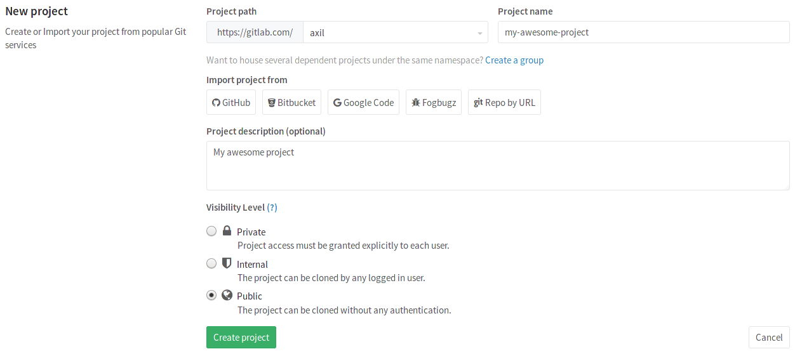

# How to create a project in GitLab

>**Notes:**
- For a list of words that are not allowed to be used as project names see the
  [reserved names][reserved].

1. In your dashboard, click the green **New project** button or use the plus
   icon in the upper right corner of the navigation bar.

    

1. This opens the **New project** page.

    

1. Choose if you want start a blank project, or with one of the predefined
   [Project Templates](https://gitlab.com/gitlab-org/project-templates):
   this will kickstart your repository code and CI automatically.
   Otherwise, if you have a project in a different repository, you can [import it] by
   clicking on the **Import project** tab, provided this is enabled in
   your GitLab instance. Ask your administrator if not.

1. Provide the following information:
    - Enter the name of your project in the **Project name** field. You can't use
      special characters, but you can use spaces, hyphens, underscores or even
      emoji.
    - The **Project description (optional)** field enables you to enter a
      description for your project's dashboard, which will help others
      understand what your project is about. Though it's not required, it's a good
      idea to fill this in.
    - Changing the **Visibility Level** modifies the project's
      [viewing and access rights](../public_access/public_access.md) for users.

1. Click **Create project**.

## Push to create a new project

> [Introduced](https://gitlab.com/gitlab-org/gitlab-ce/issues/26388) in GitLab 10.5.

When you create a new repo locally, instead of going to GitLab to manually
create a new project and then push the repo, you can directly push it to
GitLab to create the new project, all without leaving your terminal. If you have access to that
namespace, we will automatically create a new project under that GitLab namespace with its 
visibility set to Private by default (you can later change it in the [project's settings](../public_access/public_access.md#how-to-change-project-visibility)).

This can be done by using either SSH or HTTP:

```
## Git push using SSH
git push --set-upstream git@gitlab.example.com:namespace/nonexistent-project.git master

## Git push using HTTP
git push --set-upstream https://gitlab.example.com/namespace/nonexistent-project.git master
```

Once the push finishes successfully, a remote message will indicate
the command to set the remote and the URL to the new project:

```
remote:
remote: The private project namespace/nonexistent-project was created.
remote:
remote: To configure the remote, run:
remote:   git remote add origin https://gitlab.example.com/namespace/nonexistent-project.git
remote:
remote: To view the project, visit:
remote:   https://gitlab.example.com/namespace/nonexistent-project
remote:
```

[import it]: ../workflow/importing/README.md
[reserved]:  ../user/reserved_names.md
