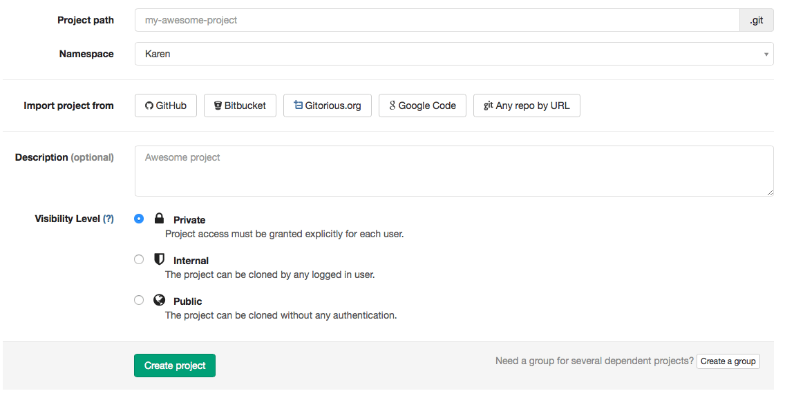

# How to create a project in GitLab

To create a new project, sign in to GitLab.

Go to your Dashboard and click on "new project" on the right side of your screen.

Fill out the required information:

1. Project path or the name of your project (you can't add spaces, so you can use hyphens or underscores)

1. Your project's description

1. Select a [visibility level](https://gitlab.com/help/public_access/public_access)

1. You can also [import your existing projects](http://docs.gitlab.com/ce/workflow/importing/README.html)

1. Click on "create project"

!
