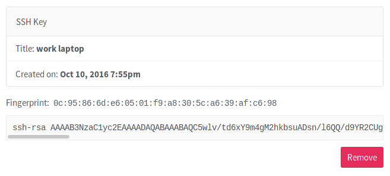

# How to create your SSH keys

This topic describes how to create SSH keys. You do this to use Git over SSH instead of Git over HTTP.

## Creating your SSH keys

1. Go to your [command line](start-using-git.md) and follow the [instructions](../ssh/README.md) to generate your SSH key pair.
1. Log in to GitLab.
1. In the upper-right corner, click your avatar and select **Settings**.
1. On the **User Settings** menu, select **SSH keys**.
1. Paste the **public** key generated in the first step in the **Key**
   text field.
1. Optionally, give it a descriptive title so that you can recognize it in the
   event you add multiple keys.
1. Finally, click the **Add key** button to add it to GitLab. You will be able to see
   its fingerprint, title, and creation date.

    

NOTE: **Note:**
Once you add a key, you cannot edit it. If the paste
didn't work, you need  to remove the offending key and re-add it.
