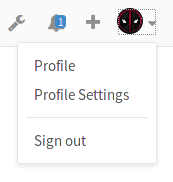
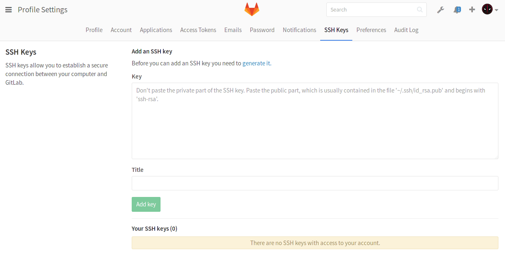
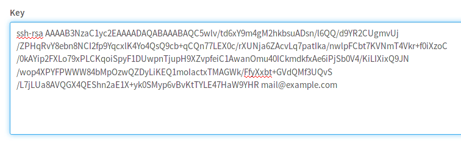

# How to create your SSH Keys

1. The first thing you need to do is go to your [command line](start-using-git.md)
   and follow the [instructions](../ssh/README.md) to generate your SSH key pair.

1. Once you do that, login to GitLab with your credentials.
1. On the upper right corner, click on your avatar and go to your **Profile settings**.

    

1. Navigate to the **SSH keys** tab.

    

3. Paste your **public** key that you generated in the first step in the 'Key'
   box.

    

1. Optionally, give it a descriptive title so that you can recognize it in the
   event you add multiple keys.

    

1. Finally, click on **Add key** to add it to GitLab. You will be able to see
   its fingerprint, its title and creation date.

    

>**Note:**
Once you add a key, you cannot edit it, only remove it. In case the paste
didn't work, you will have to remove the offending key and re-add it.

---

Congratulations! You are now ready to use Git over SSH, instead of Git over HTTP!
