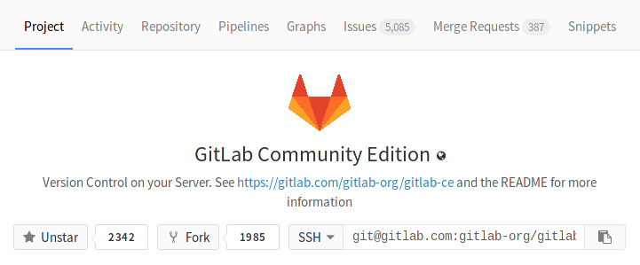
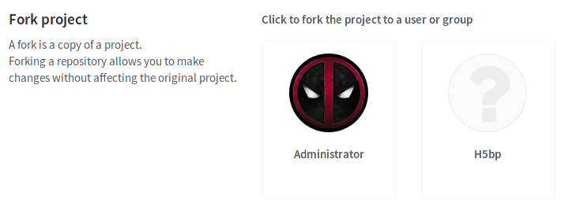

# How to fork a project

A fork is a copy of an original repository that you can put in another namespace
where you can experiment and apply changes that you can later decide if
publishing or not, without affecting your original project.

It takes just a few steps to fork a project in GitLab.

1. Go to a project's dashboard under the **Project** tab and click on the
   **Fork** button.

    

1. You will be asked where to fork the repository. Click on the user or group
   to where you'd like to add the forked project.

    

1. After a few moments, depending on the repository's size, the forking will
   complete.
