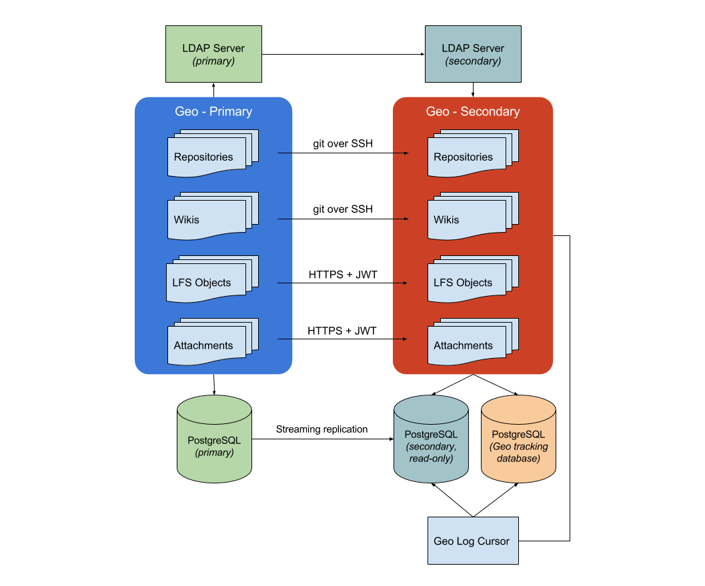

# GitLab Geo

NOTE: GitLab Geo is in ALPHA development. It is considered experimental and
not production-ready. It will undergo significant changes over the next year,
and there is significant chance of data loss.

> **Notes:**
- GitLab Geo is part of [GitLab Enterprise Edition Premium][ee].
- Introduced in GitLab Enterprise Edition 8.9.
  We recommend you use it with at least GitLab Enterprise Edition 8.14 for
  basic Geo features, or latest version for a better experience.
- You should make sure that all nodes run the same GitLab version.

GitLab Geo allows you to replicate your GitLab instance to other geographical
locations as a read-only fully operational version.

## Overview

If you have two or more teams geographically spread out, but your GitLab
instance is in a single location, fetching large repositories can take a long
time.

Your Geo instance can be used for cloning and fetching projects, in addition to
reading any data. This will make working with large repositories over large
distances much faster.

When Geo is enabled, we refer to your original instance as a **primary** node
and the replicated read-only ones as **secondaries**.

Keep in mind that:

- Secondaries talk to primary to get user data for logins (API), and to
  clone/pull from repositories (HTTP(S)/SSH).
- Primary talks to secondaries to notify for changes (API).

## Use-cases

- Can be used for cloning and fetching projects, in addition
to reading any data
- Overcomes slow connection between distant offices, saving time by
improving speed for distributed teams
- Helps reducing the loading time for automated tasks,
custom integrations and internal workflows

## Architecture

The following diagram illustrates the underlying architecture of GitLab Geo:

[Source diagram](https://docs.google.com/drawings/d/1VQIcj6jyE3idWKyt9MRUAaE3XXrkwx8g-Ne4pmURmwI/edit)

In this diagram, there is one Geo primary node and one secondary. The
secondary clones repositories via git over SSH. Attachments, LFS objects, and
other files are downloaded via HTTPS using a GitLab API to authenticate.

Writes to the database and Git repositories can only be performed on the Geo
primary node. The secondary node receives database updates via PostgreSQL
streaming replication.

Note that the secondary needs two different PostgreSQL databases: a read-only
instance that streams data from the main GitLab database and another used
internally by the secondary node to record what data has been replicated.

### LDAP

We recommend that if you use LDAP on your primary that you also set up a
secondary LDAP server for the secondary Geo node. Otherwise, users will not be
able to perform Git operations over HTTP(s) on the **secondary** Geo node
using HTTP Basic Authentication. However, Git via SSH and personal access
tokens will still work.

Check with your LDAP provider for instructions on on how to set up
replication. For example, OpenLDAP provides [these
instructions](https://www.openldap.org/doc/admin24/replication.html).

## Setup instructions

In order to set up one or more GitLab Geo instances, follow the steps below in
the **exact order** they appear. **Make sure the GitLab version is the same on
all nodes.**

### Using Omnibus GitLab

If you installed GitLab using the Omnibus packages (highly recommended):

1. [Install GitLab Enterprise Edition][install-ee] on the server that will serve
   as the **secondary** Geo node. Do not login or set up anything else in the
   secondary node for the moment.
1. [Upload the GitLab License](../user/admin_area/license.md) to the **primary** Geo Node to unlock GitLab Geo.
1. [Setup the database replication](database.md)  (`primary (read-write) <-> secondary (read-only)` topology).
1. [Configure GitLab](configuration.md) to set the primary and secondary nodes.
1. [Configure SSH authorizations to use the database](ssh.md)
1. Optional: [Configure a secondary LDAP server](../administration/auth/ldap.md) for the secondary. See [notes on LDAP](#ldap).
1. [Follow the after setup steps](after_setup.md).

[install-ee]: https://about.gitlab.com/downloads-ee/ "GitLab Enterprise Edition Omnibus packages downloads page"

### Using GitLab installed from source

If you installed GitLab from source:

1. [Install GitLab Enterprise Edition][install-ee-source] on the server that
   will serve as the **secondary** Geo node. Do not login or set up anything
   else in the secondary node for the moment.
1. [Upload the GitLab License](../user/admin_area/license.md) you purchased for GitLab Enterprise Edition to unlock GitLab Geo.
1. [Setup the database replication](database_source.md)  (`primary (read-write) <-> secondary (read-only)` topology).
1. [Configure GitLab](configuration_source.md) to set the primary and secondary
   nodes.
1. [Follow the after setup steps](after_setup.md).

[install-ee-source]: https://docs.gitlab.com/ee/install/installation.html "GitLab Enterprise Edition installation from source"

## Configuring GitLab Geo

Read through the [GitLab Geo configuration](configuration.md) documentation.

## Updating the Geo nodes

Read how to [update your Geo nodes to the latest GitLab version](updating_the_geo_nodes.md).

## Current limitations

- You cannot push code to secondary nodes
- Primary node has to be online for OAuth login to happen (existing sessions and git are not affected)

## Frequently Asked Questions

Read more in the [Geo FAQ](faq.md).

## Troubleshooting

Read the [troubleshooting document](troubleshooting.md).

[ee]: https://about.gitlab.com/gitlab-ee/ "GitLab Enterprise Edition landing page"
[install-ee]: https://about.gitlab.com/downloads-ee/ "GitLab Enterprise Edition Omnibus packages downloads page"
[install-ee-source]: https://docs.gitlab.com/ee/install/installation.html "GitLab Enterprise Edition installation from source"
