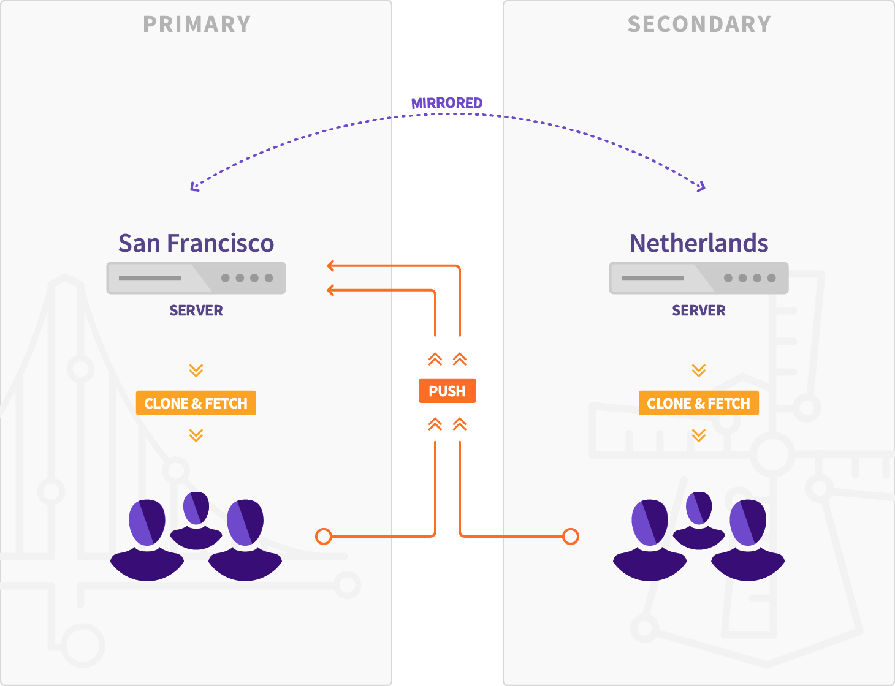

# GitLab Geo

> **Note:**
This feature was introduced in GitLab 8.5 EE as Alpha.
We recommend you use with at least GitLab 8.6 EE.

GitLab Geo allows you to replicate your GitLab instance to other geographical
locations as a read-only fully operational version.

- [Overview](#overview)
- [Setup instructions](#setup-instructions)
    - [Database Replication](database.md)
    - [Configuration](configuration.md)
- [Current limitations](#current-limitations)
- [Disaster Recovery](disaster-recovery.md)
- [Frequently Asked Questions](#frequently-asked-questions)
    - [Can I use Geo in a disaster recovery situation?](#can-i-use-geo-in-a-disaster-recovery-situation)
    - [What data is replicated to a secondary node?](#what-data-is-replicated-to-a-secondary-node)
    - [Can I git push to a secondary node?](#can-i-git-push-to-a-secondary-node)
    - [How long does it take to have a commit replicated to a secondary node?](#how-long-does-it-take-to-have-a-commit-replicated-to-a-secondary-node)
    - [What happens if the SSH server runs at a different port?](#what-happens-if-the-ssh-server-runs-at-a-different-port)

<!-- END doctoc generated TOC please keep comment here to allow auto update -->

## Overview

If you have two or more teams geographically spread out, but your GitLab
instance is in a single location, fetching large repositories can take a long
time.

Your Geo instance can be used for cloning and fetching projects, in addition to
reading any data. This will make working with large repositories over large
distances much faster.

When Geo is enabled, we refer to your original instance as a **primary** node
and the replicated read-only ones as **secondaries**.

Keep in mind that:

- Secondaries talk to primary to get user data for logins (API), and to
  clone/pull from repositories (HTTP(S)/SSH).
- Primary talks to secondaries to notify for changes (API).

## Setup instructions

GitLab Geo requires some additional work installing and configuring your
instance, than a normal setup.

There are a couple of things you need to do in order to have one or more GitLab
Geo instances. Follow the steps below in the order that they appear:

1. Install GitLab Enterprise Edition on the server that will serve as the
   secondary Geo node
1. [Setup a database replication](database.md) in `primary <-> secondary (read-only)` topology
1. [Configure GitLab](configuration.md) and set the primary and secondary nodes
After you set up the database replication and configure the GitLab Geo nodes,
there are a few things to consider:

1. When you create a new project in the primary node, the Git repository will
   appear in the secondary only _after_ the first `git push`
1. To fetch from the secondary node, a separate remote URL must be set in your
   Git repository locally

## Current limitations

- You cannot push code to secondary nodes
- Git LFS is not supported yet
- Git Annex is not supported yet
- Primary node has to be online for OAuth login to happen (existing sessions and git are not affected)

## Frequently Asked Questions

### Can I use Geo in a disaster recovery situation?

There are limitations to what we replicate (see Current limitations).
In an extreme data-loss situation you can make a secondary Geo into your
primary, but this is not officially supported yet.

If you still want to proceed, see our step-by-step instructions on how to 
manually [promote a secondary node](disaster-recovery.md) into primary. 

### What data is replicated to a secondary node?

We currently replicate project repositories and the whole database. This
means user accounts, issues, merge requests, groups, project data, etc.,
will be available for query.
We currently don't replicate user generated attachments / avatars or any
other file in `public/upload`. We also don't replicate LFS / Annex or
artifacts data (`shared/folder`).

### Can I git push to a secondary node?

No. All writing operations (this includes `git push`) must be done in your
primary node.

### How long does it take to have a commit replicated to a secondary node?

All replication operations are asynchronous and are queued to be dispatched in
a batched request every 10 seconds. Besides that, it depends on a lot of other
factors including the amount of traffic, how big your commit is, the
connectivity between your nodes, your hardware, etc.

### What happens if the SSH server runs at a different port?

We send the clone url from the primary server to any secondaries, so it
doesn't matter. If primary is running on port `2200` clone url will reflect
that.
