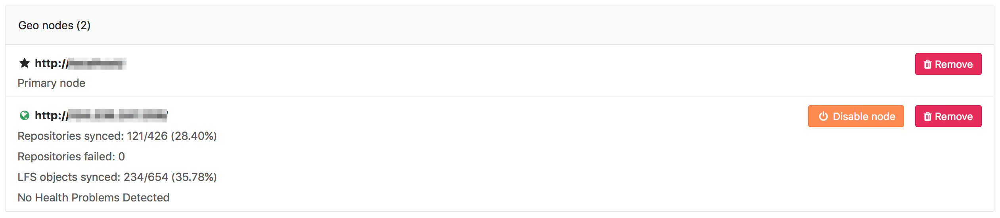

# GitLab Geo configuration

>**Note:**
This is the documentation for the Omnibus GitLab packages. For installations
from source, follow the [**GitLab Geo nodes configuration for installations
from source**](configuration_source.md) guide.

## Configuring a new secondary node

>**Note:**
This is the final step in setting up a secondary Geo node. Stages of the
setup process must be completed in the documented order.
Before attempting the steps in this stage, [complete all prior stages](README.md#using-omnibus-gitlab).

The basic steps of configuring a secondary node are to replicate required
configurations between the primary and the secondaries; to configure a tracking
database on each secondary; and to start GitLab on the secondary node.

You are encouraged to first read through all the steps before executing them
in your testing/production environment.

>**Notes:**
- **Do not** setup any custom authentication in the secondary nodes, this will be
  handled by the primary node.
- **Do not** add anything in the secondaries Geo nodes admin area
  (**Admin Area ➔ Geo Nodes**). This is handled solely by the primary node.

### Step 1. Manually replicate secret GitLab values

GitLab stores a number of secret values in the `/etc/gitlab/gitlab-secrets.json`
file which *must* match between the primary and secondary nodes. Until there is
a means of automatically replicating these between nodes (see
[issue #3789](https://gitlab.com/gitlab-org/gitlab-ee/issues/3789)), they must
be manually replicated to the secondary.

1. SSH into the **primary** node, and execute the command below:

    ```bash
    sudo cat /etc/gitlab/gitlab-secrets.json
    ```

    This will display the secrets that need to be replicated, in JSON format.

1. SSH into the **secondary** node and login as the `root` user:

    ```
    sudo -i
    ```

1. Make a backup of any existing secrets:

    ```bash
    mv /etc/gitlab/gitlab-secrets.json /etc/gitlab/gitlab-secrets.json.`date +%F`
    ```

1. Copy `/etc/gitlab/gitlab-secrets.json` from the primary to the secondary, or
   copy-and-paste the file contents between nodes:

    ```bash
    sudo editor /etc/gitlab/gitlab-secrets.json

    # paste the output of the `cat` command you ran on the primary
    # save and exit
    ```

1. Ensure the file permissions are correct:

    ```bash
    chown root:root /etc/gitlab/gitlab-secrets.json
    chmod 0600 /etc/gitlab/gitlab-secrets.json
    ```

1. Reconfigure the secondary node for the change to take effect:

    ```
    gitlab-ctl reconfigure
    ```

Once reconfigured, the secondary will automatically start
replicating missing data from the primary in a process known as backfill.
Meanwhile, the primary node will start to notify the secondary of any changes, so
that the secondary can act on those notifications immediately.

Make sure the secondary instance is
running and accessible. You can login to the secondary node
with the same credentials as used in the primary.

### Step 2. Manually replicate primary SSH host keys

GitLab integrates with the system-installed SSH daemon, designating a user
(typically named git) through which all access requests are handled.

In a [Disaster Recovery](disaster-recovery.md) situation, GitLab system
administrators will promote a secondary Geo replica to a primary and they can
update the DNS records for the primary domain to point to the secondary to prevent
the need to update all references to the primary domain to the secondary domain,
like changing Git remotes and API URLs.

This will cause all SSH requests to the newly promoted primary node from
failing due to SSH host key mismatch. To prevent this, the primary SSH host
keys must be manually replicated to the secondary node.

1. SSH into the **secondary** node and login as the `root` user:

    ```
    sudo -i
    ```

1. Make a backup of any existing SSH host keys:

    ```bash
    find /etc/ssh -iname ssh_host_* -exec mv {} {}.backup.`date +%F` \;
    ```

1. SSH into the **primary** node, and execute the command below:

    ```bash
    sudo find /etc/ssh -iname ssh_host_* -not -iname '*.pub'
    ```

1. For each file in that list copy the file from the primary node to
   the **same** location on your **secondary** node.

1. On your **secondary** node, ensure the file permissions are correct:

    ```bash
    chown root:root /etc/ssh/ssh_host_*
    chmod 0600 /etc/ssh/ssh_host_*
    ```

1. Regenerate the public keys from the private keys:

    ```bash
    find /etc/ssh -iname ssh_host_* -not -iname '*.backup*' -exec sh -c 'ssh-keygen -y -f "{}" > "{}.pub"' \;
    ```

1. Restart sshd:

    ```bash
    service ssh restart
    ```

### Step 3. (Optional) Enabling hashed storage (from GitLab 10.0)

>**Warning**
Hashed storage is in **Alpha**. It is considered experimental and not
production-ready. See [Hashed Storage](../administration/repository_storage_types.md)
for more detail, and for the latest updates, check
[infrastructure issue #2821](https://gitlab.com/gitlab-com/infrastructure/issues/2821).

Using hashed storage significantly improves Geo replication - project and group
renames no longer require synchronization between nodes.

1. Visit the **primary** node's **Admin Area ➔ Settings**
   (`/admin/application_settings`) in your browser
1. In the `Repository Storages` section, check `Create new projects using hashed storage paths`:

    

### Step 4. (Optional) Configuring the secondary to trust the primary

You can safely skip this step if your primary uses a CA-issued HTTPS certificate.

If your primary is using a self-signed certificate for *HTTPS* support, you will
need to add that certificate to the secondary's trust store. Retrieve the
certificate from the primary and follow
[these instructions](https://docs.gitlab.com/omnibus/settings/ssl.html)
on the secondary.

### Step 5. Enable Git access over HTTP/HTTPS

GitLab Geo synchronizes repositories over HTTP/HTTPS, and therefore requires this clone
method to be enabled. Navigate to **Admin Area ➔ Settings**
(`/admin/application_settings`) on the primary node, and set
`Enabled Git access protocols` to `Both SSH and HTTP(S)` or `Only HTTP(S)`.

### Step 6. Verify proper functioning of the secondary node

Congratulations! Your secondary geo node is now configured!

You can login to the secondary node with the same credentials you used on the
primary. Visit the secondary node's **Admin Area ➔ Geo Nodes**
(`/admin/geo_nodes`) in your browser to check if it's correctly identified as a
secondary Geo node and if Geo is enabled.

The initial replication, or 'backfill', will probably still be in progress. You
can monitor the synchronization process on each geo node from the primary
node's Geo Nodes dashboard in your browser.



If your installation isn't working properly, check the
[troubleshooting document](troubleshooting.md).

The two most obvious issues that can become apparent in the dashboard are:

1. Database replication not working well
1. Instance to instance notification not working. In that case, it can be
   something of the following:
     - You are using a custom certificate or custom CA (see the
       [troubleshooting document](troubleshooting.md))
     - The instance is firewalled (check your firewall rules)

Please note that disabling a secondary node will stop the sync process.

Please note that if `git_data_dirs` is customized on the primary for multiple
repository shards you must duplicate the same configuration on the secondary.

Point your users to the ["Using a Geo Server" guide](using_a_geo_server.md).

Currently, this is what is synced:

* Git repositories
* Wikis
* LFS objects
* Issues, merge requests, snippets, and comment attachments
* Users, groups, and project avatars

## Selective replication

GitLab Geo supports selective replication, which allows admins to choose which
groups should be replicated by secondary nodes.

It is important to note that selective replication:

1. Does not restrict permissions from secondary nodes.
1. Does not hide projects metadata from secondary nodes. Since Geo currently
relies on PostgreSQL replication, all project metadata gets replicated to
secondary nodes, but repositories that have not been selected will be empty.
1. Secondary nodes won't pull repositories that do not belong to the selected
groups to be replicated.

## Upgrading Geo

See the [updating the Geo nodes document](updating_the_geo_nodes.md).

## Troubleshooting

See the [troubleshooting document](troubleshooting.md).
