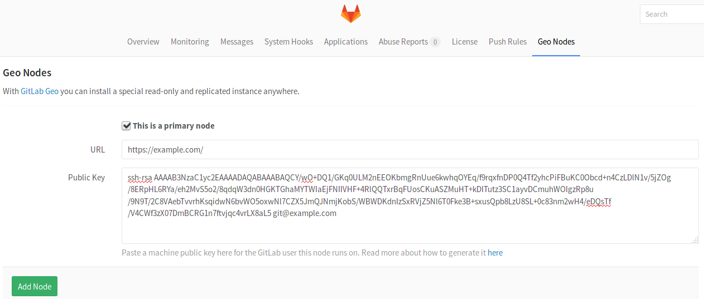

# GitLab Geo configuration

> **Important:**
Make sure you have followed the first two steps of the
[Setup instructions](README.md#setup-instructions).

After having installed GitLab Enterprise Edition in the instance that will serve
as a Geo node and set up the database replication, the next steps can be summed
up to:

- configure the primary node
- replicate some required configurations between the primary and the secondaries
- start GitLab in the secondary node's machine
- configure every secondary node in the primary's Admin screen

After GitLab's instance is online and defined in **Geo Nodes** admin screen,
new data will start to be automatically replicated, but you still need to copy
old data from the primary machine (more information below).

## Primary node GitLab setup

>**Notes:**
- You will need to setup your database into a **Primary <-> Secondary (read-only)** replication
  topology, and your Primary node should always point to a database's Primary
  instance. If you haven't done that already, read [database replication](./database.md).
- Only in the Geo nodes admin area of the primary node, will you be adding all
  nodes' information (secondary and primary). Do not add anything in the Geo
  nodes admin area of the secondaries.

To setup the primary node:

1. [Create the SSH key pair][ssh-pair] for the primary node.
1. Visit the primary node's **Admin Area > Geo Nodes** (`/admin/geo_nodes`).
1. Add your primary node by providing its full URL and the public SSH key
   you created previously. Make sure to check the box 'This is a primary node'
   when adding it.



---

>**Note:**
Don't set anything up for the `secondary` node yet, make sure to follow the
[Secondary node GitLab setup](#secondary-node-gitlab-setup) first.

In the following table you can see what all these settings mean:

| Setting   | Description |
| --------- | ----------- |
| Primary   | This marks a Geo Node as primary. There can be only one primary, make sure that you first add the primary node and then all the others. |
| URL       | Your instance's full URL, in the same way it is configured in `gitlab.yml` (source based installations) or `/etc/gitlab/gitlab.rb` (omnibus installations). |
|Public Key | The SSH public key of the user that your GitLab instance runs on (unless changed, should be the user `git`). That means that you have to go in each Geo Node separately and create an SSH key pair. See the [SSH key creation][ssh-pair] section. |

## Secondary node GitLab setup

>**Note:**
The Geo nodes admin area (**Admin Area > Geo Nodes**) is not used when setting
up the secondary nodes. This is handled at the primary one.

To install a secondary node, you must follow the normal GitLab Enterprise
Edition installation, with some extra requirements:

- You should point your database connection to a [replicated instance](./database.md).
- Your secondary node should be allowed to [communicate via HTTP/HTTPS and
  SSH with your primary node (make sure your firewall is not blocking that).
- Don't make any extra steps you would do for a normal new installation
- Don't setup any custom authentication (this will be handled by the `primary` node)

You need to make sure you restored the database backup (that is part of setting
up replication) and that the primary node PostgreSQL instance is ready to
replicate data.

### Database Encryption Key

GitLab stores a unique encryption key in disk that we use to safely store
sensitive data in the database.

Any secondary node must have the **exact same value** for `db_key_base` as
defined in the primary one.

- For Omnibus installations it is stored at `/etc/gitlab/gitlab-secrets.json`.
- For installations from source it is stored at `/home/git/gitlab/config/secrets.yml`.

Find that key in the primary node and copy paste its value in the secondaries.

### Enable the secondary GitLab instance

Your new GitLab secondary node can now be safely started.

1. [Create the SSH key pair][ssh-pair] for the secondary node.
1. Visit the primary node's **Admin Area > Geo Nodes** (`/admin/geo_nodes`).
1. Add your secondary node by providing its full URL and the public SSH key
   you created previously.
1. Hit the **Add node** button.

---

After the **Add Node** button is pressed, the primary node will start to notify
changes to the secondary. Make sure the secondary instance is running and
accessible.

The two most obvious issues that replication can have here are:

- Database replication not working well
- Instance to instance notification not working. In that case, it can be
  something of the following:
   - You are using a custom certificate or custom CA (see the
     [Troubleshooting](#troubleshooting) section)
   - Instance is firewalled (check your firewall rules)

### Repositories data replication

Getting a new secondary Geo node up and running, will also require the
repositories directory to be synced from the primary node. You can use `rsync`
for that. Assuming `1.2.3.4` is the IP of the primary node, SSH into the
secondary and run:

```bash
# For Omnibus installations
rsync -guavrP root@1.2.3.4:/var/opt/gitlab/git-data/repositories/ /var/opt/gitlab/git-data/repositories/
gitlab-ctl reconfigure # to fix directory permissions

# For installations from source
rsync -guavrP root@1.2.3.4:/home/git/repositories/ /home/git/repositories/
chmod ug+rwX,o-rwx /home/git/repositories
```

If this step is not followed, the secondary node will eventually clone and
fetch every missing repository as they are updated with new commits on the
primary node, so syncing the repositories beforehand will buy you some time.

While active repositories will be eventually replicated, if you don't rsync,
the files, any archived/inactive repositories will not get in the secondary node
as Geo doesn't run any routine task to look for missing repositories.

### Authorized keys regeneration

The final step will be to regenerate the keys for `~/.ssh/authorized_keys` using
the command below (HTTPS clone will still work without this extra step).

On the secondary node where the database is [already replicated](./database.md),
run:

```
# For Omnibus installations
gitlab-rake gitlab:shell:setup

# For source installations
sudo -u git -H bundle exec rake gitlab:shell:setup RAILS_ENV=production
```

This will enable `git` operations to authorize against your existing users.
New users and SSH keys updated after this step, will be replicated automatically.

### Ready to use

Your instance should be ready to use. You can visit the Admin area in the
secondary node to check if it's correctly identified as a secondary Geo node and
if Geo is enabled.

If your installation isn't working properly, check the
[troubleshooting](#troubleshooting) section.

## Create SSH key pairs for new Geo nodes

>**Note:**
These are general instructions to create a new SSH key pair for a new Geo node,
either primary or secondary.

---

When adding a new Geo node, you must provide an SSH public key of the user that
your GitLab instance runs on (unless changed, should be the user `git`). This
user will act as a "normal user" who fetches from the primary Geo node.

1. Run the command below on each server that will be a Geo node:

    ```bash
    sudo -u git -H ssh-keygen
    ```

1. Get the contents of `id_rsa.pub` the was just created:

    ```
    # Omnibus installations
    sudo -u git cat /var/opt/gitlab/.ssh/id_rsa.pub

    # Installations from source
    sudo -u git cat /home/git/.ssh/id_rsa.pub
    ```

1. Copy them to the admin area of the **primary** node (**Admin Area > Geo Nodes**).

Remember to add your primary node to the `known_hosts` file of your `git` user.

You can find ssh key files and `know_hosts` at `/var/opt/gitlab/.ssh/` in
Omnibus installations or at `/home/git/.ssh/` when following the source
installation guide.

If for any reason you generate the key using a different name from the default
`id_rsa`, or you want to generate an extra key only for the repository
synchronization feature, you can do so, but you have to create/modify your
`~/.ssh/config` (for the `git` user).

This is an example on how to change the default key for all remote hosts:

```bash
Host *                              # Match all remote hosts
  IdentityFile ~/.ssh/mycustom.key  # The location of your private key
```

This is how to change it for an specific host:

```bash
Host example.com                    # The FQDN of the primary Geo node
  HostName example.com              # The FQDN of the primary Geo node
  IdentityFile ~/.ssh/mycustom.key  # The location of your private key
```

## Troubleshooting

Setting up Geo requires careful attention to details and sometimes it's easy to
miss a step.

Here is a checklist of questions you should ask to try to detect where you have
to fix (all commands and path locations are for Omnibus installs):

- Is Postgres replication working?
- Are my nodes pointing to the correct database instance?
    - You should make sure your primary Geo node points to the instance with
      writing permissions.
    - Any secondary nodes should point only to read-only instances.
- Can Geo detect my current node correctly?
    - Geo uses your defined node from `Admin > Geo` screen, and tries to match
      with the value defined in `/etc/gitlab/gitlab.rb` configuration file.
      The relevant line looks like: `external_url "http://gitlab.example.com"`.
    - To check if node on current machine is correctly detected type:
      `sudo gitlab-rails runner "Gitlab::Geo.current_node"`,
      expect something like: `#<GeoNode id: 2, schema: "https", host: "gitlab.example.com", port: 443, relative_url_root: "", primary: false, ...>`
    - By running the command above, `primary` should be `true` when executed in
      the primary node, and `false` on any secondary
- Did I defined the correct SSH Key for the node?
    - You must create an SSH Key for `git` user
    - This key is the one you have to inform at `Admin > Geo`
- Can I SSH from secondary to primary node using `git` user account?
    - This is the most obvious cause of problems with repository replication issues.
      If you have not added primary node's key to `known_hosts`, you will end up with
      a lot of failed sidekiq jobs with an error similar to:

      ```
      Gitlab::Shell::Error: Host key verification failed. fatal: Could not read from remote repository. Please make sure you have the correct access rights and the repository exists.
      ```

      Easy way to fix is by logging in as the `git` user in the secondary node and run:

      ```
      # remove old entries to your primary gitlab in known_hosts
      ssh-keyscan -R your-primary-gitlab.example.com

      # add a new entry in known_hosts
      ssh-keyscan -t rsa your-primary-gitlab.example.com >> ~/.ssh/known_hosts
      ```
- Can primary node communicate with secondary node by HTTP/HTTPS ports?
- Can secondary nodes communicate with primary node by HTTP/HTTPS/SSH ports?
- Can secondary nodes execute a succesfull git clone using git user's own
  SSH Key to primary node repository?

> This list is an attempt to document all the moving parts that can go wrong.
We are working into getting all this steps verified automatically in a
rake task in the future. :)

[ssh-pair]: #create-ssh-key-pairs-for-new-geo-nodes
