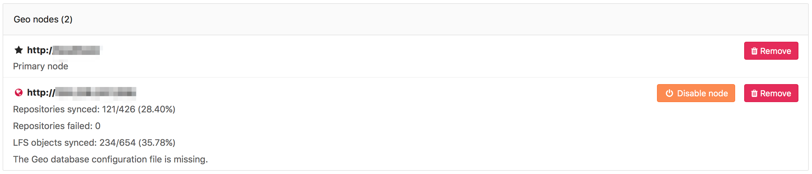

# GitLab Geo troubleshooting

>**Note:**
This list is an attempt to document all the moving parts that can go wrong.
We are working into getting all this steps verified automatically in a
rake task in the future.

Setting up Geo requires careful attention to details and sometimes it's easy to
miss a step. Here is a checklist of questions you should ask to try to detect
where you have to fix (all commands and path locations are for Omnibus installs):

- Is Postgres replication working?
- Are my nodes pointing to the correct database instance?
    - You should make sure your primary Geo node points to the instance with
      writing permissions.
    - Any secondary nodes should point only to read-only instances.
- Can Geo detect my current node correctly?
    - Geo uses your defined node from `Admin ➔ Geo` screen, and tries to match
      with the value defined in `/etc/gitlab/gitlab.rb` configuration file.
      The relevant line looks like: `external_url "http://gitlab.example.com"`.
    - To check if node on current machine is correctly detected type:

        ```
        sudo gitlab-rails runner "puts Gitlab::Geo.current_node.inspect"
        ```

        and expect something like:

        ```
        #<GeoNode id: 2, schema: "https", host: "gitlab.example.com", port: 443, relative_url_root: "", primary: false, ...>
        ```

    - By running the command above, `primary` should be `true` when executed in
      the primary node, and `false` on any secondary
- Did I define the correct SSH Key for the node?
    - You must create an SSH Key for `git` user
    - This key is the one you have to inform at `Admin > Geo`
- Can I SSH from secondary to primary node using `git` user account?
    - This is the most obvious cause of problems with repository replication issues.
      If you haven't added the primary node's key to `known_hosts`, you will end up with
      a lot of failed sidekiq jobs with an error similar to:

        ```
        Gitlab::Shell::Error: Host key verification failed. fatal: Could not read from remote repository. Please make sure you have the correct access rights and the repository exists.
        ```

        An easy way to fix is by logging in as the `git` user in the secondary node and run:

        ```
        # remove old entries to your primary gitlab in known_hosts
        ssh-keyscan -R your-primary-gitlab.example.com

- How do I fix the message, "ERROR:  replication slots can only be used if max_replication_slots > 0"?

  - This means that the `max_replication_slots` PostgreSQL variable needs to
    be set on the primary database. In GitLab 9.4, we have made this setting
    default to 1. You may need to increase this value if you have more Geo
    secondary nodes. Be sure to restart PostgreSQL for this to take
    effect. See the [PostgreSQL replication
    setup](database.md#postgresql-replication) guide for more details.

- How do I fix the message, "FATAL:  could not start WAL streaming: ERROR:  replication slot "geo_secondary_my_domain_com" does not exist"?

  - This occurs when PostgreSQL does not have a replication slot for the
    secondary by that name. You may want to rerun the [replication
    process](database.md) on the secondary.

Visit the primary node's **Admin Area ➔ Geo Nodes** (`/admin/geo_nodes`) in
your browser. We perform the following health checks on each secondary node
to help identify if something is wrong:

- Is the node running?
- Is the node's secondary database configured for streaming replication?
- Is the node's secondary tracking database configured?
- Is the node's secondary tracking database connected?
- Is the node's secondary tracking database up-to-date?


