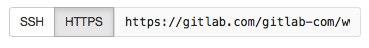

# Git Command Line commands

## Start working on your project

* In Git, when you copy a project you say you "clone" it. You need to clone the contents in the project that you’d like to work on to your computer. To do it, go to your [gitlab.com](https://gitlab.com) account

* When you are on your Dashboard, click on the project that you'd like to clone, which you'll find at the right side of your screen


* When you're in the project, click on the HTTPS button at the right side of your screen. Then copy the HTTPS link (you'll have to paste it on your shell in the next step)



## In your Command Line or shell

* To clone your project, go to your computer's shell and type the following command

```
git clone PASTE HTTPS HERE
```

* A clone of the project will be created in your computer. You'll be able to find it stored as a regular file

## Basic commands

It's important to know some basic commands to work on your shell

* Go into a project, directory or file to work in it
```
cd NAME-OF-PROJECT-OR-FILE
```

* Go back one directory or file
```
cd ../
```

* Go to the master branch to pull the latest changes from there
```
git checkout master
```

* Download the latest changes in the project, so that you work on an up-to-date copy (this is important to do every time you work on a project)
```
git pull
```

* Create a branch (remember that spaces won't be recognized, you need to use a hyphen or underscore)
```
git checkout -b NAME-OF-BRANCH
```

* Work on a branch that has already been created
```
git checkout NAME-OF-BRANCH
```

* To see what’s in the file
```
ls
```

* Create a directory
```
mkdir NAME-OF-YOUR-DIRECTORY
```

* Create a README.md or file in directory
```
touch README.md
nano README.md
#### ADD YOUR INFORMATION
#### Press: control + X
#### Type: Y
#### Press: enter
```

* To see the changes you've made (it's important to be aware of what's happening and what's the status of your changes)
```
git status
```

* Add changes to commit (you'll be able to see your changes in red when you type "git status")
```
git add CHANGES IN RED
git commit -m "DESCRIBE COMMIT IN A FEW WORDS"
```

* Send changes to gitlab.com
```
git push origin NAME-OF-BRANCH
```

* Move a file
```
mv NAME-OF-FILE
```

* Rename a file
```
rn NAME-OF-FILE
```

* Remove a file
```
rm NAME-OF-FILE
```

* Remove a directory
```
rm -r NAME-OF-DIRECTORY
```

* Delete changes
```
git clean -f
```

* View history in terminal
```
history
```

* Remove all the changes that you don't want to send to gitlab.com
```
git add NAME-OF-FILE -all
```

* Merge created branch with master branch. You need to be in the created branch
```
git checkout NAME-OF-BRANCH
git merge master
```
