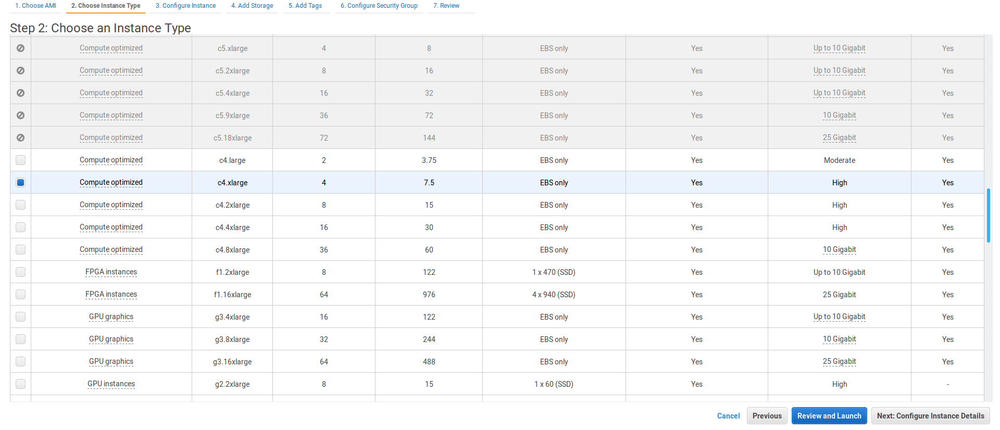
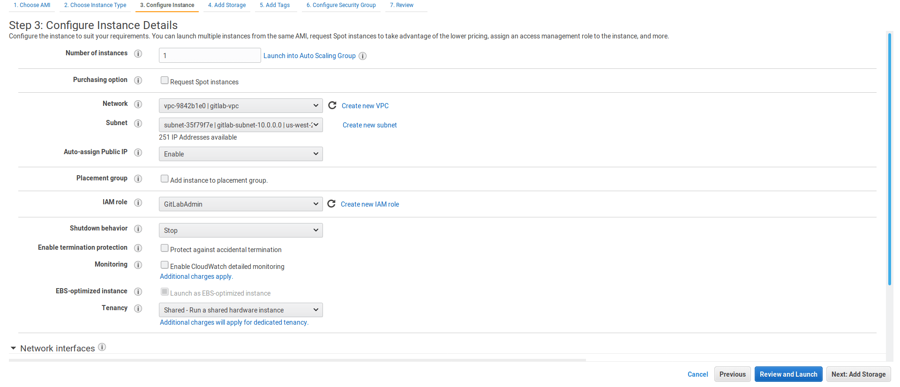
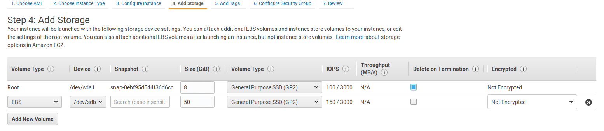
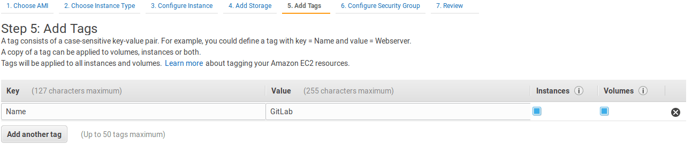
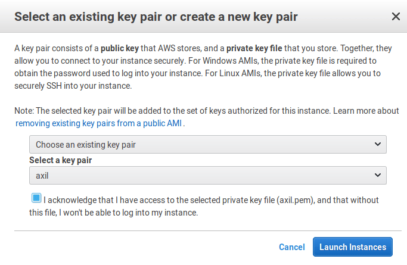

# Installing GitLab on AWS

GitLab can be installed on Amazon Web Services (AWS) by using the official
AMIs provided with each release.

## Introduction

In this guide, we will explore the simplest way to install GitLab on AWS.
That means that this will be a single EC2 node, and all GitLab's components,
including the database, will be hosted on the same instance.

If you are interested for a highly available environment, check the
[high availability docs](../../administration/high_availability/README.md).

## Architecture

Below is the diagram of the architecture.


## Requirements

A basic familiarity with AWS and EC2 is assumed. In particular, you will need:

- [An AWS account](https://console.aws.amazon.com/console/home)
- [Create or upload](https://docs.aws.amazon.com/AWSEC2/latest/UserGuide/ec2-key-pairs.html)
  an SSH key to connect to the instance via SSH
- A domain name under which GitLab will be reached

## Costs

Based on [GitLab's requirements](../requirements.md#hardware-requirements), the
instance type should be at least `c4.xlarge`. This is enough to accommodate 100 users.

Here's a list of the services we will use and their costs:

- **EC2** - GitLab will deployed on shared hardware which means
  [on-demand pricing](https://aws.amazon.com/ec2/pricing/on-demand)
  will apply. If you want to run it on a dedicated or reserved instance,
  consult the [EC2 pricing page](https://aws.amazon.com/ec2/pricing/) for more
  information on the cost.
- **EBS** - We will also use an EBS volume to store the Git data. See the
  [Amazon EBS pricing](https://aws.amazon.com/ebs/pricing/).
- **S3** - We will use S3 to store backups. See the
  [Amazon S3 pricing](https://aws.amazon.com/s3/pricing/).

## Security

We will create a new IAM role specifically for deploying GitLab, a new VPC, as
well as a security group with limited port access to the instance.

### Creating an IAM EC2 instance role and profile

To minimize the permissions of the user, we'll create a new IAM role with
limited access:

1. Navigate to the IAM dashboard https://console.aws.amazon.com/iam/home and
   click on **Create role**.
1. Create a new role by choosing to **AWS service > EC2**. Once done, click on
   **Next: Permissions**.

    

1. Choose **AmazonEC2FullAccess** and **AmazonS3FullAccess** and click on **Next: Review**.
1. Give the role the name `GitLabAdmin` and click **Create role**.

    

### Configuring the network

We'll start by creating a VPC for our GitLab cloud infrastructure, then we can
create subnets to have public and private instances. Public subnets will require
a Route Table and an associated Internet Gateway.

Let's create a VPC:

1. Navigate to https://console.aws.amazon.com/vpc/home
1. Select **Your VPCs** from the left menu and then click on **Create VPC**.
   At the name tag enter `gitlab-vpc` and at the IPv4 CIDR block enter `10.0.0.0/16`.
   Click **Yes, Create** when ready.

    

Now, onto creating a subnet:

1. Select **Subnets** from the left menu.
1. Click on **Create subnet**. Give it a descriptive name tag based on the IP,
   for example `gitlab-subnet-10.0.0.0`, select the VPC we created previously,
   and at the IPv4 CIDR block let's give it a 24 subnet `10.0.0.0/24`:

    

Since the newly created subnet is private, we need to create a Route Table to
associate an Internet Gateway:

1. Select **Route Tables** from the left menu.
1. Click **Create Route Table**.
1. At the "Name tag" enter `gitlab-public` and choose `gitlab-vpc` under "VPC".
1. Hit **Yes, Create**.

Now, create the Internet gateway:

1. Select **Internet Gateways** from the left menu.
1. Click on **Create internet gateway**, give it the name `gitlab-gateway` and
   click **Create**.
1. Select it from the table, and then under the **Actions** dropdown choose
   "Attach to VPC".

    

1. Choose `gitlab-vpc` from the list and hit **Create**.

Now it's time to add the route to the subnet:

1. Select **Route Tables** from the left menu and click on the `gitlab-public`
   route to show the options at the bottom.
1. Select the **Routes** tab, hit **Edit > Add another route** and set `0.0.0.0/0`
   as destination. In the target, select the `gitlab-gateway` we created previously.
   Hit **Save** once done.

    

1. Select the **Subnet Associations** tab and hit **Edit**.
1. Check the subnet and hit **Save**.

    

Now that we're done with the network, let's create a security group.

### Creating a security group

The security group is basically the firewall.

1. Select **Security Groups** from the left menu.
1. Click on **Create Security Group** and fill in the details. Give it a name,
   add a description, choose the VPC we created previously, and finally, add
   the inbound rules.
   You will need to open the SSH, HTTP, HTTPS ports. Leave the outbound traffic
   as is.

     

     TIP: **Tip:**
     Depending on your setup, you might want to allow SSH traffic from only a known
     host. In that case, change the SSH source to be custom and give it the IP
     you want to SSH from.

1. When done, click on **Create**.

---

Now that we have set up security, let's deploy GitLab.

## Deploying GitLab

We'll use AWS's wizard to deploy GitLab and then SSH into the instance to
configure the domain name.

### Choose the AMI

1. On the EC2 dashboard click **Launch Instance**.
1. Choose the AMI by going to the Community AMIs and search for `GitLab EE <version>`
   where `<version>` the latest version as seen  in the
   [releases page](https://about.gitlab.com/releases/).

    

### Choose instance type

1. Choose the `c4.xlarge` instance.

    

1. Click **Next: Configure Instance Details**

### Configure instance

1. Configure the instance. At "Network" choose `gitlab-vpc` and the subnet we
   created for that VPC. Select "Enable" for the "Auto-assign Public IP" and
   choose the `GitLabAdmin` IAM role.

    

1. Click **Next: Add Storage**.

### Add storage

Edit the root volume to 20GB, and add a new EBS volume that will host the Git data.
Its size depends on your needs and you can always migrate to a bigger volume later.



### Add tags

To help you manage your instances, you can optionally assign your own metadata
to each resource in the [form of tags](https://docs.aws.amazon.com/console/ec2/tags).

Let's add one with its key set to `Name` and value to `GitLab`.



### Configure security group

1. Select the existing security group we [have created](#creating-a-security-group).

    

1. Select **Review and Launch**.

### Review and launch

Now is a good time to review all the previous settings. Click **Launch** and
select the SSH key pair you have created previously.



Finally, click on **Launch instances**.

## After deployment

After a few minutes, the instance should be up and accessible via the internet.
Let's connect to it and configure some things before logging in.

### Setting up the EBS volume

The EBS volume will host the Git data. We need to first format the `/dev/xvdb`
volume and then mount it:

1. First, create the directory that the volume will be mounted to:

    ```sh
    sudo mkdir /gitlab-data
    ```

1. Create a partition with a GUID Partition Table (GPT), mark it as
   primary, choose the `ext4` file system, and use all its size:

    ```sh
    sudo parted --script /dev/xvdb mklabel gpt mkpart primary ext4 0% 100%
    ```

1. Format to `ext4`:

    ```sh
    sudo mkfs.ext4 -L Data /dev/xvdb1
    ```

1. Find its PARTUUID:

    ```sh
    blkid /dev/xvdb1
    ```

    You need to copy the PARTUUID number (without the quotes) and use this to
    mount the newly created partition.

1. Open `/etc/fstab` with your editor, comment out the entry about `/dev/xvdb`,
   and add the new partition:

    ```
    PARTUUID=d4129b25-a3c9-4d2c-a090-2c234fee4d46   /gitlab-data   ext4    defaults,nofail,x-systemd.requires=cloud-init.service,comment=cloudconfig       0       2
    ```

1. Mount the partition:

    ```sh
    sudo mount -a
    ```

---

Now that the partition is created and mounted, it's time to tell GitLab to store
its data to the new `/gitlab-data` directory:

1. Edit `/etc/gitlab/gitlab.rb` with your editor and add the following:

    ```ruby
    git_data_dirs({ "default" => { "path" => "/gitlab-data" } })
    ```

1. Save the file and reconfigure GitLab:

    ```sh
    sudo gitlab-ctl reconfigure
    ```

Read more on [storing Git data in an alternative directory](https://docs.gitlab.com/omnibus/settings/configuration.html#storing-git-data-in-an-alternative-directory).

### Setting up a domain name

After you SSH into the instance, configure the domain name:

1. Open `/etc/gitlab/gitlab.rb` with your favorite editor.
1. Edit the `external_url` value:

    ```ruby
    external_url 'http://example.com'
    ```

1. Reconfigure GitLab:

    ```sh
    sudo gitlab-ctl reconfigure
    ```

You should now be able to reach GitLab at the URL you defined. To use HTTPS
(recommended), see the [HTTPS documentation](https://docs.gitlab.com/omnibus/settings/nginx.html#enable-https).

### Logging in for the first time

If you followed the previous section, you should be now able to visit GitLab
in your browser. The very first time, you will be asked to set up a password
for the `root` user which has admin privileges on the GitLab instance.

After you set it up, login with username `root` and the newly created password.

## Backup and restore

GitLab provides [a tool to backup](../../raketasks/backup_restore.md#creating-a-backup-of-the-gitlab-system)
and restore its Git data, database, and other files. You can also
[backup GitLab using S3](../../raketasks/backup_restore.md#using-amazon-s3).

Bare in mind that the backup tool does not store
[the configuration files](../../raketasks/backup_restore.md#storing-configuration-files),
you'll need to do it yourself.

## Updating GitLab

GitLab releases a new version every month on the 22nd. Whenever a new version is
released, you can update your GitLab instance:

1. SSH into your instance
1. Take a backup:

    ```sh
    sudo gitlab-rake gitlab:backup:create
    ```

1. Update the repositories and install GitLab:

    ```sh
    sudo apt update
    sudo apt install gitlab-ee
    ```

After a few minutes, the new version should be up and running.

## Resources

- [Omnibus GitLab](https://docs.gitlab.com/omnibus/) - Everything you need to know
  about administering your GitLab instance.
- [Upload a license](https://docs.gitlab.com/ee/user/admin_area/license.html) - Activate all GitLab
  Enterprise Edition functionality with a license.
