# Installing GitLab HA on Amazon Web Services (AWS)

This page offers a walkthrough of a common HA (Highly Available) configuration
for GitLab on AWS. You should customize it to accommodate your needs.

NOTE: **Note**
For organizations with 300 users or less, the recommended AWS installation method is to launch an EC2 single box [Omnibus Installation](https://about.gitlab.com/install/) and implement a snapshot strategy for backing up the data.

## Introduction

GitLab on AWS can leverage many of the services that are already
configurable with GitLab High Availability (HA). These services offer a great deal of
flexibility and can be adapted to the needs of most companies, while enabling the
automation of both vertical and horizontal scaling.

In this guide, we'll go through a basic HA setup where we'll start by
configuring our Virtual Private Cloud and subnets to later integrate
services such as RDS for our database server and ElastiCache as a Redis
cluster to finally manage them within an auto scaling group with custom
scaling policies.

## Requirements

In addition to having a basic familiarity with [AWS](https://docs.aws.amazon.com/) and [Amazon EC2](https://docs.aws.amazon.com/ec2/), you will need:

- [An AWS account](https://console.aws.amazon.com/console/home)
- [To create or upload an SSH key](https://docs.aws.amazon.com/AWSEC2/latest/UserGuide/ec2-key-pairs.html)
  to connect to the instance via SSH
- A domain name for the GitLab instance

## Architecture

Below is a diagram of the recommended architecture.

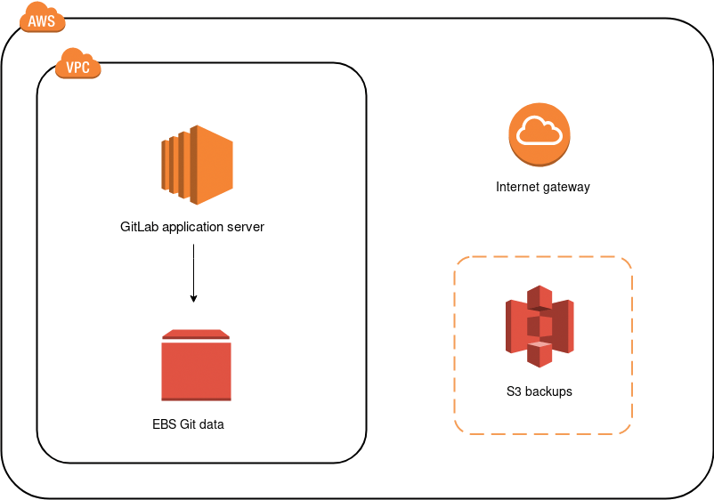

## AWS costs

Here's a list of the AWS services we will use, with links to pricing information:

- **EC2**: GitLab will deployed on shared hardware which means
  [on-demand pricing](https://aws.amazon.com/ec2/pricing/on-demand/)
  will apply. If you want to run it on a dedicated or reserved instance,
  consult the [EC2 pricing page](https://aws.amazon.com/ec2/pricing/) for more
  information on the cost.
- **EBS**: We will also use an EBS volume to store the Git data. See the
  [Amazon EBS pricing](https://aws.amazon.com/ebs/pricing/).
- **S3**: We will use S3 to store backups, artifacts, LFS objects, etc. See the
  [Amazon S3 pricing](https://aws.amazon.com/s3/pricing/).
- **ALB**: An Application Load Balancer will be used to route requests to the
  GitLab instance. See the [Amazon ELB pricing](https://aws.amazon.com/elasticloadbalancing/pricing/).
- **RDS**: An Amazon Relational Database Service using PostgreSQL will be used
  to provide a High Availability database configuration. See the
  [Amazon RDS pricing](https://aws.amazon.com/rds/postgresql/pricing/).
- **ElastiCache**: An in-memory cache environment will be used to provide a
  High Availability Redis configuration. See the
  [Amazon ElastiCache pricing](https://aws.amazon.com/elasticache/pricing/).

NOTE: **Note:** Please note that while we will be using EBS for storage, we do not recommend using EFS as it may negatively impact GitLab's performance. You can review the [relevant documentation](../../administration/high_availability/nfs.md#avoid-using-awss-elastic-file-system-efs) for more details.

## Creating an IAM EC2 instance role and profile

To minimize the permissions of the user, we'll create a new [IAM](https://docs.aws.amazon.com/IAM/latest/UserGuide/introduction.html)
role with limited access:

1. Navigate to the IAM dashboard <https://console.aws.amazon.com/iam/home> and
   click **Create role**.
1. Create a new role by selecting **AWS service > EC2**, then click
   **Next: Permissions**.
1. Choose **AmazonEC2FullAccess** and **AmazonS3FullAccess**, then click **Next: Review**.
1. Give the role the name `GitLabAdmin` and click **Create role**.

## Configuring the network

We'll start by creating a VPC for our GitLab cloud infrastructure, then
we can create subnets to have public and private instances in at least
two [Availability Zones (AZs)](https://docs.aws.amazon.com/AWSEC2/latest/UserGuide/using-regions-availability-zones.html). Public subnets will require a Route Table keep and an associated
Internet Gateway.

### Creating the Virtual Private Cloud (VPC)

We'll now create a VPC, a virtual networking environment that you'll control:

1. Navigate to <https://console.aws.amazon.com/vpc/home>.
1. Select **Your VPCs** from the left menu and then click **Create VPC**.
   At the "Name tag" enter `gitlab-vpc` and at the "IPv4 CIDR block" enter
   `10.0.0.0/16`. If you don't require dedicated hardware, you can leave
   "Tenancy" as default. Click **Yes, Create** when ready.

   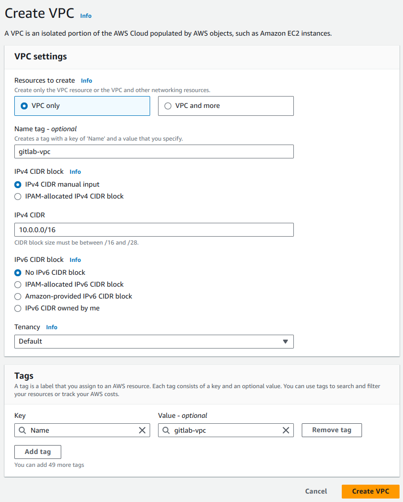

### Subnets

Now, let's create some subnets in different Availability Zones. Make sure
that each subnet is associated to the VPC we just created and
that CIDR blocks don't overlap. This will also
allow us to enable multi AZ for redundancy.

We will create private and public subnets to match load balancers and
RDS instances as well:

1. Select **Subnets** from the left menu.
1. Click **Create subnet**. Give it a descriptive name tag based on the IP,
   for example `gitlab-public-10.0.0.0`, select the VPC we created previously,
   and at the IPv4 CIDR block let's give it a 24 subnet `10.0.0.0/24`:

   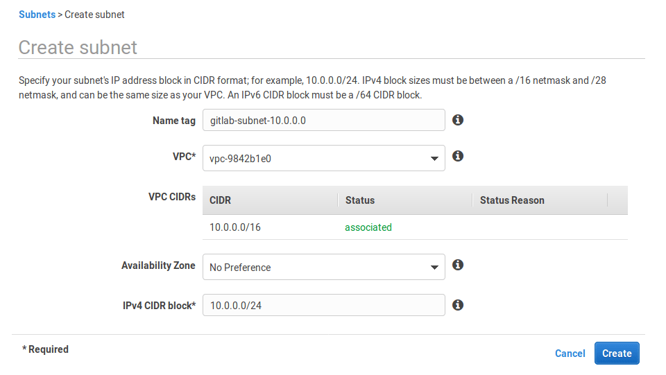

1. Follow the same steps to create all subnets:

   | Name tag                  | Type    | Availability Zone | CIDR block |
   | ------------------------- | ------- | ----------------- | ---------- |
   | `gitlab-public-10.0.0.0`  | public  | `us-west-2a`      | `10.0.0.0` |
   | `gitlab-private-10.0.1.0` | private | `us-west-2a`      | `10.0.1.0` |
   | `gitlab-public-10.0.2.0`  | public  | `us-west-2b`      | `10.0.2.0` |
   | `gitlab-private-10.0.3.0` | private | `us-west-2b`      | `10.0.3.0` |

### Route Table

Up to now all our subnets are private. We need to create a Route Table
to associate an Internet Gateway. On the same VPC dashboard:

1. Select **Route Tables** from the left menu.
1. Click **Create Route Table**.
1. At the "Name tag" enter `gitlab-public` and choose `gitlab-vpc` under "VPC".
1. Hit **Yes, Create**.

### Internet Gateway

Now, still on the same dashboard, go to Internet Gateways and
create a new one:

1. Select **Internet Gateways** from the left menu.
1. Click **Create internet gateway**, give it the name `gitlab-gateway` and
   click **Create**.
1. Select it from the table, and then under the **Actions** dropdown choose
   "Attach to VPC".

   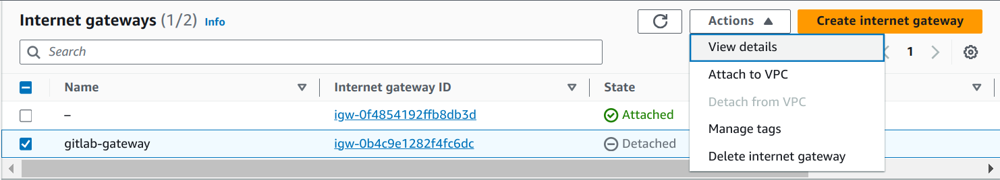

1. Choose `gitlab-vpc` from the list and hit **Attach**.

### Configuring subnets

We now need to add a new target which will be our Internet Gateway and have
it receive traffic from any destination.

1. Select **Route Tables** from the left menu and select the `gitlab-public`
   route to show the options at the bottom.
1. Select the **Routes** tab, hit **Edit > Add another route** and set `0.0.0.0/0`
   as destination. In the target, select the `gitlab-gateway` we created previously.
   Hit **Save** once done.

   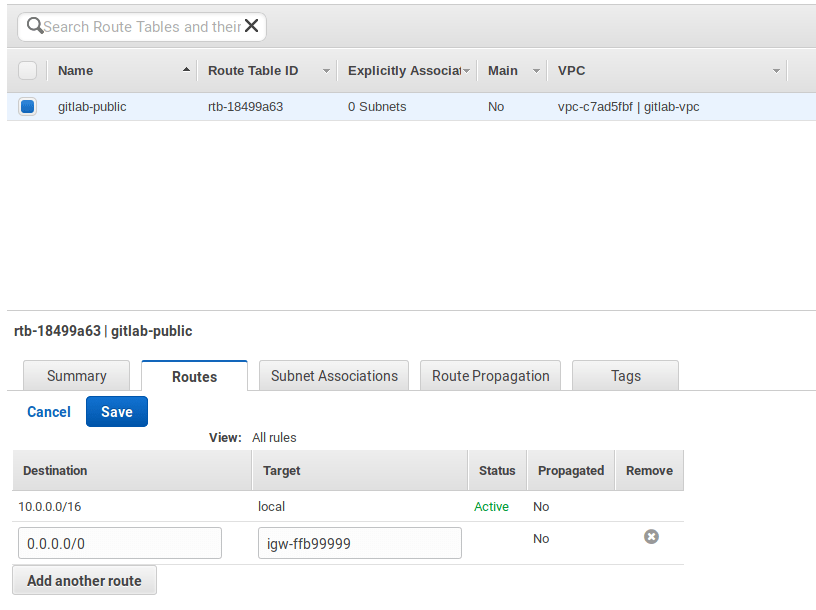

Next, we must associate the **public** subnets to the route table:

1. Select the **Subnet Associations** tab and hit **Edit**.
1. Check only the public subnet and hit **Save**.

   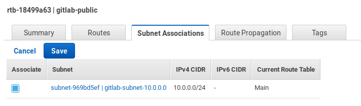

---

Now that we're done with the network, let's create a security group.

## Creating a security group

The security group is basically the firewall:

1. Select **Security Groups** from the left menu.
1. Click **Create Security Group** and fill in the details. Give it a name,
   add a description, and choose the VPC we created previously
1. Select the security group from the list and at the bottom select the
   Inbound Rules tab. You will need to open the SSH, HTTP, and HTTPS ports. Set
   the source to `0.0.0.0/0`.

   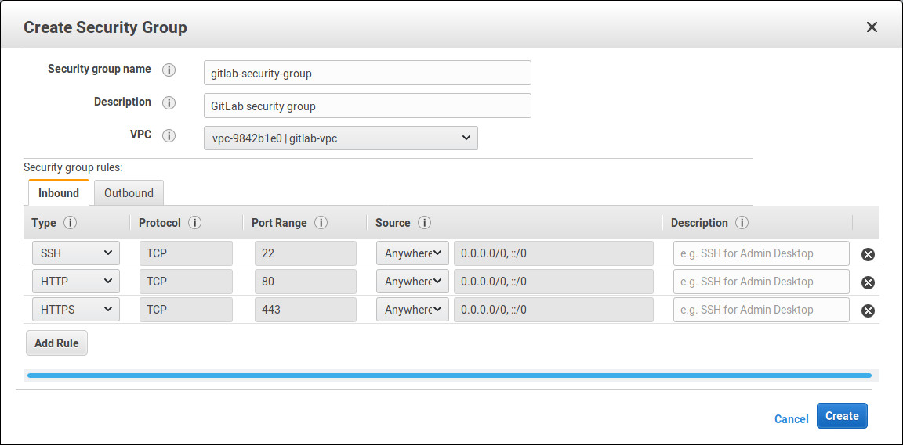

   TIP: **Tip:**
   Based on best practices, you should allow SSH traffic from only a known
   host or CIDR block. In that case, change the SSH source to be custom and give
   it the IP you want to SSH from.

1. When done, click **Save**.

## PostgreSQL with RDS

For our database server we will use Amazon RDS which offers Multi AZ
for redundancy. Let's start by creating a subnet group and then we'll
create the actual RDS instance.

### RDS Subnet Group

1. Navigate to the RDS dashboard and select **Subnet Groups** from the left menu.
1. Give it a name (`gitlab-rds-group`), a description, and choose the VPC from
   the VPC dropdown.
1. Click "Add all the subnets related to this VPC" and
   remove the public ones, we only want the **private subnets**.
   In the end, you should see `10.0.1.0/24` and `10.0.3.0/24` (as
   we defined them in the [subnets section](#subnets)).
   Click **Create** when ready.

   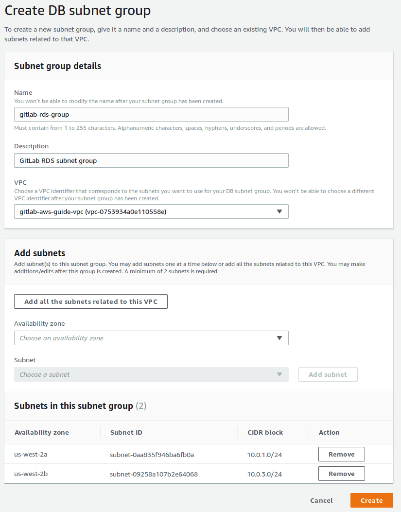

### Creating the database

Now, it's time to create the database:

1. Select **Instances** from the left menu and click **Create database**.
1. Select PostgreSQL and click **Next**.
1. Since this is a production server, let's choose "Production". Click **Next**.
1. Let's see the instance specifications:
   1. Leave the license model as is (`postgresql-license`).
   1. For the version, select the latest of the 9.6 series (check the
      [database requirements](../../install/requirements.md#postgresql-requirements))
      if there are any updates on this).
   1. For the size, let's select a `t2.medium` instance.
   1. Multi-AZ-deployment is recommended as redundancy, so choose "Create
      replica in different zone". Read more at
      [High Availability (Multi-AZ)](https://docs.aws.amazon.com/AmazonRDS/latest/UserGuide/Concepts.MultiAZ.html).
   1. A Provisioned IOPS (SSD) storage type is best suited for HA (though you can
      choose a General Purpose (SSD) to reduce the costs). Read more about it at
      [Storage for Amazon RDS](https://docs.aws.amazon.com/AmazonRDS/latest/UserGuide/CHAP_Storage.html).

1. The rest of the settings on this page request a DB instance identifier, username
   and a master password. We've chosen to use `gitlab-db-ha`, `gitlab` and a
   very secure password respectively. Keep these in hand for later.
1. Click **Next** to proceed to the advanced settings.
1. Make sure to choose our GitLab VPC, our subnet group, set public accessibility to
   **No**, and to leave it to create a new security group. The only additional
   change which will be helpful is the database name for which we can use
   `gitlabhq_production`. At the very bottom, there's an option to enable
   auto updates to minor versions. You may want to turn it off.
1. When done, click **Create database**.

### Installing the `pg_trgm` extension for PostgreSQL

Once the database is created, connect to your new RDS instance to verify access
and to install a required extension.

You can find the host or endpoint by selecting the instance you just created and
after the details drop down you'll find it labeled as 'Endpoint'. Do not to
include the colon and port number:

```sh
sudo /opt/gitlab/embedded/bin/psql -U gitlab -h <rds-endpoint> -d gitlabhq_production
```

At the psql prompt create the extension and then quit the session:

```sh
psql (9.4.7)
Type "help" for help.

gitlab=# CREATE EXTENSION pg_trgm;
gitlab=# \q
```

---

Now that the database is created, let's move on setting up Redis with ElasticCache.

## Redis with ElastiCache

ElastiCache is an in-memory hosted caching solution. Redis maintains its own
persistence and is used for certain types of the GitLab application.

To set up Redis:

1. Navigate to the ElastiCache dashboard from your AWS console.
1. Go to **Subnet Groups** in the left menu, and create a new subnet group.
   Make sure to select our VPC and its [private subnets](#subnets). Click
   **Create** when ready.

   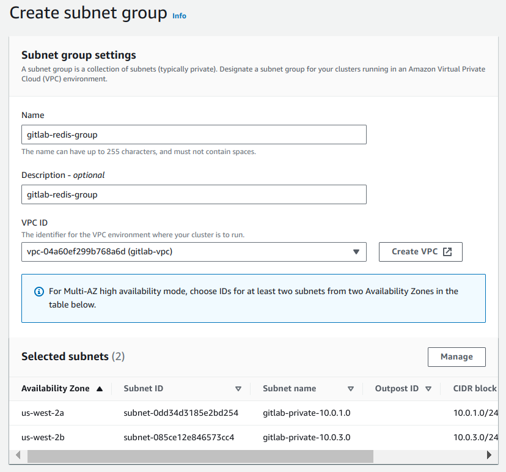

1. Select **Redis** on the left menu and click **Create** to create a new
   Redis cluster. Depending on your load, you can choose whether to enable
   cluster mode or not. Even without cluster mode on, you still get the
   chance to deploy Redis in multi availability zones. In this guide, we chose
   not to enable it.
1. In the settings section:
   1. Give the cluster a name (`gitlab-redis`) and a description.
   1. For the version, select the latest of `3.2` series (e.g., `3.2.10`).
   1. Select the node type and the number of replicas.
1. In the advanced settings section:
   1. Select the multi-AZ auto-failover option.
   1. Select the subnet group we created previously.
   1. Manually select the preferred availability zones, and under "Replica 2"
      choose a different zone than the other two.

      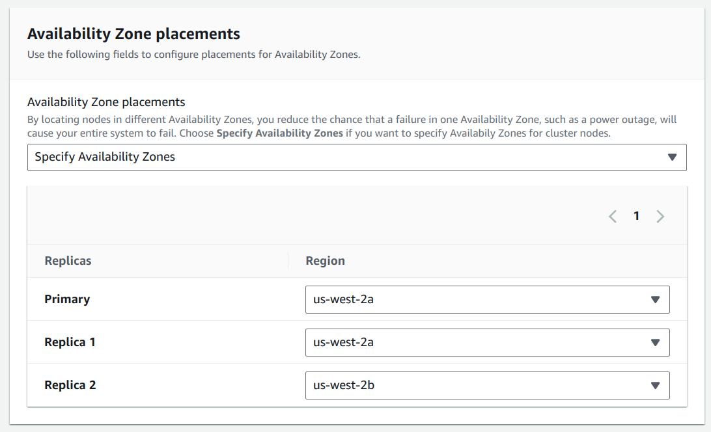

1. In the security settings, edit the security groups and choose the
   `gitlab-security-group` we had previously created.
1. Leave the rest of the settings to their default values or edit to your liking.
1. When done, click **Create**.

## RDS and Redis Security Group

Let's navigate to our EC2 security groups and add a small change for our EC2
instances to be able to connect to RDS. First, copy the security group name we
defined, namely `gitlab-security-group`, select the RDS security group and edit the
inbound rules. Choose the rule type to be PostgreSQL and paste the name under
source.

Similar to the above, jump to the `gitlab-security-group` group
and add a custom TCP rule for port `6379` accessible within itself.

## Load Balancer

On the EC2 dashboard, look for Load Balancer on the left column:

1. Click the **Create Load Balancer** button.
   1. Choose the Application Load Balancer.
   1. Give it a name (`gitlab-loadbalancer`) and set the scheme to "internet-facing".
   1. In the "Listeners" section, make sure it has HTTP and HTTPS.
   1. In the "Availability Zones" section, select the `gitlab-vpc` we have created
      and associate the **public subnets**.
1. Click **Configure Security Settings** to go to the next section to
   select the TLS certificate. When done, go to the next step.
1. In the "Security Groups" section, create a new one by giving it a name
   (`gitlab-loadbalancer-sec-group`) and allow both HTTP ad HTTPS traffic
   from anywhere (`0.0.0.0/0, ::/0`).
1. In the next step, configure the routing and select an existing target group
   (`gitlab-public`). The Load Balancer Health will allow us to indicate where to
   ping and what makes up a healthy or unhealthy instance.
1. Leave the "Register Targets" section as is, and finally review the settings
   and create the ELB.

After the Load Balancer is up and running, you can revisit your Security
Groups to refine the access only through the ELB and any other requirement
you might have.

## Deploying GitLab inside an auto scaling group

We'll use AWS's wizard to deploy GitLab and then SSH into the instance to
configure the PostgreSQL and Redis connections.

The Auto Scaling Group option is available through the EC2 dashboard on the left
sidebar.

1. Click **Create Auto Scaling group**.
1. Create a new launch configuration.

### Choose the AMI

Choose the AMI:

1. Go to the Community AMIs and search for `GitLab EE <version>`
   where `<version>` the latest version as seen on the
   [releases page](https://about.gitlab.com/releases/).

   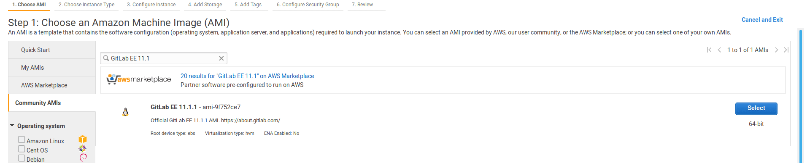

### Choose an instance type

You should choose an instance type based on your workload. Consult
[the hardware requirements](../requirements.md#hardware-requirements) to choose
one that fits your needs (at least `c5.xlarge`, which is enough to accommodate 100 users):

1. Choose the your instance type.
1. Click **Next: Configure Instance Details**.

### Configure details

In this step we'll configure some details:

1. Enter a name (`gitlab-autoscaling`).
1. Select the IAM role we created.
1. Optionally, enable CloudWatch and the EBS-optimized instance settings.
1. In the "Advanced Details" section, set the IP address type to
   "Do not assign a public IP address to any instances."
1. Click **Next: Add Storage**.

### Add storage

The root volume is 8GB by default and should be enough given that we won't store
any data there. Let's create a new EBS volume that will host the Git data. Its
size depends on your needs and you can always migrate to a bigger volume later.
You will be able to [set up that volume](#setting-up-the-ebs-volume)
after the instance is created.

CAUTION: **Caution:**
We **do not** recommend using the AWS Elastic File System (EFS), as it can result
in [significantly degraded performance](../../administration/high_availability/nfs.md#avoid-using-awss-elastic-file-system-efs).

### Configure security group

As a last step, configure the security group:

1. Select the existing load balancer security group we have [created](#load-balancer).
1. Select **Review**.

### Review and launch

Now is a good time to review all the previous settings. When ready, click
**Create launch configuration** and select the SSH key pair with which you will
connect to the instance.

### Create Auto Scaling Group

We are now able to start creating our Auto Scaling Group:

1. Give it a group name.
1. Set the group size to 2 as we want to always start with two instances.
1. Assign it our network VPC and add the **private subnets**.
1. In the "Advanced Details" section, choose to receive traffic from ELBs
   and select our ELB.
1. Choose the ELB health check.
1. Click **Next: Configure scaling policies**.

This is the really great part of Auto Scaling; we get to choose when AWS
launches new instances and when it removes them. For this group we'll
scale between 2 and 4 instances where one instance will be added if CPU
utilization is greater than 60% and one instance is removed if it falls
to less than 45%.


Finally, configure notifications and tags as you see fit, and create the
auto scaling group.

You'll notice that after we save the configuration, AWS starts launching our two
instances in different AZs and without a public IP which is exactly what
we intended.

## After deployment

After a few minutes, the instances should be up and accessible via the internet.
Let's connect to the primary and configure some things before logging in.

### Configuring GitLab to connect with postgres and Redis

While connected to your server, let's connect to the RDS instance to verify
access and to install a required extension:

```sh
sudo /opt/gitlab/embedded/bin/psql -U gitlab -h <rds-endpoint> -d gitlabhq_production
```

Edit the `gitlab.rb` file at `/etc/gitlab/gitlab.rb`
find the `external_url 'http://gitlab.example.com'` option and change it
to the domain you will be using or the public IP address of the current
instance to test the configuration.

For a more detailed description about configuring GitLab, see [Configuring GitLab for HA](../../administration/high_availability/gitlab.md)

Now look for the GitLab database settings and uncomment as necessary. In
our current case we'll specify the database adapter, encoding, host, name,
username, and password:

```ruby
# Disable the built-in Postgres
postgresql['enable'] = false

# Fill in the connection details
gitlab_rails['db_adapter'] = "postgresql"
gitlab_rails['db_encoding'] = "unicode"
gitlab_rails['db_database'] = "gitlabhq_production"
gitlab_rails['db_username'] = "gitlab"
gitlab_rails['db_password'] = "mypassword"
gitlab_rails['db_host'] = "<rds-endpoint>"
```

Next, we need to configure the Redis section by adding the host and
uncommenting the port:

```ruby
# Disable the built-in Redis
redis['enable'] = false

# Fill in the connection details
gitlab_rails['redis_host'] = "<redis-endpoint>"
gitlab_rails['redis_port'] = 6379
```

Finally, reconfigure GitLab for the change to take effect:

```sh
sudo gitlab-ctl reconfigure
```

You might also find it useful to run a check and a service status to make sure
everything has been setup correctly:

```sh
sudo gitlab-rake gitlab:check
sudo gitlab-ctl status
```

If everything looks good, you should be able to reach GitLab in your browser.

### Setting up the EBS volume

The EBS volume will host the Git repositories data:

1. First, format the `/dev/xvdb` volume and then mount it under the directory
   where the data will be stored. For example, `/mnt/gitlab-data/`.
1. Tell GitLab to store its data in the new directory by editing
   `/etc/gitlab/gitlab.rb` with your editor:

   ```ruby
   git_data_dirs({
     "default" => { "path" => "/mnt/gitlab-data" }
   })
   ```

   where `/mnt/gitlab-data` the location where you will store the Git data.

1. Save the file and reconfigure GitLab:

   ```sh
   sudo gitlab-ctl reconfigure
   ```

TIP: **Tip:**
If you wish to add more than one data volumes to store the Git repositories,
read the [repository storage paths docs](../../administration/repository_storage_paths.md).

### Setting up Gitaly

Gitaly is a service that provides high-level RPC access to Git repositories.
It should be enabled and configured in a separate EC2 instance on the
[private VPC](#subnets) we configured previously.

Follow the [documentation to set up Gitaly](../../administration/gitaly/index.md).

### Using Amazon S3 object storage

GitLab stores many objects outside the Git repository, many of which can be
uploaded to S3. That way, you can offload the root disk volume of these objects
which would otherwise take much space.

In particular, you can store in S3:

- [The Git LFS objects](../../administration/lfs/lfs_administration.md#s3-for-omnibus-installations) ((Omnibus GitLab installations))
- [The Container Registry images](../../administration/packages/container_registry.md#container-registry-storage-driver) (Omnibus GitLab installations)
- [The GitLab CI/CD job artifacts](../../administration/job_artifacts.md#using-object-storage) (Omnibus GitLab installations)

### Setting up a domain name

After you SSH into the instance, configure the domain name:

1. Open `/etc/gitlab/gitlab.rb` with your preferred editor.
1. Edit the `external_url` value:

   ```ruby
   external_url 'http://example.com'
   ```

1. Reconfigure GitLab:

   ```sh
   sudo gitlab-ctl reconfigure
   ```

You should now be able to reach GitLab at the URL you defined. To use HTTPS
(recommended), see the [HTTPS documentation](https://docs.gitlab.com/omnibus/settings/nginx.html#enable-https).

### Logging in for the first time

If you followed the previous section, you should be now able to visit GitLab
in your browser. The very first time, you will be asked to set up a password
for the `root` user which has admin privileges on the GitLab instance.

After you set it up, login with username `root` and the newly created password.

## Health check and monitoring with Prometheus

Apart from Amazon's Cloudwatch which you can enable on various services,
GitLab provides its own integrated monitoring solution based on Prometheus.
For more information on how to set it up, visit the
[GitLab Prometheus documentation](../../administration/monitoring/prometheus/index.md)

GitLab also has various [health check endpoints](../..//user/admin_area/monitoring/health_check.md)
that you can ping and get reports.

## GitLab Runners

If you want to take advantage of [GitLab CI/CD](../../ci/README.md), you have to
set up at least one [GitLab Runner](https://docs.gitlab.com/runner/).

Read more on configuring an
[autoscaling GitLab Runner on AWS](https://docs.gitlab.com/runner/configuration/runner_autoscale_aws/).

## Backup and restore

GitLab provides [a tool to backup](../../raketasks/backup_restore.md#creating-a-backup-of-the-gitlab-system)
and restore its Git data, database, attachments, LFS objects, etc.

Some important things to know:

- The backup/restore tool **does not** store some configuration files, like secrets; you'll
  need to [configure this yourself](../../raketasks/backup_restore.md#storing-configuration-files).
- By default, the backup files are stored locally, but you can
  [backup GitLab using S3](../../raketasks/backup_restore.md#using-amazon-s3).
- You can [exclude specific directories form the backup](../../raketasks/backup_restore.md#excluding-specific-directories-from-the-backup).

### Backing up GitLab

To back up GitLab:

1. SSH into your instance.
1. Take a backup:

   ```sh
   sudo gitlab-backup create
   ```

NOTE: **Note**
For GitLab 12.1 and earlier, use `gitlab-rake gitlab:backup:create`.

### Restoring GitLab from a backup

To restore GitLab, first review the [restore documentation](../../raketasks/backup_restore.md#restore),
and primarily the restore prerequisites. Then, follow the steps under the
[Omnibus installations section](../../raketasks/backup_restore.md#restore-for-omnibus-gitlab-installations).

## Updating GitLab

GitLab releases a new version every month on the 22nd. Whenever a new version is
released, you can update your GitLab instance:

1. SSH into your instance
1. Take a backup:

   ```sh
   sudo gitlab-backup create
   ```

NOTE: **Note**
For GitLab 12.1 and earlier, use `gitlab-rake gitlab:backup:create`.

1. Update the repositories and install GitLab:

   ```sh
   sudo apt update
   sudo apt install gitlab-ee
   ```

After a few minutes, the new version should be up and running.

## Conclusion

In this guide, we went mostly through scaling and some redundancy options,
your mileage may vary.

Keep in mind that all Highly Available solutions come with a trade-off between
cost/complexity and uptime. The more uptime you want, the more complex the solution.
And the more complex the solution, the more work is involved in setting up and
maintaining it.

Have a read through these other resources and feel free to
[open an issue](https://gitlab.com/gitlab-org/gitlab-foss/issues/new)
to request additional material:

- [GitLab High Availability](../../administration/high_availability/README.md):
  GitLab supports several different types of clustering and high-availability.
- [Geo replication](../../administration/geo/replication/index.md):
  Geo is the solution for widely distributed development teams.
- [Omnibus GitLab](https://docs.gitlab.com/omnibus/) - Everything you need to know
  about administering your GitLab instance.
- [Upload a license](../../user/admin_area/license.md):
  Activate all GitLab Enterprise Edition functionality with a license.
- [Pricing](https://about.gitlab.com/pricing/): Pricing for the different tiers.

<!-- ## Troubleshooting

Include any troubleshooting steps that you can foresee. If you know beforehand what issues
one might have when setting this up, or when something is changed, or on upgrading, it's
important to describe those, too. Think of things that may go wrong and include them here.
This is important to minimize requests for support and to avoid doc comments with
questions that you know someone might ask.

Each scenario can be a third-level heading, e.g. `### Getting error message X`.
If you have none to add when creating a doc, leave this section in place
but commented out to help encourage others to add to it in the future. -->
