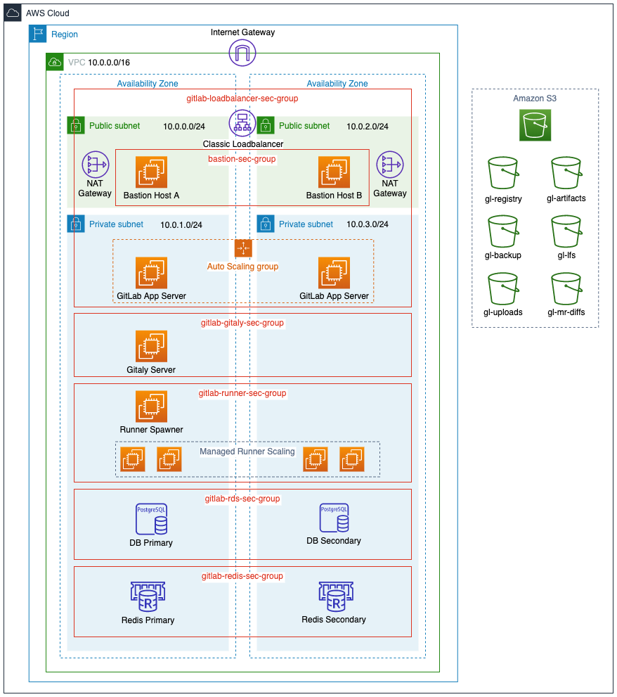

{::options parse_block_html="true" /}

# Installing a GitLab POC on Amazon Web Services (AWS) **(FREE SELF)**

This page offers a walkthrough of a common configuration for GitLab on AWS using the official GitLab Linux package. You should customize it to accommodate your needs.

NOTE:
For organizations with 1,000 users or less, the recommended AWS installation method is to launch an EC2 single box [Omnibus Installation](https://about.gitlab.com/install/) and implement a snapshot strategy for backing up the data. See the [1,000 user reference architecture](../../administration/reference_architectures/1k_users.md) for more information.

## Getting started for production-grade GitLab

NOTE:
This document is an installation guide for a proof of concept instance. It is not a reference architecture and it does not result in a highly available configuration.

Following this guide exactly results in a proof of concept instance that roughly equates to a **scaled down** version of a **two availability zone implementation** of the **Non-HA** [Omnibus 2000 User Reference Architecture](../../administration/reference_architectures/2k_users.md). The 2K reference architecture is not HA because it is primarily intended to provide some scaling while keeping costs and complexity low. The [3000 User Reference Architecture](../../administration/reference_architectures/3k_users.md) is the smallest size that is GitLab HA. It has additional service roles to achieve HA, most notably it uses Gitaly Cluster to achieve HA for Git repository storage and specifies triple redundancy.

GitLab maintains and tests two main types of Reference Architectures. The **Omnibus architectures** are implemented on instance compute while **Cloud Native Hybrid architectures** maximize the use of a Kubernetes cluster. Cloud Native Hybrid reference architecture specifications are addendum sections to the Reference Architecture size pages that start by describing the Omnibus architecture. For example, the 3000 User Cloud Native Reference Architecture is in the subsection titled [Cloud Native Hybrid reference architecture with Helm Charts (alternative)](../../administration/reference_architectures/3k_users.md#cloud-native-hybrid-reference-architecture-with-helm-charts-alternative) in the 3000 User Reference Architecture page.

### Getting started for production-grade Omnibus GitLab

The Infrastructure as Code tooling [GitLab Environment Tool (GET)](https://gitlab.com/gitlab-org/gitlab-environment-toolkit/-/tree/main) is the best place to start for building Omnibus GitLab on AWS and most especially if you are targeting an HA setup. While it does not automate everything, it does complete complex setups like Gitaly Cluster for you. GET is open source so anyone can build on top of it and contribute improvements to it.

### Getting started for production-grade Cloud Native Hybrid GitLab

For the Cloud Native Hybrid architectures there are two Infrastructure as Code options which are compared in GitLab Cloud Native Hybrid on AWS EKS implementation pattern in the section [Available Infrastructure as Code for GitLab Cloud Native Hybrid](gitlab_hybrid_on_aws.md#available-infrastructure-as-code-for-gitlab-cloud-native-hybrid). It compares the [GitLab Environment Toolkit](https://gitlab.com/gitlab-org/gitlab-environment-toolkit/-/tree/main) to the AWS Quick Start for GitLab Cloud Native Hybrid on EKS which was co-developed by GitLab and AWS. GET and the AWS Quick Start are both open source so anyone can build on top of them and contribute improvements to them.

## Introduction

For the most part, we make use of Omnibus GitLab in our setup, but we also leverage native AWS services. Instead of using the Omnibus bundled PostgreSQL and Redis, we use Amazon RDS and ElastiCache.

In this guide, we go through a multi-node setup where we start by
configuring our Virtual Private Cloud and subnets to later integrate
services such as RDS for our database server and ElastiCache as a Redis
cluster to finally manage them in an auto scaling group with custom
scaling policies.

## Requirements

In addition to having a basic familiarity with [AWS](https://docs.aws.amazon.com/) and [Amazon EC2](https://docs.aws.amazon.com/ec2/), you need:

- [An AWS account](https://console.aws.amazon.com/console/home)
- [To create or upload an SSH key](https://docs.aws.amazon.com/AWSEC2/latest/UserGuide/ec2-key-pairs.html)
  to connect to the instance via SSH
- A domain name for the GitLab instance
- An SSL/TLS certificate to secure your domain. If you do not already own one, you can provision a free public SSL/TLS certificate through [AWS Certificate Manager](https://aws.amazon.com/certificate-manager/)(ACM) for use with the [Elastic Load Balancer](#load-balancer) we create.

NOTE:
It can take a few hours to validate a certificate provisioned through ACM. To avoid delays later, request your certificate as soon as possible.

## Architecture

Below is a diagram of the recommended architecture.



## AWS costs

GitLab uses the following AWS services, with links to pricing information:

- **EC2**: GitLab is deployed on shared hardware, for which
  [on-demand pricing](https://aws.amazon.com/ec2/pricing/on-demand/) applies.
  If you want to run GitLab on a dedicated or reserved instance, see the
  [EC2 pricing page](https://aws.amazon.com/ec2/pricing/) for information about
  its cost.
- **S3**: GitLab uses S3 ([pricing page](https://aws.amazon.com/s3/pricing/)) to
  store backups, artifacts, and LFS objects.
- **ELB**: A Classic Load Balancer ([pricing page](https://aws.amazon.com/elasticloadbalancing/pricing/)),
  used to route requests to the GitLab instances.
- **RDS**: An Amazon Relational Database Service using PostgreSQL
  ([pricing page](https://aws.amazon.com/rds/postgresql/pricing/)).
- **ElastiCache**: An in-memory cache environment ([pricing page](https://aws.amazon.com/elasticache/pricing/)),
  used to provide a Redis configuration.

## Create an IAM EC2 instance role and profile

As we are using [Amazon S3 object storage](#amazon-s3-object-storage), our EC2 instances must have read, write, and list permissions for our S3 buckets. To avoid embedding AWS keys in our GitLab configuration, we make use of an [IAM Role](https://docs.aws.amazon.com/IAM/latest/UserGuide/id_roles.html) to allow our GitLab instance with this access. We must create an IAM policy to attach to our IAM role:

### Create an IAM Policy

1. Go to the IAM dashboard and select **Policies** in the left menu.
1. Select **Create policy**, select the `JSON` tab, and add a policy. We want to [follow security best practices and grant _least privilege_](https://docs.aws.amazon.com/IAM/latest/UserGuide/best-practices.html#grant-least-privilege), giving our role only the permissions needed to perform the required actions.
   1. Assuming you prefix the S3 bucket names with `gl-` as shown in the diagram, add the following policy:

   ```json
   {   "Version": "2012-10-17",
       "Statement": [
           {
               "Effect": "Allow",
               "Action": [
                   "s3:PutObject",
                   "s3:GetObject",
                   "s3:DeleteObject",
                   "s3:PutObjectAcl"
               ],
               "Resource": "arn:aws:s3:::gl-*/*"
           },
           {
               "Effect": "Allow",
               "Action": [
                   "s3:ListBucket",
                   "s3:AbortMultipartUpload",
                   "s3:ListMultipartUploadParts",
                   "s3:ListBucketMultipartUploads"
               ],
               "Resource": "arn:aws:s3:::gl-*"
           }
       ]
   }
   ```

1. Select **Review policy**, give your policy a name (we use `gl-s3-policy`), and select **Create policy**.

### Create an IAM Role

1. Still on the IAM dashboard, select **Roles** in the left menu, and
   select **Create role**.
1. Create a new role by selecting **AWS service > EC2**, then select
   **Next: Permissions**.
1. In the policy filter, search for the `gl-s3-policy` we created above, select it, and select **Tags**.
1. Add tags if needed and select **Review**.
1. Give the role a name (we use `GitLabS3Access`) and select **Create Role**.

We use this role when we [create a launch configuration](#create-a-launch-configuration) later on.

## Configuring the network

We start by creating a VPC for our GitLab cloud infrastructure, then
we can create subnets to have public and private instances in at least
two [Availability Zones (AZs)](https://docs.aws.amazon.com/AWSEC2/latest/UserGuide/using-regions-availability-zones.html). Public subnets require a Route Table keep and an associated
Internet Gateway.

### Creating the Virtual Private Cloud (VPC)

We now create a VPC, a virtual networking environment that you control:

1. Sign in to [Amazon Web Services](https://console.aws.amazon.com/vpc/home).
1. Select **Your VPCs** from the left menu and then select **Create VPC**.
   At the "Name tag" enter `gitlab-vpc` and at the "IPv4 CIDR block" enter
   `10.0.0.0/16`. If you don't require dedicated hardware, you can leave
   "Tenancy" as default. Select **Yes, Create** when ready.

   

1. Select the VPC, select **Actions**, select **Edit DNS resolution**, and enable DNS resolution. Select **Save** when done.

### Subnets

Now, let's create some subnets in different Availability Zones. Make sure
that each subnet is associated to the VPC we just created and
that CIDR blocks don't overlap. This also
allows us to enable multi AZ for redundancy.

We create private and public subnets to match load balancers and
RDS instances as well:

1. Select **Subnets** from the left menu.
1. Select **Create subnet**. Give it a descriptive name tag based on the IP,
   for example `gitlab-public-10.0.0.0`, select the VPC we created previously, select an availability zone (we use `us-west-2a`),
   and at the IPv4 CIDR block let's give it a 24 subnet `10.0.0.0/24`:

   

1. Follow the same steps to create all subnets:

   | Name tag                  | Type    | Availability Zone | CIDR block    |
   | ------------------------- | ------- | ----------------- | ------------- |
   | `gitlab-public-10.0.0.0`  | public  | `us-west-2a`      | `10.0.0.0/24` |
   | `gitlab-private-10.0.1.0` | private | `us-west-2a`      | `10.0.1.0/24` |
   | `gitlab-public-10.0.2.0`  | public  | `us-west-2b`      | `10.0.2.0/24` |
   | `gitlab-private-10.0.3.0` | private | `us-west-2b`      | `10.0.3.0/24` |

1. Once all the subnets are created, enable **Auto-assign IPv4** for the two public subnets:
   1. Select each public subnet in turn, select **Actions**, and select **Modify auto-assign IP settings**. Enable the option and save.

### Internet Gateway

Now, still on the same dashboard, go to Internet Gateways and
create a new one:

1. Select **Internet Gateways** from the left menu.
1. Select **Create internet gateway**, give it the name `gitlab-gateway` and
   select **Create**.
1. Select it from the table, and then under the **Actions** dropdown list choose
   "Attach to VPC".

   

1. Choose `gitlab-vpc` from the list and hit **Attach**.

### Create NAT Gateways

Instances deployed in our private subnets must connect to the internet for updates, but should not be reachable from the public internet. To achieve this, we make use of [NAT Gateways](https://docs.aws.amazon.com/vpc/latest/userguide/vpc-nat-gateway.html) deployed in each of our public subnets:

1. Go to the VPC dashboard and select **NAT Gateways** in the left menu bar.
1. Select **Create NAT Gateway** and complete the following:
   1. **Subnet**: Select `gitlab-public-10.0.0.0` from the dropdown list.
   1. **Elastic IP Allocation ID**: Enter an existing Elastic IP or select **Allocate Elastic IP address** to allocate a new IP to your NAT gateway.
   1. Add tags if needed.
   1. Select **Create NAT Gateway**.

Create a second NAT gateway but this time place it in the second public subnet, `gitlab-public-10.0.2.0`.

### Route Tables

#### Public Route Table

We must create a route table for our public subnets to reach the internet via the internet gateway we created in the previous step.

On the VPC dashboard:

1. Select **Route Tables** from the left menu.
1. Select **Create Route Table**.
1. At the "Name tag" enter `gitlab-public` and choose `gitlab-vpc` under "VPC".
1. Select **Create**.

We now must add our internet gateway as a new target and have
it receive traffic from any destination.

1. Select **Route Tables** from the left menu and select the `gitlab-public`
   route to show the options at the bottom.
1. Select the **Routes** tab, select **Edit routes > Add route** and set `0.0.0.0/0`
   as the destination. In the target column, select the `gitlab-gateway` we created previously.
   Select **Save routes** when done.

Next, we must associate the **public** subnets to the route table:

1. Select the **Subnet Associations** tab and select **Edit subnet associations**.
1. Check only the public subnets and select **Save**.

#### Private Route Tables

We also must create two private route tables so that instances in each private subnet can reach the internet via the NAT gateway in the corresponding public subnet in the same availability zone.

1. Follow the same steps as above to create two private route tables. Name them `gitlab-private-a` and `gitlab-private-b`.
1. Next, add a new route to each of the private route tables where the destination is `0.0.0.0/0` and the target is one of the NAT gateways we created earlier.
   1. Add the NAT gateway we created in `gitlab-public-10.0.0.0` as the target for the new route in the `gitlab-private-a` route table.
   1. Similarly, add the NAT gateway in `gitlab-public-10.0.2.0` as the target for the new route in the `gitlab-private-b`.
1. Lastly, associate each private subnet with a private route table.
   1. Associate `gitlab-private-10.0.1.0` with `gitlab-private-a`.
   1. Associate `gitlab-private-10.0.3.0` with `gitlab-private-b`.

## Load Balancer

We create a load balancer to evenly distribute inbound traffic on ports `80` and `443` across our GitLab application servers. Based on the [scaling policies](#create-an-auto-scaling-group) we create later, instances are added to or removed from our load balancer as needed. Additionally, the load balancer performs health checks on our instances.

On the EC2 dashboard, look for Load Balancer in the left navigation bar:

1. Select **Create Load Balancer**.
   1. Choose the **Classic Load Balancer**.
   1. Give it a name (we use `gitlab-loadbalancer`) and for the **Create LB Inside** option, select `gitlab-vpc` from the dropdown list.
   1. In the **Listeners** section, set the following listeners:
        - HTTP port 80 for both load balancer and instance protocol and ports
        - TCP port 22 for both load balancer and instance protocols and ports
        - HTTPS port 443 for load balancer protocol and ports, forwarding to HTTP port 80 on the instance (we configure GitLab to listen on port 80 [later in the guide](#add-support-for-proxied-ssl))
   1. In the **Select Subnets** section, select both public subnets from the list so that the load balancer can route traffic to both availability zones.
1. We add a security group for our load balancer to act as a firewall to control what traffic is allowed through. Select **Assign Security Groups** and select **Create a new security group**, give it a name
   (we use `gitlab-loadbalancer-sec-group`) and description, and allow both HTTP and HTTPS traffic
   from anywhere (`0.0.0.0/0, ::/0`). Also allow SSH traffic, select a custom source, and add a single trusted IP address or an IP address range in CIDR notation. This allows users to perform Git actions over SSH.
1. Select **Configure Security Settings** and set the following:
   1. Select an SSL/TLS certificate from ACM or upload a certificate to IAM.
   1. Under **Select a Cipher**, pick a predefined security policy from the dropdown list. You can see a breakdown of [Predefined SSL Security Policies for Classic Load Balancers](https://docs.aws.amazon.com/elasticloadbalancing/latest/classic/elb-security-policy-table.html) in the AWS documentation. Check the GitLab codebase for a list of [supported SSL ciphers and protocols](https://gitlab.com/gitlab-org/gitlab/-/blob/9ee7ad433269b37251e0dd5b5e00a0f00d8126b4/lib/support/nginx/gitlab-ssl#L97-99).
1. Select **Configure Health Check** and set up a health check for your EC2 instances.
   1. For **Ping Protocol**, select HTTP.
   1. For **Ping Port**, enter 80.
   1. For **Ping Path** - we recommend that you [use the Readiness check endpoint](../../administration/load_balancer.md#readiness-check). You must add [the VPC IP Address Range (CIDR)](https://docs.aws.amazon.com/elasticloadbalancing/latest/classic/elb-security-groups.html#elb-vpc-nacl) to the [IP allowlist](../../administration/monitoring/ip_allowlist.md) for the [Health Check endpoints](../../user/admin_area/monitoring/health_check.md)
   1. Keep the default **Advanced Details** or adjust them according to your needs.
1. Select **Add EC2 Instances** - don't add anything as we create an Auto Scaling Group later to manage instances for us.
1. Select **Add Tags** and add any tags you need.
1. Select **Review and Create**, review all your settings, and select **Create** if you're happy.

After the Load Balancer is up and running, you can revisit your Security
Groups to refine the access only through the ELB and any other requirements
you might have.

### Configure DNS for Load Balancer

On the Route 53 dashboard, select **Hosted zones** in the left navigation bar:

1. Select an existing hosted zone or, if you do not already have one for your domain, select **Create Hosted Zone**, enter your domain name, and select **Create**.
1. Select **Create Record Set** and provide the following values:
    1. **Name:** Use the domain name (the default value) or enter a subdomain.
    1. **Type:** Select **A - IPv4 address**.
    1. **Alias:** Defaults to **No**. Select **Yes**.
    1. **Alias Target:** Find the **ELB Classic Load Balancers** section and select the classic load balancer we created earlier.
    1. **Routing Policy:** We use **Simple** but you can choose a different policy based on your use case.
    1. **Evaluate Target Health:** We set this to **No** but you can choose to have the load balancer route traffic based on target health.
    1. Select **Create**.
1. If you registered your domain through Route 53, you're done. If you used a different domain registrar, you must update your DNS records with your domain registrar. You must:
   1. Select **Hosted zones** and select the domain you added above.
   1. You see a list of `NS` records. From your domain registrar's administrator panel, add each of these as `NS` records to your domain's DNS records. These steps may vary between domain registrars. If you're stuck, Google **"name of your registrar" add DNS records** and you should find a help article specific to your domain registrar.

The steps for doing this vary depending on which registrar you use and is beyond the scope of this guide.

## PostgreSQL with RDS

For our database server we use Amazon RDS for PostgreSQL which offers Multi AZ
for redundancy (Aurora is **not** supported). First we create a security group and subnet group, then we
create the actual RDS instance.

### RDS Security Group

We need a security group for our database that allows inbound traffic from the instances we deploy in our `gitlab-loadbalancer-sec-group` later on:

1. From the EC2 dashboard, select **Security Groups** from the left menu bar.
1. Select **Create security group**.
1. Give it a name (we use `gitlab-rds-sec-group`), a description, and select the `gitlab-vpc` from the **VPC** dropdown list.
1. In the **Inbound rules** section, select **Add rule** and set the following:
   1. **Type:** search for and select the **PostgreSQL** rule.
   1. **Source type:** set as "Custom".
   1. **Source:** select the `gitlab-loadbalancer-sec-group` we created earlier.
1. When done, select **Create security group**.

### RDS Subnet Group

1. Go to the RDS dashboard and select **Subnet Groups** from the left menu.
1. Select **Create DB Subnet Group**.
1. Under **Subnet group details**, enter a name (we use `gitlab-rds-group`), a description, and choose the `gitlab-vpc` from the VPC dropdown list.
1. From the **Availability Zones** dropdown list, select the Availability Zones that include the subnets you've configured. In our case, we add `eu-west-2a` and `eu-west-2b`.
1. From the **Subnets** dropdown list, select the two private subnets (`10.0.1.0/24` and `10.0.3.0/24`) as we defined them in the [subnets section](#subnets).
1. Select **Create** when ready.

### Create the database

WARNING:
Avoid using burstable instances (t class instances) for the database as this could lead to performance issues due to CPU credits running out during sustained periods of high load.

Now, it's time to create the database:

1. Go to the RDS dashboard, select **Databases** from the left menu, and select **Create database**.
1. Select **Standard Create** for the database creation method.
1. Select **PostgreSQL** as the database engine and select the minimum PostgreSQL version as defined for your GitLab version in our [database requirements](../../install/requirements.md#postgresql-requirements).
1. Because this is a production server, let's choose **Production** from the **Templates** section.
1. Under **Settings**, use:
   - `gitlab-db-ha` for the DB instance identifier.
   - `gitlab` for a master username.
   - A very secure password for the master password.

   Make a note of these as we need them later.

1. For the DB instance size, select **Standard classes** and select an instance size that meets your requirements from the dropdown list. We use a `db.m4.large` instance.
1. Under **Storage**, configure the following:
   1. Select **Provisioned IOPS (SSD)** from the storage type dropdown list. Provisioned IOPS (SSD) storage is best suited for this use (though you can choose General Purpose (SSD) to reduce the costs). Read more about it at [Storage for Amazon RDS](https://docs.aws.amazon.com/AmazonRDS/latest/UserGuide/CHAP_Storage.html).
   1. Allocate storage and set provisioned IOPS. We use the minimum values, `100` and `1000`, respectively.
   1. Enable storage autoscaling (optional) and set a maximum storage threshold.
1. Under **Availability & durability**, select **Create a standby instance** to have a standby RDS instance provisioned in a different [Availability Zone](https://docs.aws.amazon.com/AmazonRDS/latest/UserGuide/Concepts.MultiAZ.html).
1. Under **Connectivity**, configure the following:
   1. Select the VPC we created earlier (`gitlab-vpc`) from the **Virtual Private Cloud (VPC)** dropdown list.
   1. Expand the **Additional connectivity configuration** section and select the subnet group (`gitlab-rds-group`) we created earlier.
   1. Set public accessibility to **No**.
   1. Under **VPC security group**, select **Choose existing** and select the `gitlab-rds-sec-group` we create above from the dropdown list.
   1. Leave the database port as the default `5432`.
1. For **Database authentication**, select **Password authentication**.
1. Expand the **Additional configuration** section and complete the following:
   1. The initial database name. We use `gitlabhq_production`.
   1. Configure your preferred backup settings.
   1. The only other change we make here is to disable auto minor version updates under **Maintenance**.
   1. Leave all the other settings as is or tweak according to your needs.
   1. If you're happy, select **Create database**.

Now that the database is created, let's move on to setting up Redis with ElastiCache.

## Redis with ElastiCache

ElastiCache is an in-memory hosted caching solution. Redis maintains its own
persistence and is used to store session data, temporary cache information, and background job queues for the GitLab application.

### Create a Redis Security Group

1. Go to the EC2 dashboard.
1. Select **Security Groups** from the left menu.
1. Select **Create security group** and fill in the details. Give it a name (we use `gitlab-redis-sec-group`),
   add a description, and choose the VPC we created previously
1. In the **Inbound rules** section, select **Add rule** and add a **Custom TCP** rule, set port `6379`, and set the "Custom" source as the `gitlab-loadbalancer-sec-group` we created earlier.
1. When done, select **Create security group**.

### Redis Subnet Group

1. Go to the ElastiCache dashboard from your AWS console.
1. Go to **Subnet Groups** in the left menu, and create a new subnet group (we name ours `gitlab-redis-group`).
   Make sure to select our VPC and its [private subnets](#subnets).
1. Select **Create** when ready.

   

### Create the Redis Cluster

1. Go back to the ElastiCache dashboard.
1. Select **Redis** on the left menu and select **Create** to create a new
   Redis cluster. Do not enable **Cluster Mode** as it is [not supported](../../administration/redis/replication_and_failover_external.md#requirements). Even without cluster mode on, you still get the
   chance to deploy Redis in multiple availability zones.
1. In the settings section:
   1. Give the cluster a name (`gitlab-redis`) and a description.
   1. For the version, select the latest.
   1. Leave the port as `6379` because this is what we used in our Redis security group above.
   1. Select the node type (at least `cache.t3.medium`, but adjust to your needs) and the number of replicas.
1. In the advanced settings section:
   1. Select the multi-AZ auto-failover option.
   1. Select the subnet group we created previously.
   1. Manually select the preferred availability zones, and under "Replica 2"
      choose a different zone than the other two.

      

1. In the security settings, edit the security groups and choose the
   `gitlab-redis-sec-group` we had previously created.
1. Leave the rest of the settings to their default values or edit to your liking.
1. When done, select **Create**.

## Setting up Bastion Hosts

Because our GitLab instances are in private subnets, we need a way to connect
to these instances with SSH for actions that include making configuration changes
and performing upgrades. One way of doing this is by using a [bastion host](https://en.wikipedia.org/wiki/Bastion_host),
sometimes also referred to as a jump box.

NOTE:
If you do not want to maintain bastion hosts, you can set up [AWS Systems Manager Session Manager](https://docs.aws.amazon.com/systems-manager/latest/userguide/session-manager.html) for access to instances. This is beyond the scope of this document.

### Create Bastion Host A

1. Go to the EC2 Dashboard and select **Launch instance**.
1. Select the **Ubuntu Server 18.04 LTS (HVM)** AMI.
1. Choose an instance type. We use a `t2.micro` as we only use the bastion host to SSH into our other instances.
1. Select **Configure Instance Details**.
   1. Under **Network**, select the `gitlab-vpc` from the dropdown list.
   1. Under **Subnet**, select the public subnet we created earlier (`gitlab-public-10.0.0.0`).
   1. Double check that under **Auto-assign Public IP** you have **Use subnet setting (Enable)** selected.
   1. Leave everything else as default and select **Add Storage**.
1. For storage, we leave everything as default and only add an 8GB root volume. We do not store anything on this instance.
1. Select **Add Tags** and on the next screen select **Add Tag**.
   1. We only set `Key: Name` and `Value: Bastion Host A`.
1. Select **Configure Security Group**.
   1. Select **Create a new security group**, enter a **Security group name** (we use `bastion-sec-group`), and add a description.
   1. We enable SSH access from anywhere (`0.0.0.0/0`). If you want stricter security, specify a single IP address or an IP address range in CIDR notation.
   1. Select **Review and Launch**
1. Review all your settings and, if you're happy, select **Launch**.
1. Acknowledge that you have access to an existing key pair or create a new one. Select **Launch Instance**.

Confirm that you can SSH into the instance:

1. On the EC2 Dashboard, select **Instances** in the left menu.
1. Select **Bastion Host A** from your list of instances.
1. Select **Connect** and follow the connection instructions.
1. If you are able to connect successfully, let's move on to setting up our second bastion host for redundancy.

### Create Bastion Host B

1. Create an EC2 instance following the same steps as above with the following changes:
   1. For the **Subnet**, select the second public subnet we created earlier (`gitlab-public-10.0.2.0`).
   1. Under the **Add Tags** section, we set `Key: Name` and `Value: Bastion Host B` so that we can easily identify our two instances.
   1. For the security group, select the existing `bastion-sec-group` we created above.

### Use SSH Agent Forwarding

EC2 instances running Linux use private key files for SSH authentication. You connect to your bastion host using an SSH client and the private key file stored on your client. Because the private key file is not present on the bastion host, you are not able to connect to your instances in private subnets.

Storing private key files on your bastion host is a bad idea. To get around this, use SSH agent forwarding on your client. See [Securely Connect to Linux Instances Running in a Private Amazon VPC](https://aws.amazon.com/blogs/security/securely-connect-to-linux-instances-running-in-a-private-amazon-vpc/) for a step-by-step guide on how to use SSH agent forwarding.

## Install GitLab and create custom AMI

We need a preconfigured, custom GitLab AMI to use in our launch configuration later. As a starting point, we use the official GitLab AMI to create a GitLab instance. Then, we add our custom configuration for PostgreSQL, Redis, and Gitaly. If you prefer, instead of using the official GitLab AMI, you can also spin up an EC2 instance of your choosing and [manually install GitLab](https://about.gitlab.com/install/).

### Install GitLab

From the EC2 dashboard:

1. Use the section below titled "[Find official GitLab-created AMI IDs on AWS](#find-official-gitlab-created-ami-ids-on-aws)" to find the correct AMI to launch.
1. After selecting **Launch** on the desired AMI, select an instance type based on your workload. Consult the [hardware requirements](../../install/requirements.md#hardware-requirements) to choose one that fits your needs (at least `c5.xlarge`, which is sufficient to accommodate 100 users).
1. Select **Configure Instance Details**:
   1. In the **Network** dropdown list, select `gitlab-vpc`, the VPC we created earlier.
   1. In the **Subnet** dropdown list, select `gitlab-private-10.0.1.0` from the list of subnets we created earlier.
   1. Double check that **Auto-assign Public IP** is set to `Use subnet setting (Disable)`.
   1. Select **Add Storage**.
   1. The root volume is 8GiB by default and should be enough given that we do not store any data there.
1. Select **Add Tags** and add any tags you may need. In our case, we only set `Key: Name` and `Value: GitLab`.
1. Select **Configure Security Group**. Check **Select an existing security group** and select the `gitlab-loadbalancer-sec-group` we created earlier.
1. Select **Review and launch** followed by **Launch** if you're happy with your settings.
1. Finally, acknowledge that you have access to the selected private key file or create a new one. Select **Launch Instances**.

### Add custom configuration

Connect to your GitLab instance via **Bastion Host A** using [SSH Agent Forwarding](#use-ssh-agent-forwarding). Once connected, add the following custom configuration:

#### Disable Let's Encrypt

Because we're adding our SSL certificate at the load balancer, we do not need the GitLab built-in support for Let's Encrypt. Let's Encrypt [is enabled by default](https://docs.gitlab.com/omnibus/settings/ssl/index.html#enable-the-lets-encrypt-integration) when using an `https` domain in GitLab 10.7 and later, so we must explicitly disable it:

1. Open `/etc/gitlab/gitlab.rb` and disable it:

   ```ruby
   letsencrypt['enable'] = false
   ```

1. Save the file and reconfigure for the changes to take effect:

   ```shell
   sudo gitlab-ctl reconfigure
   ```

#### Install the required extensions for PostgreSQL

From your GitLab instance, connect to the RDS instance to verify access and to install the required `pg_trgm` and `btree_gist` extensions.

To find the host or endpoint, go to **Amazon RDS > Databases** and select the database you created earlier. Look for the endpoint under the **Connectivity & security** tab.

Do not to include the colon and port number:

```shell
sudo /opt/gitlab/embedded/bin/psql -U gitlab -h <rds-endpoint> -d gitlabhq_production
```

At the `psql` prompt create the extension and then quit the session:

```shell
psql (10.9)
Type "help" for help.

gitlab=# CREATE EXTENSION pg_trgm;
gitlab=# CREATE EXTENSION btree_gist;
gitlab=# \q
```

#### Configure GitLab to connect to PostgreSQL and Redis

1. Edit `/etc/gitlab/gitlab.rb`, find the `external_url 'http://<domain>'` option
   and change it to the `https` domain you are using.

1. Look for the GitLab database settings and uncomment as necessary. In
   our current case we specify the database adapter, encoding, host, name,
   username, and password:

   ```ruby
   # Disable the built-in Postgres
    postgresql['enable'] = false

   # Fill in the connection details
   gitlab_rails['db_adapter'] = "postgresql"
   gitlab_rails['db_encoding'] = "unicode"
   gitlab_rails['db_database'] = "gitlabhq_production"
   gitlab_rails['db_username'] = "gitlab"
   gitlab_rails['db_password'] = "mypassword"
   gitlab_rails['db_host'] = "<rds-endpoint>"
   ```

1. Next, we must configure the Redis section by adding the host and
   uncommenting the port:

   ```ruby
   # Disable the built-in Redis
   redis['enable'] = false

   # Fill in the connection details
   gitlab_rails['redis_host'] = "<redis-endpoint>"
   gitlab_rails['redis_port'] = 6379
   ```

1. Finally, reconfigure GitLab for the changes to take effect:

   ```shell
   sudo gitlab-ctl reconfigure
   ```

1. You can also run a check and a service status to make sure
   everything has been setup correctly:

   ```shell
   sudo gitlab-rake gitlab:check
   sudo gitlab-ctl status
   ```

#### Set up Gitaly

WARNING:
In this architecture, having a single Gitaly server creates a single point of failure. Use
[Gitaly Cluster](../../administration/gitaly/praefect.md) to remove this limitation.

Gitaly is a service that provides high-level RPC access to Git repositories.
It should be enabled and configured on a separate EC2 instance in one of the
[private subnets](#subnets) we configured previously.

Let's create an EC2 instance where we install Gitaly:

1. From the EC2 dashboard, select **Launch instance**.
1. Choose an AMI. In this example, we select the **Ubuntu Server 18.04 LTS (HVM), SSD Volume Type**.
1. Choose an instance type. We pick a `c5.xlarge`.
1. Select **Configure Instance Details**.
   1. In the **Network** dropdown list, select `gitlab-vpc`, the VPC we created earlier.
   1. In the **Subnet** dropdown list, select `gitlab-private-10.0.1.0` from the list of subnets we created earlier.
   1. Double check that **Auto-assign Public IP** is set to `Use subnet setting (Disable)`.
   1. Select **Add Storage**.
1. Increase the Root volume size to `20 GiB` and change the **Volume Type** to `Provisioned IOPS SSD (io1)`. (This is an arbitrary size. Create a volume big enough for your repository storage requirements.)
   1. For **IOPS** set `1000` (20 GiB x 50 IOPS). You can provision up to 50 IOPS per GiB. If you select a larger volume, increase the IOPS accordingly. Workloads where many small files are written in a serialized manner, like `git`, requires performant storage, hence the choice of `Provisioned IOPS SSD (io1)`.
1. Select **Add Tags** and add your tags. In our case, we only set `Key: Name` and `Value: Gitaly`.
1. Select **Configure Security Group** and let's **Create a new security group**.
   1. Give your security group a name and description. We use `gitlab-gitaly-sec-group` for both.
   1. Create a **Custom TCP** rule and add port `8075` to the **Port Range**. For the **Source**, select the `gitlab-loadbalancer-sec-group`.
   1. Also add an inbound rule for SSH from the `bastion-sec-group` so that we can connect using [SSH Agent Forwarding](#use-ssh-agent-forwarding) from the Bastion hosts.
1. Select **Review and launch** followed by **Launch** if you're happy with your settings.
1. Finally, acknowledge that you have access to the selected private key file or create a new one. Select **Launch Instances**.

NOTE:
Instead of storing configuration _and_ repository data on the root volume, you can also choose to add an additional EBS volume for repository storage. Follow the same guidance as above. See the [Amazon EBS pricing](https://aws.amazon.com/ebs/pricing/). We do not recommend using EFS as it may negatively impact the performance of GitLab. You can review the [relevant documentation](../../administration/nfs.md#avoid-using-cloud-based-file-systems) for more details.

Now that we have our EC2 instance ready, follow the [documentation to install GitLab and set up Gitaly on its own server](../../administration/gitaly/configure_gitaly.md#run-gitaly-on-its-own-server). Perform the client setup steps from that document on the [GitLab instance we created](#install-gitlab) above.

#### Add Support for Proxied SSL

As we are terminating SSL at our [load balancer](#load-balancer), follow the steps at [Supporting proxied SSL](https://docs.gitlab.com/omnibus/settings/ssl/index.html#configure-a-reverse-proxy-or-load-balancer-ssl-termination) to configure this in `/etc/gitlab/gitlab.rb`.

Remember to run `sudo gitlab-ctl reconfigure` after saving the changes to the `gitlab.rb` file.

#### Fast lookup of authorized SSH keys

The public SSH keys for users allowed to access GitLab are stored in `/var/opt/gitlab/.ssh/authorized_keys`. Typically we'd use shared storage so that all the instances are able to access this file when a user performs a Git action over SSH. Because we do not have shared storage in our setup, we update our configuration to authorize SSH users via indexed lookup in the GitLab database.

Follow the instructions at [Set up fast SSH key lookup](../../administration/operations/fast_ssh_key_lookup.md#set-up-fast-lookup) to switch from using the `authorized_keys` file to the database.

If you do not configure fast lookup, Git actions over SSH results in the following error:

```shell
Permission denied (publickey).
fatal: Could not read from remote repository.

Please make sure you have the correct access rights
and the repository exists.
```

#### Configure host keys

Ordinarily we would manually copy the contents (primary and public keys) of `/etc/ssh/` on the primary application server to `/etc/ssh` on all secondary servers. This prevents false man-in-the-middle-attack alerts when accessing servers in your cluster behind a load balancer.

We automate this by creating static host keys as part of our custom AMI. As these host keys are also rotated every time an EC2 instance boots up, "hard coding" them into our custom AMI serves as a workaround.

On your GitLab instance run the following:

```shell
sudo mkdir /etc/ssh_static
sudo cp -R /etc/ssh/* /etc/ssh_static
```

In `/etc/ssh/sshd_config` update the following:

```shell
# HostKeys for protocol version 2
HostKey /etc/ssh_static/ssh_host_rsa_key
HostKey /etc/ssh_static/ssh_host_dsa_key
HostKey /etc/ssh_static/ssh_host_ecdsa_key
HostKey /etc/ssh_static/ssh_host_ed25519_key
```

#### Amazon S3 object storage

Because we're not using NFS for shared storage, we use [Amazon S3](https://aws.amazon.com/s3/) buckets to store backups, artifacts, LFS objects, uploads, merge request diffs, container registry images, and more. Our documentation includes [instructions on how to configure object storage](../../administration/object_storage.md) for each of these data types, and other information about using object storage with GitLab.

NOTE:
Because we are using the [AWS IAM profile](#create-an-iam-role) we created earlier, be sure to omit the AWS access key and secret access key/value pairs when configuring object storage. Instead, use `'use_iam_profile' => true` in your configuration as shown in the object storage documentation linked above.

Remember to run `sudo gitlab-ctl reconfigure` after saving the changes to the `gitlab.rb` file.

---

That concludes the configuration changes for our GitLab instance. Next, we create a custom AMI based on this instance to use for our launch configuration and auto scaling group.

### Log in for the first time

Using the domain name you used when setting up [DNS for the load balancer](#configure-dns-for-load-balancer), you should now be able to visit GitLab in your browser.

Depending on how you installed GitLab and if you did not change the password by any other means, the default password is either:

- Your instance ID if you used the official GitLab AMI.
- A randomly generated password stored for 24 hours in `/etc/gitlab/initial_root_password`.

To change the default password, log in as the `root` user with the default password and [change it in the user profile](../../user/profile/user_passwords.md#change-your-password).

When our [auto scaling group](#create-an-auto-scaling-group) spins up new instances, we are able to sign in with username `root` and the newly created password.

### Create custom AMI

On the EC2 dashboard:

1. Select the `GitLab` instance we [created earlier](#install-gitlab).
1. Select **Actions**, scroll down to **Image** and select **Create Image**.
1. Give your image a name and description (we use `GitLab-Source` for both).
1. Leave everything else as default and select **Create Image**

Now we have a custom AMI that we use to create our launch configuration the next step.

## Deploy GitLab inside an auto scaling group

### Create a launch configuration

From the EC2 dashboard:

1. Select **Launch Configurations** from the left menu and select **Create launch configuration**.
1. Select **My AMIs** from the left menu and select the `GitLab` custom AMI we created above.
1. Select an instance type best suited for your needs (at least a `c5.xlarge`) and select **Configure details**.
1. Enter a name for your launch configuration (we use `gitlab-ha-launch-config`).
1. **Do not** check **Request Spot Instance**.
1. From the **IAM Role** dropdown list, pick the `GitLabAdmin` instance role we [created earlier](#create-an-iam-ec2-instance-role-and-profile).
1. Leave the rest as defaults and select **Add Storage**.
1. The root volume is 8GiB by default and should be enough given that we do not store any data there. Select **Configure Security Group**.
1. Check **Select and existing security group** and select the `gitlab-loadbalancer-sec-group` we created earlier.
1. Select **Review**, review your changes, and select **Create launch configuration**.
1. Acknowledge that you have access to the private key or create a new one. Select **Create launch configuration**.

### Create an auto scaling group

1. After the launch configuration is created, select **Create an Auto Scaling group using this launch configuration** to start creating the auto scaling group.
1. Enter a **Group name** (we use `gitlab-auto-scaling-group`).
1. For **Group size**, enter the number of instances you want to start with (we enter `2`).
1. Select the `gitlab-vpc` from the **Network** dropdown list.
1. Add both the private [subnets we created earlier](#subnets).
1. Expand the **Advanced Details** section and check the **Receive traffic from one or more load balancers** option.
1. From the **Classic Load Balancers** dropdown list, select the load balancer we created earlier.
1. For **Health Check Type**, select **ELB**.
1. We leave our **Health Check Grace Period** as the default `300` seconds. Select **Configure scaling policies**.
1. Check **Use scaling policies to adjust the capacity of this group**.
1. For this group we scale between 2 and 4 instances where one instance is added if CPU
utilization is greater than 60% and one instance is removed if it falls
to less than 45%.


1. Finally, configure notifications and tags as you see fit, review your changes, and create the
auto scaling group.

As the auto scaling group is created, you see your new instances spinning up in your EC2 dashboard. You also see the new instances added to your load balancer. After the instances pass the heath check, they are ready to start receiving traffic from the load balancer.

Because our instances are created by the auto scaling group, go back to your instances and terminate the [instance we created manually above](#install-gitlab). We only needed this instance to create our custom AMI.

## Health check and monitoring with Prometheus

Apart from Amazon's Cloudwatch which you can enable on various services,
GitLab provides its own integrated monitoring solution based on Prometheus.
For more information about how to set it up, see
[GitLab Prometheus](../../administration/monitoring/prometheus/index.md).

GitLab also has various [health check endpoints](../../user/admin_area/monitoring/health_check.md)
that you can ping and get reports.

## GitLab Runner

If you want to take advantage of [GitLab CI/CD](../../ci/index.md), you have to
set up at least one [runner](https://docs.gitlab.com/runner/).

Read more on configuring an
[autoscaling GitLab Runner on AWS](https://docs.gitlab.com/runner/configuration/runner_autoscale_aws/).

## Backup and restore

GitLab provides [a tool to back up](../../raketasks/backup_restore.md)
and restore its Git data, database, attachments, LFS objects, and so on.

Some important things to know:

- The backup/restore tool **does not** store some configuration files, like secrets; you
  must [configure this yourself](../../raketasks/backup_gitlab.md#storing-configuration-files).
- By default, the backup files are stored locally, but you can
  [backup GitLab using S3](../../raketasks/backup_gitlab.md#using-amazon-s3).
- You can [exclude specific directories form the backup](../../raketasks/backup_gitlab.md#excluding-specific-directories-from-the-backup).

### Backing up GitLab

To back up GitLab:

1. SSH into your instance.
1. Take a backup:

   ```shell
   sudo gitlab-backup create
   ```

NOTE:
For GitLab 12.1 and earlier, use `gitlab-rake gitlab:backup:create`.

### Restoring GitLab from a backup

To restore GitLab, first review the [restore documentation](../../raketasks/backup_restore.md#restore-gitlab),
and primarily the restore prerequisites. Then, follow the steps under the
[Omnibus installations section](../../raketasks/restore_gitlab.md#restore-for-omnibus-gitlab-installations).

## Updating GitLab

GitLab releases a new version every month on the 22nd. Whenever a new version is
released, you can update your GitLab instance:

1. SSH into your instance
1. Take a backup:

   ```shell
   sudo gitlab-backup create
   ```

NOTE:
For GitLab 12.1 and earlier, use `gitlab-rake gitlab:backup:create`.

1. Update the repositories and install GitLab:

   ```shell
   sudo apt update
   sudo apt install gitlab-ee
   ```

After a few minutes, the new version should be up and running.

## Find official GitLab-created AMI IDs on AWS

Read more on how to use [GitLab releases as AMIs](index.md#official-gitlab-releases-as-amis).

## Conclusion

In this guide, we went mostly through scaling and some redundancy options,
your mileage may vary.

Keep in mind that all solutions come with a trade-off between
cost/complexity and uptime. The more uptime you want, the more complex the solution.
And the more complex the solution, the more work is involved in setting up and
maintaining it.

Have a read through these other resources and feel free to
[open an issue](https://gitlab.com/gitlab-org/gitlab/-/issues/new)
to request additional material:

- [Scaling GitLab](../../administration/reference_architectures/index.md):
  GitLab supports several different types of clustering.
- [Geo replication](../../administration/geo/index.md):
  Geo is the solution for widely distributed development teams.
- [Omnibus GitLab](https://docs.gitlab.com/omnibus/) - Everything you must know
  about administering your GitLab instance.
- [Add a license](../../user/admin_area/license.md):
  Activate all GitLab Enterprise Edition functionality with a license.
- [Pricing](https://about.gitlab.com/pricing/): Pricing for the different tiers.

## Troubleshooting

### Instances are failing health checks

If your instances are failing the load balancer's health checks, verify that they are returning a status `200` from the health check endpoint we configured earlier. Any other status, including redirects like status `302`, causes the health check to fail.

You may have to set a password on the `root` user to prevent automatic redirects on the sign-in endpoint before health checks pass.

### "The change you requested was rejected (422)"

If you see this page when trying to set a password via the web interface, make sure `external_url` in `gitlab.rb` matches the domain you are making a request from, and run `sudo gitlab-ctl reconfigure` after making any changes to it.

### Some job logs are not uploaded to object storage

When the GitLab deployment is scaled up to more than one node, some job logs may not be uploaded to [object storage](../../administration/object_storage.md) properly. [Incremental logging is required](../../administration/object_storage.md#alternatives-to-file-system-storage) for CI to use object storage.

Enable [incremental logging](../../administration/job_logs.md#enable-or-disable-incremental-logging) if it has not already been enabled.
