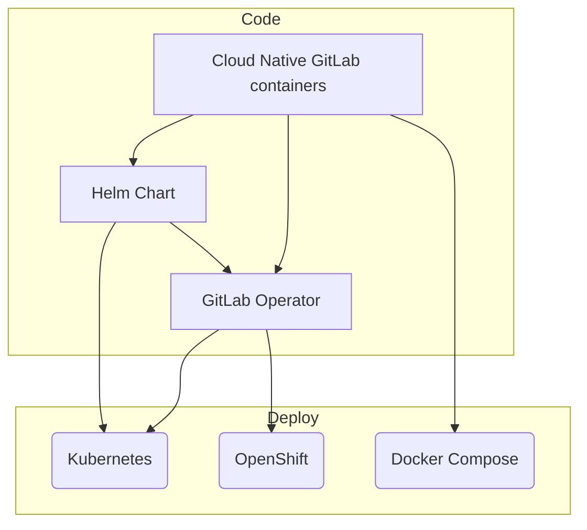

# Cloud Native GitLab **(FREE SELF)**

[Cloud Native GitLab](https://gitlab.com/gitlab-org/build/CNG) provides cloud
native containers to deploy GitLab. These containers may be deployed and managed
via Helm using GitLab Charts or GitLab Operator on Kubernetes, OpenShift,
and Kubernetes compatible container platforms:

- [Helm charts](https://docs.gitlab.com/charts/): The cloud native Helm chart
  installs GitLab and all of its components on Kubernetes. Use this method if
  your infrastructure is built on Kubernetes and you're familiar with how it
  works. The methods for management, observability, and some concepts are
  different than traditional deployments.
- [GitLab Operator](https://docs.gitlab.com/operator/): The GitLab Operator
  provides an installation and management method for GitLab following the
  [Kubernetes Operator pattern](https://kubernetes.io/docs/concepts/extend-kubernetes/operator/).
  You can also use the GitLab Operator to run GitLab in an
  [OpenShift](../openshift_and_gitlab/index.md) environment.

Here's an overview of how the containers are built:

