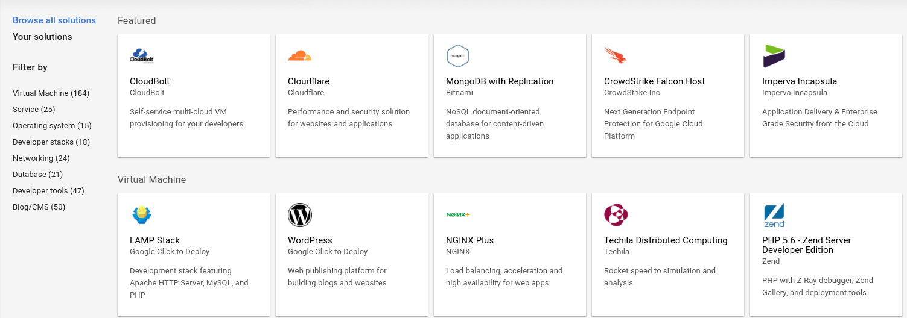
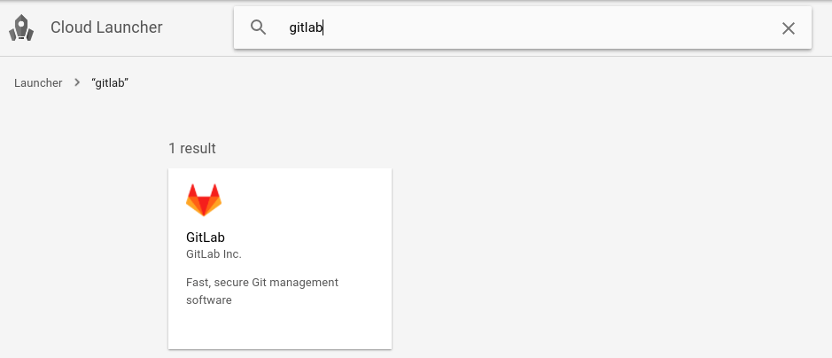
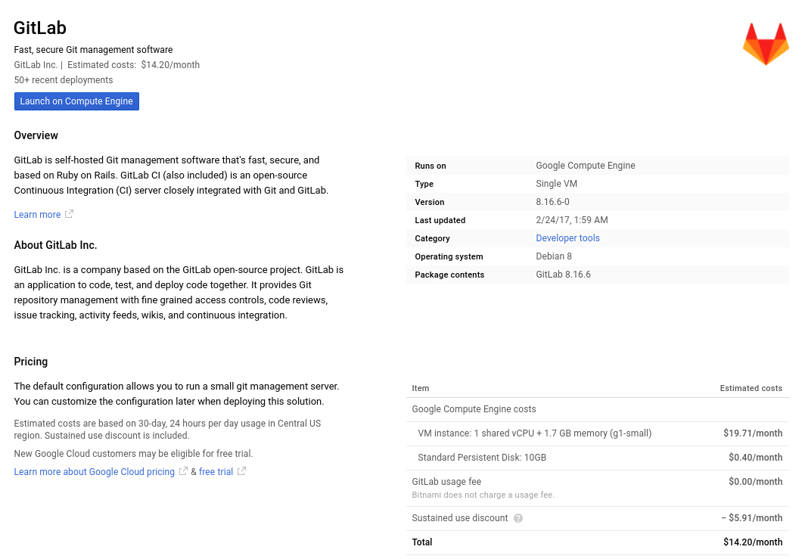
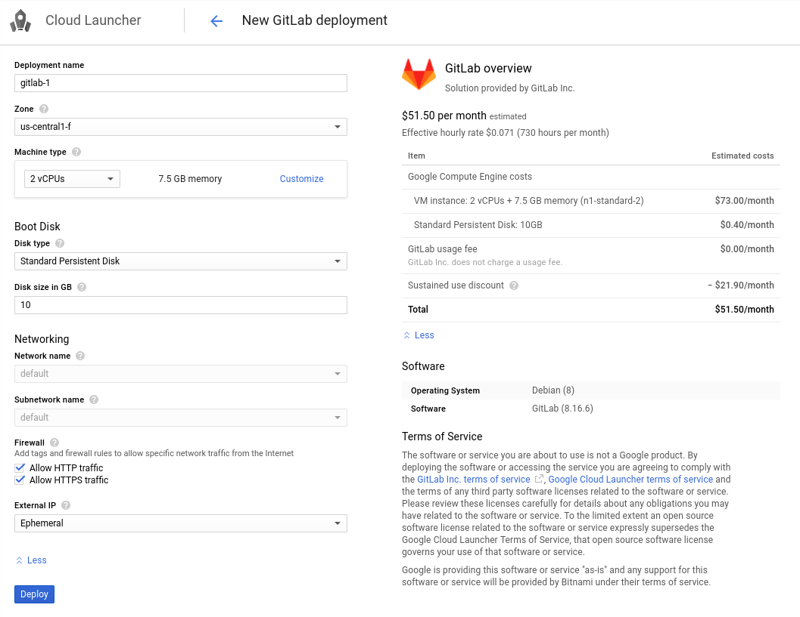
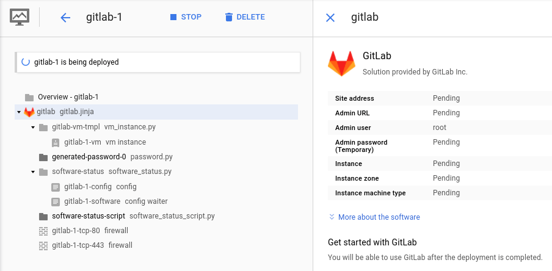
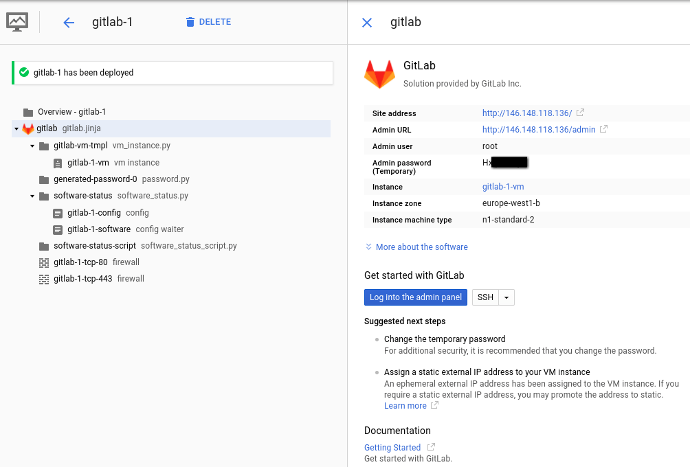
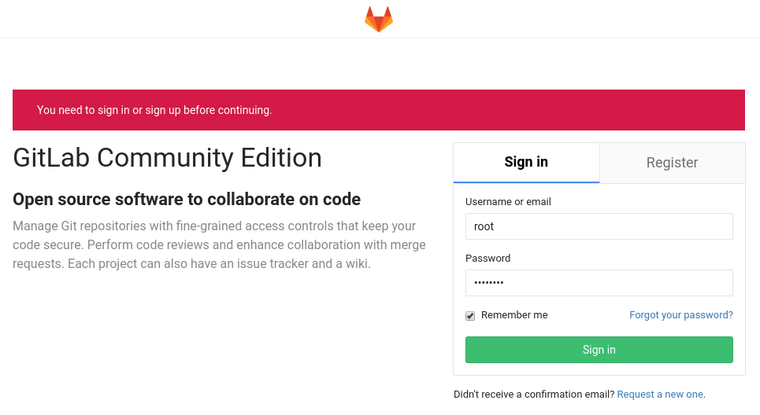
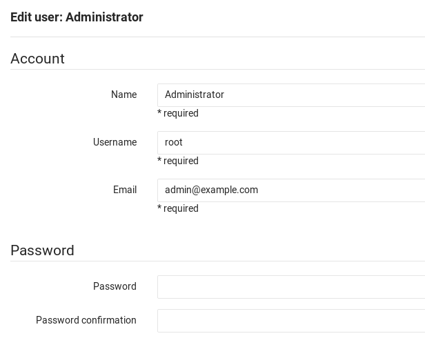

# Installing GitLab on Google Cloud Platform


The fastest way to get started on [Google Cloud Platform (GCP)][gcp] is through
the [Google Cloud Launcher][launcher] program.

GitLab's official Google Launcher apps:
1. [GitLab Community Edition](https://console.cloud.google.com/launcher/details/gitlab-public/gitlab-community-edition?project=gitlab-public)
2. [GitLab Enterprise Edition](https://console.cloud.google.com/launcher/details/gitlab-public/gitlab-enterprise-edition?project=gitlab-public)

## Prerequisites

There are only two prerequisites in order to install GitLab on GCP:

1. You need to have a Google account.
1. You need to sign up for the GCP program. If this is your first time, Google
   gives you [$300 credit for free][freetrial] to consume over a 60-day period.

Once you have performed those two steps, you can visit the
[GCP launcher console][console] which has a list of all the things you can
deploy on GCP.



The next step is to find and install GitLab.

## Configuring and deploying the VM

To deploy GitLab on GCP you need to follow five simple steps:

1. Go to https://cloud.google.com/launcher and login with your Google credentials
1. Search for GitLab from GitLab Inc. (not the same as Bitnami) and click on
   the tile.

    

1. In the next page, you can see an overview of the GitLab VM as well as some
   estimated costs. Click the **Launch on Compute Engine** button to choose the
   hardware and network settings.

    

1. In the settings page you can choose things like the datacenter where your GitLab
   server will be hosted, the number of CPUs and amount of RAM, the disk size
   and type, etc. Read GitLab's [requirements documentation][req] for more
   details on what to choose depending on your needs.

    

1. As a last step, hit **Deploy** when ready. The process will finish in a few
   seconds.

    


## Visiting GitLab for the first time

After a few seconds, GitLab will be successfully deployed and you should be
able to see the IP address that Google assigned to the VM, as well as the
credentials to the GitLab admin account.



1. Click on the IP under **Site address** to visit GitLab.
1. Accept the self-signed certificate that Google automatically deployed in
   order to securely reach GitLab's login page.
1. Use the username and password that are present in the Google console page
   to login into GitLab and click **Sign in**.

      

Congratulations! GitLab is now installed and you can access it via your browser,
but we're not done yet. There are some steps you need to take in order to have
a fully functional GitLab installation.

## Next steps

These are the most important next steps to take after you installed GitLab for
the first time.

### Changing the admin password and email

Google assigned a random password for the GitLab admin account and you should
change it ASAP:

1. Visit the GitLab admin page through the link in the Google console under
   **Admin URL**.
1. Find the Administrator user under the **Users** page and hit **Edit**.
1. Change the email address to a real one and enter a new password.

    

1. Hit **Save changes** for the changes to take effect.
1. After changing the password, you will be signed out from GitLab. Use the
   new credentials to login again.

### Assigning a static IP

By default, Google assigns an ephemeral IP to your instance. It is strongly
recommended to assign a static IP if you are going to use GitLab in production
and use a domain name as we'll see below.

Read Google's documentation on how to [promote an ephemeral IP address][ip].

### Using a domain name

Assuming you have a domain name in your possession and you have correctly
set up DNS to point to the static IP you configured in the previous step,
here's how you configure GitLab to be aware of the change:

1. SSH into the VM. You can easily use the **SSH** button in the Google console
   and a new window will pop up.

    

     In the future you might want to set up [connecting with an SSH key][ssh]
     instead.

1. Edit the config file of Omnibus GitLab using your favorite text editor:

    ```
    sudo vim /etc/gitlab/gitlab.rb
    ```

1. Set the `external_url` value to the domain name you wish GitLab to have
   **without** `https`:

    ```
    external_url 'http://gitlab.example.com'
    ```

    We will set up HTTPS in the next step, no need to do this now.

1. Reconfigure GitLab for the changes to take effect:

    ```
    sudo gitlab-ctl reconfigure
    ```

1. You can now visit GitLab using the domain name.

### Configuring HTTPS with the domain name

Although not needed, it's strongly recommended to secure GitLab with a TLS
certificate. Follow the steps in the [Omnibus documentation][omni-ssl].

### Configuring the email SMTP settings

You need to configure the email SMTP settings correctly otherwise GitLab will
not be able to send notification emails, like comments, and password changes.
Check the [Omnibus documentation][omni-smtp] how to do so.

## Further reading

GitLab can be configured to authenticate with other OAuth providers, LDAP, SAML,
Kerberos, etc. Here are some documents you might be interested in reading:

- [Omnibus GitLab documentation](https://docs.gitlab.com/omnibus/)
- [Integration documentation](https://docs.gitlab.com/ce/integration/)
- [GitLab Pages configuration](https://docs.gitlab.com/ce/administration/pages/index.html)
- [GitLab Container Registry configuration](https://docs.gitlab.com/ce/administration/container_registry.html)

[console]: https://console.cloud.google.com/launcher "GCP launcher console"
[freetrial]: https://console.cloud.google.com/freetrial "GCP free trial"
[ip]: https://cloud.google.com/compute/docs/configure-instance-ip-addresses#promote_ephemeral_ip "Configuring an Instance's IP Addresses"
[gcp]: https://cloud.google.com/ "Google Cloud Platform"
[launcher]: https://cloud.google.com/launcher/ "Google Cloud Launcher home page"
[req]: ../requirements.md "GitLab hardware and software requirements"
[ssh]: https://cloud.google.com/compute/docs/instances/connecting-to-instance "Connecting to Linux Instances"
[omni-smtp]: https://docs.gitlab.com/omnibus/settings/smtp.html#smtp-settings "Omnibus GitLab SMTP settings"
[omni-ssl]: https://docs.gitlab.com/omnibus/settings/nginx.html#enable-https "Omnibus GitLab enable HTTPS"
