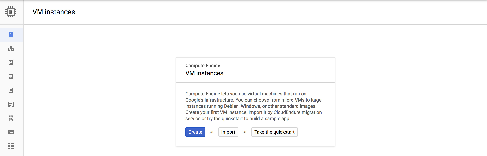
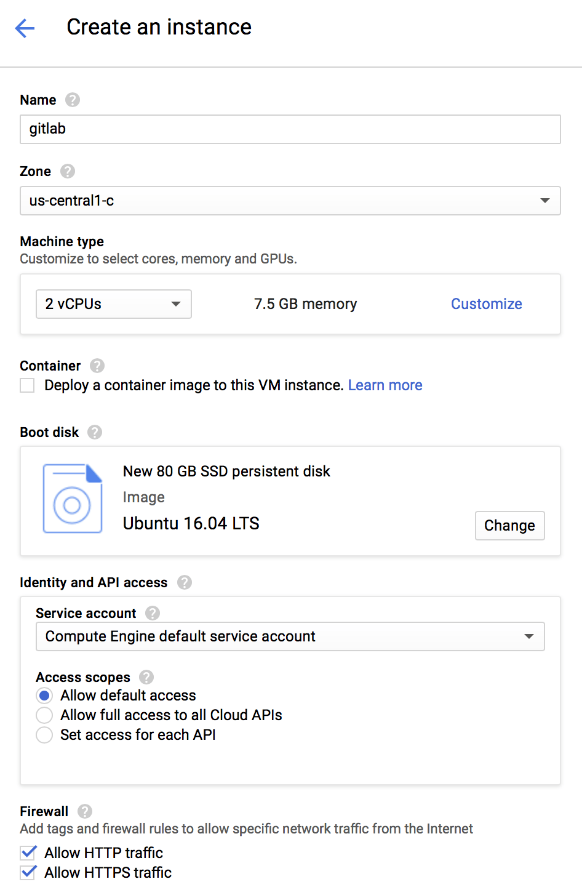
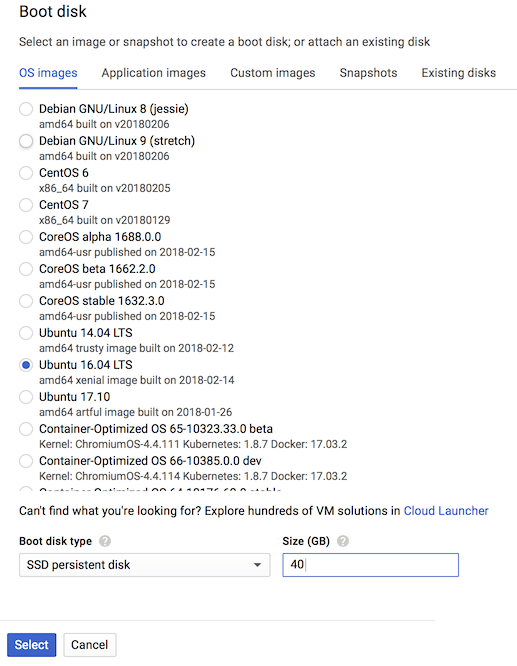
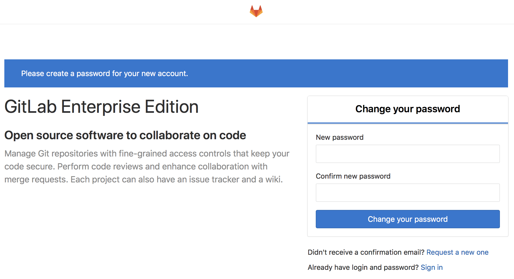

# Installing GitLab on Google Cloud Platform

This guide will help you install GitLab on a [Google Cloud Platform (GCP)][gcp] instance.

NOTE: **Alternative installation method:**
Google provides a whitepaper for [deploying production-ready GitLab on
Google Kubernetes Engine](https://cloud.google.com/solutions/deploying-production-ready-gitlab-on-gke),
including all steps and external resource configuration. These are an alternative to using a GCP VM, and use
the [Cloud native GitLab Helm chart](https://docs.gitlab.com/charts/).

## Prerequisites

There are only two prerequisites in order to install GitLab on GCP:

1. You need to have a Google account.
1. You need to sign up for the GCP program. If this is your first time, Google
   gives you [$300 credit for free][freetrial] to consume over a 60-day period.

Once you have performed those two steps, you can [create a VM](#creating-the-vm).

## Creating the VM

To deploy GitLab on GCP you first need to create a virtual machine:

1. Go to <https://console.cloud.google.com/compute/instances> and log in with your Google credentials.
1. Click on **Create**

   

1. On the next page, you can select the type of VM as well as the
   estimated costs. Provide the name of the instance, desired datacenter, and machine type. Note that GitLab recommends at least 2 vCPU's and 4GB of RAM.

   

1. Click **Change** under Boot disk to select the size, type, and desired operating system. GitLab supports a [variety of linux operating systems][req], including Ubuntu and Debian. Click **Select** when finished.

   

1. As a last step allow HTTP and HTTPS traffic, then click **Create**. The process will finish in a few seconds.

## Installing GitLab

After a few seconds, the instance will be created and available to log in. The next step is to install GitLab onto the instance.


1. Make a note of the IP address of the instance, as you will need that in a later step.
1. Click on the SSH button to connect to the instance.
1. A new window will appear, with you logged into the instance.

   

1. Next, follow the instructions for installing GitLab for the operating system you choose, at <https://about.gitlab.com/install/>. You can use the IP address from the step above, as the hostname.

1. Congratulations! GitLab is now installed and you can access it via your browser. To finish installation, open the URL in your browser and provide the initial administrator password. The username for this account is `root`.

   

## Next steps

These are the most important next steps to take after you installed GitLab for
the first time.

### Assigning a static IP

By default, Google assigns an ephemeral IP to your instance. It is strongly
recommended to assign a static IP if you are going to use GitLab in production
and use a domain name as we'll see below.

Read Google's documentation on how to [promote an ephemeral IP address][ip].

### Using a domain name

Assuming you have a domain name in your possession and you have correctly
set up DNS to point to the static IP you configured in the previous step,
here's how you configure GitLab to be aware of the change:

1. SSH into the VM. You can easily use the **SSH** button in the Google console
   and a new window will pop up.

   

   In the future you might want to set up [connecting with an SSH key][ssh]
   instead.

1. Edit the config file of Omnibus GitLab using your favorite text editor:

   ```
   sudo vim /etc/gitlab/gitlab.rb
   ```

1. Set the `external_url` value to the domain name you wish GitLab to have
   **without** `https`:

   ```
   external_url 'http://gitlab.example.com'
   ```

   We will set up HTTPS in the next step, no need to do this now.

1. Reconfigure GitLab for the changes to take effect:

   ```
   sudo gitlab-ctl reconfigure
   ```

1. You can now visit GitLab using the domain name.

### Configuring HTTPS with the domain name

Although not needed, it's strongly recommended to secure GitLab with a TLS
certificate. Follow the steps in the [Omnibus documentation][omni-ssl].

### Configuring the email SMTP settings

You need to configure the email SMTP settings correctly otherwise GitLab will
not be able to send notification emails, like comments, and password changes.
Check the [Omnibus documentation][omni-smtp] how to do so.

## Further reading

GitLab can be configured to authenticate with other OAuth providers, LDAP, SAML,
Kerberos, etc. Here are some documents you might be interested in reading:

- [Omnibus GitLab documentation](https://docs.gitlab.com/omnibus/)
- [Integration documentation](../../integration/README.md)
- [GitLab Pages configuration](../../administration/pages/index.md)
- [GitLab Container Registry configuration](../../administration/container_registry.md)

[freetrial]: https://console.cloud.google.com/freetrial "GCP free trial"
[ip]: https://cloud.google.com/compute/docs/configure-instance-ip-addresses#promote_ephemeral_ip "Configuring an Instance's IP Addresses"
[gcp]: https://cloud.google.com/ "Google Cloud Platform"
[launcher]: https://cloud.google.com/launcher/ "Google Cloud Launcher home page"
[req]: ../requirements.md "GitLab hardware and software requirements"
[ssh]: https://cloud.google.com/compute/docs/instances/connecting-to-instance "Connecting to Linux Instances"
[omni-smtp]: https://docs.gitlab.com/omnibus/settings/smtp.html#smtp-settings "Omnibus GitLab SMTP settings"
[omni-ssl]: https://docs.gitlab.com/omnibus/settings/nginx.html#enable-https "Omnibus GitLab enable HTTPS"

<!-- ## Troubleshooting

Include any troubleshooting steps that you can foresee. If you know beforehand what issues
one might have when setting this up, or when something is changed, or on upgrading, it's
important to describe those, too. Think of things that may go wrong and include them here.
This is important to minimize requests for support, and to avoid doc comments with
questions that you know someone might ask.

Each scenario can be a third-level heading, e.g. `### Getting error message X`.
If you have none to add when creating a doc, leave this section in place
but commented out to help encourage others to add to it in the future. -->
