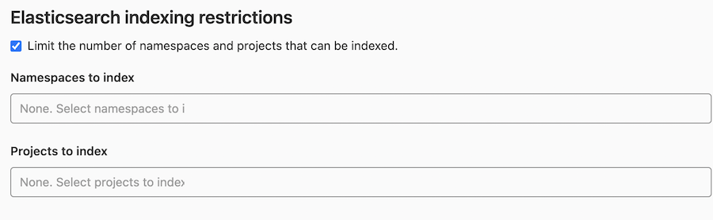

# Elasticsearch **(PREMIUM SELF)**

This page describes how to enable advanced search. When enabled,
advanced search provides faster search response times and [improved search features](../../user/search/advanced_search.md).

## Version requirements

### Elasticsearch version requirements

> Support for Elasticsearch 6.8 was [removed](https://gitlab.com/gitlab-org/gitlab/-/issues/350275) in GitLab 15.0.

Advanced search works with the following versions of Elasticsearch.

| GitLab version        | Elasticsearch version    |
|-----------------------|--------------------------|
| GitLab 15.0 or later  | Elasticsearch 7.x - 8.x  |
| GitLab 13.9 - 14.10   | Elasticsearch 6.8 - 7.x  |
| GitLab 13.3 - 13.8    | Elasticsearch 6.4 - 7.x  |
| GitLab 12.7 - 13.2    | Elasticsearch 6.x - 7.x  |

Advanced search follows the [Elasticsearch end-of-life policy](https://www.elastic.co/support/eol).
When we change Elasticsearch supported versions in GitLab, we announce them in [deprecation notes](https://about.gitlab.com/handbook/marketing/blog/release-posts/#deprecations) in monthly release posts
before we remove them.

### OpenSearch version requirements

| GitLab version          | OpenSearch version        |
|-------------------------|---------------------------|
| GitLab 15.0 to 15.5.2   | OpenSearch 1.x            |
| GitLab 15.5.3 and later | OpenSearch 1.x and later  |

If your version of Elasticsearch or OpenSearch is incompatible, to prevent data loss, indexing pauses and
a message is logged in the
[`elasticsearch.log`](../../administration/logs/index.md#elasticsearchlog) file.

If you are using a compatible version and after connecting to OpenSearch, you get the message `Elasticsearch version not compatible`, [unpause indexing](#unpause-indexing).

## System requirements

Elasticsearch requires additional resources to those documented in the
[GitLab system requirements](../../install/requirements.md).

Memory, CPU, and storage resource amounts vary depending on the amount of data you index into the Elasticsearch cluster. Heavily used Elasticsearch clusters may require more resources. The [`estimate_cluster_size`](#gitlab-advanced-search-rake-tasks) Rake task ([introduced](https://gitlab.com/gitlab-org/gitlab/-/issues/221177) in GitLab 13.10) uses the total repository size to estimate the advanced search storage requirements.

## Install Elasticsearch

Elasticsearch is *not* included in the Omnibus packages or when you install from
source. You must [install it separately](https://www.elastic.co/guide/en/elasticsearch/reference/7.16/install-elasticsearch.html "Elasticsearch 7.x installation documentation") and ensure you select your version. Detailed information on how to install Elasticsearch is out of the scope of this page.

You can install Elasticsearch yourself, or use a cloud hosted offering such as [Elasticsearch Service](https://www.elastic.co/elasticsearch/service) (available on AWS, GCP, or Azure) or the [Amazon OpenSearch](https://docs.aws.amazon.com/opensearch-service/latest/developerguide/gsg.html)
service.

You should install Elasticsearch on a separate server. Running Elasticsearch on the same server as GitLab is not recommended and can cause a degradation in GitLab instance performance.

For a single node Elasticsearch cluster, the functional cluster health status is always yellow due to the allocation of the primary shard. Elasticsearch cannot assign replica shards to the same node as primary shards.

The search index updates after you:

- Add data to the database or repository.
- [Enable Elasticsearch](#enable-advanced-search) in the Admin Area.

## Upgrade to a new Elasticsearch major version

> - Elasticsearch 6.8 support is removed with GitLab 15.0.
> - Upgrading from GitLab 14.10 to 15.0 requires that you are using any version of Elasticsearch 7.x.

You are not required to change the GitLab configuration when you upgrade Elasticsearch.

## Elasticsearch repository indexer

To index Git repository data, GitLab uses an [indexer written in Go](https://gitlab.com/gitlab-org/gitlab-elasticsearch-indexer).

Depending on your GitLab version, there are different installation procedures for the Go indexer:

- For Omnibus GitLab 11.8 or greater, see [Omnibus GitLab](#omnibus-gitlab).
- For installations from source or older versions of Omnibus GitLab,
  [install the indexer from source](#from-source).
- If you are using GitLab Development Kit, see [GDK Elasticsearch how-to](https://gitlab.com/gitlab-org/gitlab-development-kit/-/blob/main/doc/howto/elasticsearch.md).

### Omnibus GitLab

Starting with GitLab 11.8, the Go indexer is included in Omnibus GitLab.
The former Ruby-based indexer was removed in [GitLab 12.3](https://gitlab.com/gitlab-org/gitlab/-/issues/6481).

### From source

First, we need to install some dependencies, then we build and install
the indexer itself.

#### Install dependencies

This project relies on [International Components for Unicode](https://icu.unicode.org/) (ICU) for text encoding,
therefore we must ensure the development packages for your platform are
installed before running `make`.

##### Debian / Ubuntu

To install on Debian or Ubuntu, run:

```shell
sudo apt install libicu-dev
```

##### CentOS / RHEL

To install on CentOS or RHEL, run:

```shell
sudo yum install libicu-devel
```

##### macOS

NOTE:
You must first [install Homebrew](https://brew.sh/).

To install on macOS, run:

```shell
brew install icu4c
export PKG_CONFIG_PATH="/usr/local/opt/icu4c/lib/pkgconfig:$PKG_CONFIG_PATH"
```

#### Build and install

To build and install the indexer, run:

```shell
indexer_path=/home/git/gitlab-elasticsearch-indexer

# Run the installation task for gitlab-elasticsearch-indexer:
sudo -u git -H bundle exec rake gitlab:indexer:install[$indexer_path] RAILS_ENV=production
cd $indexer_path && sudo make install
```

The `gitlab-elasticsearch-indexer` is installed to `/usr/local/bin`.

You can change the installation path with the `PREFIX` environment variable.
Remember to pass the `-E` flag to `sudo` if you do so.

Example:

```shell
PREFIX=/usr sudo -E make install
```

After installation, be sure to [enable Elasticsearch](#enable-advanced-search).

NOTE:
If you see an error such as `Permission denied - /home/git/gitlab-elasticsearch-indexer/` while indexing, you
may need to set the `production -> elasticsearch -> indexer_path` setting in your `gitlab.yml` file to
`/usr/local/bin/gitlab-elasticsearch-indexer`, which is where the binary is installed.

### View indexing errors

Errors from the [GitLab Elasticsearch Indexer](https://gitlab.com/gitlab-org/gitlab-elasticsearch-indexer) are reported in
the [`elasticsearch.log`](../../administration/logs/index.md#elasticsearchlog) file and the [`sidekiq.log`](../../administration/logs/index.md#sidekiqlog) file with a `json.exception.class` of `Gitlab::Elastic::Indexer::Error`.
These errors may occur when indexing Git repository data.

## Enable advanced search

Prerequisite:

- You must have administrator access to the instance.

To enable advanced search:

1. On the top bar, select **Main menu > Admin**.
1. On the left sidebar, select **Settings > Advanced Search**.

   NOTE:
   To see the **Advanced Search** section, you need an active GitLab Premium
   [license](../../user/admin_area/license.md).

1. Configure the [advanced search settings](#advanced-search-configuration) for
   your Elasticsearch cluster. Do not enable **Search with Elasticsearch enabled**
   yet.
1. Enable **Elasticsearch indexing** and select **Save changes**. This creates
   an empty index if one does not already exist.
1. Select **Index all projects**.
1. Select **Check progress** in the confirmation message to see the status of
   the background jobs.
1. Personal snippets must be indexed using another Rake task:

   ```shell
   # Omnibus installations
   sudo gitlab-rake gitlab:elastic:index_snippets

   # Installations from source
   bundle exec rake gitlab:elastic:index_snippets RAILS_ENV=production
   ```

1. After indexing completes, enable **Search with Elasticsearch enabled** and select **Save changes**.

NOTE:
When your Elasticsearch cluster is down while Elasticsearch is enabled,
you might have problems updating documents such as issues because your
instance queues a job to index the change, but cannot find a valid
Elasticsearch cluster.

For GitLab instances with more than 50 GB of repository data, see [How to index large instances efficiently](#how-to-index-large-instances-efficiently).

### Advanced search configuration

The following Elasticsearch settings are available:

| Parameter                                             | Description |
|-------------------------------------------------------|-------------|
| `Elasticsearch indexing`                              | Enables or disables Elasticsearch indexing and creates an empty index if one does not already exist. You may want to enable indexing but disable search to give the index time to be fully completed, for example. Also, keep in mind that this option doesn't have any impact on existing data, this only enables/disables the background indexer which tracks data changes and ensures new data is indexed. |
| `Pause Elasticsearch indexing`                        | Enables or disables temporary indexing pause. This is useful for cluster migration/reindexing. All changes are still tracked, but they are not committed to the Elasticsearch index until resumed. |
| `Search with Elasticsearch enabled`                   | Enables or disables using Elasticsearch in search. |
| `URL`                                                 | The URL of your Elasticsearch instance. Use a comma-separated list to support clustering (for example, `http://host1, https://host2:9200`). If your Elasticsearch instance is password-protected, use the `Username` and `Password` fields described below. Alternatively, use inline credentials such as `http://<username>:<password>@<elastic_host>:9200/`. |
| `Username`                                                 | The `username` of your Elasticsearch instance. |
| `Password`                                                 | The password of your Elasticsearch instance. |
| `Number of Elasticsearch shards`                      | Elasticsearch indices are split into multiple shards for performance reasons. In general, you should use at least 5 shards, and indices with tens of millions of documents need to have more shards ([see below](#guidance-on-choosing-optimal-cluster-configuration)). Changes to this value do not take effect until the index is recreated. You can read more about tradeoffs in the [Elasticsearch documentation](https://www.elastic.co/guide/en/elasticsearch/reference/current/scalability.html). |
| `Number of Elasticsearch replicas`                    | Each Elasticsearch shard can have a number of replicas. These are a complete copy of the shard, and can provide increased query performance or resilience against hardware failure. Increasing this value increases total disk space required by the index. |
| `Limit the number of namespaces and projects that can be indexed`   | Enabling this allows you to select namespaces and projects to index. All other namespaces and projects use database search instead. If you enable this option but do not select any namespaces or projects, none are indexed. [Read more below](#limit-the-number-of-namespaces-and-projects-that-can-be-indexed).|
| `Using AWS OpenSearch Service with IAM credentials` | Sign your OpenSearch requests using [AWS IAM authorization](https://docs.aws.amazon.com/IAM/latest/UserGuide/id_credentials_access-keys.html), [AWS EC2 Instance Profile Credentials](https://docs.aws.amazon.com/codedeploy/latest/userguide/getting-started-create-iam-instance-profile.html#getting-started-create-iam-instance-profile-cli), or [AWS ECS Tasks Credentials](https://docs.aws.amazon.com/AmazonECS/latest/userguide/task-iam-roles.html). Refer to [Identity and Access Management in Amazon OpenSearch Service](https://docs.aws.amazon.com/opensearch-service/latest/developerguide/ac.html) for details of AWS hosted OpenSearch domain access policy configuration. |
| `AWS Region`                                          | The AWS region in which your OpenSearch Service is located. |
| `AWS Access Key`                                      | The AWS access key. |
| `AWS Secret Access Key`                               | The AWS secret access key. |
| `Maximum file size indexed`                           | See [the explanation in instance limits.](../../administration/instance_limits.md#maximum-file-size-indexed). |
| `Maximum field length`                                | See [the explanation in instance limits.](../../administration/instance_limits.md#maximum-field-length). |
| `Maximum bulk request size (MiB)` | Used by the GitLab Ruby and Go-based indexer processes. This setting indicates how much data must be collected (and stored in memory) in a given indexing process before submitting the payload to the Elasticsearch Bulk API. For the GitLab Go-based indexer, you should use this setting with `Bulk request concurrency`. `Maximum bulk request size (MiB)` must accommodate the resource constraints of both the Elasticsearch hosts and the hosts running the GitLab Go-based indexer from either the `gitlab-rake` command or the Sidekiq tasks. |
| `Bulk request concurrency`                            | The Bulk request concurrency indicates how many of the GitLab Go-based indexer processes (or threads) can run in parallel to collect data to subsequently submit to the Elasticsearch Bulk API. This increases indexing performance, but fills the Elasticsearch bulk requests queue faster. This setting should be used together with the Maximum bulk request size setting (see above) and needs to accommodate the resource constraints of both the Elasticsearch hosts and the hosts running the GitLab Go-based indexer either from the `gitlab-rake` command or the Sidekiq tasks. |
| `Client request timeout` | Elasticsearch HTTP client request timeout value in seconds. `0` means using the system default timeout value, which depends on the libraries that GitLab application is built upon. |

WARNING:
Increasing the values of `Maximum bulk request size (MiB)` and `Bulk request concurrency` can negatively impact
Sidekiq performance. Return them to their default values if you see increased `scheduling_latency_s` durations
in your Sidekiq logs. For more information, see
[issue 322147](https://gitlab.com/gitlab-org/gitlab/-/issues/322147).

### Access requirements

#### Elasticsearch with role privileges

To access and perform operations in Elasticsearch, GitLab requires a role with the following privileges:

```json
{
  "cluster": ["monitor"],
  "indices": [
    {
      "names": ["gitlab-*"],
      "privileges": [
        "create_index",
        "delete_index",
        "view_index_metadata",
        "read",
        "manage",
        "write"
      ]
    }
  ]
}
```

For more information, see [Elasticsearch security privileges](https://www.elastic.co/guide/en/elasticsearch/reference/current/security-privileges.html).

#### AWS OpenSearch Service with fine-grained access control

To use the self-managed AWS OpenSearch Service with GitLab using fine-grained access control, try one of the
[recommended configurations](https://docs.aws.amazon.com/opensearch-service/latest/developerguide/fgac.html#fgac-recommendations).

Configure your instance's domain access policies to allow `es:ESHttp*` actions. You can customize
the following example configuration to limit principals or resources:

```json
{
  "Version": "2012-10-17",
  "Statement": [
    {
      "Effect": "Allow",
      "Principal": {
        "AWS": [
          "*"
        ]
      },
      "Action": [
        "es:ESHttp*"
      ],
      "Resource": "domain-arn/*"
    }
  ]
}
```

For more information, see [Identity and Access Management in Amazon OpenSearch Service](https://docs.aws.amazon.com/opensearch-service/latest/developerguide/ac.html).

##### Connecting with a master user in the internal database

When using fine-grained access control with a user in the internal database, you should use HTTP basic
authentication to connect to OpenSearch. You can provide the master username and password as part of the
OpenSearch URL or in the **Username** and **Password** text boxes in the advanced search settings. See
[Tutorial: Internal user database and HTTP basic authentication](https://docs.aws.amazon.com/opensearch-service/latest/developerguide/fgac-walkthrough-basic.html) for details.

##### Connecting with an IAM user

When using fine-grained access control with IAM credentials, you can provide the credentials in the **AWS OpenSearch IAM credentials** section in the advanced search settings.

##### Permissions for fine-grained access control

The following permissions are required for advanced search. See [Creating roles](https://docs.aws.amazon.com/opensearch-service/latest/developerguide/fgac.html#fgac-roles) for details.

```json
{
  "cluster_permissions": [
    "cluster_composite_ops",
    "cluster_monitor"
  ],
  "index_permissions": [
    {
      "index_patterns": [
        "gitlab*"
      ],
      "allowed_actions": [
        "data_access",
        "manage_aliases",
        "search",
        "create_index",
        "delete",
        "manage"
      ]
    },
    {
      "index_patterns": [
        "*"
      ],
      "allowed_actions": [
        "indices:admin/aliases/get",
        "indices:monitor/stats"
      ]
    }
  ]
}
```

The index pattern `*` requires a few permissions for advanced search to work.

### Limit the number of namespaces and projects that can be indexed

If you check checkbox `Limit the number of namespaces and projects that can be indexed`
under **Elasticsearch indexing restrictions** more options become available.



You can select namespaces and projects to index exclusively. If the namespace is a group, it includes
any subgroups and projects belonging to those subgroups to be indexed as well.

Advanced search only provides cross-group code/commit search (global) if all name-spaces are indexed. In this particular scenario where only a subset of namespaces are indexed, a global search does not provide a code or commit scope. This is possible only in the scope of an indexed namespace. There is no way to code/commit search in multiple indexed namespaces (when only a subset of namespaces has been indexed). For example if two groups are indexed, there is no way to run a single code search on both. You can only run a code search on the first group and then on the second.

You can filter the selection dropdown list by writing part of the namespace or project name you're interested in.


NOTE:
If no namespaces or projects are selected, no advanced search indexing takes place.

WARNING:
If you have already indexed your instance, you must regenerate the index to delete all existing data
for filtering to work correctly. To do this, run the Rake tasks `gitlab:elastic:recreate_index` and
`gitlab:elastic:clear_index_status`. Afterwards, removing a namespace or a project from the list deletes the data
from the Elasticsearch index as expected.

## Enable custom language analyzers

You can improve the language support for Chinese and Japanese languages by utilizing [`smartcn`](https://www.elastic.co/guide/en/elasticsearch/plugins/current/analysis-smartcn.html) and/or [`kuromoji`](https://www.elastic.co/guide/en/elasticsearch/plugins/current/analysis-kuromoji.html) analysis plugins from Elastic.

To enable languages support:

1. Install the desired plugins, refer to [Elasticsearch documentation](https://www.elastic.co/guide/en/elasticsearch/plugins/7.9/installation.html) for plugins installation instructions. The plugins must be installed on every node in the cluster, and each node must be restarted after installation. For a list of plugins, see the table later in this section.
1. On the top bar, select **Main menu > Admin**.
1. On the left sidebar, select **Settings > Advanced Search**.
1. Locate **Custom analyzers: language support**.
1. Enable plugins support for **Indexing**.
1. Select **Save changes** for the changes to take effect.
1. Trigger [Zero downtime reindexing](#zero-downtime-reindexing) or reindex everything from scratch to create a new index with updated mappings.
1. Enable plugins support for **Searching** after the previous step is completed.

For guidance on what to install, see the following Elasticsearch language plugin options:

| Parameter                                             | Description |
|-------------------------------------------------------|-------------|
| `Enable Chinese (smartcn) custom analyzer: Indexing`   | Enables or disables Chinese language support using [`smartcn`](https://www.elastic.co/guide/en/elasticsearch/plugins/current/analysis-smartcn.html) custom analyzer for newly created indices.|
| `Enable Chinese (smartcn) custom analyzer: Search`   | Enables or disables using [`smartcn`](https://www.elastic.co/guide/en/elasticsearch/plugins/current/analysis-smartcn.html) fields for advanced search. Only enable this after [installing the plugin](https://www.elastic.co/guide/en/elasticsearch/plugins/current/analysis-smartcn.html), enabling custom analyzer indexing and recreating the index.|
| `Enable Japanese (kuromoji) custom analyzer: Indexing`   | Enables or disables Japanese language support using [`kuromoji`](https://www.elastic.co/guide/en/elasticsearch/plugins/current/analysis-kuromoji.html) custom analyzer for newly created indices.|
| `Enable Japanese (kuromoji) custom analyzer: Search`  | Enables or disables using [`kuromoji`](https://www.elastic.co/guide/en/elasticsearch/plugins/current/analysis-kuromoji.html) fields for advanced search. Only enable this after [installing the plugin](https://www.elastic.co/guide/en/elasticsearch/plugins/current/analysis-kuromoji.html), enabling custom analyzer indexing and recreating the index.|

## Disable advanced search

To disable the Elasticsearch integration:

1. On the top bar, select **Main menu > Admin**.
1. On the left sidebar, select **Settings > Advanced Search**.
1. Uncheck **Elasticsearch indexing** and **Search with Elasticsearch enabled**.
1. Select **Save changes**.
1. Optional. Delete the existing indices:

   ```shell
   # Omnibus installations
   sudo gitlab-rake gitlab:elastic:delete_index

   # Installations from source
   bundle exec rake gitlab:elastic:delete_index RAILS_ENV=production
   ```

## Unpause Indexing

1. On the top bar, select **Main menu > Admin**.
1. On the left sidebar, select **Settings > Advanced Search**.
1. Expand **Advanced Search**.
1. Clear the **Pause Elasticsearch indexing** checkbox.

## Zero-downtime reindexing

The idea behind this reindexing method is to leverage the [Elasticsearch reindex API](https://www.elastic.co/guide/en/elasticsearch/reference/current/docs-reindex.html)
and Elasticsearch index alias feature to perform the operation. We set up an index alias which connects to a
`primary` index which is used by GitLab for reads/writes. When reindexing process starts, we temporarily pause
the writes to the `primary` index. Then, we create another index and invoke the Reindex API which migrates the
index data onto the new index. After the reindexing job is complete, we switch to the new index by connecting the
index alias to it which becomes the new `primary` index. At the end, we resume the writes and typical operation resumes.

### Using zero-downtime reindexing

You can use zero-downtime reindexing to configure index settings or mappings that cannot be changed without creating a new index and copying existing data. You should not use zero-downtime reindexing to fix missing data. Zero-downtime reindexing does not add data to the search cluster if the data is not already indexed. You must complete all [advanced search migrations](#advanced-search-migrations) before you start reindexing.

### Trigger the reindex via the advanced search administration

> - [Introduced](https://gitlab.com/gitlab-org/gitlab/-/merge_requests/34069) in GitLab 13.2.
> - A scheduled index deletion and the ability to cancel it was [introduced](https://gitlab.com/gitlab-org/gitlab/-/merge_requests/38914) in GitLab 13.3.
> - Support for retries during reindexing was [introduced](https://gitlab.com/gitlab-org/gitlab/-/merge_requests/55681) in GitLab 13.12.

To trigger the reindexing process:

1. Sign in to your GitLab instance as an administrator.
1. On the top bar, select **Main menu > Admin**.
1. On the left sidebar, select **Settings > Advanced Search**.
1. Expand **Elasticsearch zero-downtime reindexing**.
1. Select **Trigger cluster reindexing**.

Reindexing can be a lengthy process depending on the size of your Elasticsearch cluster.

After this process is completed, the original index is scheduled to be deleted after
14 days. You can cancel this action by pressing the **Cancel** button on the same
page you triggered the reindexing process.

While the reindexing is running, you can follow its progress under that same section.

#### Elasticsearch zero-downtime reindexing

> [Introduced](https://gitlab.com/gitlab-org/gitlab/-/merge_requests/55681) in GitLab 13.12.

1. On the top bar, select **Main menu > Admin**.
1. On the left sidebar, select **Settings > Advanced Search**.
1. Expand **Elasticsearch zero-downtime reindexing**, and you'll
   find the following options:

- [Slice multiplier](#slice-multiplier)
- [Maximum running slices](#maximum-running-slices)

##### Slice multiplier

The slice multiplier calculates the [number of slices during reindexing](https://www.elastic.co/guide/en/elasticsearch/reference/current/docs-reindex.html#docs-reindex-slice).

GitLab uses [manual slicing](https://www.elastic.co/guide/en/elasticsearch/reference/current/docs-reindex.html#docs-reindex-manual-slice)
to control the reindex efficiently and safely, which enables users to retry only
failed slices.

The multiplier defaults to `2` and applies to the number of shards per index.
For example, if this value is `2` and your index has 20 shards, then the
reindex task is split into 40 slices.

##### Maximum running slices

The maximum running slices parameter defaults to `60` and corresponds to the
maximum number of slices allowed to run concurrently during Elasticsearch
reindexing.

Setting this value too high can have adverse performance impacts as your cluster
may become heavily saturated with searches and writes. Setting this value too
low may lead the reindexing process to take a very long time to complete.

The best value for this depends on your cluster size, whether you're willing
to accept some degraded search performance during reindexing, and how important
it is for the reindex to finish quickly and resume indexing.

### Mark the most recent reindex job as failed and resume the indexing

Sometimes, you might want to abandon the unfinished reindex job and resume the indexing. You can achieve this via the following steps:

1. Mark the most recent reindex job as failed:

   ```shell
   # Omnibus installations
   sudo gitlab-rake gitlab:elastic:mark_reindex_failed

   # Installations from source
   bundle exec rake gitlab:elastic:mark_reindex_failed RAILS_ENV=production
   ```

1. On the top bar, select **Main menu > Admin**.
1. On the left sidebar, select **Settings > Advanced Search**.
1. Expand **Advanced Search**.
1. Clear the **Pause Elasticsearch indexing** checkbox.

## Advanced search migrations

> [Introduced](https://gitlab.com/gitlab-org/gitlab/-/issues/234046) in GitLab 13.6.

With reindex migrations running in the background, there's no need for a manual
intervention. This usually happens in situations where new features are added to
advanced search, which means adding or changing the way content is indexed.

To confirm that the advanced search migrations ran, you can check with:

```shell
curl "$CLUSTER_URL/gitlab-production-migrations/_search?q=*" | jq .
```

This should return something similar to:

```json
{
  "took": 14,
  "timed_out": false,
  "_shards": {
    "total": 1,
    "successful": 1,
    "skipped": 0,
    "failed": 0
  },
  "hits": {
    "total": {
      "value": 1,
      "relation": "eq"
    },
    "max_score": 1,
    "hits": [
      {
        "_index": "gitlab-production-migrations",
        "_type": "_doc",
        "_id": "20201105181100",
        "_score": 1,
        "_source": {
          "completed": true
        }
      }
    ]
  }
}
```

To debug issues with the migrations you can check the [`elasticsearch.log` file](../../administration/logs/index.md#elasticsearchlog).

### Retry a halted migration

Some migrations are built with a retry limit. If the migration cannot finish within the retry limit,
it is halted and a notification is displayed in the advanced search integration settings.
It is recommended to check the [`elasticsearch.log` file](../../administration/logs/index.md#elasticsearchlog) to
debug why the migration was halted and make any changes before retrying the migration. Once you believe you've
fixed the cause of the failure, select "Retry migration", and the migration is scheduled to be retried
in the background.

If you cannot get the migration to succeed, you may
consider the
[last resort to recreate the index from scratch](elasticsearch_troubleshooting.md#last-resort-to-recreate-an-index).
This may allow you to skip over
the problem because a newly created index skips all migrations as the index
is recreated with the correct up-to-date schema.

### All migrations must be finished before doing a major upgrade

Before doing a major version GitLab upgrade, you should have completed all
migrations that exist up until the latest minor version before that major
version. If you have halted migrations, these need to be resolved and
[retried](#retry-a-halted-migration) before proceeding with a major version
upgrade. Read more about [upgrading to a new major version](../../update/index.md#upgrading-to-a-new-major-version).

## GitLab advanced search Rake tasks

Rake tasks are available to:

- [Build and install](#build-and-install) the indexer.
- Delete indices when [disabling Elasticsearch](#disable-advanced-search).
- Add GitLab data to an index.

The following are some available Rake tasks:

| Task                                                                                                                                                    | Description                                                                                                                                                                               |
|:--------------------------------------------------------------------------------------------------------------------------------------------------------|:------------------------------------------------------------------------------------------------------------------------------------------------------------------------------------------|
| [`sudo gitlab-rake gitlab:elastic:info`](https://gitlab.com/gitlab-org/gitlab/-/blob/master/ee/lib/tasks/gitlab/elastic.rake)                            | Outputs debugging information for the advanced search integration. |
| [`sudo gitlab-rake gitlab:elastic:index`](https://gitlab.com/gitlab-org/gitlab/-/blob/master/ee/lib/tasks/gitlab/elastic.rake)                            | Enables Elasticsearch indexing and run `gitlab:elastic:create_empty_index`, `gitlab:elastic:clear_index_status`, `gitlab:elastic:index_projects`, `gitlab:elastic:index_snippets`, and `gitlab:elastic:index_users`.                          |
| [`sudo gitlab-rake gitlab:elastic:pause_indexing`](https://gitlab.com/gitlab-org/gitlab/-/blob/master/ee/lib/tasks/gitlab/elastic.rake)                            | Pauses Elasticsearch indexing. Changes are still tracked. Useful for cluster/index migrations. |
| [`sudo gitlab-rake gitlab:elastic:resume_indexing`](https://gitlab.com/gitlab-org/gitlab/-/blob/master/ee/lib/tasks/gitlab/elastic.rake)                            | Resumes Elasticsearch indexing. |
| [`sudo gitlab-rake gitlab:elastic:index_projects`](https://gitlab.com/gitlab-org/gitlab/-/blob/master/ee/lib/tasks/gitlab/elastic.rake)                   | Iterates over all projects, and queues Sidekiq jobs to index them in the background. It can only be used after the index is created.                                                                                                      |
| [`sudo gitlab-rake gitlab:elastic:index_projects_status`](https://gitlab.com/gitlab-org/gitlab/-/blob/master/ee/lib/tasks/gitlab/elastic.rake)            | Determines the overall status of the indexing. It is done by counting the total number of indexed projects, dividing by a count of the total number of projects, then multiplying by 100. |
| [`sudo gitlab-rake gitlab:elastic:clear_index_status`](https://gitlab.com/gitlab-org/gitlab/-/blob/master/ee/lib/tasks/gitlab/elastic.rake)               | Deletes all instances of IndexStatus for all projects. This command results in a complete wipe of the index, and it should be used with caution.                                                                                              |
| [`sudo gitlab-rake gitlab:elastic:create_empty_index`](https://gitlab.com/gitlab-org/gitlab/-/blob/master/ee/lib/tasks/gitlab/elastic.rake) | Generates empty indices (the default index and a separate issues index) and assigns an alias for each on the Elasticsearch side only if it doesn't already exist.                                                                                                      |
| [`sudo gitlab-rake gitlab:elastic:delete_index`](https://gitlab.com/gitlab-org/gitlab/-/blob/master/ee/lib/tasks/gitlab/elastic.rake)       | Removes the GitLab indices and aliases (if they exist) on the Elasticsearch instance.                                                                                                                                   |
| [`sudo gitlab-rake gitlab:elastic:recreate_index`](https://gitlab.com/gitlab-org/gitlab/-/blob/master/ee/lib/tasks/gitlab/elastic.rake)     | Wrapper task for `gitlab:elastic:delete_index` and `gitlab:elastic:create_empty_index`.                                                                       |
| [`sudo gitlab-rake gitlab:elastic:index_snippets`](https://gitlab.com/gitlab-org/gitlab/-/blob/master/ee/lib/tasks/gitlab/elastic.rake)                   | Performs an Elasticsearch import that indexes the snippets data.                                                                                                                          |
| [`sudo gitlab-rake gitlab:elastic:index_users`](https://gitlab.com/gitlab-org/gitlab/-/blob/master/ee/lib/tasks/gitlab/elastic.rake)                   | Imports all users into Elasticsearch.                                                                                                                 |
| [`sudo gitlab-rake gitlab:elastic:projects_not_indexed`](https://gitlab.com/gitlab-org/gitlab/-/blob/master/ee/lib/tasks/gitlab/elastic.rake)             | Displays which projects are not indexed.                                                                                                                                                  |
| [`sudo gitlab-rake gitlab:elastic:reindex_cluster`](https://gitlab.com/gitlab-org/gitlab/-/blob/master/ee/lib/tasks/gitlab/elastic.rake)                  | Schedules a zero-downtime cluster reindexing task. This feature should be used with an index that was created after GitLab 13.0. |
| [`sudo gitlab-rake gitlab:elastic:mark_reindex_failed`](https://gitlab.com/gitlab-org/gitlab/-/blob/master/ee/lib/tasks/gitlab/elastic.rake)              | Mark the most recent re-index job as failed. |
| [`sudo gitlab-rake gitlab:elastic:list_pending_migrations`](https://gitlab.com/gitlab-org/gitlab/-/blob/master/ee/lib/tasks/gitlab/elastic.rake)          | List pending migrations. Pending migrations include those that have not yet started, have started but not finished, and those that are halted. |
| [`sudo gitlab-rake gitlab:elastic:estimate_cluster_size`](https://gitlab.com/gitlab-org/gitlab/-/blob/master/ee/lib/tasks/gitlab/elastic.rake)            | Get an estimate of cluster size based on the total repository size. |
| [`sudo gitlab-rake gitlab:elastic:enable_search_with_elasticsearch`](https://gitlab.com/gitlab-org/gitlab/-/blob/master/ee/lib/tasks/gitlab/elastic.rake)            | Enables advanced search with Elasticsearch. |
| [`sudo gitlab-rake gitlab:elastic:disable_search_with_elasticsearch`](https://gitlab.com/gitlab-org/gitlab/-/blob/master/ee/lib/tasks/gitlab/elastic.rake)            | Disables advanced search with Elasticsearch. |

### Environment variables

In addition to the Rake tasks, there are some environment variables that can be used to modify the process:

| Environment Variable | Data Type | What it does                                                                 |
| -------------------- |:---------:| ---------------------------------------------------------------------------- |
| `ID_TO`              | Integer   | Tells the indexer to only index projects less than or equal to the value.    |
| `ID_FROM`            | Integer   | Tells the indexer to only index projects greater than or equal to the value. |

### Indexing a range of projects or a specific project

Using the `ID_FROM` and `ID_TO` environment variables, you can index a limited number of projects. This can be useful for staging indexing.

```shell
root@git:~# sudo gitlab-rake gitlab:elastic:index_projects ID_FROM=1 ID_TO=100
```

Because `ID_FROM` and `ID_TO` use the `or equal to` comparison, you can use them to index only one project
by setting both to the same project ID:

```shell
root@git:~# sudo gitlab-rake gitlab:elastic:index_projects ID_FROM=5 ID_TO=5
Indexing project repositories...I, [2019-03-04T21:27:03.083410 #3384]  INFO -- : Indexing GitLab User / test (ID=33)...
I, [2019-03-04T21:27:05.215266 #3384]  INFO -- : Indexing GitLab User / test (ID=33) is done!
```

## Advanced search index scopes

When performing a search, the GitLab index uses the following scopes:

| Scope Name       | What it searches       |
| ---------------- | ---------------------- |
| `commits`        | Commit data            |
| `projects`       | Project data (default) |
| `blobs`          | Code                   |
| `issues`         | Issue data             |
| `merge_requests` | Merge request data     |
| `milestones`     | Milestone data         |
| `notes`          | Note data              |
| `snippets`       | Snippet data           |
| `wiki_blobs`     | Wiki contents          |
| `users`          | Users                  |

## Tuning

### Guidance on choosing optimal cluster configuration

For basic guidance on choosing a cluster configuration you may refer to [Elastic Cloud Calculator](https://cloud.elastic.co/pricing). You can find more information below.

- Generally, you want to use at least a 2-node cluster configuration with one replica, which allows you to have resilience. If your storage usage is growing quickly, you may want to plan horizontal scaling (adding more nodes) beforehand.
- It's not recommended to use HDD storage with the search cluster, because it takes a hit on performance. It's better to use SSD storage (NVMe or SATA SSD drives for example).
- You should not use [coordinating-only nodes](https://www.elastic.co/guide/en/elasticsearch/reference/current/modules-node.html#coordinating-only-node) with large instances. Coordinating-only nodes are smaller than [data nodes](https://www.elastic.co/guide/en/elasticsearch/reference/current/modules-node.html#data-node), which can impact performance and [advanced search migrations](#advanced-search-migrations).
- You can use the [GitLab Performance Tool](https://gitlab.com/gitlab-org/quality/performance) to benchmark search performance with different search cluster sizes and configurations.
- `Heap size` should be set to no more than 50% of your physical RAM. Additionally, it shouldn't be set to more than the threshold for zero-based compressed oops. The exact threshold varies, but 26 GB is safe on most systems, but can also be as large as 30 GB on some systems. See [Heap size settings](https://www.elastic.co/guide/en/elasticsearch/reference/current/important-settings.html#heap-size-settings) and [Setting JVM options](https://www.elastic.co/guide/en/elasticsearch/reference/current/jvm-options.html) for more details.
- Number of CPUs (CPU cores) per node usually corresponds to the `Number of Elasticsearch shards` setting described below.
- A good guideline is to ensure you keep the number of shards per node below 20 per GB heap it has configured. A node with a 30 GB heap should therefore have a maximum of 600 shards, but the further below this limit you can keep it the better. This generally helps the cluster stay in good health.
- Number of Elasticsearch shards:
  - Small shards result in small segments, which increases overhead. Aim to keep the average shard size between at least a few GB and a few tens of GB.
  - Another consideration is the number of documents. To determine the number of shards to use, sum the numbers in the **Main menu > Admin > Dashboard > Statistics** pane (the number of documents to be indexed), divide by 5 million, and add 5. For example:
    - If you have fewer than about 2,000,000 documents, use the default of 5 shards
    - 10,000,000 documents: `10000000/5000000 + 5` = 7 shards
    - 100,000,000 documents: `100000000/5000000 + 5` = 25 shards
- `refresh_interval` is a per index setting. You may want to adjust that from default `1s` to a bigger value if you don't need data in real-time. This changes how soon you see fresh results. If that's important for you, you should leave it as close as possible to the default value.
- You might want to raise [`indices.memory.index_buffer_size`](https://www.elastic.co/guide/en/elasticsearch/reference/current/indexing-buffer.html) to 30% or 40% if you have a lot of heavy indexing operations.

### Advanced search integration settings guidance

- The `Number of Elasticsearch shards` setting usually corresponds with the number of CPUs available in your cluster. For example, if you have a 3-node cluster with 4 cores each, this means you benefit from having at least 3*4=12 shards in the cluster. It's only possible to change the shards number by using [Split index API](https://www.elastic.co/guide/en/elasticsearch/reference/current/indices-split-index.html) or by reindexing to a different index with a changed number of shards.
- The `Number of Elasticsearch replicas` setting should most of the time be equal to `1` (each shard has 1 replica). Using `0` is not recommended, because losing one node corrupts the index.

### How to index large instances efficiently

This section may be helpful in the event that the other
[basic instructions](#enable-advanced-search) cause problems
due to large volumes of data being indexed.

WARNING:
Indexing a large instance generates a lot of Sidekiq jobs.
Make sure to prepare for this task by having a
[scalable setup](../../administration/reference_architectures/index.md) or creating
[extra Sidekiq processes](../../administration/sidekiq/extra_sidekiq_processes.md).

1. [Configure your Elasticsearch host and port](#enable-advanced-search).
1. Create empty indices:

   ```shell
   # Omnibus installations
   sudo gitlab-rake gitlab:elastic:create_empty_index

   # Installations from source
   bundle exec rake gitlab:elastic:create_empty_index RAILS_ENV=production
   ```

1. If this is a re-index of your GitLab instance, clear the index status:

   ```shell
   # Omnibus installations
   sudo gitlab-rake gitlab:elastic:clear_index_status

   # Installations from source
   bundle exec rake gitlab:elastic:clear_index_status RAILS_ENV=production
   ```

1. [Enable **Elasticsearch indexing**](#enable-advanced-search).
1. Indexing large Git repositories can take a while. To speed up the process, you can [tune for indexing speed](https://www.elastic.co/guide/en/elasticsearch/reference/current/tune-for-indexing-speed.html#tune-for-indexing-speed):

   - You can temporarily disable [`refresh`](https://www.elastic.co/guide/en/elasticsearch/reference/current/indices-refresh.html), the operation responsible for making changes to an index available to search.

   - You can set the number of replicas to 0. This setting controls the number of copies each primary shard of an index has. Thus, having 0 replicas effectively disables the replication of shards across nodes, which should increase the indexing performance. This is an important trade-off in terms of reliability and query performance. It is important to remember to set the replicas to a considered value after the initial indexing is complete.

   In our experience, you can expect a 20% decrease in indexing time. After completing indexing in a later step, you can return `refresh` and `number_of_replicas` to their desired settings.

   NOTE:
   This step is optional but may help significantly speed up large indexing operations.

   ```shell
   curl --request PUT localhost:9200/gitlab-production/_settings --header 'Content-Type: application/json' \
        --data '{
          "index" : {
              "refresh_interval" : "-1",
              "number_of_replicas" : 0
          } }'
   ```

1. Index projects and their associated data:

   ```shell
   # Omnibus installations
   sudo gitlab-rake gitlab:elastic:index_projects

   # Installations from source
   bundle exec rake gitlab:elastic:index_projects RAILS_ENV=production
   ```

   This enqueues a Sidekiq job for each project that needs to be indexed.
   You can view the jobs in **Main menu > Admin > Monitoring > Background Jobs > Queues Tab**
   and select `elastic_commit_indexer`, or you can query indexing status using a Rake task:

   ```shell
   # Omnibus installations
   sudo gitlab-rake gitlab:elastic:index_projects_status

   # Installations from source
   bundle exec rake gitlab:elastic:index_projects_status RAILS_ENV=production

   Indexing is 65.55% complete (6555/10000 projects)
   ```

   If you want to limit the index to a range of projects you can provide the
   `ID_FROM` and `ID_TO` parameters:

   ```shell
   # Omnibus installations
   sudo gitlab-rake gitlab:elastic:index_projects ID_FROM=1001 ID_TO=2000

   # Installations from source
   bundle exec rake gitlab:elastic:index_projects ID_FROM=1001 ID_TO=2000 RAILS_ENV=production
   ```

   Where `ID_FROM` and `ID_TO` are project IDs. Both parameters are optional.
   The above example indexes all projects from ID `1001` up to (and including) ID `2000`.

   NOTE:
   Sometimes the project indexing jobs queued by `gitlab:elastic:index_projects`
   can get interrupted. This may happen for many reasons, but it's always safe
   to run the indexing task again.

   You can also use the `gitlab:elastic:clear_index_status` Rake task to force the
   indexer to "forget" all progress, so it retries the indexing process from the
   start.

1. Personal snippets are not associated with a project and need to be indexed separately:

   ```shell
   # Omnibus installations
   sudo gitlab-rake gitlab:elastic:index_snippets

   # Installations from source
   bundle exec rake gitlab:elastic:index_snippets RAILS_ENV=production
   ```

1. Enable replication and refreshing again after indexing (only if you previously disabled it):

   ```shell
   curl --request PUT localhost:9200/gitlab-production/_settings --header 'Content-Type: application/json' \
        --data '{
          "index" : {
              "number_of_replicas" : 1,
              "refresh_interval" : "1s"
          } }'
   ```

   A force merge should be called after enabling the refreshing above.

   For Elasticsearch 6.x, the index should be in read-only mode before proceeding with the force merge:

   ```shell
   curl --request PUT localhost:9200/gitlab-production/_settings --header 'Content-Type: application/json' \
        --data '{
          "settings": {
            "index.blocks.write": true
          } }'
   ```

   Then, initiate the force merge:

   ```shell
   curl --request POST 'localhost:9200/gitlab-production/_forcemerge?max_num_segments=5'
   ```

   After this, if your index is in read-only mode, switch back to read-write:

   ```shell
   curl --request PUT localhost:9200/gitlab-production/_settings --header 'Content-Type: application/json' \
        --data '{
          "settings": {
            "index.blocks.write": false
          } }'
   ```

1. After the indexing has completed, enable [**Search with Elasticsearch enabled**](#enable-advanced-search).

### Deleted documents

Whenever a change or deletion is made to an indexed GitLab object (a merge request description is changed, a file is deleted from the default branch in a repository, a project is deleted, etc), a document in the index is deleted. However, since these are "soft" deletes, the overall number of "deleted documents", and therefore wasted space, increases. Elasticsearch does intelligent merging of segments to remove these deleted documents. However, depending on the amount and type of activity in your GitLab installation, it's possible to see as much as 50% wasted space in the index.

In general, we recommend letting Elasticsearch merge and reclaim space automatically, with the default settings. From [Lucene's Handling of Deleted Documents](https://www.elastic.co/blog/lucenes-handling-of-deleted-documents "Lucene's Handling of Deleted Documents"), _"Overall, besides perhaps decreasing the maximum segment size, it is best to leave Lucene defaults as-is and not fret too much about when deletes are reclaimed."_

However, some larger installations may wish to tune the merge policy settings:

- Consider reducing the `index.merge.policy.max_merged_segment` size from the default 5 GB to maybe 2 GB or 3 GB. Merging only happens when a segment has at least 50% deletions. Smaller segment sizes allows merging to happen more frequently.

  ```shell
  curl --request PUT localhost:9200/gitlab-production/_settings ---header 'Content-Type: application/json' \
       --data '{
         "index" : {
           "merge.policy.max_merged_segment": "2gb"
         }
       }'
  ```

- You can also adjust `index.merge.policy.reclaim_deletes_weight`, which controls how aggressively deletions are targeted. But this can lead to costly merge decisions, so we recommend not changing this unless you understand the tradeoffs.

  ```shell
  curl --request PUT localhost:9200/gitlab-production/_settings ---header 'Content-Type: application/json' \
       --data '{
         "index" : {
           "merge.policy.reclaim_deletes_weight": "3.0"
         }
       }'
  ```

- Do not do a [force merge](https://www.elastic.co/guide/en/elasticsearch/reference/current/indices-forcemerge.html "Force Merge") to remove deleted documents. A warning in the [documentation](https://www.elastic.co/guide/en/elasticsearch/reference/current/indices-forcemerge.html "Force Merge") states that this can lead to very large segments that may never get reclaimed, and can also cause significant performance or availability issues.

## Index large instances with dedicated Sidekiq nodes or processes

WARNING:
Most instances should not need to configure this. The steps below use an advanced setting of Sidekiq called [routing rules](../../administration/sidekiq/processing_specific_job_classes.md#routing-rules).
Be sure to fully understand about the implication of using routing rules to avoid losing jobs entirely.

Indexing a large instance can be a lengthy and resource-intensive process that has the potential
of overwhelming Sidekiq nodes and processes. This negatively affects the GitLab performance and
availability.

As GitLab allows you to start multiple Sidekiq processes, you can create an
additional process dedicated to indexing a set of queues (or queue group). This way, you can
ensure that indexing queues always have a dedicated worker, while the rest of the queues have
another dedicated worker to avoid contention.

For this purpose, use the [routing rules](../../administration/sidekiq/processing_specific_job_classes.md#routing-rules)
option that allows Sidekiq to route jobs to a specific queue based on [worker matching query](../../administration/sidekiq/processing_specific_job_classes.md#worker-matching-query).

To handle this, we generally recommend one of the following two options. You can either:

- [Use two queue groups on one single node](#single-node-two-processes).
- [Use two queue groups, one on each node](#two-nodes-one-process-for-each).

For the steps below, consider the entry of `sidekiq['routing_rules']`:

- `["feature_category=global_search", "global_search"]` as all indexing jobs are routed to the `global_search` queue.
- `["*", "default"]` as all other non-indexing jobs are routed to the `default` queue.

Note that at least one process in `sidekiq['queue_groups']` has to include the `mailers` queue, otherwise mailers jobs are not processed at all.

### Single node, two processes

To create both an indexing and a non-indexing Sidekiq process in one node:

1. On your Sidekiq node, change the `/etc/gitlab/gitlab.rb` file to:

   ```ruby
   sidekiq['enable'] = true
   sidekiq['queue_selector'] = false

   sidekiq['routing_rules'] = [
      ["feature_category=global_search", "global_search"],
      ["*", "default"],
   ]

   sidekiq['queue_groups'] = [
      "global_search", # process that listens to global_search queue
      "default,mailers" # process that listens to default and mailers queue
   ]

   sidekiq['min_concurrency'] = 20
   sidekiq['max_concurrency'] = 20
   ```

1. Save the file and [reconfigure GitLab](../../administration/restart_gitlab.md)
for the changes to take effect.

WARNING:
When starting multiple processes, the number of processes cannot exceed the number of CPU
cores you want to dedicate to Sidekiq. Each Sidekiq process can use only one CPU core, subject
to the available workload and concurrency settings. For more details, see how to
[run multiple Sidekiq processes](../../administration/sidekiq/extra_sidekiq_processes.md).

### Two nodes, one process for each

To handle these queue groups on two nodes:

1. To set up the indexing Sidekiq process, on your indexing Sidekiq node, change the `/etc/gitlab/gitlab.rb` file to:

   ```ruby
   sidekiq['enable'] = true
   sidekiq['queue_selector'] = false

   sidekiq['routing_rules'] = [
      ["feature_category=global_search", "global_search"],
      ["*", "default"],
   ]

   sidekiq['queue_groups'] = [
     "global_search", # process that listens to global_search queue
   ]

   sidekiq['min_concurrency'] = 20
   sidekiq['max_concurrency'] = 20
   ```

1. Save the file and [reconfigure GitLab](../../administration/restart_gitlab.md)
for the changes to take effect.

1. To set up the non-indexing Sidekiq process, on your non-indexing Sidekiq node, change the `/etc/gitlab/gitlab.rb` file to:

   ```ruby
   sidekiq['enable'] = true
   sidekiq['routing_rules'] = [
      ["feature_category=global_search", "global_search"],
      ["*", "default"],
   ]

   sidekiq['queue_groups'] = [
      "default,mailers" # process that listens to default and mailers queue
   ]

   sidekiq['min_concurrency'] = 20
   sidekiq['max_concurrency'] = 20
   ```

    to set up a non-indexing Sidekiq process.

1. Save the file and [reconfigure GitLab](../../administration/restart_gitlab.md)
for the changes to take effect.

## Reverting to Basic Search

Sometimes there may be issues with your Elasticsearch index data and as such
GitLab allows you to revert to "basic search" when there are no search
results and assuming that basic search is supported in that scope. This "basic
search" behaves as though you don't have advanced search enabled at all for
your instance and search using other data sources (such as PostgreSQL data and Git
data).

## Data recovery: Elasticsearch is a secondary data store only

The use of Elasticsearch in GitLab is only ever as a secondary data store.
This means that all of the data stored in Elasticsearch can always be derived
again from other data sources, specifically PostgreSQL and Gitaly. Therefore, if
the Elasticsearch data store is ever corrupted for whatever reason, you can reindex everything from scratch.
