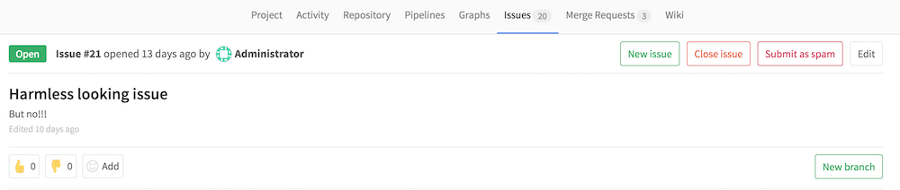

DETAILS:
**Tier:** Free, Premium, Ultimate
**Offering:** GitLab.com, GitLab Self-Managed, GitLab Dedicated

GitLab uses [Akismet](https://akismet.com/) to prevent the creation of
spam issues on public projects. Issues created through the web UI or the API can be submitted to
Akismet for review, and instance administrators can
[mark snippets as spam](../user/snippets.md#mark-snippet-as-spam).

Detected spam is rejected, and an entry is added in the **Spam log** section of the
**Admin** area.

Privacy note: GitLab submits the user's IP and user agent to Akismet.

NOTE:
GitLab submits all issues to Akismet.

Akismet configuration is available to users on GitLab Self-Managed. Akismet is already enabled on
GitLab SaaS (GitLab.com), where its configuration and management are handled by GitLab Inc.

## Configure Akismet

DETAILS:
**Tier:** Free, Premium, Ultimate
**Offering:** GitLab Self-Managed, GitLab Dedicated

To use Akismet:

1. Go to the [Akismet sign-in page](https://akismet.com/account/).
1. Sign in or create a new account.
1. Select **Show** to reveal the API key, and copy the API key's value.
1. Sign in to GitLab as an administrator.
1. On the left sidebar, at the bottom, select **Admin**.
1. Select **Settings > Reporting**.
1. Expand **Spam and Anti-bot Protection**.
1. Select the **Enable Akismet** checkbox.
1. Fill in the API key from step 3.
1. Save the configuration.

## Train the Akismet filter

DETAILS:
**Tier:** Free, Premium, Ultimate
**Offering:** GitLab Self-Managed, GitLab Dedicated

To better differentiate between spam and ham, you can train the Akismet
filter whenever there is a false positive or false negative.

When an entry is recognized as spam, it is rejected and added to the spam logs.
From here you can review if entries are really spam. If one of them is not really
spam, you can use the **Submit as ham** button to tell Akismet that it falsely
recognized an entry as spam.

If an entry that is actually spam was not recognized as such, you can also submit
this information to Akismet. The **Submit as spam** button is only displayed
to administrator users.

Training Akismet helps it to recognize spam more accurately in the future.
