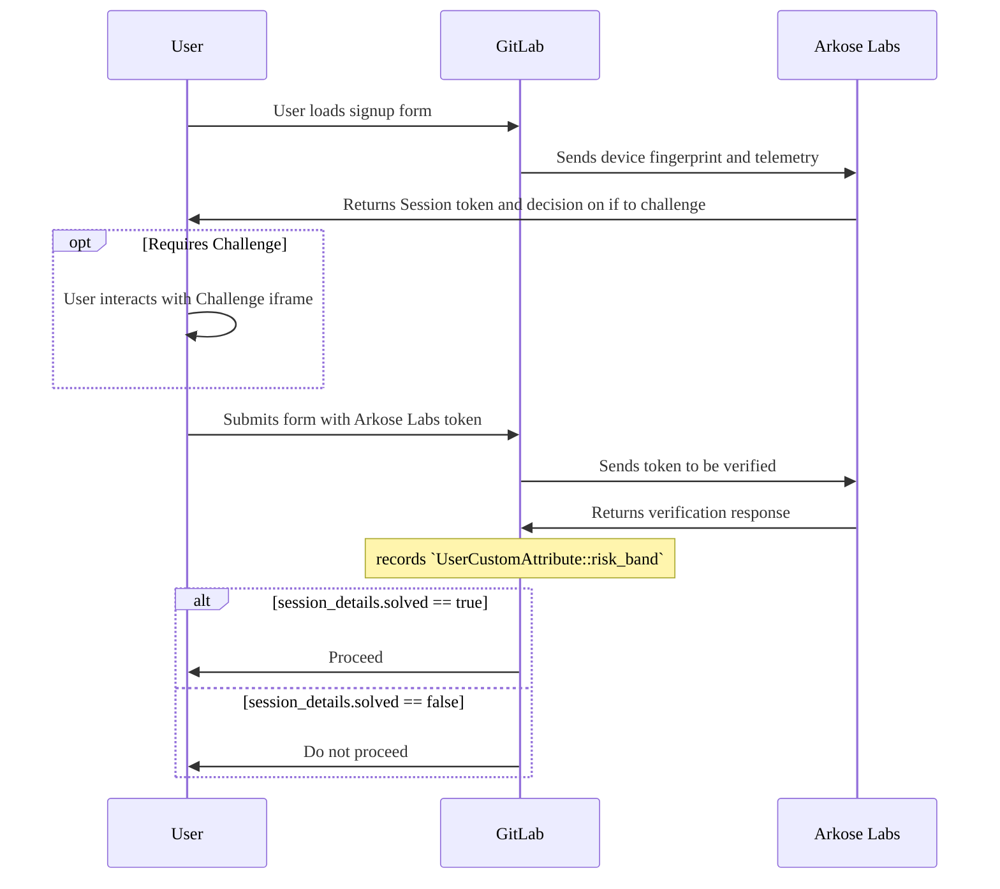

WARNING:
Arkose Protect is used on GitLab.com and is not supported for GitLab Self-Managed
instances. The following documents the internal requirements for maintaining
Arkose Protect on GitLab.com. While this feature is theoretically usable in GitLab Self-Managed instances, it
is not recommended at the moment.

GitLab integrates [Arkose Protect](https://www.arkoselabs.com/platform/) to guard against
malicious users from creating accounts.

## How does it work?

If Arkose Protect determines that the user is suspicious, it presents an interactive challenge below
the `Sign in` button. The challenge needs to be completed to proceed with the sign-in
attempt. If Arkose Protect trusts the user, the challenge runs in transparent mode, meaning that the
user doesn't need to take any additional action and can sign in as usual.



## How do we treat malicious sign-up attempts?

Depending on the risk score received, a user might be required to perform up to three stages of [identity verification](../security/identity_verification.md) to register an account.

## Configuration

To enable Arkose Protect:

1. License ArkoseLabs.
1. Get the public and private API keys from the [ArkoseLabs Portal](https://portal.arkoselabs.com/).
1. Enable the ArkoseLabs login challenge. Run the following commands in the Rails console, replacing `<your_public_api_key>` and `<your_private_api_key>` with your own API keys.

   ```ruby
   ApplicationSetting.current.update(arkose_labs_public_api_key: '<your_public_api_key>')
   ApplicationSetting.current.update(arkose_labs_private_api_key: '<your_private_api_key>')
   ```

To disable Arkose Protect:

To disable the ArkoseLabs integration, run the following command in the Rails console.

   ```ruby
   Feature.disable(:arkose_labs)
   ```

## Triage and debug ArkoseLabs issues

You can triage and debug issues raised by ArkoseLabs with:

- The [GitLab production logs](https://log.gprd.gitlab.net).
- The [Arkose logging service](https://gitlab.com/gitlab-org/gitlab/-/blob/master/ee/lib/arkose/logger.rb).

### View ArkoseLabs Verify API response for a user session

To view an ArkoseLabs Verify API response for a user, [query the GitLab production logs](https://log.gprd.gitlab.net/goto/54b82f50-935a-11ed-9f43-e3784d7fe3ca) with the following KQL:

```plaintext
KQL: json.message:"Arkose verify response" AND json.username:replace_username_here
```

If the query is valid, the result contains debug information about the user's session:

| Response | Description |
|---------|-------------|
| `json.response.session_details.suppressed` | Value is `true` if the challenge was not shown to the user. Always `true` if the user is allowlisted. |
| `json.arkose.risk_band` | Can be `low`, `medium`, or `high`. Ignored on sign in. Use to debug identity verification issues. |
| `json.response.session_details.solved` | Indicates whether the user solved the challenge. Always `true` if the user is allowlisted. |
| `json.response.session_details.previously_verified` | Indicates whether the token has been reused. Default is `false`. If `true`, it might indicate malicious activity. |

### Check if a user failed an ArkoseLabs challenge

To check if a user failed to sign in because the ArkoseLabs challenge was not solved, [query the GitLab production logs](https://log.gprd.gitlab.net/goto/b97c8a80-935a-11ed-85ed-e7557b0a598c) with the following KQL:

```plaintext
KQL: json.message:"Challenge was not solved" AND json.username:replace_username_here
```

## Allowlists

To ensure end-to-end QA test suites can pass during staging and production, we've [allowlisted](https://developer.arkoselabs.com/docs/verify-api-v4#creating-allowlists-and-denylists) the [GITLAB_QA_USER_AGENT](https://start.1password.com/open/i?a=LKATQYUATRBRDHRRABEBH4RJ5Y&v=6gq44ckmq23vqk5poqunurdgay&i=u2wvs63affaxzi22gnfbjjw2zm&h=gitlab.1password.com). Each QA user receives an `ALLOWLIST` [risk category](https://developer.arkoselabs.com/docs/risk-score).

You can find the usage of the allowlist telltale in our [Arkose::VerifyResponse](https://gitlab.com/gitlab-org/gitlab/-/blob/master/ee/lib/arkose/verify_response.rb#L38) class.

## Feedback Job

To help Arkose improve their protection service, we created a daily background job to send them the list of blocked users by us.
This job is performed by the `Arkose::BlockedUsersReportWorker` class.

## Test your integration

> - Requesting specific behaviors with Data Exchange [introduced](https://gitlab.com/gitlab-org/gitlab/-/issues/435275) in GitLab 16.8 [with a flag](../administration/feature_flags.md) named `arkose_labs_signup_data_exchange`. Disabled by default.

In staging and development environments only, you can suppress a challenge, or force one to appear.
You can use this feature if you want to receive a specific risk band.

To force a challenge, change your browser [user agent string](https://developer.chrome.com/docs/devtools/device-mode/override-user-agent/). You can find the appropriate string in [1Password](https://start.1password.com/open/i?a=LKATQYUATRBRDHRRABEBH4RJ5Y&v=6gq44ckmq23vqk5poqunurdgay&i=5v3ushqmfgifpwyqohop5gv5xe&h=gitlab.1password.com).

Alternatively, to request specific behaviors, enable the `arkose_labs_signup_data_exchange` feature flag and modify the Data Exchange payload to include an `interactive` field with any of the following values:

- `'true'` - Force a challenge to appear.
- `'false'` - Suppress a challenge. If you suppress a challenge, ArkoseLabs considers your session safe.

For example, the following diff updates the payload to suppress the challenge:

```diff
diff --git a/ee/lib/arkose/data_exchange_payload.rb b/ee/lib/arkose/data_exchange_payload.rb
index 191ae0b5cf82..b2d888b98c95 100644
--- a/ee/lib/arkose/data_exchange_payload.rb
+++ b/ee/lib/arkose/data_exchange_payload.rb
@@ -35,6 +35,7 @@ def json_data
       now = Time.current.to_i

       data = {
+        interactive: 'false',
         timestamp: now.to_s, # required to be a string
         "HEADER_user-agent" => request.user_agent,
         "HEADER_origin" => request.origin,
```

## Additional resources

<!-- markdownlint-disable MD044 -->
The [Anti-abuse team](https://handbook.gitlab.com/handbook/engineering/development/sec/software-supply-chain-security/anti-abuse/#group-members) owns the ArkoseLabs Protect feature. You can join our ArkoseLabs/GitLab collaboration channel on Slack: [#ext-gitlab-arkose](https://gitlab.slack.com/archives/C02SGF6RLPQ).
<!-- markdownlint-enable MD044 -->

ArkoseLabs also maintains the following resources:

- [ArkoseLabs portal](https://portal.arkoselabs.com/)
- [ArkoseLabs Zendesk](https://support.arkoselabs.com/hc/en-us)
- [ArkoseLabs documentation](https://developer.arkoselabs.com/docs/documentation-guide)
- [ArkoseLabs Data Exchange documentation](https://support.arkoselabs.com/hc/en-us/articles/4410529474323-Data-Exchange-Enhanced-Detection-and-API-Source-Validation)
