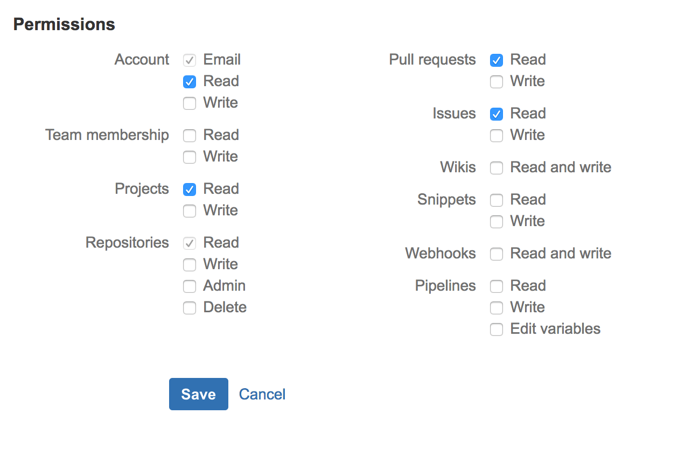
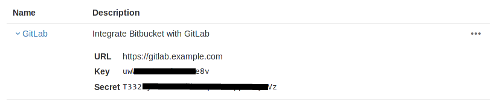

# Integrate your GitLab server with Bitbucket

Import projects from Bitbucket.org and login to your GitLab instance with your
Bitbucket.org account.

## Overview

You can set up Bitbucket.org as an OAuth provider so that you can use your
credentials to authenticate into GitLab or import your projects from
Bitbucket.org.

- To use Bitbucket.org as an OmniAuth provider, follow the [Bitbucket OmniAuth
  provider](#bitbucket-omniauth-provider) section.
- To import projects from Bitbucket, follow both the
  [Bitbucket OmniAuth provider](#bitbucket-omniauth-provider) and
  [Bitbucket project import](#bitbucket-project-import) sections.

## Bitbucket OmniAuth provider

> **Note:**
Make sure to first follow the [Initial OmniAuth configuration][init-oauth]
before proceeding with setting up the Bitbucket integration.

To enable the Bitbucket OmniAuth provider you must register your application
with Bitbucket.org. Bitbucket will generate an application ID and secret key for
you to use.

1.  Sign in to [Bitbucket.org](https://bitbucket.org).
1.  Navigate to your individual user settings (**Bitbucket settings**) or a team's
    settings (**Manage team**), depending on how you want the application registered.
    It does not matter if the application is registered as an individual or a
    team, that is entirely up to you.
1.  Select **OAuth** in the left menu under "Access Management".
1.  Select **Add consumer**.
1.  Provide the required details:

    | Item | Description |
    | :--- | :---------- |
    | **Name** | This can be anything. Consider something like `<Organization>'s GitLab` or `<Your Name>'s GitLab` or something else descriptive. |
    | **Application description** | Fill this in if you wish. |
    | **Callback URL** | Leave blank. |
    | **URL** | The URL to your GitLab installation, e.g., `https://gitlab.example.com`. |

    And grant at least the following permissions:

    ```
    Account: Email
    Repositories: Read, Admin
    ```

    >**Note:**
    It may seem a little odd to giving GitLab admin permissions to repositories,
    but this is needed in order for GitLab to be able to clone the repositories.

    

1.  Select **Save**.
1.  Select your newly created OAuth consumer and you should now see a Key and
    Secret in the list of OAuth customers. Keep this page open as you continue
    the configuration.

      

1.  On your GitLab server, open the configuration file:

    ```
    # For Omnibus packages
    sudo editor /etc/gitlab/gitlab.rb

    # For installations from source
    sudo -u git -H editor /home/git/gitlab/config/gitlab.yml
    ```

1.  Follow the [Initial OmniAuth Configuration](omniauth.md#initial-omniauth-configuration)
    for initial settings.
1.  Add the Bitbucket provider configuration:

    For Omnibus packages:

    ```ruby
    gitlab_rails['omniauth_providers'] = [
      {
        "name" => "bitbucket",
        "app_id" => "BITBUCKET_APP_KEY",
        "app_secret" => "BITBUCKET_APP_SECRET",
        "url" => "https://bitbucket.org/"
      }
    ]
    ```

    For installations from source:

    ```yaml
    - { name: 'bitbucket',
        app_id: 'BITBUCKET_APP_KEY',
        app_secret: 'BITBUCKET_APP_SECRET' }
    ```

    ---

    Where `BITBUCKET_APP_KEY` is the Key and `BITBUCKET_APP_SECRET` the Secret
    from the Bitbucket application page.

1.  Save the configuration file.
1.  [Reconfigure][] or [restart GitLab][] for the changes to take effect if you
    installed GitLab via Omnibus or from source respectively.

On the sign in page there should now be a Bitbucket icon below the regular sign
in form. Click the icon to begin the authentication process. Bitbucket will ask
the user to sign in and authorize the GitLab application. If everything goes
well, the user will be returned to GitLab and will be signed in.

## Bitbucket project import

To allow projects to be imported directly into GitLab, Bitbucket requires two
extra setup steps compared to [GitHub](github.md) and [GitLab.com](gitlab.md).

Bitbucket doesn't allow OAuth applications to clone repositories over HTTPS, and
instead requires GitLab to use SSH and identify itself using your GitLab
server's SSH key.

To be able to access repositories on Bitbucket, GitLab will automatically
register your public key with Bitbucket as a deploy key for the repositories to
be imported. Your public key needs to be at `~/.ssh/bitbucket_rsa` which
translates to `/var/opt/gitlab/.ssh/bitbucket_rsa` for Omnibus packages and to
`/home/git/.ssh/bitbucket_rsa.pub` for installations from source.

---

Below are the steps that will allow GitLab to be able to import your projects
from Bitbucket.

1. Make sure you [have enabled the Bitbucket OAuth support](#bitbucket-omniauth-provider).
1. Create a new SSH key with an **empty passphrase**:

    ```sh
    sudo -u git -H ssh-keygen
    ```

    When asked to 'Enter file in which to save the key' enter:
    `/var/opt/gitlab/.ssh/bitbucket_rsa` for Omnibus packages or
    `/home/git/.ssh/bitbucket_rsa` for installations from source. The name is
    important so make sure to get it right.

    > **Warning:**
    This key must NOT be associated with ANY existing Bitbucket accounts. If it
    is, the import will fail with an `Access denied! Please verify you can add
    deploy keys to this repository.` error.

1. Next, you need to to configure the SSH client to use your new key. Open the
   SSH configuration file of the `git` user:

    ```
    # For Omnibus packages
    sudo editor /var/opt/gitlab/.ssh/config

    # For installations from source
    sudo editor /home/git/.ssh/config
    ```

1. Add a host configuration for `bitbucket.org`:

    ```sh
    Host bitbucket.org
      IdentityFile ~/.ssh/bitbucket_rsa
      User git
    ```

1. Save the file and exit.
1. Manually connect to `bitbucket.org` over SSH, while logged in as the `git`
   user that GitLab will use:

    ```sh
    sudo -u git -H ssh bitbucket.org
    ```

    That step is performed because GitLab needs to connect to Bitbucket over SSH,
    in order to add `bitbucket.org` to your GitLab server's known SSH hosts.

1.  Verify the RSA key fingerprint you'll see in the response matches the one
    in the [Bitbucket documentation][bitbucket-docs] (the specific IP address
    doesn't matter):

    ```sh
    The authenticity of host 'bitbucket.org (104.192.143.1)' can't be established.
    RSA key fingerprint is SHA256:zzXQOXSRBEiUtuE8AikJYKwbHaxvSc0ojez9YXaGp1A.
    Are you sure you want to continue connecting (yes/no)?
    ```

1. If the fingerprint matches, type `yes` to continue connecting and have
   `bitbucket.org` be added to your known SSH hosts. After confirming you should
   see a permission denied message. If you see an authentication successful
   message you have done something wrong. The key you are using has already been
   added to a Bitbucket account and will cause the import script to fail. Ensure
   the key you are using CANNOT authenticate with Bitbucket.
1. Restart GitLab to allow it to find the new public key.

Your GitLab server is now able to connect to Bitbucket over SSH. You should be
able to see the "Import projects from Bitbucket" option on the New Project page
enabled.

## Acknowledgemts

Special thanks to the writer behind the following article:

- http://stratus3d.com/blog/2015/09/06/migrating-from-bitbucket-to-local-gitlab-server/

[init-oauth]: omniauth.md#initial-omniauth-configuration
[bitbucket-docs]: https://confluence.atlassian.com/bitbucket/use-the-ssh-protocol-with-bitbucket-cloud-221449711.html#UsetheSSHprotocolwithBitbucketCloud-KnownhostorBitbucket%27spublickeyfingerprints
[reconfigure]: ../administration/restart_gitlab.md#omnibus-gitlab-reconfigure
[restart GitLab]: ../administration/restart_gitlab.md#installations-from-source
