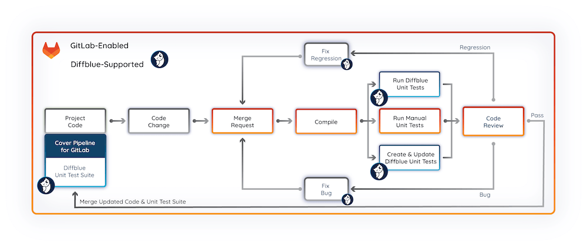
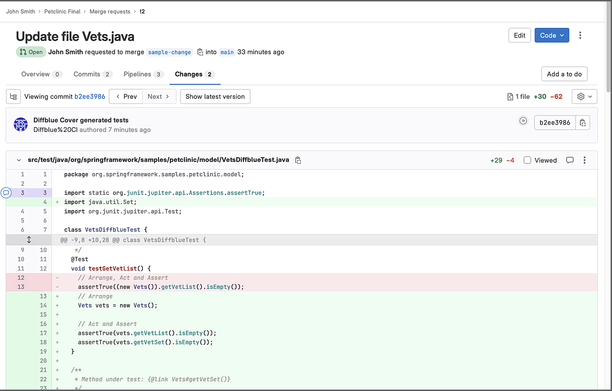

DETAILS:
**Tier:** Free, Premium, Ultimate
**Offering:** GitLab.com, GitLab Self-Managed, GitLab Dedicated

You can integrate the [Diffblue Cover](https://www.diffblue.com/) reinforcement learning AI tool into your CI/CD pipelines, to automatically write and maintain Java unit tests for your GitLab projects.
The Diffblue Cover Pipeline for GitLab integration allows you to automatically:

- Write a baseline unit test suite for your projects.
- Write new unit tests for new code.
- Update existing unit tests in your code.
- Remove existing unit tests in your code when they're no longer required.

## Configure the integration

To integrate Diffblue Cover into your pipeline:

1. Find and configure the Diffblue Cover integration.
1. Configure a pipeline for a sample project using the GitLab pipeline editor and the Diffblue Cover pipeline template.
1. Create a full baseline unit test suite for the project.

### Configure Diffblue Cover

1. On the left sidebar, select **Search or go to** and find your project.
   - If you want to test the integration with a sample project, you can [import](../user/project/import/repo_by_url.md)
     the Diffblue [Spring PetClinic sample project](https://github.com/diffblue/demo-spring-petclinic).
1. Select **Settings > Integrations**.
1. Find **Diffblue Cover** and select **Configure**.
1. Complete the fields:

   - Select the **Active** checkbox.
   - Enter your Diffblue Cover **License key** provided in your welcome email or by your organization.
     If needed, select the [**Try Diffblue Cover**](https://www.diffblue.com/try-cover/gitlab/) link to sign up for a free trial.
   - Enter details of your GitLab access token (**Name** and **Secret**) to allow Diffblue Cover to access your project.
     In general, use a GitLab [project access token](../user/project/settings/project_access_tokens.md) with the `Developer` role, plus `api` and `write_repository` scopes.
     If necessary you can use a [group access token](../user/group/settings/group_access_tokens.md) or a [personal access token](../user/profile/personal_access_tokens.md), again with the `Developer` role, plus `api` and `write_repository` scopes.

     NOTE:
     Using an access token with excessive permissions is a security risk.
     If you use a Personal access token, consider creating a dedicated user with access limited to just the project, minimizing the impact of the token being leaked.

1. Select **Save changes**.
   Your Diffblue Cover integration is now <mark style="color:green;">**Active**</mark> and ready for use in your project.

### Configure a pipeline

Here we'll create a merge request pipeline for the project that will download the latest version of Diffblue Cover, build the project, write Java unit tests for the project, and commit the changes to the branch.

1. On the left sidebar, select **Search or go to** and find your project.
1. Copy the contents of the [`Diffblue-Cover.gitlab-ci.yml` template](https://gitlab.com/gitlab-org/gitlab/-/blob/master/lib/gitlab/ci/templates/Diffblue-Cover.gitlab-ci.yml)
   into your project's `.gitlab-ci.yml` file.

   NOTE:
   When using the Diffblue Cover pipeline template with your own project and existing pipeline file, add the Diffblue template content to your file and modify as needed.
   For more information, see [Cover Pipeline for GitLab](https://docs.diffblue.com/features/cover-pipeline/cover-pipeline-for-gitlab) in the Diffblue documentation.

1. Enter a commit message.
1. Enter a new **Branch** name. For example, `add-diffblue-cover-pipeline`.
1. Select **Start a new merge request with these changes**.
1. Select **Commit changes**.

### Create a baseline unit test suite

1. In the **New merge request** form, enter a **Title** (for example, "Add Cover pipeline and create baseline unit test suite") and fill out the other fields.
1. Select **Create merge request**. The merge request pipeline runs Diffblue Cover to create the baseline unit test suite for the project.
1. Once the pipeline completes, the changes can be reviewed from the **Changes** tab. When you're happy, merge the updates to your repo. Go to the `src/test` folders in the project repository to see the unit tests created by Diffblue Cover (suffixed with `*DiffblueTest.java`).

## Subsequent code changes

When performing subsequent code changes to a project, the merge request pipeline will run Diffblue Cover but will only update the associated tests.
The resulting diff can then be analyzed to check the new behavior, catch regressions, and spot any unplanned behavioral changes to the code.

## Next steps

This topic demonstrates some of the key features of Cover Pipeline for GitLab and how to use the integration in a pipeline.
The wider and deeper functionality, provided through `dcover` commands in the pipeline template, can be implemented to expand your unit test capabilities even further.
For more information, see [Cover Pipeline for GitLab](https://docs.diffblue.com/features/cover-pipeline/cover-pipeline-for-gitlab) in the Diffblue documentation.
