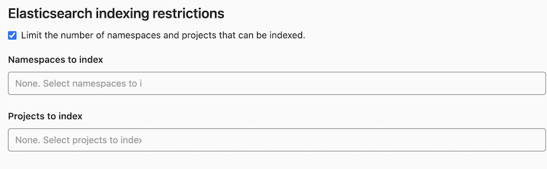
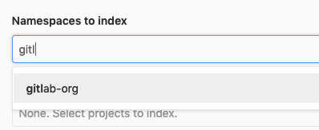

# Elasticsearch integration **(STARTER ONLY)**

> [Introduced](https://gitlab.com/gitlab-org/gitlab/merge_requests/109 "Elasticsearch Merge Request") in GitLab [Starter](https://about.gitlab.com/pricing/) 8.4. Support
> for [Amazon Elasticsearch](https://docs.aws.amazon.com/elasticsearch-service/latest/developerguide/es-gsg.html) was [introduced](https://gitlab.com/gitlab-org/gitlab/merge_requests/1305) in GitLab
> [Starter](https://about.gitlab.com/pricing/) 9.0.

This document describes how to set up Elasticsearch with GitLab. Once enabled,
you'll have the benefit of fast search response times and the advantage of two
special searches:

- [Advanced Global Search](../user/search/advanced_global_search.md)
- [Advanced Syntax Search](../user/search/advanced_search_syntax.md)

## Version Requirements

<!-- Please remember to update ee/lib/system_check/app/elasticsearch_check.rb if this changes -->

| GitLab version | Elasticsearch version |
| -------------- | --------------------- |
| GitLab Enterprise Edition 8.4 - 8.17  | Elasticsearch 2.4 with [Delete By Query Plugin](https://www.elastic.co/guide/en/elasticsearch/plugins/2.4/plugins-delete-by-query.html) installed |
| GitLab Enterprise Edition 9.0 - 11.4   | Elasticsearch 5.1 - 5.5 |
| GitLab Enterprise Edition 11.5+        | Elasticsearch 5.6 - 6.x |

## Installing Elasticsearch

Elasticsearch is _not_ included in the Omnibus packages. You will have to
[install it yourself](https://www.elastic.co/guide/en/elasticsearch/reference/current/install-elasticsearch.html "Elasticsearch installation documentation")
whether you are using the Omnibus package or installed GitLab from source.
Providing detailed information on installing Elasticsearch is out of the scope
of this document.

NOTE: **Note:**
Elasticsearch should be installed on a separate server, whether you install
it yourself or by using the
[Amazon Elasticsearch](https://docs.aws.amazon.com/elasticsearch-service/latest/developerguide/es-gsg.html)
service. Running Elasticsearch on the same server as GitLab is not recommended
and it will likely cause performance degradation on the GitLab installation.

Once the data is added to the database or repository and [Elasticsearch is
enabled in the admin area](#enabling-elasticsearch) the search index will be
updated automatically.

## Elasticsearch repository indexer (beta)

In order to improve Elasticsearch indexing performance, GitLab has made available a [new indexer written in Go](https://gitlab.com/gitlab-org/gitlab-elasticsearch-indexer).
This will replace the included Ruby indexer in the future but should be considered beta software for now, so there may be some bugs.

The Elasticsearch Go indexer is included in Omnibus for GitLab 11.8 and newer.

To use the new Elasticsearch indexer included in Omnibus, check the box "Use the new repository indexer (beta)"  when [enabling the Elasticsearch integration](#enabling-elasticsearch).

If you would like to use the Elasticsearch Go indexer with a source installation or an older version of GitLab, please follow the instructions below.

### Installation

First, we need to install some dependencies, then we'll build and install
the indexer itself.

#### Dependencies

This project relies on [ICU](http://site.icu-project.org/) for text encoding,
therefore we need to ensure the development packages for your platform are
installed before running `make`.

##### Debian / Ubuntu

To install on Debian or Ubuntu, run:

```sh
sudo apt install libicu-dev
```

##### CentOS / RHEL

To install on CentOS or RHEL, run:

```sh
sudo yum install libicu-devel
```

##### Mac OSX

To install on macOS, run:

```sh
brew install icu4c
export PKG_CONFIG_PATH="/usr/local/opt/icu4c/lib/pkgconfig:$PKG_CONFIG_PATH"
```

#### Building and installing

To build and install the indexer, run:

```sh
indexer_path=/home/git/gitlab-elasticsearch-indexer

# Run the installation task for gitlab-elasticsearch-indexer:
sudo -u git -H bundle exec rake gitlab:indexer:install[$indexer_path] RAILS_ENV=production
cd $indexer_path && sudo make install
```

The `gitlab-elasticsearch-indexer` will be installed to `/usr/local/bin`.

You can change the installation path with the `PREFIX` env variable.
Please remember to pass the `-E` flag to `sudo` if you do so.

Example:

```sh
PREFIX=/usr sudo -E make install
```

Once installed, enable it under your instance's Elasticsearch settings explained [below](#enabling-elasticsearch).

## System Requirements

Elasticsearch requires additional resources in excess of those documented in the
[GitLab system requirements](../install/requirements.md). These will vary by
installation size, but you should ensure **at least** an additional **8 GiB of RAM**
for each Elasticsearch node, per the [official guidelines](https://www.elastic.co/guide/en/elasticsearch/guide/current/hardware.html).

Keep in mind, this is the **minimum requirements** as per Elasticsearch. For
production instances, they recommend considerably more resources.

Storage requirements also vary based on the installation side, but as a rule of
thumb, you should allocate the total size of your production database, **plus**
two-thirds of the total size of your Git repositories. Efforts to reduce this
total are being tracked in [epic &153](https://gitlab.com/groups/gitlab-org/-/epics/153).

## Enabling Elasticsearch

In order to enable Elasticsearch, you need to have admin access. Navigate to
**Admin Area** (wrench icon), then **Settings > Integrations** and expand the **Elasticsearch** section.

Click **Save changes** for the changes to take effect.

The following Elasticsearch settings are available:

| Parameter                                             | Description |
| ----------------------------------------------------- | ----------- |
| `Elasticsearch indexing`                              | Enables/disables Elasticsearch indexing. You may want to enable indexing but disable search in order to give the index time to be fully completed, for example. Also, keep in mind that this option doesn't have any impact on existing data, this only enables/disables background indexer which tracks data changes. So by enabling this you will not get your existing data indexed, use special rake task for that as explained in [Adding GitLab's data to the Elasticsearch index](#adding-gitlabs-data-to-the-elasticsearch-index). |
| `Use the new repository indexer (beta)`               | Perform repository indexing using [GitLab Elasticsearch Indexer](https://gitlab.com/gitlab-org/gitlab-elasticsearch-indexer). |
| `Search with Elasticsearch enabled`                   | Enables/disables using Elasticsearch in search. |
| `URL`                                                 | The URL to use for connecting to Elasticsearch. Use a comma-separated list to support clustering (e.g., `http://host1, https://host2:9200`). If your Elasticsearch instance is password protected, pass the `username:password` in the URL (e.g., `http://<username>:<password>@<elastic_host>:9200/`). |
| `Number of Elasticsearch shards`                      | Elasticsearch indexes are split into multiple shards for performance reasons. In general, larger indexes need to have more shards. Changes to this value do not take effect until the index is recreated. You can read more about tradeoffs in the [Elasticsearch documentation](https://www.elastic.co/guide/en/elasticsearch/reference/current/indices-create-index.html#create-index-settings) |
| `Number of Elasticsearch replicas`                    | Each Elasticsearch shard can have a number of replicas. These are a complete copy of the shard, and can provide increased query performance or resilience against hardware failure. Increasing this value will greatly increase total disk space required by the index. |
| `Limit namespaces and projects that can be indexed`   | Enabling this will allow you to select namespaces and projects to index. All other namespaces and projects will use database search instead. Please note that if you enable this option but do not select any namespaces or projects, none will be indexed. [Read more below](#limiting-namespaces-and-projects).
| `Using AWS hosted Elasticsearch with IAM credentials` | Sign your Elasticsearch requests using [AWS IAM authorization](https://docs.aws.amazon.com/IAM/latest/UserGuide/id_credentials_access-keys.html) or [AWS EC2 Instance Profile Credentials](https://docs.aws.amazon.com/codedeploy/latest/userguide/getting-started-create-iam-instance-profile.html#getting-started-create-iam-instance-profile-cli). The policies must be configured to allow `es:*` actions. |
| `AWS Region`                                          | The AWS region your Elasticsearch service is located in. |
| `AWS Access Key`                                      | The AWS access key. |
| `AWS Secret Access Key`                               | The AWS secret access key. |

### Limiting namespaces and projects

If you select `Limit namespaces and projects that can be indexed`, more options will become available


You can select namespaces and projects to index exclusively. Please note that if the namespace is a group it will include
any sub-groups and projects belonging to those sub-groups to be indexed as well.

Elasticsearch only provides cross-group code/commit search (global) if all name-spaces are indexed. In this particular scenario where only a subset of namespaces are indexed, a global search will not provide a code or commit scope. This will be possible only in the scope of an indexed namespace. Currently there is no way to code/commit search in multiple indexed namespaces (when only a subset of namespaces has been indexed). For example if two groups are indexed, there is no way to run a single code search on both. You can only run a code search on the first group and then on the second.

You can filter the selection dropdown by writing part of the namespace or project name you're interested in.



NOTE: **Note**:
If no namespaces or projects are selected, no Elasticsearch indexing will take place.

CAUTION: **Warning**:
If you have already indexed your instance, you will have to regenerate the index in order to delete all existing data
for filtering to work correctly. To do this run the rake tasks `gitlab:elastic:create_empty_index` and
`gitlab:elastic:clear_index_status`. Afterwards, removing a namespace or a project from the list will delete the data
from the Elasticsearch index as expected.

## Disabling Elasticsearch

To disable the Elasticsearch integration:

1. Navigate to the **Admin Area** (wrench icon), then **Settings > Integrations**.
1. Expand the **Elasticsearch** section and uncheck **Elasticsearch indexing**
   and **Search with Elasticsearch enabled**.
1. Click **Save changes** for the changes to take effect.
1. (Optional) Delete the existing index by running one of these commands:

   ```sh
   # Omnibus installations
   sudo gitlab-rake gitlab:elastic:delete_index

   # Installations from source
   bundle exec rake gitlab:elastic:delete_index RAILS_ENV=production
   ```

## Adding GitLab's data to the Elasticsearch index

While Elasticsearch indexing is enabled, new changes in your GitLab instance will be automatically indexed as they happen.
To backfill existing data, you can use one of the methods below to index it in background jobs.

### Indexing through the administration UI

> [Introduced](https://gitlab.com/gitlab-org/gitlab/merge_requests/15390) in [GitLab Starter](https://about.gitlab.com/pricing/) 12.3.

To index via the admin area:

1. Navigate to the **Admin Area** (wrench icon), then **Settings > Integrations** and expand the **Elasticsearch** section.
1. [Enable **Elasticsearch indexing** and configure your host and port](#enabling-elasticsearch).
1. Create empty indexes using one of the following commands:

   ```sh
   # Omnibus installations
   sudo gitlab-rake gitlab:elastic:create_empty_index

   # Installations from source
   bundle exec rake gitlab:elastic:create_empty_index RAILS_ENV=production
   ```

1. Click **Index all projects**.
1. Click **Check progress** in the confirmation message to see the status of the background jobs.
1. Personal snippets need to be indexed manually by running one of these commands:

   ```sh
   # Omnibus installations
   sudo gitlab-rake gitlab:elastic:index_snippets

   # Installations from source
   bundle exec rake gitlab:elastic:index_snippets RAILS_ENV=production
   ```

1. After the indexing has completed, enable [**Search with Elasticsearch**](#enabling-elasticsearch).

### Indexing through Rake tasks

#### Indexing small instances

CAUTION: **Warning**:
This will delete your existing indexes.

If the database size is less than 500 MiB, and the size of all hosted repos is less than 5 GiB:

1. [Enable **Elasticsearch indexing** and configure your host and port](#enabling-elasticsearch).
1. Index your data using one of the following commands:

   ```sh
   # Omnibus installations
   sudo gitlab-rake gitlab:elastic:index

   # Installations from source
   bundle exec rake gitlab:elastic:index RAILS_ENV=production
   ```

1. After the indexing has completed, enable [**Search with Elasticsearch**](#enabling-elasticsearch).

#### Indexing large instances

CAUTION: **Warning**:
Performing asynchronous indexing will generate a lot of Sidekiq jobs.
Make sure to prepare for this task by either [Horizontally Scaling](../administration/high_availability/README.md#basic-scaling)
or creating [extra Sidekiq processes](../administration/operations/extra_sidekiq_processes.md)

1. [Enable **Elasticsearch indexing** and configure your host and port](#enabling-elasticsearch).
1. Create empty indexes using one of the following commands:

   ```sh
   # Omnibus installations
   sudo gitlab-rake gitlab:elastic:create_empty_index

   # Installations from source
   bundle exec rake gitlab:elastic:create_empty_index RAILS_ENV=production
   ```

1. Indexing large Git repositories can take a while. To speed up the process, you
   can temporarily disable auto-refreshing and replicating. In our experience, you can expect a 20%
   decrease in indexing time. We'll enable them when indexing is done. This step is optional!

   ```bash
   curl --request PUT localhost:9200/gitlab-production/_settings --data '{
       "index" : {
           "refresh_interval" : "-1",
           "number_of_replicas" : 0
       } }'
   ```

1. Index projects and their associated data:

   ```sh
   # Omnibus installations
   sudo gitlab-rake gitlab:elastic:index_projects

   # Installations from source
   bundle exec rake gitlab:elastic:index_projects RAILS_ENV=production
   ```

   This enqueues a Sidekiq job for each project that needs to be indexed.
   You can view the jobs in **Admin Area > Monitoring > Background Jobs > Queues Tab**
   and click `elastic_indexer`, or you can query indexing status using a rake task:

   ```sh
   # Omnibus installations
   sudo gitlab-rake gitlab:elastic:index_projects_status

   # Installations from source
   bundle exec rake gitlab:elastic:index_projects_status RAILS_ENV=production

   Indexing is 65.55% complete (6555/10000 projects)
   ```

   If you want to limit the index to a range of projects you can provide the
   `ID_FROM` and `ID_TO` parameters:

   ```sh
   # Omnibus installations
   sudo gitlab-rake gitlab:elastic:index_projects ID_FROM=1001 ID_TO=2000

   # Installations from source
   bundle exec rake gitlab:elastic:index_projects ID_FROM=1001 ID_TO=2000 RAILS_ENV=production
   ```

   Where `ID_FROM` and `ID_TO` are project IDs. Both parameters are optional.
   The above example will index all projects from ID `1001` up to (and including) ID `2000`.

   TIP: **Troubleshooting:**
   Sometimes the project indexing jobs queued by `gitlab:elastic:index_projects`
   can get interrupted. This may happen for many reasons, but it's always safe
   to run the indexing task again. It will skip repositories that have
   already been indexed.

   As the indexer stores the last commit SHA of every indexed repository in the
   database, you can run the indexer with the special parameter `UPDATE_INDEX` and
   it will check every project repository again to make sure that every commit in
   a repository is indexed, which can be useful in case if your index is outdated:

   ```sh
   # Omnibus installations
   sudo gitlab-rake gitlab:elastic:index_projects UPDATE_INDEX=true ID_TO=1000

   # Installations from source
   bundle exec rake gitlab:elastic:index_projects UPDATE_INDEX=true ID_TO=1000 RAILS_ENV=production
   ```

   You can also use the `gitlab:elastic:clear_index_status` Rake task to force the
   indexer to "forget" all progress, so it will retry the indexing process from the
   start.

1. Personal snippets are not associated with a project and need to be indexed separately
   by running one of these commands:

   ```sh
   # Omnibus installations
   sudo gitlab-rake gitlab:elastic:index_snippets

   # Installations from source
   bundle exec rake gitlab:elastic:index_snippets RAILS_ENV=production
   ```

1. Enable replication and refreshing again after indexing (only if you previously disabled it):

   ```bash
   curl --request PUT localhost:9200/gitlab-production/_settings --data '{
       "index" : {
           "number_of_replicas" : 1,
           "refresh_interval" : "1s"
       } }'
   ```

   A force merge should be called after enabling the refreshing above.

   For Elasticsearch 6.x, the index should be in read-only mode before proceeding with the force merge:

   ```bash
   curl --request PUT localhost:9200/gitlab-production/_settings --data '{
     "settings": {
       "index.blocks.write": true
     } }'
   ```

   Then, initiate the force merge:

   ```bash
   curl --request POST 'http://localhost:9200/gitlab-production/_forcemerge?max_num_segments=5'
   ```

   After this, if your index is in read-only mode, switch back to read-write:

   ```bash
   curl --request PUT localhost:9200/gitlab-production/_settings --data '{
     "settings": {
       "index.blocks.write": false
     } }'
   ```

1. After the indexing has completed, enable [**Search with Elasticsearch**](#enabling-elasticsearch).

### Indexing limitations

For repository and snippet files, GitLab will only index up to 1 MiB of content, in order to avoid indexing timeouts.

## GitLab Elasticsearch Rake Tasks

There are several rake tasks available to you via the command line:

- [`sudo gitlab-rake gitlab:elastic:index`](https://gitlab.com/gitlab-org/gitlab/blob/master/ee/lib/tasks/gitlab/elastic.rake)
  - This is a wrapper task. It does the following:
    - `sudo gitlab-rake gitlab:elastic:create_empty_index`
    - `sudo gitlab-rake gitlab:elastic:clear_index_status`
    - `sudo gitlab-rake gitlab:elastic:index_projects`
    - `sudo gitlab-rake gitlab:elastic:index_snippets`
- [`sudo gitlab-rake gitlab:elastic:index_projects`](https://gitlab.com/gitlab-org/gitlab/blob/master/ee/lib/tasks/gitlab/elastic.rake)
  - This iterates over all projects and queues Sidekiq jobs to index them in the background.
- [`sudo gitlab-rake gitlab:elastic:index_projects_status`](https://gitlab.com/gitlab-org/gitlab/blob/master/ee/lib/tasks/gitlab/elastic.rake)
  - This determines the overall status of the indexing. It is done by counting the total number of indexed projects, dividing by a count of the total number of projects, then multiplying by 100.
- [`sudo gitlab-rake gitlab:elastic:create_empty_index`](https://gitlab.com/gitlab-org/gitlab/blob/master/ee/lib/tasks/gitlab/elastic.rake)
  - This generates an empty index on the Elasticsearch side, deleting the existing one if present.
- [`sudo gitlab-rake gitlab:elastic:clear_index_status`](https://gitlab.com/gitlab-org/gitlab/blob/master/ee/lib/tasks/gitlab/elastic.rake)
  - This deletes all instances of IndexStatus for all projects.
- [`sudo gitlab-rake gitlab:elastic:delete_index`](https://gitlab.com/gitlab-org/gitlab/blob/master/ee/lib/tasks/gitlab/elastic.rake)
  - This removes the GitLab index on the Elasticsearch instance.
- [`sudo gitlab-rake gitlab:elastic:recreate_index`](https://gitlab.com/gitlab-org/gitlab/blob/master/ee/lib/tasks/gitlab/elastic.rake)
  - Does the same thing as `sudo gitlab-rake gitlab:elastic:create_empty_index`
- [`sudo gitlab-rake gitlab:elastic:index_snippets`](https://gitlab.com/gitlab-org/gitlab/blob/master/ee/lib/tasks/gitlab/elastic.rake)
  - Performs an Elasticsearch import that indexes the snippets data.
- [`sudo gitlab-rake gitlab:elastic:projects_not_indexed`](https://gitlab.com/gitlab-org/gitlab/blob/master/ee/lib/tasks/gitlab/elastic.rake)
  - Displays which projects are not indexed.

### Environment Variables

In addition to the rake tasks, there are some environment variables that can be used to modify the process:

| Environment Variable | Data Type | What it does                                                                 |
| -------------------- |:---------:| ---------------------------------------------------------------------------- |
| `UPDATE_INDEX`       | Boolean   | Tells the indexer to overwrite any existing index data (true/false).         |
| `ID_TO`              | Integer   | Tells the indexer to only index projects less than or equal to the value.    |
| `ID_FROM`            | Integer   | Tells the indexer to only index projects greater than or equal to the value. |

### Indexing a specific project

Because the `ID_TO` and `ID_FROM` environment variables use the `or equal to` comparison, you can index only one project by using both these variables with the same project ID number:

```sh
root@git:~# sudo gitlab-rake gitlab:elastic:index_projects ID_TO=5 ID_FROM=5
Indexing project repositories...I, [2019-03-04T21:27:03.083410 #3384]  INFO -- : Indexing GitLab User / test (ID=33)...
I, [2019-03-04T21:27:05.215266 #3384]  INFO -- : Indexing GitLab User / test (ID=33) is done!
```

## Elasticsearch Index Scopes

When performing a search, the GitLab index will use the following scopes:

| Scope Name       | What it searches       |
| ---------------- | ---------------------- |
| `commits`        | Commit data            |
| `projects`       | Project data (default) |
| `blobs`          | Code                   |
| `issues`         | Issue data             |
| `merge_requests` | Merge Request data     |
| `milestones`     | Milestone data         |
| `notes`          | Note data              |
| `snippets`       | Snippet data           |
| `wiki_blobs`     | Wiki contents          |

## Tuning

### Deleted documents

Whenever a change or deletion is made to an indexed GitLab object (a merge request description is changed, a file is deleted from the master branch in a repository, a project is deleted, etc), a document in the index is deleted.  However, since these are "soft" deletes, the overall number of "deleted documents", and therefore wasted space, increases.  Elasticsearch does intelligent merging of segments in order to remove these deleted documents.  However, depending on the amount and type of activity in your GitLab installation, it's possible to see as much as 50% wasted space in the index.

In general, we recommend simply letting Elasticsearch merge and reclaim space automatically, with the default settings. From [Lucene's Handling of Deleted Documents](https://www.elastic.co/blog/lucenes-handling-of-deleted-documents "Lucene's Handling of Deleted Documents"), _"Overall, besides perhaps decreasing the maximum segment size, it is best to leave Lucene's defaults as-is and not fret too much about when deletes are reclaimed."_

However, some larger installations may wish to tune the merge policy settings:

- Consider reducing the `index.merge.policy.max_merged_segment` size from the default 5 GB to maybe 2 GB or 3 GB.  Merging only happens when a segment has at least 50% deletions.  Smaller segment sizes will allow merging to happen more frequently.

  ```bash
  curl --request PUT http://localhost:9200/gitlab-production/_settings --data '{
    "index" : {
      "merge.policy.max_merged_segment": "2gb"
    }
  }'
  ```

- You can also adjust `index.merge.policy.reclaim_deletes_weight`, which controls how aggressively deletions are targeted.  But this can lead to costly merge decisions, so we recommend not changing this unless you understand the tradeoffs.

  ```bash
  curl --request PUT http://localhost:9200/gitlab-production/_settings --data '{
    "index" : {
      "merge.policy.reclaim_deletes_weight": "3.0"
    }
  }'
  ```

- Do not do a [force merge](https://www.elastic.co/guide/en/elasticsearch/reference/current/indices-forcemerge.html "Force Merge") to remove deleted documents.  A warning in the [documentation](https://www.elastic.co/guide/en/elasticsearch/reference/current/indices-forcemerge.html "Force Merge") states that this can lead to very large segments that may never get reclaimed, and can also cause significant performance or availability issues.

## Troubleshooting

Here are some common pitfalls and how to overcome them:

- **How can I verify my GitLab instance is using Elasticsearch?**

  The easiest method is via the rails console (`sudo gitlab-rails console`) by running the following:

  ```ruby
  u = User.find_by_username('your-username')
  s = SearchService.new(u, {:search => 'search_term'})
  pp s.search_objects.class.name
  ```

  If you see `Elasticsearch::Model::Response::Records`, you are using Elasticsearch.

  NOTE: **Note**:
  The above instructions are used to verify that GitLab is using Elasticsearch only when indexing all namespaces. This is not to be used for scenarios that only index a [subset of namespaces](https://docs.gitlab.com/ee/integration/elasticsearch.html#limiting-namespaces-and-projects).

- **I updated GitLab and now I can't find anything**

  We continuously make updates to our indexing strategies and aim to support
  newer versions of Elasticsearch. When indexing changes are made, it may
  be necessary for you to [reindex](#adding-gitlabs-data-to-the-elasticsearch-index) after updating GitLab.

- **I indexed all the repositories but I can't find anything**

  Make sure you indexed all the database data [as stated above](#adding-gitlabs-data-to-the-elasticsearch-index).

  Beyond that, check via the [Elasticsearch Search API](https://www.elastic.co/guide/en/elasticsearch/reference/current/search-search.html) to see if the data shows up on the Elasticsearch side.

  If it shows up via the [Elasticsearch Search API](https://www.elastic.co/guide/en/elasticsearch/reference/current/search-search.html), check that it shows up via the rails console (`sudo gitlab-rails console`):

  ```ruby
  u = User.find_by_username('your-username')
  s = SearchService.new(u, {:search => 'search_term', :scope => 'blobs'})
  pp s.search_objects.to_a
  ```

  NOTE: **Note**:
  The above instructions are not to be used for scenarios that only index a [subset of namespaces](https://docs.gitlab.com/ee/integration/elasticsearch.html#limiting-namespaces-and-projects).

  See [Elasticsearch Index Scopes](#elasticsearch-index-scopes) for more information on searching for specific types of data.

- **I indexed all the repositories but then switched Elasticsearch servers and now I can't find anything**

  You will need to re-run all the rake tasks to re-index the database, repositories, and wikis.

- **The indexing process is taking a very long time**

  The more data present in your GitLab instance, the longer the indexing process takes.

- **There are some projects that weren't indexed, but we don't know which ones**

  You can run `sudo gitlab-rake gitlab:elastic:projects_not_indexed` to display projects that aren't indexed.

- **No new data is added to the Elasticsearch index when I push code**

  When performing the initial indexing of blobs, we lock all projects until the project finishes indexing. It could
  happen that an error during the process causes one or multiple projects to remain locked. In order to unlock them,
  run the `gitlab:elastic:clear_locked_projects` rake task.

- **"Can't specify parent if no parent field has been configured"**

  If you enabled Elasticsearch before GitLab 8.12 and have not rebuilt indexes you will get
  exception in lots of different cases:

  ```text
  Elasticsearch::Transport::Transport::Errors::BadRequest([400] {
      "error": {
          "root_cause": [{
              "type": "illegal_argument_exception",
              "reason": "Can't specify parent if no parent field has been configured"
          }],
          "type": "illegal_argument_exception",
          "reason": "Can't specify parent if no parent field has been configured"
      },
      "status": 400
  }):
  ```

  This is because we changed the index mapping in GitLab 8.12 and the old indexes should be removed and built from scratch again,
  see details in the [8-11-to-8-12 update guide](https://gitlab.com/gitlab-org/gitlab/blob/master/doc/update/8.11-to-8.12.md#11-elasticsearch-index-update-if-you-currently-use-elasticsearch).

- Exception `Elasticsearch::Transport::Transport::Errors::BadRequest`

  If you have this exception (just like in the case above but the actual message is different) please check if you have the correct Elasticsearch version and you met the other [requirements](#system-requirements).
  There is also an easy way to check it automatically with `sudo gitlab-rake gitlab:check` command.

- Exception `Elasticsearch::Transport::Transport::Errors::RequestEntityTooLarge`

  ```text
  [413] {"Message":"Request size exceeded 10485760 bytes"}
  ```

  This exception is seen when your Elasticsearch cluster is configured to reject
  requests above a certain size (10MiB in this case). This corresponds to the
  `http.max_content_length` setting in `elasticsearch.yml`. Increase it to a
  larger size and restart your Elasticsearch cluster.

  AWS has [fixed limits](https://docs.aws.amazon.com/elasticsearch-service/latest/developerguide/aes-limits.html)
  for this setting ("Maximum Size of HTTP Request Payloads"), based on the size of
  the underlying instance.

### Reverting to basic search

Sometimes there may be issues with your Elasticsearch index data and as such
GitLab will allow you to revert to "basic search" when there are no search
results and assuming that basic search is supported in that scope. This "basic
search" will behave as though you don't have Elasticsearch enabled at all for
your instance and search using other data sources (ie. Postgres data and Git
data).
