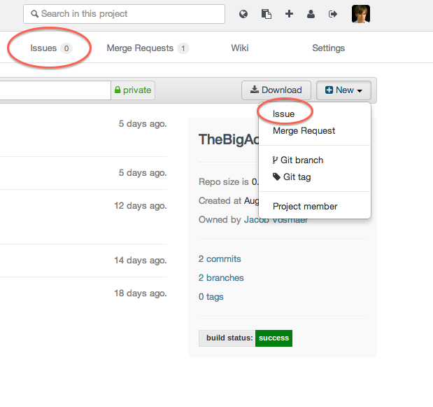

# External issue tracker

GitLab has a great issue tracker but you can also use an external issue tracker such as JIRA or Redmine. This is something that you can turn on per GitLab project. If for example you configure JIRA it provides the following functionality:

- the 'Issues' link on the GitLab project pages takes you to the appropriate JIRA issue index;
- clicking 'New issue' on the project dashboard creates a new JIRA issue;
- To reference JIRA issue PROJECT-1234 in comments, use syntax PROJECT-1234. Commit messages get turned into HTML links to the corresponding JIRA issue.

You can configure the integration in the gitlab.yml configuration file.

Support to add your commits to the Jira ticket automatically is [available in GitLab EE](http://doc.gitlab.com/ee/integration/jira.html).
