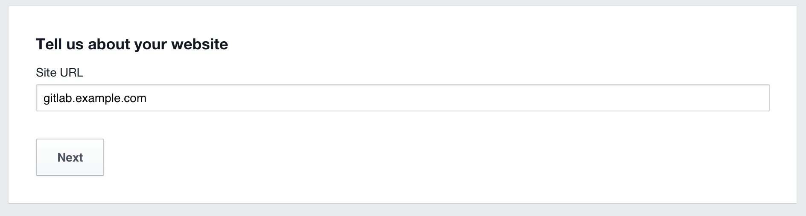
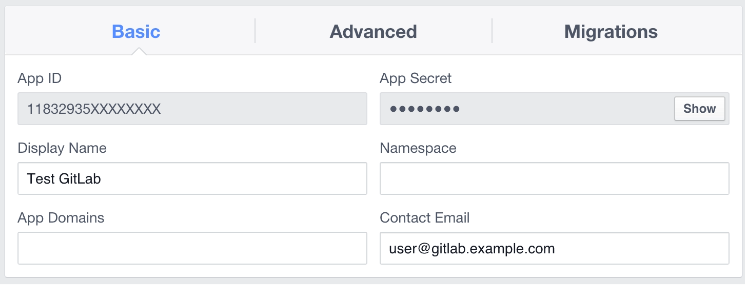
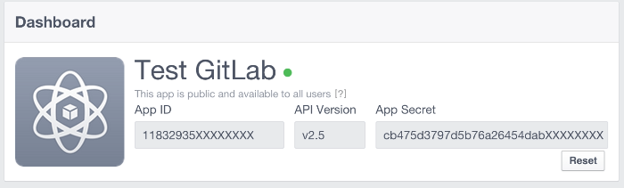

# Use Facebook as an OAuth 2.0 authentication provider

DETAILS:
**Tier:** Free, Premium, Ultimate
**Offering:** Self-managed

You can use the Facebook OmniAuth provider to authenticate users with their Facebook account.

To enable the Facebook OmniAuth provider, you must:

- Register your application with Facebook. Facebook generates an app ID and a secret key for you to use.
- Configure the GitLab server.

## Register your application with Facebook

1. Sign in to your [Facebook developer account](https://developers.facebook.com/).

1. Go to **My Apps** > **Create App**, then complete the following steps:

   1. Enter a descriptive name for your app. For example: **`<your_organization's>` GitLab** or **`<your_name's>` GitLab**.

   1. Select **Create New Facebook App ID**.

   1. Select a **Category**. For example **Productivity**.

   1. Select **Create App ID**.

   1. At the bottom of the page, enter the address of your GitLab installation.

      

   1. Select **Next**.

1. In the upper-right corner, select **Skip Quick Start**.

1. From the menu on the left, select **Settings**, then complete the following:

   1. Enter a contact email for your app.

      

   1. Select **Save Changes**.

1. From the menu on the left, select **Status & Review**, then complete the following:

   1. Change the switch on the right from **No** to **Yes**.

   1. When prompted to make the app public, select **Confirm**.

1. From the menu on the left, select **Dashboard**, then complete the following:

   1. Next to the hidden **App Secret**, select **Show**.

   1. Copy the **App ID** and **App Secret**. Keep this page
      open as you continue configuration.

      

## Configure the GitLab server

1. On your GitLab server, open the configuration file:

   ::Tabs

   :::TabTitle Linux package installations

   ```shell
   sudo editor /etc/gitlab/gitlab.rb
   ```

   :::TabTitle Self-compiled installations

   ```shell
   cd /home/git/gitlab

   sudo -u git -H editor config/gitlab.yml
   ```

   ::EndTabs

1. Configure the [common settings](omniauth.md#configure-common-settings)
   to add `facebook` as a single sign-on provider. This enables Just-In-Time
   account provisioning for users who do not have an existing GitLab account.

1. Add the provider configuration:

   ::Tabs

   :::TabTitle Linux package installations

   ```ruby
   gitlab_rails['omniauth_providers'] = [
     {
       name: "facebook",
       # label: "Provider name", # optional label for login button, defaults to "Facebook"
       app_id: "YOUR_APP_ID",
       app_secret: "YOUR_APP_SECRET"
     }
   ]
   ```

   :::TabTitle Self-compiled installations

   ```yaml
   - { name: 'facebook',
       # label: 'Provider name', # optional label for login button, defaults to "Facebook"
       app_id: 'YOUR_APP_ID',
       app_secret: 'YOUR_APP_SECRET' }
   ```

   ::EndTabs

1. In the provide configuration, paste the following values:

   1. `YOUR_APP_ID`: The **App ID** you copied in the previous step.

   1. `YOUR_APP_SECRET`: The **App Secret** you copied in the previous step.

1. Save the configuration file.

1. For the changes to take effect:
   - If you installed using the Linux package, [reconfigure GitLab](../administration/restart_gitlab.md#reconfigure-a-linux-package-installation).
   - If you self-compiled your installation, [restart GitLab](../administration/restart_gitlab.md#self-compiled-installations).

On the sign in page, a Facebook icon should now appear below the sign-in fields.
The user can select the icon to sign in.
