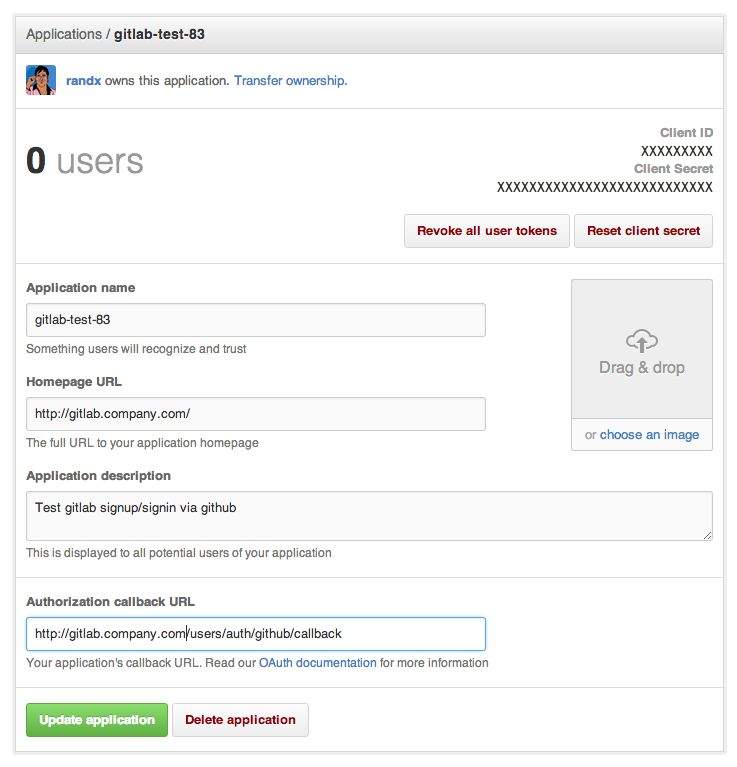

# GitHub OAuth2 OmniAuth Provider

To enable the GitHub OmniAuth provider you must register your application with GitHub. GitHub will generate a client ID and secret key for you to use.

1.  Sign in to GitHub.

1.  Navigate to your individual user settings or an organization's settings, depending on how you want the application registered. It does not matter if the application is registered as an individual or an organization - that is entirely up to you.

1.  Select "Applications" in the left menu.

1.  Select "Register new application".

1.  Provide the required details.
    - Application name: This can be anything. Consider something like "\<Organization\>'s GitLab" or "\<Your Name\>'s GitLab" or something else descriptive.
    - Homepage URL: The URL to your GitLab installation. 'https://gitlab.company.com'
    - Application description: Fill this in if you wish.
    - Authorization callback URL: 'https://gitlab.company.com/users/auth/github/callback'
1.  Select "Register application".

1.  You should now see a Client ID and Client Secret near the top right of the page (see screenshot). Keep this page open as you continue configuration. 

1.  On your GitLab server, open the configuration file.

    ```sh
    cd /home/git/gitlab

    sudo -u git -H editor config/gitlab.yml
    ```

1.  Find the section dealing with OmniAuth. See [Initial OmniAuth Configuration](README.md#initial-omniauth-configuration) for more details.

1.  Under `providers:` uncomment (or add) lines that look like the following:

    ```
        - { name: 'github', app_id: 'YOUR APP ID',
          app_secret: 'YOUR APP SECRET',
          args: { scope: 'user:email' } }
    ```

1.  Change 'YOUR APP ID' to the client ID from the GitHub application page from step 7. 

1.  Change 'YOUR APP SECRET' to the client secret from the GitHub application page  from step 7.

1.  Save the configuration file.

1.  Restart GitLab for the changes to take effect.

On the sign in page there should now be a GitHub icon below the regular sign in form. Click the icon to begin the authentication process. GitHub will ask the user to sign in and authorize the GitLab application. If everything goes well the user will be returned to GitLab and will be signed in.
