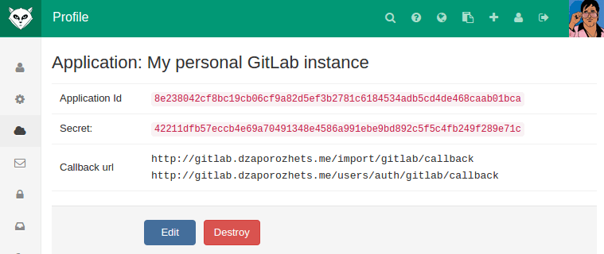

# Integrate your server with GitLab.com

Import projects from GitLab.com and login to your GitLab instance with your GitLab.com account.

To enable the GitLab.com OmniAuth provider you must register your application with GitLab.com. 
GitLab.com will generate an application ID and secret key for you to use.

1.  Sign in to GitLab.com

1.  Navigate to your profile settings.

1.  Select "Applications" in the left menu.

1.  Select "New application".

1.  Provide the required details.
    - Name: This can be anything. Consider something like `<Organization>'s GitLab` or `<Your Name>'s GitLab` or something else descriptive.
    - Redirect URI:

    ```
    http://your-gitlab.example.com/import/gitlab/callback
    http://your-gitlab.example.com/users/auth/gitlab/callback
    ```

    The first link is required for the importer and second for the authorization.

1.  Select "Submit".

1.  You should now see a Client ID and Client Secret near the top right of the page (see screenshot). 
    Keep this page open as you continue configuration. 
    

1.  On your GitLab server, open the configuration file.

    For omnibus package:

    ```sh
      sudo editor /etc/gitlab/gitlab.rb
    ```

    For installations from source:

    ```sh
      cd /home/git/gitlab

      sudo -u git -H editor config/gitlab.yml
    ```

1.  See [Initial OmniAuth Configuration](omniauth.md#initial-omniauth-configuration) for initial settings.

1.  Add the provider configuration:

    For omnibus package:

    ```ruby
      gitlab_rails['omniauth_providers'] = [
        {
          "name" => "gitlab",
          "app_id" => "YOUR_APP_ID",
          "app_secret" => "YOUR_APP_SECRET",
          "args" => { "scope" => "api" }
        }
      ]
    ```

    For installations from source:

    ```
      - { name: 'gitlab', app_id: 'YOUR_APP_ID',
        app_secret: 'YOUR_APP_SECRET',
        args: { scope: 'api' } }
    ```

1.  Change 'YOUR_APP_ID' to the Application ID from the GitLab.com application page.

1.  Change 'YOUR_APP_SECRET' to the secret from the GitLab.com application page.

1.  Save the configuration file.

1.  Restart GitLab for the changes to take effect.

On the sign in page there should now be a GitLab.com icon below the regular sign in form. 
Click the icon to begin the authentication process. GitLab.com will ask the user to sign in and authorize the GitLab application. 
If everything goes well the user will be returned to your GitLab instance and will be signed in.
