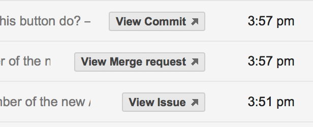

# GitLab buttons in gmail

GitLab supports [Google actions in email](https://developers.google.com/gmail/markup/actions/actions-overview).

If correctly setup, emails that require an action will be marked in Gmail.



To get this functioning, you need to be registered with Google.
[See how to register with google in this document.](https://developers.google.com/gmail/markup/registering-with-google)

To aid the registering with google, GitLab offers a rake task that will send an email to google whitelisting email address from your GitLab server.

To check what would be sent to the google email address, run the rake task:

```bash
bundle exec rake gitlab:mail_google_schema_whitelisting RAILS_ENV=production
```

**This will not send the email but give you the output of how the mail will look.**

Copy the output of the rake task to [google email markup tester](https://www.google.com/webmasters/markup-tester/u/0/) and press "Validate".

If you receive "No errors detected" message from the tester you can send the email using:

```bash
bundle exec rake gitlab:mail_google_schema_whitelisting RAILS_ENV=production SEND=true
``
