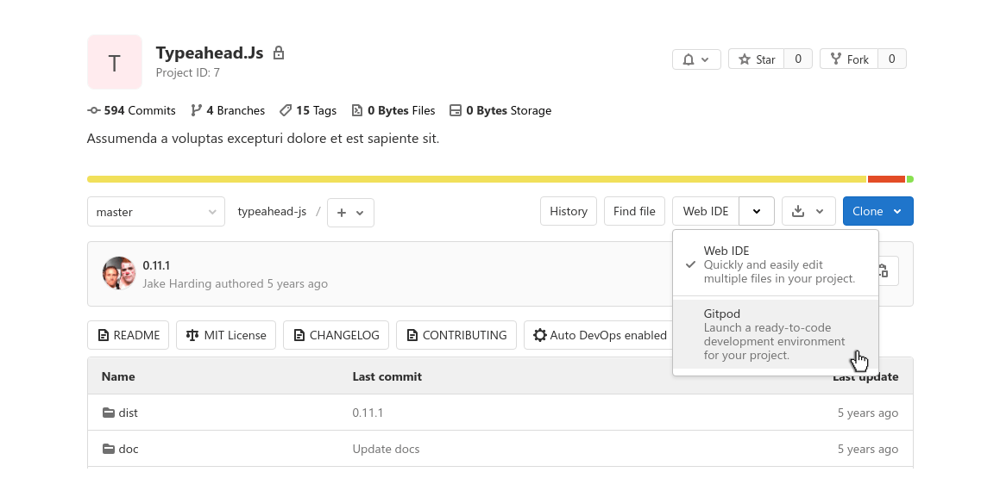

# Gitpod Integration **(FREE)**

> - [Introduced](https://gitlab.com/gitlab-org/gitlab/-/issues/228893) in GitLab 13.4.
> - [Feature flag removed](https://gitlab.com/gitlab-org/gitlab/-/258206) in GitLab 13.8

With [Gitpod](https://gitpod.io/) you can describe your development environment as code to get fully
set up, compiled, and tested development environments for any GitLab project. The development
environments are not only automated but also prebuilt which means that Gitpod continuously builds
your Git branches like a CI/CD server.

This means you don't have to wait for dependencies to be downloaded and builds to finish, you can start
coding immediately. With Gitpod you can start coding instantly on any project, branch, and merge
request from any device, at any time.

To use the GitLab Gitpod integration, it must be enabled for your GitLab instance. Users of:

- GitLab.com can use it immediately after it's [enabled in their user settings](#enable-gitpod-in-your-user-settings).
- GitLab self-managed instances can use it after:
  1. It's [enabled and configured by a GitLab administrator](#configure-a-self-managed-instance).
  1. It's [enabled in their user settings](#enable-gitpod-in-your-user-settings).

To learn more about Gitpod, see their [features](https://www.gitpod.io/features/) and
[documentation](https://www.gitpod.io/docs/).

## Enable Gitpod in your user settings

With the Gitpod integration enabled for your GitLab instance, to enable it for yourself:

1. In the top-right corner, select your avatar.
1. Select **Preferences**.
1. Under **Preferences**, locate the **Integrations** section.
1. Check the **Enable Gitpod integration** checkbox and select the **Save changes** button.

## Configure a self-managed instance **(FREE SELF)**

For GitLab self-managed instances, a GitLab administrator needs to:

1. Set up a Gitpod instance to integrate with GitLab. Refer to the [Gitpod documentation](https://www.gitpod.io/docs/self-hosted/latest/self-hosted/)
   to get your instance up and running.
1. Enable it in GitLab:
   1. On the top bar, select **Menu >** **{admin}** **Admin**.
   1. In the left sidebar, select **Settings > General**.
   1. Expand the **Gitpod** configuration section.
   1. Check the **Enable Gitpod integration** checkbox.
   1. Add your Gitpod instance URL (for example, `https://gitpod.example.com`).
   1. Select the **Save changes** button.

Your users then need to [enable it for themselves](#enable-gitpod-in-your-user-settings).

## Launch Gitpod in GitLab

You can launch Gitpod directly from GitLab by clicking the **Gitpod** button from the **Web IDE**
dropdown on the project page:

A project launched in GitLab looks like:

