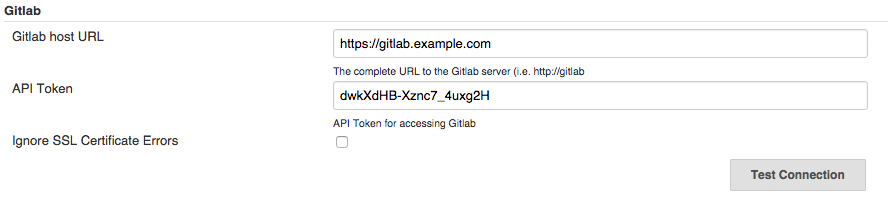
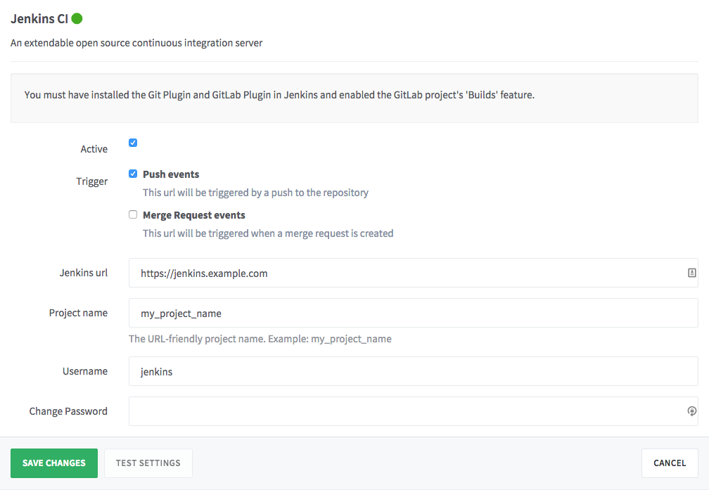
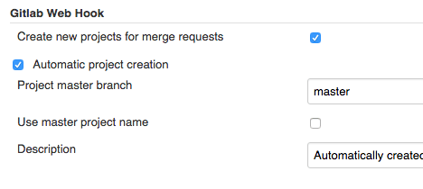
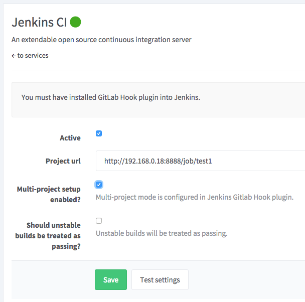
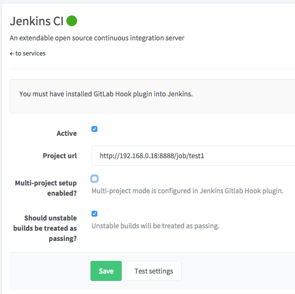

# Jenkins CI integration

In GitLab 8.3, Jenkins integration using the
[GitLab Hook Plugin](https://wiki.jenkins-ci.org/display/JENKINS/GitLab+Hook+Plugin)
was deprecated in favor of the
[GitLab Plugin](https://wiki.jenkins-ci.org/display/JENKINS/GitLab+Plugin).
The deprecated integration has been renamed to 'Jenkins CI (Deprecated)' in the
project service settings. We may remove this in a future release and recommend
using the new 'Jenkins CI' project service instead. See
[documentation for 'Jenkins CI (Deprecated)'](#jenkins-ci-deprecated-service)
below.

## Jenkins CI Service

Integration includes:

* Trigger a Jenkins build after push to a repository and/or when a merge request
  is created
* Show build status on Merge Request page, on each commit and on the project
  home page

### Requirements:

* [Jenkins GitLab Plugin](https://wiki.jenkins-ci.org/display/JENKINS/GitLab+Plugin)
* [Jenkins Git Plugin](https://wiki.jenkins-ci.org/display/JENKINS/Git+Plugin)
* Git clone access for Jenkins from the GitLab repository
* GitLab API access to report build status

### Configure GitLab users

Create a user or choose an existing user that Jenkins will use to interact
through the GitLab API. This user will need to be a global Admin or added
as a member to each Group/Project. Developer permission is required for reporting
build status. This is because a successful build status can trigger a merge
when 'Merge when build succeeds' feature is used. Some features of the GitLab
Plugin may require additional privileges. For example, there is an option to
accept a merge request if the build is successful. Using this feature would
require developer, master or owner-level permission.

Copy the private API token from **Profile Settings -> Account**. You will need this
when configuring the Jenkins server later.

### Configure the Jenkins server

Install [Jenkins GitLab Plugin](https://wiki.jenkins-ci.org/display/JENKINS/GitLab+Plugin)
and [Jenkins Git Plugin](https://wiki.jenkins-ci.org/display/JENKINS/Git+Plugin).

Go to Manage Jenkins -> Configure System and scroll down to the 'GitLab' section.
Enter the GitLab server URL in the 'GitLab host URL' field and paste the API token
copied earlier in the 'API Token' field.

### Configure a Jenkins project

Follow the GitLab Plugin documentation under the
[Using it With a Job](https://github.com/jenkinsci/gitlab-plugin#using-it-with-a-job)
heading. You *do not* need to complete instructions under the 'GitLab
Configuration (>= 8.0)'. Be sure to check the 'Use GitLab CI features' checkbox
as described under the 'GitLab Configuration (>= 8.1)'.

### Configure a GitLab project

Create a new GitLab project or choose an existing one. Then, go to **Services ->
Jenkins CI**.

Check the 'Active' box. Select whether you want GitLab to trigger a build
on push, Merge Request creation, tag push, or any combination of these. We
recommend unchecking 'Merge Request events' unless you have a specific use-case
that requires re-building a commit when a merge request is created. With 'Push
events' selected, GitLab will build the latest commit on each push and the build
status will be displayed in the merge request.

Enter the Jenkins URL and Project name. The project name should be URL-friendly
where spaces are replaced with underscores. To be safe, copy the project name
from the URL bar of your browser while viewing the Jenkins project.

Optionally, enter a username and password if your Jenkins server requires
authentication.

# Jenkins CI (Deprecated) Service

This service is deprecated and may be removed in a future version of GitLab.
Please see documentation for the new Jenkins CI service above.

Integration includes:

* Trigger Jenkins build after push to repo
* Show build status on Merge Request page

Requirements: 

* [Jenkins GitLab Hook plugin](https://wiki.jenkins-ci.org/display/JENKINS/GitLab+Hook+Plugin)
* git clone access for Jenkins from GitLab repo (via ssh key)

## Jenkins

1. Install [GitLab Hook plugin](https://wiki.jenkins-ci.org/display/JENKINS/GitLab+Hook+Plugin)
2. Setup jenkins project

## GitLab

### Read access to repository

Jenkins needs read access to the GitLab repository. We already specified a
private key to use in Jenkins, now we need to add a public one to the GitLab
project. For that case we will need a Deploy key. Read the documentation on
[how to setup a Deploy key](../../ssh/README.md#deploy-keys).

### Jenkins service

Now navigate to GitLab services page and activate Jenkins

Done! Now when you push to GitLab - it will create a build for Jenkins.
And also you will be able to see merge request build status with a link to the Jenkins build.

### Multi-project Configuration

The GitLab Hook plugin in Jenkins supports the automatic creation of a project
for each feature branch. After configuration GitLab will trigger feature branch
builds and a corresponding project will be created in Jenkins.

Configure the GitLab Hook plugin in Jenkins. Go to 'Manage Jenkins' and then
'Configure System'. Find the 'GitLab Web Hook' section and configure as shown below.

In the Jenkins service in GitLab, check the 'Multi-project setup enabled?'.

### Mark unstable build as passing

When using some plugins in Jenkins, an unstable build status will result when
tests are not passing. In these cases the unstable status in Jenkins should
register as a failure in GitLab on the merge request page. In other cases you
may not want an unstable status to display as a build failure in GitLab. Control
this behavior using the 'Should unstable builds be treated as passing?' setting
in the Jenkins service in GitLab.

When checked, unstable builds will display as green or passing in GitLab. By
default unstable builds display in GitLab as red or failed.

## Development

An explanation of how this works in case anyone want to improve it or develop this service for another CI tool.
In GitLab there is no database table that lists the commits, these are always read from the repository.
Therefore it is not possible to mark the build status of a commit in GitLab.
Actually we believe this information should be stored in a single place, the CI tool itself.
To show this information in a merge request you make a project service in GitLab.
This project service does a (JSON) query to a url of the CI tool with the SHA1 of the commit.
The project service builds this url and payload based on project service settings and knowlegde of the CI tool.
The response is parsed to give a response in GitLab (success/failed/pending).
All this happens with AJAX requests on the merge request page.
The Jenkins project service code is only available in GitLab EE.
The GitLab CI project service code is available in the GitLab CE codebase.
