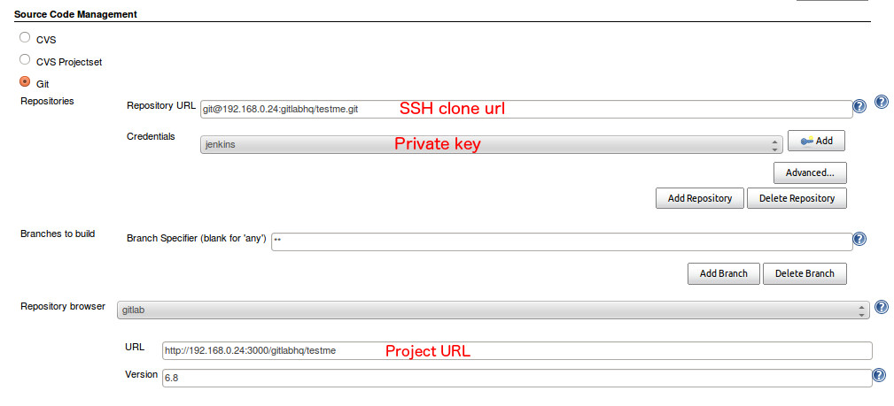

# Jenkins CI integration

GitLab can be configured to interact with Jenkins

Integration includes: 

* Trigger Jenkins build after push to repo
* Show build status on Merge Request page

Requirements: 

* Jenkins GitLab Hook plugin
* git clone access for Jenkins from GitLab repo (via ssh key)

## Jenkins

1. Install GitLab Hook plugin
2. Setup jenkins project

## GitLab

### Read access to repository 

Jenkins need read access to GitLab repository. We already specified private key to use in Jenkins. Now we need to add public key to GitLab project

### Jenkins service

Now navigate to GitLab services page and activate Jenkins

Done! Now when you push to GitLab - it will create build for Jenkins. 
And also you will be able to see merge request build statuswith link to Jenkins build.
