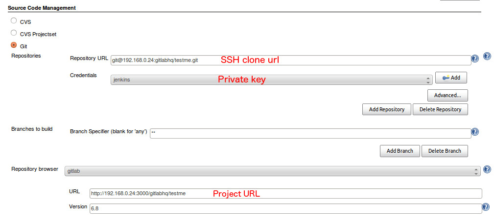
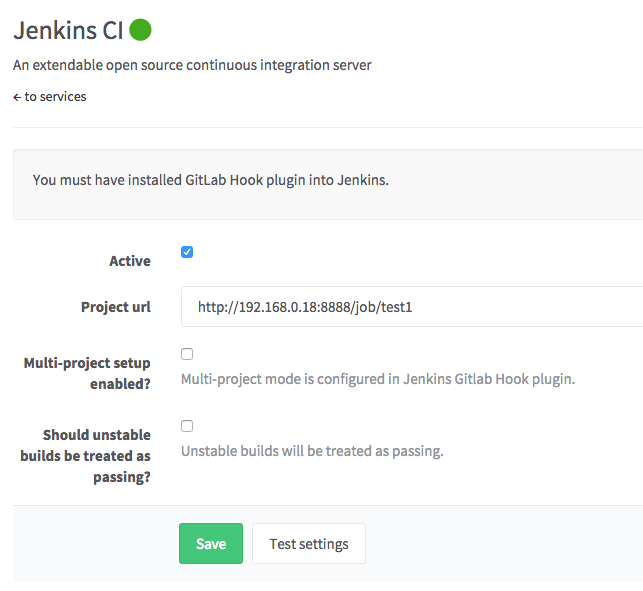

# Jenkins CI (deprecated) service **(FREE)**

NOTE:
In GitLab 8.3, Jenkins integration using the
[GitLab Hook Plugin](https://wiki.jenkins.io/display/JENKINS/GitLab+Hook+Plugin)
was deprecated in favor of the
[GitLab Plugin](https://wiki.jenkins.io/display/JENKINS/GitLab+Plugin).
Please use documentation for the new [Jenkins CI service](jenkins.md).

NOTE:
This service was [removed in v13.0](https://gitlab.com/gitlab-org/gitlab/-/issues/1600)

Integration includes:

- Trigger Jenkins build after push to repository
- Show build status on Merge Request page

Requirements:

- [Jenkins GitLab Hook plugin](https://wiki.jenkins.io/display/JENKINS/GitLab+Hook+Plugin)
- Git clone access for Jenkins from GitLab repository (via SSH key)

## Jenkins

1. Install [GitLab Hook plugin](https://wiki.jenkins.io/display/JENKINS/GitLab+Hook+Plugin)
1. Set up Jenkins project

## GitLab

In GitLab, perform the following steps.

### Read access to repository

Jenkins needs read access to the GitLab repository. We already specified a
private key to use in Jenkins, now we need to add a public one to the GitLab
project. For that case we need a Deploy key. Read the documentation on
[how to set up a Deploy key](../user/project/deploy_keys/index.md).

### Jenkins service

Now navigate to GitLab services page and activate Jenkins

Done! When you push to GitLab, it creates a build for Jenkins. You can view the merge request build status with a link to the Jenkins build.

### Multi-project Configuration

The GitLab Hook plugin in Jenkins supports the automatic creation of a project
for each feature branch. After configuration GitLab triggers feature branch
builds and a corresponding project is created in Jenkins.

Configure the GitLab Hook plugin in Jenkins. Go to 'Manage Jenkins' and then
'Configure System'. Find the 'GitLab Web Hook' section and configure as shown below.
