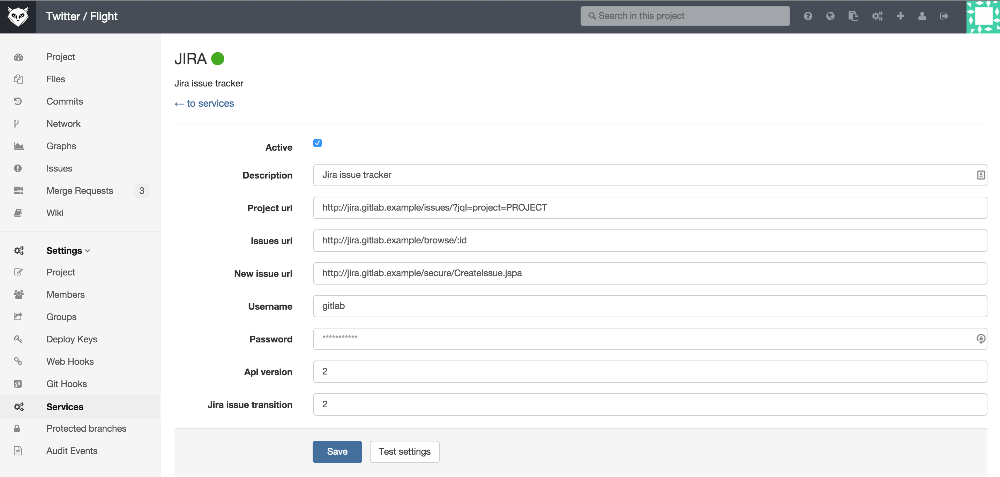

# GitLab Jira integration

GitLab can be configured to interact with Jira.
Configuration happens via username and password.
Connecting to a Jira server via CAS is not possible.

Each project can be configured to connect to a different Jira instance, configuration is explained [here](#configuration).
If you have one Jira instance you can pre-fill the settings page with a default template. To configure the template [see external issue tracker document](external-issue-tracker.md#service-template)).

Once the project is connected to Jira, you can reference and close the issues in Jira directly from GitLab.


## Table of Contents

* [Referencing Jira Issues from GitLab](#referencing-jira-issues)
* [Closing Jira Issues from GitLab](#closing-jira-issues)
* [Configuration](#configuration)

### Referencing Jira Issues

When GitLab project has Jira issue tracker configured and enabled, mentioning Jira issue in GitLab will automatically add a comment in Jira issue with the link back to GitLab. This means that in comments in merge requests and commits referencing an issue, eg. `PROJECT-7`, will add a comment in Jira issue in the format:


```
 USER mentioned this issue in LINK_TO_THE_MENTION
```

* `USER` A user that mentioned the issue. This is the link to the user profile in GitLab.
* `LINK_TO_THE_MENTION` Link to the origin of mention with a name of the entity where Jira issue was mentioned.
Can be commit or merge request.


### Closing Jira Issues

Jira issues can be closed directly from GitLab by using trigger words, eg. `Resolves PROJECT-1`, `Closes PROJECT-1` or `Fixes PROJECT-1`, in commits and merge requests.
When a commit which contains the trigger word in the commit message is pushed, GitLab will add a comment in the mentioned Jira issue.

For example, for project named PROJECT in Jira, we implemented a new feature and created a merge request in GitLab.

This feature was requested in Jira issue PROJECT-7. Merge request in GitLab contains the improvement and in merge request description we say that this merge request `Closes PROJECT-7` issue.

Once this merge request is merged, Jira issue will be automatically closed with a link to the commit that resolved the issue.


## Configuration

### Configuring JIRA

We need to create a user in JIRA which will have access to all projects that need to integrate with GitLab.
Login to your JIRA instance as admin and under Administration go to User Management and create a new user.
As an example, we'll create a user named `gitlab` and add it to `jira-developers` group.

**It is important that the user `gitlab` has write-access to projects in JIRA**

### Configuring GitLab

### GitLab 7.8 EE and up with JIRA v6.x

To enable JIRA integration in a project, navigate to the project Settings page and go to Services. Here you will find JIRA.

Fill in the required details on the page:



* `description` A name for the issue tracker (to differentiate between instances, for instance).
* `project url` The URL to the JIRA project which is being linked to this GitLab project.
* `issues url` The URL to the JIRA project issues overview for the project that is linked to this GitLab project.
* `new issue url` This is the URL to create a new issue in JIRA for the project linked to this GitLab project.
* `api url` The base URL of the JIRA API. It may be omitted, in which case GitLab will automatically use API version `2` based on the `project url`, i.e. `https://jira.example.com/rest/api/2`.
* `username` The username of the user created in [configuring JIRA step](#configuring-jira).
* `password` The password of the user created in [configuring JIRA step](#configuring-jira).
* `Jira issue transition` This is the id of a transition that moves issues to a closed state. You can find this number under [JIRA workflow administration, see screenshot](jira_workflow_screenshot.png).  By default, this id is `2`. (In the example image, this is `2` as well)

After saving the configuration, your GitLab project will be able to interact with the linked JIRA project.


### GitLab 6.x-7.7 with JIRA v6.x

**Note: GitLab 7.8 and up contain various integration improvements. We strongly recommend upgrading.**


In `gitlab.yml` enable [JIRA issue tracker section by uncommenting the lines](https://gitlab.com/subscribers/gitlab-ee/blob/6-8-stable-ee/config/gitlab.yml.example#L111-115).
This will make sure that all issues within GitLab are pointing to the JIRA issue tracker.

We can also enable JIRA service that will allow us to interact with JIRA issues.

For example, we can close issues in JIRA by a commit in GitLab.

Go to project settings page and fill in the project name for the JIRA project:


Next, go to the services page and find JIRA.


1. Tick the active check box to enable the service.
1. Supply the url to JIRA server, for example http://jira.sample
1. Supply the username of a user we created under `Configuring JIRA` section, for example `gitlab`
1. Supply the password of the user
1. Optional: supply the JIRA api version, default is version
1. Optional: supply the JIRA issue transition ID (issue transition to closed). This is dependant on JIRA settings, default is 2
1. Save

Now we should be able to interact with JIRA issues.
