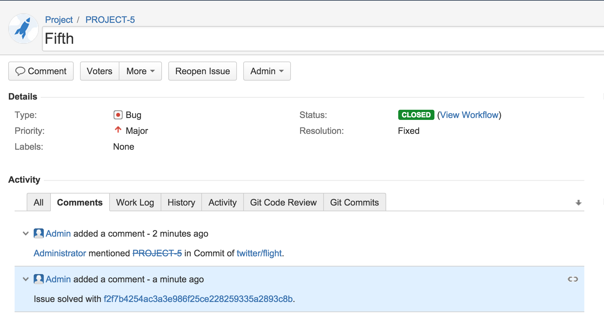

# GitLab JIRA integration

GitLab can be configured to interact with JIRA.

## Configuring JIRA

We need to create a user in JIRA which will have access to all projects that need to integrate with GitLab.
Login to your JIRA instance as admin and under Administration go to User Management and create a new user.
As an example, we'll create a user named `gitlab` and add it to `jira-developers` group.

**It is important that the user `gitlab` has write-access to projects in JIRA**

## Configuring GitLab

### GitLab 7.8 EE and up with JIRA v6.x

To enable JIRA integration in a project, navigate to the project Settings page and go to Services. Here you will find JIRA.

Fill in the required details on the page:

* `description` A name for the issue tracker (to differentiate between instances, for instance).
* `project url` The URL to the JIRA project which is being linked to this GitLab project.
* `issues url` The URL to the JIRA project issues overview for the project that is linked to this GitLab project.
* `new issue url` This is the URL to create a new issue in JIRA for the project linked to this GitLab project.
* `username` The username of the user created in [configuring JIRA step](#configuring-jira).
* `password` The password of the user created in [configuring JIRA step](#configuring-jira).
* `api version` The version of the JIRA API. By default, version `2` is used.
* `Jira issue transition` This is the id of a transition that moves issues to a closed state. You can find this number under [JIRA workflow administration](jira_workflow_screenshot.png).  By default, this id is `2`. (In the example image, this is `2` as well)

After saving the configuration, your GitLab project will be able to interact with the linked JIRA project.

This will allow users to mention JIRA issues in comments in merge requests and comments on commits by mentioning the issue as such:
`PROJECT-5`.

You can close JIRA issues by writing `Resolves PROJECT-5` or `Closes PROJECT-5` in commits and merge requests. After pushing the commit or merging the merge request, the referenced JIRA issue will be automatically closed.

### GitLab 6.x-7.7 with JIRA v6.x

In `gitlab.yml` enable [JIRA issue tracker section by uncommenting the lines](https://gitlab.com/subscribers/gitlab-ee/blob/6-8-stable-ee/config/gitlab.yml.example#L111-115).
This will make sure that all issues within GitLab are pointing to the JIRA issue tracker.

We can also enable JIRA service that will allow us to interact with JIRA issues.

For example, we can close issues in JIRA by a commit in GitLab.

Go to project settings page and fill in the project name for the JIRA project:

Next, go to the services page and find JIRA.

1. Tick the active check box to enable the service.
1. Supply the url to JIRA server, for example http://jira.sample
1. Supply the username of a user we created under `Configuring JIRA` section, for example `gitlab`
1. Supply the password of the user
1. Optional: supply the JIRA api version, default is version
1. Optional: supply the JIRA issue transition ID (issue transition to closed). This is dependant on JIRA settings, default is 2
1. Save

Now we should be able to interact with JIRA issues, for example we can close a JIRA issue by commiting to our GitLab repository and referencing the JIRA issue( in the format of JIRAPROJECT-123).

For example, for project named NEW we commit with a commit message `Add new file fixes NEW-1`:

That will close an issue NEW-1 in JIRA and add a comment with a link to the commit that closed the issue:

