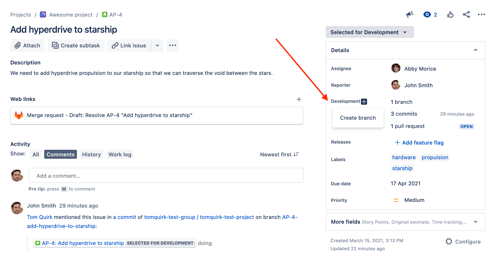
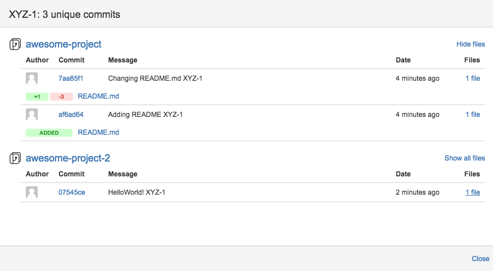
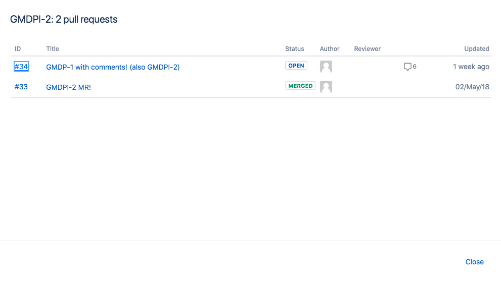

# GitLab Jira Development panel integration **(FREE)**

> - [Moved](https://gitlab.com/gitlab-org/gitlab/-/issues/233149) to GitLab Free in 13.4.

With the Jira Development panel integration, you can reference Jira issues in GitLab.
When configured, activity (such as pipeline, deployment, and feature flags) displays in the Jira issue's
[Development panel](https://support.atlassian.com/jira-software-cloud/docs/view-development-information-for-an-issue/).
From the Development panel, you can open a detailed view and
[take various actions](#use-the-integration), including creating a new merge request from a branch:

The information displayed in the Jira Development panel depends on where you mention the Jira issue ID:

| Your mention of Jira issue ID in GitLab context   | Automated effect in Jira issue                                                                         |
|---------------------------------------------------|--------------------------------------------------------------------------------------------------------|
| In a merge request                                | Link to the MR is displayed in Development panel.                                                      |
| In a branch name                                  | Link to the branch is displayed in Development panel.                                                  |
| In a commit message                               | Link to the commit is displayed in Development panel.                                                  |
| In a commit message with Jira [Smart Commits](https://confluence.atlassian.com/fisheye/using-smart-commits-960155400.html) | Displays your custom comment or logged time spent and/or performs specified issue transition on merge. |

This integration connects all GitLab projects to projects in the Jira instance in either:

- A top-level GitLab group: Connects the projects in a group with no parent group,
  including the projects in its subgroups.
- A personal namespace: Connects the projects in that personal namespace to Jira.

## Use the integration

After the integration is [set up on GitLab and Jira](#configure-the-integration), you can:

- Refer to any Jira issue by its ID (in uppercase) in GitLab branch names,
  commit messages, and merge request titles.
- See the linked branches, commits, and merge requests in Jira issues:

At this time, merge requests are called "pull requests" in Jira issues.
This name may change in a future Jira release.

Select the links to see your GitLab repository data.

### Use Jira Smart Commits

With Jira [Smart Commits](https://confluence.atlassian.com/fisheye/using-smart-commits-960155400.html),
you can use GitLab to add Jira comments, log time spent on the issue, or apply any issue transition.

For more information about using Jira Smart Commits to track time against an issue, specify
an issue transition, or add a custom comment, read the Atlassian page
[Using Smart Commits](https://confluence.atlassian.com/fisheye/using-smart-commits-960155400.html).

## Configure the integration

<i class="fa fa-youtube-play youtube" aria-hidden="true"></i>
For an overview of how to configure Jira Development panel integration, see
[Agile Management - GitLab Jira Development panel integration](https://www.youtube.com/watch?v=VjVTOmMl85M).

To simplify administration, we recommend that a GitLab group maintainer or group owner
(or instance administrator in the case of self-managed GitLab) set up the integration.

| Jira usage | GitLab.com customers need | GitLab self-managed customers need |
|------------|---------------------------|------------------------------------|
| [Atlassian cloud](https://www.atlassian.com/cloud) | The [GitLab.com for Jira Cloud](https://marketplace.atlassian.com/apps/1221011/gitlab-com-for-jira-cloud?hosting=cloud&tab=overview) application installed from the [Atlassian Marketplace](https://marketplace.atlassian.com). This offers real-time sync between GitLab and Jira. | The [GitLab.com for Jira Cloud](https://marketplace.atlassian.com/apps/1221011/gitlab-com-for-jira-cloud?hosting=cloud&tab=overview), using a workaround process. See the documentation for [installing the GitLab Jira Cloud application for self-managed instances](connect-app.md#install-the-gitlabcom-for-jira-cloud-app-for-self-managed-instances) for more information. |
| Your own server | The Jira DVCS (distributed version control system) connector. This syncs data hourly. | The [Jira DVCS Connector](dvcs.md). |

Each GitLab project can be configured to connect to an entire Jira instance. That means after
configuration, one GitLab project can interact with all Jira projects in that instance. For:

- The [view Jira issues](issues.md#view-jira-issues) feature **(PREMIUM)**, you must associate a GitLab project with a
  specific Jira project.
- Other features, you do not have to explicitly associate a GitLab project with any single Jira
  project.

If you have a single Jira instance, you can pre-fill the settings. For more information, read the
documentation for [central administration of project integrations](../../user/admin_area/settings/project_integration_management.md).

To enable the integration in GitLab, you must:

1. [Configure the project in Jira](index.md#jira-integration).
   The supported Jira versions are `v6.x`, `v7.x`, and `v8.x`.
1. [Enter the correct values in GitLab](#configure-gitlab).

### Configure GitLab

To enable the integration in your GitLab project, after you
[configure your Jira project](index.md#jira-integration):

1. Ensure your GitLab installation does not use a relative URL, as described in
   [Limitations](#limitations).
1. Go to your project and select [**Settings > Integrations**](../../user/project/integrations/overview.md#accessing-integrations).
1. Select **Jira**.
1. Select **Enable integration**.
1. Select **Trigger** actions. Your choice determines whether a mention of Jira issue
   (in a GitLab commit, merge request, or both) creates a cross-link in Jira back to GitLab.
1. To comment in the Jira issue when a **Trigger** action is made in GitLab, select
   **Enable comments**.
1. To transition Jira issues when a
   [closing reference](../../user/project/issues/managing_issues.md#closing-issues-automatically)
   is made in GitLab, select **Enable Jira transitions**.
1. Provide Jira configuration information:
   - **Web URL**: The base URL to the Jira instance web interface you're linking to
     this GitLab project, such as `https://jira.example.com`.
   - **Jira API URL**: The base URL to the Jira instance API, such as `https://jira-api.example.com`.
     Defaults to the **Web URL** value if not set. Leave blank if using **Jira on Atlassian cloud**.
   - **Username or Email**:
     For **Jira Server**, use `username`. For **Jira on Atlassian cloud**, use `email`.
     See [authentication in Jira](index.md#authentication-in-jira).
   - **Password/API token**:
     Use `password` for **Jira Server** or `API token` for **Jira on Atlassian cloud**.
     See [authentication in Jira](index.md#authentication-in-jira).
1. To enable users to view Jira issues inside the GitLab project **(PREMIUM)**, select **Enable Jira issues** and
   enter a Jira project key.

   You can display issues only from a single Jira project in a given GitLab project.

   WARNING:
   If you enable Jira issues with this setting, all users with access to this GitLab project
   can view all issues from the specified Jira project.

1. To enable issue creation for vulnerabilities **(ULTIMATE)**, select **Enable Jira issues creation from vulnerabilities**.
1. Select the **Jira issue type**. If the dropdown is empty, select refresh (**{retry}**) and try again.
1. To verify the Jira connection is working, select **Test settings**.
1. Select **Save changes**.

Your GitLab project can now interact with all Jira projects in your instance and the project now
displays a Jira link that opens the Jira project.

## Limitations

This integration is not supported on GitLab instances under a
[relative URL](https://docs.gitlab.com/omnibus/settings/configuration.html#configuring-a-relative-url-for-gitlab).
For example, `http://example.com/gitlab`.

## Related topics

- [Using Smart Commits](https://confluence.atlassian.com/fisheye/using-smart-commits-960155400.html) in Jira

## Troubleshooting

### Cookies for Oracle's Access Manager

To support Oracle's Access Manager, GitLab sends additional cookies
to enable Basic Auth. The cookie being added to each request is `OBBasicAuth` with
a value of `fromDialog`.
