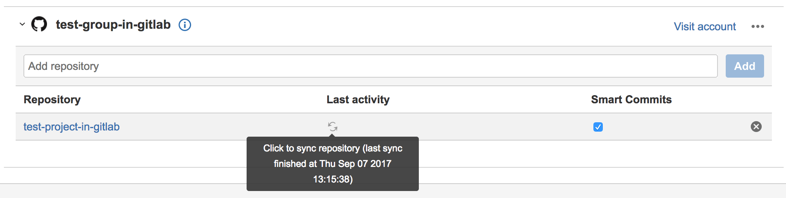

# Jira DVCS connector **(FREE)**

Use the Jira DVCS (distributed version control system) connector if you self-host
your Jira instance, and you want to sync information
between GitLab and Jira. If you use Jira Cloud and GitLab.com, you should use the
[GitLab.com for Jira Cloud app](connect-app.md) unless you specifically need the DVCS connector.

When you configure the Jira DVCS connector, make sure your GitLab and Jira instances
are accessible.

- **Self-managed GitLab**: Your GitLab instance must be accessible by Jira.
- **Jira Cloud**: Your instance must be accessible through the internet.
- **Jira Server**: Your network must allow access to your instance.

## Smart commits

When connecting GitLab with Jira with DVCS, you can process your Jira issues using
special commands, called
[Smart Commits](https://support.atlassian.com/jira-software-cloud/docs/process-issues-with-smart-commits/),
in your commit messages. With Smart Commits, you can:

- Comment on issues.
- Record time-tracking information against issues.
- Transition issues to any status defined in the Jira project's workflow.

Commands must be in the first line of the commit message. The
[Jira Software documentation](https://support.atlassian.com/jira-software-cloud/docs/process-issues-with-smart-commits/)
contains more information about how Smart Commits work, and what commands are available
for your use.

For Smart Commits to work, the committing user on GitLab must have a corresponding
user on Jira with the same email address or username.

### Smart Commit syntax

Smart Commits should follow the pattern of:

```plaintext
<ISSUE_KEY> <ignored text> #<command> <optional command parameters>
```

Some examples:

- Adding a comment to a Jira issue: `KEY-123 fixes a bug #comment Bug is fixed.`
- Recording time tracking: `KEY-123 #time 2w 4d 10h 52m Tracking work time.`
- Closing an issue: `KEY-123 #close Closing issue`

A Smart Commit message must not span more than one line (no carriage returns) but
you can still perform multiple actions in a single commit:

- Time tracking, commenting, and transitioning to **Closed**:
  `KEY-123 #time 2d 5h #comment Task completed ahead of schedule #close`.
- Commenting, transitioning to **In-progress**, and time tracking:
  `KEY-123 #comment started working on the issue #in-progress #time 12d 5h`.

## Configure a GitLab application for DVCS

We recommend you create and use a `jira` user in GitLab, and use the account only
for integration work. A separate account ensures regular account maintenance does not affect
your integration.

1. In GitLab, [create a user](../../user/profile/account/create_accounts.md) for Jira to
   use to connect to GitLab. For Jira to access all projects,
   a user with [administrator](../../user/permissions.md) permissions must
   create the user with administrator permissions.
1. Sign in as the `jira` user.
1. In the top right corner, click the account's avatar, and select **Edit profile**.
1. In the left sidebar, select **Applications**.
1. In the **Name** field, enter a descriptive name for the integration, such as `Jira`.
1. In the **Redirect URI** field, enter the URI appropriate for your version of GitLab,
   replacing `<gitlab.example.com>` with your GitLab instance domain:
   - *For GitLab versions 13.0 and later* **and** *Jira versions 8.14 and later,* use the
     generated `Redirect URL` from
     [Linking GitLab accounts with Jira](https://confluence.atlassian.com/adminjiraserver/linking-gitlab-accounts-1027142272.html).
   - *For GitLab versions 13.0 and later* **and** *Jira Cloud,* use `https://<gitlab.example.com>/login/oauth/callback`.  
   - *For GitLab versions 11.3 and later,* use `https://<gitlab.example.com>/login/oauth/callback`.
     If you use GitLab.com, the URL is `https://gitlab.com/login/oauth/callback`.
   - *For GitLab versions 11.2 and earlier,* use
     `https://<gitlab.example.com>/-/jira/login/oauth/callback`.

1. For **Scopes**, select `api` and clear any other checkboxes.
1. Select **Submit**.
1. GitLab displays the generated **Application ID**
   and **Secret** values. Copy these values, as you need them to configure Jira.

## Configure Jira for DVCS

Configure this connection when you want to import all GitLab commits and branches,
for the groups you specify, into Jira. This import takes a few minutes and, after
it completes, refreshes every 60 minutes:

1. Ensure you have completed the [GitLab configuration](#configure-a-gitlab-application-for-dvcs).
1. Go to your DVCS accounts:
   - *For Jira Server,* go to **Settings (gear) > Applications > DVCS accounts**.
   - *For Jira Cloud,* go to **Settings (gear) > Products > DVCS accounts**.
1. To create a new integration, select the appropriate value for **Host**:
   - *For Jira versions 8.14 and later:* Select **GitLab** or
     **GitLab Self-Managed**.
   - *For Jira versions 8.13 and earlier:* Select **GitHub Enterprise**.
1. For **Team or User Account**, enter either:
   - *For Jira versions 8.14 and later:*
      - The relative path of a top-level GitLab group that you have access to.
   - *For Jira versions 8.13 and earlier:*
      - The relative path of a top-level GitLab group that you have access to.
      - The relative path of your personal namespace.

1. In the **Host URL** field, enter the URI appropriate for your version of GitLab,
   replacing `<gitlab.example.com>` with your GitLab instance domain:
   - *For GitLab versions 11.3 and later,* use `https://<gitlab.example.com>`.
   - *For GitLab versions 11.2 and earlier,* use
     `https://<gitlab.example.com>/-/jira`.

1. For **Client ID**, use the **Application ID** value from the previous section.
1. For **Client Secret**, use the **Secret** value from the previous section.
1. Ensure that the rest of the checkboxes are checked.
1. Select **Add** and then **Continue** to create the DVCS account.
1. Jira redirects to GitLab where you have to confirm the authorization,
   and then GitLab redirects back to Jira where you should see the synced
   projects show up inside the new account.

To connect additional GitLab projects from other GitLab top-level groups, or
personal namespaces, repeat the previous steps with additional Jira DVCS accounts.

After you configure the integration, read more about [how to test and use it](development_panel.md).

## Refresh data imported to Jira

Jira imports the commits and branches every 60 minutes for your projects. You
can refresh the data manually from the Jira interface:

1. Sign in to your Jira instance as the user you configured the integration with.
1. Go to **Settings (gear) > Applications**.
1. Select **DVCS accounts**.
1. In the table, for the repository you want to refresh, in the **Last Activity**
   column, select the icon:
   

## Troubleshooting your DVCS connection

Refer to the items in this section if you're having problems with your DVCS connector.

### Jira cannot access GitLab server

If you complete the **Add New Account** form, authorize access, and you receive
this error, Jira and GitLab cannot connect. No other error messages
appear in any logs:

```plaintext
Error obtaining access token. Cannot access https://gitlab.example.com from Jira.
```

### SSL and TLS problems

Problems with SSL and TLS can cause this error message:

```plaintext
Error obtaining access token. Cannot access https://gitlab.example.com from Jira.
```

- The [GitLab Jira integration](index.md) requires
  GitLab to connect to Jira. Any TLS issues that arise from a private certificate
  authority or self-signed certificate are resolved
  [on the GitLab server](https://docs.gitlab.com/omnibus/settings/ssl.html#other-certificate-authorities),
  as GitLab is the TLS client.
- The Jira Development panel integration requires Jira to connect to GitLab, which
  causes Jira to be the TLS client. If your GitLab server's certificate is not
  issued by a public certificate authority, the Java Truststore on Jira's server
  must have the appropriate certificate (such as your organization's
  root certificate) added to it .

Refer to Atlassian's documentation and Atlassian Support for assistance setting up Jira correctly:

- [Add a certificate](https://confluence.atlassian.com/kb/how-to-import-a-public-ssl-certificate-into-a-jvm-867025849.html)
  to the trust store.
  - The simplest approach is [`keytool`](https://docs.oracle.com/javase/8/docs/technotes/tools/unix/keytool.html).
  - Add additional roots to Java's default Truststore (`cacerts`) to allow Jira to
    also trust public certificate authorities.
  - If the integration stops working after upgrading Jira's Java runtime, the
    `cacerts` Truststore may have been replaced during the upgrade.

- Troubleshooting connectivity [up to and including TLS handshaking](https://confluence.atlassian.com/kb/unable-to-connect-to-ssl-services-due-to-pkix-path-building-failed-error-779355358.html),
  using the a java class called `SSLPoke`.
- Download the class from Atlassian's knowledge base to a directory on Jira's server, such as `/tmp`.
- Use the same Java runtime as Jira.
- Pass all networking-related parameters that Jira is called with, such as proxy
  settings or an alternative root Truststore (`-Djavax.net.ssl.trustStore`):

```shell
${JAVA_HOME}/bin/java -Djavax.net.ssl.trustStore=/var/atlassian/application-data/jira/cacerts -classpath /tmp SSLPoke gitlab.example.com 443
```

The message `Successfully connected` indicates a successful TLS handshake.

If there are problems, the Java TLS library generates errors that you can
look up for more detail.

### Scope error when connecting Jira via DVCS

```plaintext
The requested scope is invalid, unknown, or malformed.
```

Potential resolutions:

1. Verify that the URL shown in the browser after being redirected from Jira in the
   [Jira DVCS connector setup](#configure-jira-for-dvcs) includes `scope=api` in
   the query string.
1. If `scope=api` is missing from the URL, edit the
   [GitLab account configuration](#configure-a-gitlab-application-for-dvcs). Review
   the **Scopes** field and ensure the `api` check box is selected.

### Jira error adding account and no repositories listed

After you complete the **Add New Account** form in Jira and authorize access, you might
encounter these issues:

- An `Error! Failed adding the account: [Error retrieving list of repositories]` error.
- An `Account is already integrated with JIRA` error when you click **Try Again**.
- An account is visible in the DVCS accounts view, but no repositories are listed.

To resolve this issue:

- If you're using GitLab Free, be sure you're using GitLab 13.4 or later.
- If you're using GitLab versions 11.10-12.7, upgrade to GitLab 12.8.10 or later
  to resolve [an identified issue](https://gitlab.com/gitlab-org/gitlab/-/issues/37012).

[Contact GitLab Support](https://about.gitlab.com/support/) if none of these reasons apply.

### Fix synchronization issues

If Jira displays incorrect information, such as deleted branches, you may need to
resynchronize the information. To do so:

1. In Jira, go to **Jira Administration > Applications > DVCS accounts**.
1. At the account (group or subgroup) level, Jira displays an option to
   **Refresh repositories** in the **{ellipsis_h}** (ellipsis) menu.
1. For each project, there's a sync button displayed next to the **last activity** date.
   - To perform a *soft resync*, click the button.
   - To complete a *full sync*, shift-click the button.

For more information, read
[Atlassian's documentation](https://support.atlassian.com/jira-cloud-administration/docs/synchronize-jira-cloud-to-bitbucket/).
