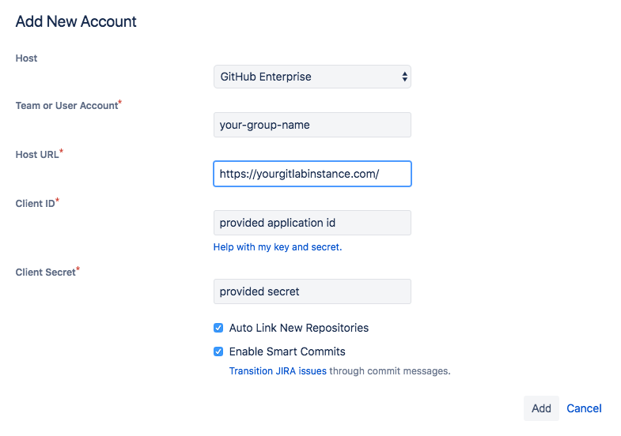

# Jira DVCS connector

If you're using GitLab.com and Jira Cloud, use the
[GitLab for Jira app](connect-app.md) unless you have a specific need for the DVCS Connector.

When configuring Jira DVCS Connector:

- If you are using self-managed GitLab, make sure your GitLab instance is accessible by Jira.
- If you're connecting to Jira Cloud, ensure your instance is accessible through the internet.
- If you are using Jira Server, make sure your instance is accessible however your network is set up.

## GitLab account configuration for DVCS

NOTE:
To ensure that regular user account maintenance doesn't impact your integration,
create and use a single-purpose `jira` user in GitLab.

1. In GitLab, create a new application to allow Jira to connect with your GitLab account.
1. Sign in to the GitLab account that you want Jira to use to connect to GitLab.
1. In the top-right corner, select your avatar.
1. Select **Edit profile**.
1. In the left sidebar, select **Applications**.
1. In the **Name** field, enter a descriptive name for the integration, such as `Jira`.
1. In the **Redirect URI** field, enter `https://<gitlab.example.com>/login/oauth/callback`,
   replacing `<gitlab.example.com>` with your GitLab instance domain. For example, if you are using GitLab.com,
   this would be `https://gitlab.com/login/oauth/callback`.

   NOTE:
   If using a GitLab version earlier than 11.3, the `Redirect URI` must be
   `https://<gitlab.example.com>/-/jira/login/oauth/callback`. If you want Jira
   to have access to all projects, GitLab recommends that an administrator create the
   application.

   

1. Check **API** in the **Scopes** section, and clear any other checkboxes.
1. Click **Save application**. GitLab displays the generated **Application ID**
   and **Secret** values. Copy these values, which you use in Jira.

## Jira DVCS Connector setup

If you're using GitLab.com and Jira Cloud, use the
[GitLab for Jira app](connect-app.md) unless you have a specific need for the DVCS Connector.

1. Ensure you have completed the [GitLab configuration](#gitlab-account-configuration-for-dvcs).
1. If you're using Jira Server, go to **Settings (gear) > Applications > DVCS accounts**.
   If you're using Jira Cloud, go to **Settings (gear) > Products > DVCS accounts**.
1. Click **Link GitHub Enterprise account** to start creating a new integration.
   (We're pretending to be GitHub in this integration, until there's additional platform support in Jira.)
1. Complete the form:

1. Select **GitHub Enterprise** for the **Host** field.

1. In the **Team or User Account** field, enter either:

   - The relative path of a top-level GitLab group that you have access to.
   - The relative path of your personal namespace.

   

1. In the **Host URL** field, enter `https://<gitlab.example.com>/`,
   replacing `<gitlab.example.com>` with your GitLab instance domain. For example, if you are using GitLab.com,
   this would be `https://gitlab.com/`.

   NOTE:
   If using a GitLab version earlier than 11.3 the **Host URL** value should be `https://<gitlab.example.com>/-/jira`

1. For the **Client ID** field, use the **Application ID** value from the previous section.

1. For the **Client Secret** field, use the **Secret** value from the previous section.

1. Ensure that the rest of the checkboxes are checked.

1. Click **Add** to complete and create the integration.

 Jira takes up to a few minutes to know about (import behind the scenes) all the commits and branches
 for all the projects in the GitLab group you specified in the previous step. These are refreshed
 every 60 minutes.

 In the future, we plan on implementing real-time integration. If you need
 to refresh the data manually, you can do this from the `Applications -> DVCS
 accounts` screen where you initially set up the integration:

 

To connect additional GitLab projects from other GitLab top-level groups (or personal namespaces), repeat the previous
steps with additional Jira DVCS accounts.

Now that the integration is configured, read more about how to test and use it in [Usage](index.md#usage).

## Troubleshooting your DVCS connection

Refer to the items in this section if you're having problems with your DVCS connector.

### Jira cannot access GitLab server

```plaintext
Error obtaining access token. Cannot access https://gitlab.example.com from Jira.
```

This error message is generated in Jira, after completing the **Add New Account**
form and authorizing access. It indicates a connectivity issue from Jira to
GitLab. No other error messages appear in any logs.

If there was an issue with SSL/TLS, this error message is generated.

- The [GitLab Jira integration](../../user/project/integrations/jira.md) requires GitLab to connect to Jira. Any
  TLS issues that arise from a private certificate authority or self-signed
  certificate [are resolved on the GitLab server](https://docs.gitlab.com/omnibus/settings/ssl.html#other-certificate-authorities),
  as GitLab is the TLS client.
- The Jira Development panel integration requires Jira to connect to GitLab, which
  causes Jira to be the TLS client. If your GitLab server's certificate is not
  issued by a public certificate authority, the Java Truststore on Jira's server
  needs to have the appropriate certificate added to it (such as your organization's
  root certificate).

Refer to Atlassian's documentation and Atlassian Support for assistance setting up Jira correctly:

- [Adding a certificate to the trust store](https://confluence.atlassian.com/kb/how-to-import-a-public-ssl-certificate-into-a-jvm-867025849.html).
  - Simplest approach is to use [`keytool`](https://docs.oracle.com/javase/8/docs/technotes/tools/unix/keytool.html).
  - Add additional roots to Java's default Truststore (`cacerts`) to allow Jira to
    also trust public certificate authorities.
  - If the integration stops working after upgrading Jira's Java runtime, this
    might be because the `cacerts` Truststore got replaced.

- [Troubleshooting connectivity up to and including TLS handshaking](https://confluence.atlassian.com/kb/unable-to-connect-to-ssl-services-due-to-pkix-path-building-failed-error-779355358.html),
  using the a java class called `SSLPoke`.

- Download the class from Atlassian's knowledge base to Jira's server, for example to `/tmp`.
- Use the same Java runtime as Jira.
- Pass all networking-related parameters that Jira is called with, such as proxy
  settings or an alternative root Truststore (`-Djavax.net.ssl.trustStore`):

```shell
${JAVA_HOME}/bin/java -Djavax.net.ssl.trustStore=/var/atlassian/application-data/jira/cacerts -classpath /tmp SSLPoke gitlab.example.com 443
```

The message `Successfully connected` indicates a successful TLS handshake.

If there are problems, the Java TLS library generates errors that you can
look up for more detail.

### Scope error when connecting Jira via DVCS

```plaintext
The requested scope is invalid, unknown, or malformed.
```

Potential resolutions:

- Verify the URL shown in the browser after being redirected from Jira in step 5 of [Jira DVCS Connector Setup](#jira-dvcs-connector-setup) includes `scope=api` in the query string.
- If `scope=api` is missing from the URL, return to [GitLab account configuration](#gitlab-account-configuration-for-dvcs) and ensure the application you created in step 1 has the `api` box checked under scopes.

### Jira error adding account and no repositories listed

```plaintext
Error!
Failed adding the account: [Error retrieving list of repositories]
```

This error message is generated in Jira after completing the **Add New Account**
form in Jira and authorizing access. Attempting to click **Try Again** returns
`Account is already integrated with JIRA.` The account is set up in the DVCS
accounts view, but no repositories are listed.

Potential resolutions:

- If you're using GitLab versions 11.10-12.7, upgrade to GitLab 12.8.10 or later
  to resolve an identified [issue](https://gitlab.com/gitlab-org/gitlab/-/issues/37012).
- If you're using GitLab Free, be sure you're using GitLab 13.4 or later.

[Contact GitLab Support](https://about.gitlab.com/support/) if none of these reasons apply.

### Fixing synchronization issues

If Jira displays incorrect information (such as deleted branches), you may need to
resynchronize the information. To do so:

1. In Jira, go to **Jira Administration > Applications > DVCS accounts**.
1. At the account (group or subgroup) level, Jira displays an option to
   **Refresh repositories** in the `...` (ellipsis) menu.
1. For each project, there's a sync button displayed next to the **last activity** date.
   To perform a *soft resync*, click the button, or complete a *full sync* by shift clicking
   the button. For more information, see
   [Atlassian's documentation](https://support.atlassian.com/jira-cloud-administration/docs/synchronize-jira-cloud-to-bitbucket/).
