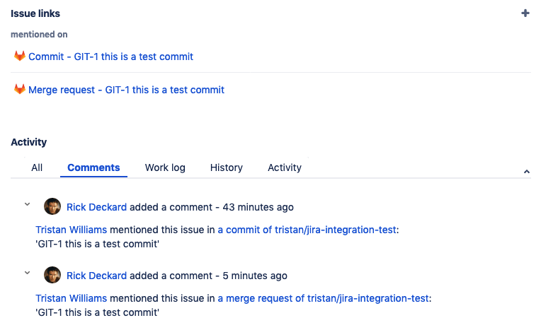
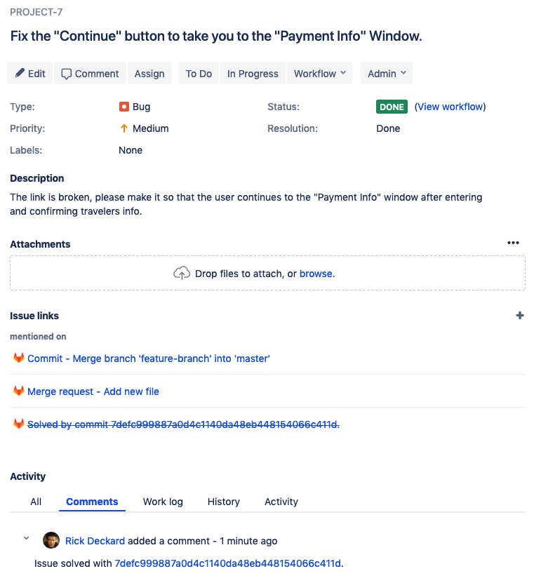
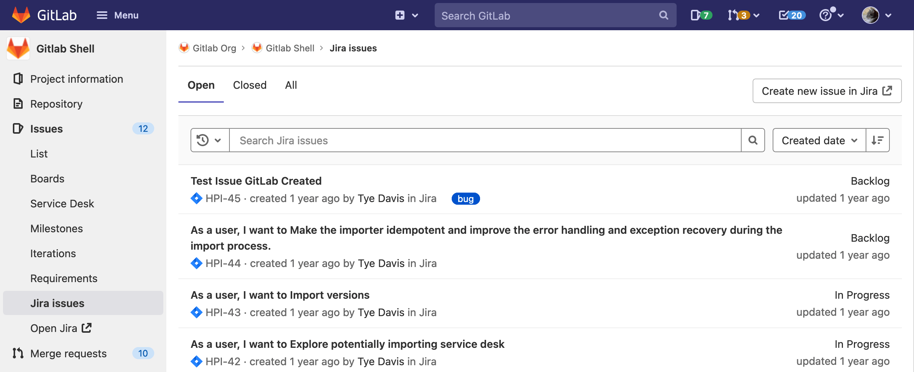
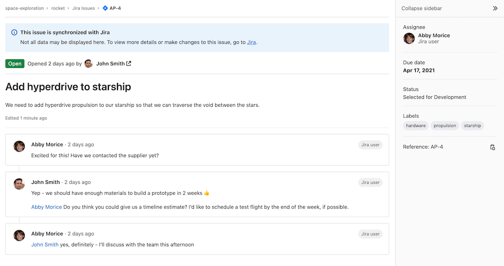

# Jira issue management **(FREE)**

You can [manage Jira issues directly in GitLab](configure.md).
You can then refer to Jira issues by ID in GitLab commits and merge requests.
The Jira issue IDs must be in uppercase.

## Reference Jira issues

With this integration, you can cross-reference Jira issues while you work in
GitLab issues and merge requests. Mention a Jira issue in a GitLab issue,
merge request, or comment, and GitLab adds a formatted comment to the Jira issue.
The comment links back to your work in GitLab.

For example, this commit references the Jira issue `GIT-1`:

```shell
git commit -m "GIT-1 this is a test commit"
```

GitLab adds a reference to the **Issue Links** section of Jira issue `GIT-1`:



GitLab also adds a comment to the issue, and uses this format:

```plaintext
USER mentioned this issue in RESOURCE_NAME of [PROJECT_NAME|COMMENTLINK]:
ENTITY_TITLE
```

- `USER`: The name of the user who mentioned the issue, linked to their GitLab user profile.
- `COMMENTLINK`: A link to where the Jira issue was mentioned.
- `RESOURCE_NAME`: The type of resource, such as a commit or merge request, which referenced the issue.
- `PROJECT_NAME`: The GitLab project name.
- `ENTITY_TITLE`: The title of the merge request, or the first line of the commit.

You can [disable comments](#disable-comments-on-jira-issues) on issues.

### Require associated Jira issue for merge requests to be merged **(ULTIMATE)**

> - [Introduced](https://gitlab.com/gitlab-org/gitlab/-/issues/280766) in GitLab 13.12 [with a flag](../../administration/feature_flags.md) named `jira_issue_association_on_merge_request`. Disabled by default.
> - [Generally available](https://gitlab.com/gitlab-org/gitlab/-/issues/335280) in GitLab 14.2. Feature flag `jira_issue_association_on_merge_request` removed.

With this integration, you can prevent merge requests from being merged if they do not refer to a Jira issue.
To enable this feature:

1. On the top bar, select **Main menu > Projects** and find your project.
1. On the left sidebar, select **Settings > Merge requests**.
1. In the **Merge checks** section, select **Require an associated issue from Jira**.
1. Select **Save**.

After you enable this feature, a merge request that doesn't reference an associated
Jira issue can't be merged. The merge request displays the message
**To merge, a Jira issue key must be mentioned in the title or description.**

## Customize Jira issue matching in GitLab

> [Introduced](https://gitlab.com/gitlab-org/gitlab/-/merge_requests/112826) in GitLab 15.10.

You can configure custom rules for how GitLab matches Jira issue keys by defining:

- [A regex pattern](#use-regular-expression)
- [A prefix](#use-a-prefix)

When you don't configure custom rules, the [default behavior](https://gitlab.com/gitlab-org/gitlab/-/blob/710d83af298d8896f2b940faf48a46d2feb4cbaf/lib/gitlab/regex.rb#L552) is used. For more information, see the [RE2 wiki](https://github.com/google/re2/wiki/Syntax).

### Use regular expression

To define a regex pattern for Jira issue keys:

1. On the top bar, select **Main menu > Projects** and find your project.
1. On the left sidebar, select **Settings > Integrations**.
1. Select **Jira**.
1. Go to the **Jira issue matching** section.
1. In the **Jira issue regex** text box, enter a regex pattern.
1. Select **Save changes**.

For more information, see the [Atlassian documentation](https://confluence.atlassian.com/adminjiraserver073/changing-the-project-key-format-861253229.html).

### Use a prefix

To define a prefix for Jira issue keys:

1. On the top bar, select **Main menu > Projects** and find your project.
1. On the left sidebar, select **Settings > Integrations**.
1. Select **Jira**.
1. Go to the **Jira issue matching** section.
1. In the **Jira issue prefix** text box, enter a prefix.
1. Select **Save changes**.

## Close Jira issues in GitLab

If you have configured GitLab transition IDs, you can close a Jira issue directly
from GitLab. Use a trigger word followed by a Jira issue ID in a commit or merge request.
When you push a commit containing a trigger word and Jira issue ID, GitLab:

1. Comments in the mentioned Jira issue.
1. Closes the Jira issue. If the Jira issue has a resolution, it isn't transitioned.

For example, use any of these trigger words to close the Jira issue `PROJECT-1`:

- `Resolves PROJECT-1`
- `Closes PROJECT-1`
- `Fixes PROJECT-1`

The commit or merge request must target your project's [default branch](../../user/project/repository/branches/default.md).
You can change your project's default branch under [project settings](img/jira_project_settings.png).

### Use case for closing issues

Consider this example:

1. A user creates Jira issue `PROJECT-7` to request a new feature.
1. You create a merge request in GitLab to build the requested feature.
1. In the merge request, you add the issue closing trigger `Closes PROJECT-7`.
1. When the merge request is merged:
   - GitLab closes the Jira issue for you:
     
   - GitLab adds a formatted comment to Jira, linking back to the commit that
     resolved the issue. You can [disable comments](#disable-comments-on-jira-issues).

## View Jira issues **(PREMIUM)**

> [Introduced](https://gitlab.com/groups/gitlab-org/-/epics/3622) in GitLab 13.2.

You can browse, search, and view issues from a selected Jira project directly in GitLab,
if your GitLab administrator [has configured it](configure.md).

To do this, in GitLab, go to your project and select **Issues > Jira issues**. The issue list
sorts by **Created date** by default, with the newest issues listed at the top:



- To display the most recently updated issues first, select **Updated date**.
- You can [search and filter](#search-and-filter-the-issues-list) the issues list.
- In GitLab [versions 13.10 and later](https://gitlab.com/gitlab-org/gitlab/-/issues/299832),
  you can select an issue from the list to view it in GitLab:
  

Issues are grouped into tabs based on their
[Jira status](https://confluence.atlassian.com/adminjiraserver070/defining-status-field-values-749382903.html):

- **Open** tab: All issues with a Jira status in any category other than Done.
- **Closed** tab: All issues with a Jira status categorized as Done.
- **All** tab: All issues of any status.

### Search and filter the issues list **(PREMIUM)**

To refine the list of issues, use the search bar to search for any text
contained in an issue summary (title) or description. Use any combination
of these filters:

- To filter issues by `labels`, specify one or more labels as part of the `labels[]`
  parameter in the URL. When using multiple labels, only issues that contain all specified
  labels are listed: `/-/integrations/jira/issues?labels[]=backend&labels[]=feature&labels[]=QA`
- To filter issues by `status`, specify the `status` parameter in the URL:
  `/-/integrations/jira/issues?status=In Progress`
- To filter issues by `reporter`, specify a reporter's Jira display name for the
  `author_username` parameter in the URL: `/-/integrations/jira/issues?author_username=John Smith`
- To filter issues by `assignee`, specify their Jira display name for the
  `assignee_username` parameter in the URL: `/-/integrations/jira/issues?assignee_username=John Smith`

Enhancements to use these filters through the user interface
[are planned](https://gitlab.com/groups/gitlab-org/-/epics/3622).

## Create a Jira issue for a vulnerability **(ULTIMATE)**

You can create a Jira issue for a vulnerability from a [Vulnerability Page](../../user/application_security/vulnerabilities/index.md#create-a-jira-issue-for-a-vulnerability).

## Automatic issue transitions

> [Introduced](https://gitlab.com/gitlab-org/gitlab/-/merge_requests/55773) in GitLab 13.11.

When you configure automatic issue transitions, you can transition a referenced
Jira issue to the next available status with a category of **Done**. To configure
this setting:

1. Refer to the [Configure GitLab](configure.md) instructions.
1. Select the **Enable Jira transitions** checkbox.
1. Select the **Move to Done** option.

## Custom issue transitions

For advanced workflows, you can specify custom Jira transition IDs:

1. Use the method based on your Jira subscription status:
   - *(For users of Jira Cloud)* Obtain your transition IDs by editing a workflow
     in the **Text** view. The transition IDs display in the **Transitions** column.
   - *(For users of Jira Server)* Obtain your transition IDs in one of these ways:
     - By using the API, with a request like `https://yourcompany.atlassian.net/rest/api/2/issue/ISSUE-123/transitions`,
       using an issue that is in the appropriate "open" state.
     - By mousing over the link for the transition you want and looking for the
       **action** parameter in the URL.
   The transition ID may vary between workflows (for example, a bug instead of a
   story), even if the status you're changing to is the same.
1. Refer to the [Configure GitLab](configure.md) instructions.
1. Select the **Enable Jira transitions** setting.
1. Select the **Custom transitions** option.
1. Enter your transition IDs in the text field. If you insert multiple transition IDs
   (separated by `,` or `;`), the issue is moved to each state, one after another, in the
   order you specify. If a transition fails, the sequence is aborted.

## Disable comments on Jira issues

GitLab can cross-link source commits or merge requests with Jira issues without
adding a comment to the Jira issue:

1. Refer to the [Configure GitLab](configure.md) instructions.
1. Clear the **Enable comments** checkbox.
