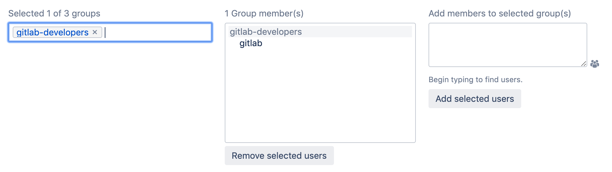
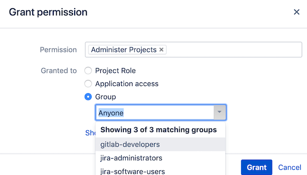

# Jira Server credentials **(FREE)**

To [integrate Jira with GitLab](index.md), you must
create a Jira user account for your Jira projects to access projects in GitLab.
This Jira user account must have write access to your Jira projects. To create the
credentials, you must:

1. [Create a Jira Server user](#create-a-jira-server-user).
1. [Create a Jira Server group](#create-a-jira-server-group) for the user to belong to.
1. [Create a permission scheme for your group](#create-a-permission-scheme-for-your-group).

## Create a Jira Server user

This process creates a user named `gitlab` and adds it to a new group named `gitlab-developers`:

1. Sign in to your Jira instance as an administrator.
1. In the upper right corner of the top menu, go to the gear icon and
   select **User Management**.
1. Create a new user account (`gitlab`) with write access to
   projects in Jira.
   - **Email address**: Jira requires a valid email address, and sends a verification
     email, which you need to set up the password.
   - **Username**: Jira creates the username by using the email prefix. You can change
     this username later.
   - **Password**: You must create a password, because the GitLab integration doesn't
     support SSO, such as SAML. To create the password, visit the user profile, look up
     the username, and set a password.
1. Select **Create user**.

After you create the user, create a group for it.

## Create a Jira Server group

After you [create a Jira Server user](#create-a-jira-server-user), you can create a
group to assign permissions to the user:

1. Sign in to your Jira instance as an administrator.
1. In the upper right corner of the top menu, go to the gear icon and
   select **User Management**.
1. From the sidebar, select **Groups**.

   

1. In the **Add group** section, enter a **Name** for the group (for example,
   `gitlab-developers`), and then select **Add group**.
1. To add the `gitlab` user to the `gitlab-developers` group, select **Edit members**.
   The `gitlab-developers` group should be listed in the leftmost box as a
   selected group.
1. In the **Add members to selected group(s)** area, enter `gitlab`.
1. Select **Add selected users**.
Jira saves your selection, and `gitlab` should appear in the **Group member(s)**
area.

Next, create a permission scheme for your group.

## Create a permission scheme for your group

After creating the group in Jira, grant permissions to the group by creating a permission scheme:

1. Sign in to your Jira instance as an administrator.
1. In the upper right corner of the top menu, go to the gear icon and
   select **Issues**.
1. From the sidebar, select **Permission Schemes**.
1. Select **Add Permission Scheme**, enter a **Name** and (optionally) a
   **Description**, and then select **Add**.
1. In the permissions scheme list, locate your new permissions scheme, and
   select **Permissions**.
1. Next to **Administer Projects**, select **Edit**. In
   the **Group** list, select `gitlab-developers`.

   

Write down the new Jira username and its
password, as you need them when
[configuring GitLab](development_panel.md#configure-gitlab).
