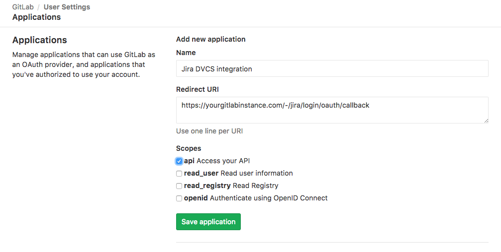
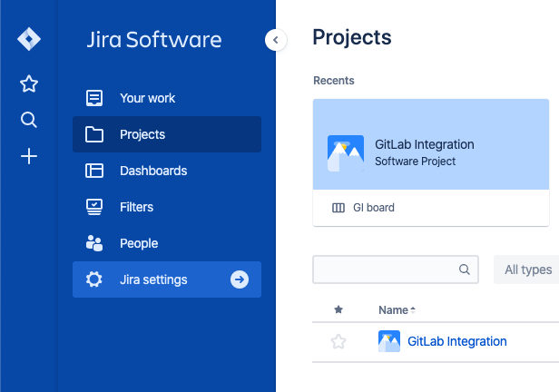
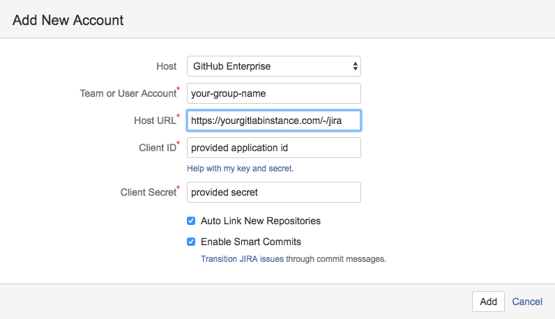
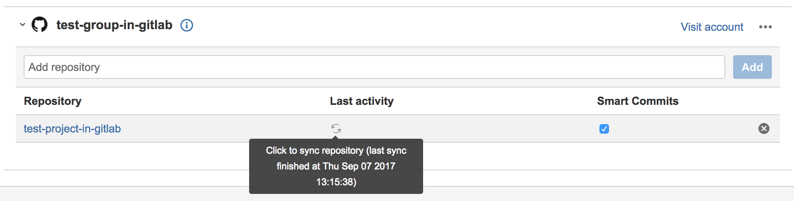
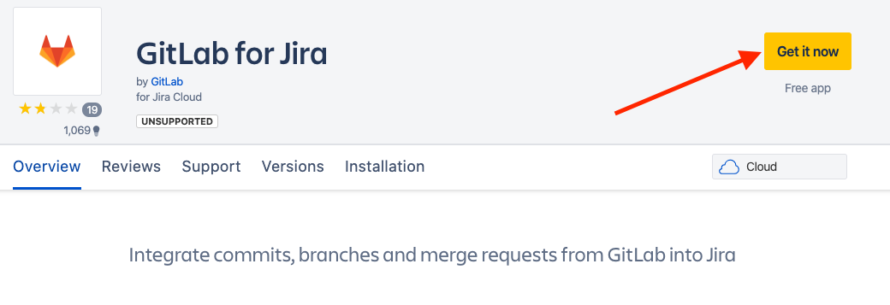
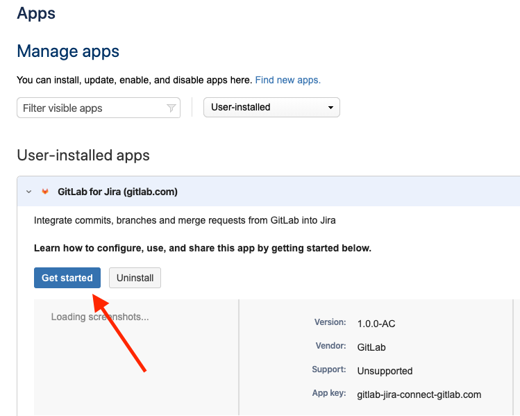
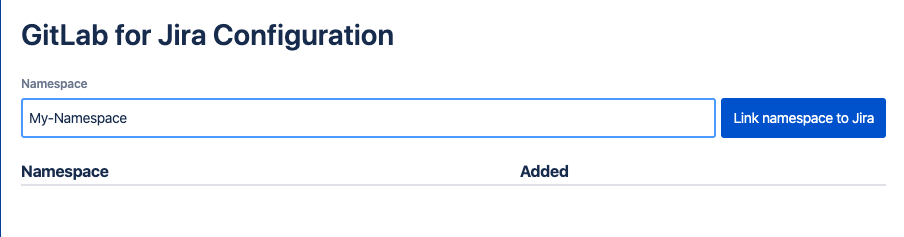
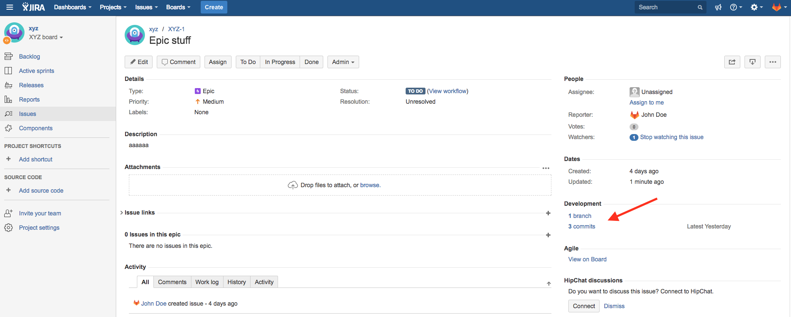
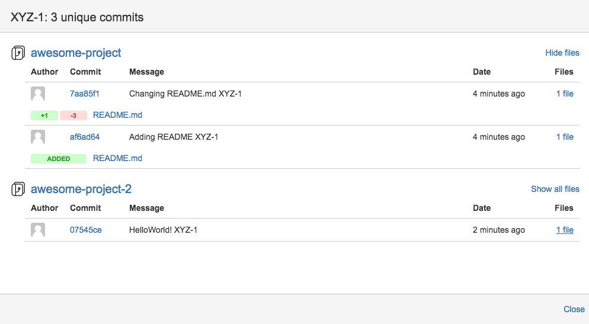
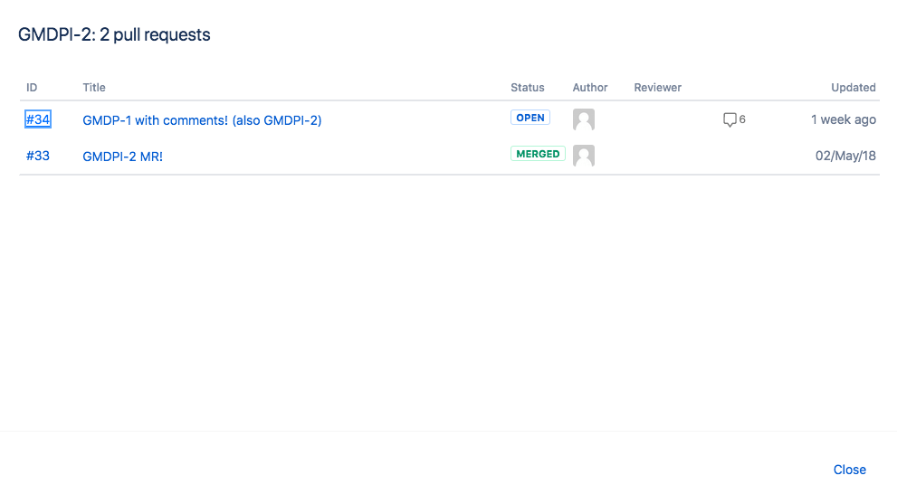

# GitLab Jira development panel integration **(PREMIUM)**

> [Introduced](https://gitlab.com/gitlab-org/gitlab/issues/2381) in [GitLab Premium](https://about.gitlab.com/pricing/) 10.0.

Complementary to our [existing Jira](../user/project/integrations/jira.md) project integration, you're now able to integrate
GitLab projects with [Jira Development Panel](https://confluence.atlassian.com/adminjiraserver070/). Both can be used
simultaneously. This works with self-managed GitLab or GitLab.com integrated with:

- Jira hosted by you.
- Cloud Jira.

By doing this you can easily access related GitLab merge requests, branches, and commits directly from a Jira issue.

This integration connects all GitLab projects within a top-level group or a personal namespace to projects in the Jira instance.
A top-level GitLab group is one that does not have any parent group itself. All the projects of that top-level group,
as well as projects of the top-level group's subgroups nesting down, are connected. Alternatively, you can specify
a GitLab personal namespace in the Jira configuration, which will then connect the projects in that personal namespace to Jira.

NOTE: **Note**:
Note this is different from the [existing Jira](../user/project/integrations/jira.md) project integration, where the mapping
is one GitLab project to the entire Jira instance.

We recommend that a GitLab group admin
or instance admin (in the case of self-managed GitLab) set up the integration,
in order to simplify administration.

TIP: **Tip:**
Create and use a single-purpose `jira` user in GitLab, so that removing
regular users won't impact your integration.

## Requirements

### Self-managed GitLab

If you are using self-managed GitLab, make sure your GitLab instance is accessible by Jira.

- If you are connecting to Jira Cloud, make sure your instance is accessible via the internet.
- If you are using Jira Server, make sure your instance is accessible however your network is set up.

### GitLab.com

There are no special requirements if you are using GitLab.com.

## GitLab Configuration

1. In GitLab, create a new application in order to allow Jira to connect with your GitLab account

   While logged-in, go to `Settings -> Applications`. (Click your profile avatar at
   the top right, choose `Settings`, and then navigate to `Applications` from the left
   navigation menu.) Use the form to create a new application.

   Enter a useful name for the `Name` field.

   For the `Redirect URI` field, enter `https://<your-gitlab-instance-domain>/login/oauth/callback`,
   replacing `<your-gitlab-instance-domain>` appropriately. So for example, if you are using GitLab.com,
   this would be `https://gitlab.com/login/oauth/callback`.

   NOTE: **Note**:
   If using a GitLab version earlier than 11.3 the `Redirect URI` value should be `https://<your-gitlab-instance-domain>/-/jira/login/oauth/callback`.

   

   - Check `api` in the Scopes section.

1. Click `Save application`. You will see the generated 'Application ID' and 'Secret' values.
   Copy these values that you will use on the Jira configuration side.

## Jira Configuration

### GitLab self-managed

1. In Jira, go to **Jira Settings > Applications > DVCS accounts**, then click **Link GitHub Enterprise account** to start creating a new integration.
   (We are pretending to be GitHub in this integration until there is further platform support from Jira.)

   

1. Complete the form

   Select GitHub Enterprise for the `Host` field.

   For the `Team or User Account` field, enter the relative path of a top-level GitLab group that you have access to,
   or the relative path of your personal namespace.

   

   For the `Host URL` field, enter `https://<your-gitlab-instance-domain>/`,
   replacing `<your-gitlab-instance-domain>` appropriately. So for example, if you are using GitLab.com,
   this would be `https://gitlab.com/`.

   NOTE: **Note**:
   If using a GitLab version earlier than 11.3 the `Host URL` value should be `https://<your-gitlab-instance-domain>/-/jira`

   For the `Client ID` field, use the `Application ID` value from the previous section.

   For the `Client Secret` field, use the `Secret` value from the previous section.

   Ensure that the rest of the checkboxes are checked.

1. Click `Add` to complete and create the integration.

   Jira takes up to a few minutes to know about (import behind the scenes) all the commits and branches
   for all the projects in the GitLab group you specified in the previous step. These are refreshed
   every 60 minutes.

   > **Note:**
   > In the future, we plan on implementing real-time integration. If you need
   > to refresh the data manually, you can do this from the `Applications -> DVCS
   > accounts` screen where you initially set up the integration:
   >
   > 

To connect additional GitLab projects from other GitLab top-level groups (or personal namespaces), repeat the above
steps with additional Jira DVCS accounts.

### GitLab.com

You can integrate GitLab.com and Jira Cloud using the **GitLab for Jira** App in the [Atlassian Marketplace](https://marketplace.atlassian.com/apps/1221011/gitlab-for-jira).

GitLab and Jira can also be integrated using the DVCS connector as described in the [GitLab self-managed section](#gitlab-self-managed). The [GitLab for Jira App](https://marketplace.atlassian.com/apps/1221011/gitlab-for-jira) is recommended when using GitLab.com and Jira Cloud because data is synchronized in real time, while the DVCS connector updates data only once per hour.

<i class="fa fa-youtube-play youtube" aria-hidden="true"></i>
For a walkthrough of the integration with GitLab for Jira, watch [Configure GitLab Jira Integration using Marketplace App](https://youtu.be/SwR-g1s1zTo) on YouTube.

NOTE: **Note:**
The **GitLab for Jira** App is only compatible with GitLab.com **and** Jira Cloud.

1. Go to **Jira Settings > Apps > Find new apps**, then search for GitLab.
1. Click **GitLab for Jira**, then click **Get it now**. Or go the [App in the marketplace directly](https://marketplace.atlassian.com/apps/1221011/gitlab-for-jira)

   
1. After installing, click **Get started** to go to the configurations page. This page is always available under **Jira Settings > Apps > Manage apps**.

   
1. Enter the group or personal namespace in the **Namespace** field and click **Link namespace to Jira**. Make sure you are logged in on GitLab.com and the namespace has a Silver or above license. The user setting up _GitLab for Jira_ must have **Maintainer** access to the GitLab namespace.

NOTE: **Note:**
The GitLab user only needs access when adding a new namespace. For syncing with Jira, we do not depend on the user's token.

   

After a namespace is added, all future commits, branches and merge requests of all projects under that namespace will be synced to Jira. Past data cannot be synced at the moment.

#### Troubleshooting GitLab for Jira

The GitLab for Jira App uses an iframe to add namespaces on the settings page. Some browsers block cross-site cookies which can lead to a message saying that the user needs to log in on GitLab.com even though the user is already logged in.

> "You need to sign in or sign up before continuing."

In this case, enable cross-site cookies in your browser.

## Usage

Once the integration is set up on GitLab and Jira you may refer any Jira issue by its ID in branch names, commit messages and merge request titles on GitLab's side,
and you will be able to see the linked `branches`, `commits`, and `merge requests` when entering a Jira issue
(inside the Jira issue, merge requests will be called "pull requests").

Click the links to see your GitLab repository data.

## Limitations

- This integration is currently not supported on GitLab instances under a [relative URL](https://docs.gitlab.com/omnibus/settings/configuration.html#configuring-a-relative-url-for-gitlab) (for example, `http://example.com/gitlab`).

## Changelog

### 11.10

- [Instance admins can now setup integration for all namespaces](https://gitlab.com/gitlab-org/gitlab/issues/8902)

### 11.1

- [Support GitLab subgroups in Jira development panel](https://gitlab.com/gitlab-org/gitlab/issues/3561)
