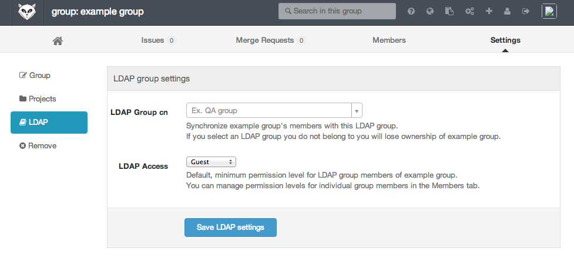
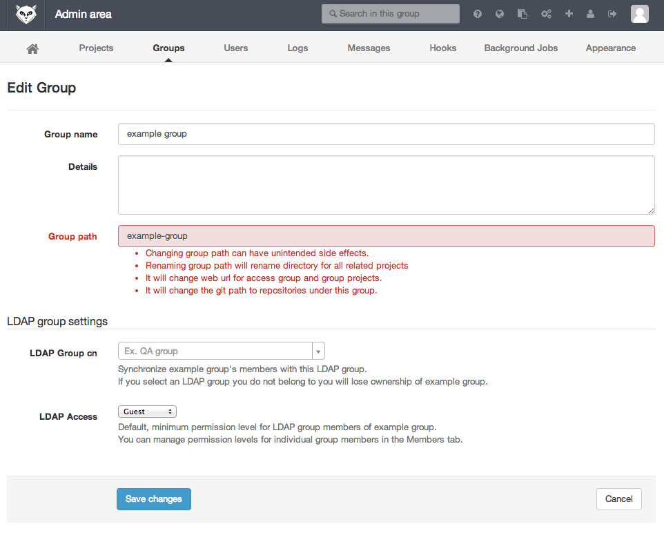
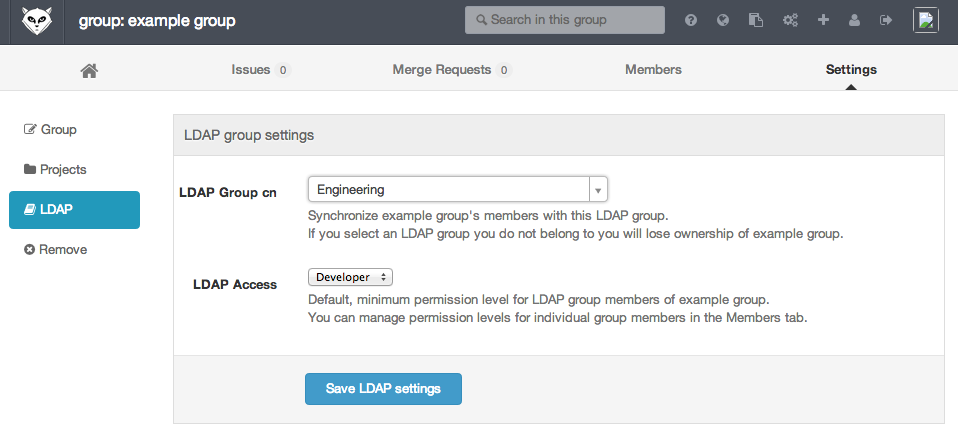
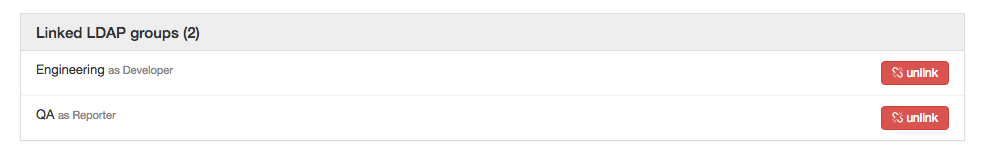

# GitLab LDAP integration

GitLab can be configured to allow your users to sign with their LDAP credentials to integrate with e.g. Active Directory.
To enable LDAP integration, edit [gitlab.rb (omnibus-gitlab)`](https://gitlab.com/gitlab-org/omnibus-gitlab/blob/master/README.md#setting-up-ldap-sign-in) or [gitlab.yml (source installations)](https://gitlab.com/gitlab-org/gitlab-ce/blob/master/config/gitlab.yml.example) on your GitLab server and restart GitLab.

The first time a user signs in with LDAP credentials, GitLab will create a new GitLab user associated with the LDAP Distinguished Name (DN) of the LDAP user.

GitLab user attributes such as nickname and email will be copied from the LDAP user entry.

## Security

GitLab assumes that LDAP users are not able to change their LDAP 'mail', 'email' or 'userPrincipalName' attribute.
An LDAP user who is allowed to change their email on the LDAP server can [take over any account](#enabling-ldap-sign-in-for-existing-gitlab-users) on your GitLab server.

We recommend against using GitLab LDAP integration if your LDAP users are allowed to change their 'mail', 'email' or 'userPrincipalName'  attribute on the LDAP server.

If a user is deleted from the LDAP server, they will be blocked in GitLab as well.
Users will be immediately blocked from logging in. However, there is an LDAP check
cache time of one hour. The means users that are already logged in or are using Git
over SSH will still be able to access GitLab for up to one hour. Manually block
the user in the GitLab Admin area to immediately block all access.

## Configuring GitLab for LDAP integration

To enable GitLab LDAP integration you need to add your LDAP server settings in `/etc/gitlab/gitlab.rb` or `/home/git/gitlab/config/gitlab.yml`.
In GitLab Enterprise Edition you can have multiple LDAP servers connected to one GitLab server.

Please note that before version 7.4, GitLab used a different syntax for configuring LDAP integration.
The old LDAP integration syntax still works in GitLab 7.4.
If your `gitlab.rb` or `gitlab.yml` file contains LDAP settings in both the old syntax and the new syntax, only the __old__ syntax will be used by GitLab.

```ruby
# For omnibus packages
gitlab_rails['ldap_enabled'] = true
gitlab_rails['ldap_servers'] = YAML.load <<-EOS # remember to close this block with 'EOS' below
main: # 'main' is the GitLab 'provider ID' of this LDAP server
  ## label
  #
  # A human-friendly name for your LDAP server. It is OK to change the label later,
  # for instance if you find out it is too large to fit on the web page.
  #
  # Example: 'Paris' or 'Acme, Ltd.'
  label: 'LDAP'

  host: '_your_ldap_server'
  port: 389
  uid: 'sAMAccountName'
  method: 'plain' # "tls" or "ssl" or "plain"
  bind_dn: '_the_full_dn_of_the_user_you_will_bind_with'
  password: '_the_password_of_the_bind_user'

  # Set a timeout, in seconds, for LDAP queries. This helps avoid blocking
  # a request if the LDAP server becomes unresponsive.
  # A value of 0 means there is no timeout.
  timeout: 10

  # This setting specifies if LDAP server is Active Directory LDAP server.
  # For non AD servers it skips the AD specific queries.
  # If your LDAP server is not AD, set this to false.
  active_directory: true

  # If allow_username_or_email_login is enabled, GitLab will ignore everything
  # after the first '@' in the LDAP username submitted by the user on login.
  #
  # Example:
  # - the user enters 'jane.doe@example.com' and 'p@ssw0rd' as LDAP credentials;
  # - GitLab queries the LDAP server with 'jane.doe' and 'p@ssw0rd'.
  #
  # If you are using "uid: 'userPrincipalName'" on ActiveDirectory you need to
  # disable this setting, because the userPrincipalName contains an '@'.
  allow_username_or_email_login: false

  # To maintain tight control over the number of active users on your GitLab installation,
  # enable this setting to keep new users blocked until they have been cleared by the admin
  # (default: false).
  block_auto_created_users: false

  # Base where we can search for users
  #
  #   Ex. ou=People,dc=gitlab,dc=example
  #
  base: ''

  # Filter LDAP users
  #
  #   Format: RFC 4515 https://tools.ietf.org/search/rfc4515
  #   Ex. (employeeType=developer)
  #
  #   Note: GitLab does not support omniauth-ldap's custom filter syntax.
  #
  user_filter: ''

  # LDAP attributes that GitLab will use to create an account for the LDAP user.
  # The specified attribute can either be the attribute name as a string (e.g. 'mail'),
  # or an array of attribute names to try in order (e.g. ['mail', 'email']).
  # Note that the user's LDAP login will always be the attribute specified as `uid` above.
  attributes:
    # The username will be used in paths for the user's own projects
    # (like `gitlab.example.com/username/project`) and when mentioning
    # them in issues, merge request and comments (like `@username`).
    # If the attribute specified for `username` contains an email address,
    # the GitLab username will be the part of the email address before the '@'.
    username: ['uid', 'userid', 'sAMAccountName']
    email:    ['mail', 'email', 'userPrincipalName']

    # If no full name could be found at the attribute specified for `name`,
    # the full name is determined using the attributes specified for
    # `first_name` and `last_name`.
    name:       'cn'
    first_name: 'givenName'
    last_name:  'sn'

# GitLab EE only: add more LDAP servers
# Choose an ID made of a-z and 0-9 . This ID will be stored in the database
# so that GitLab can remember which LDAP server a user belongs to.
# uswest2:
#   label:
#   host:
#   ....
EOS
```

If you are getting 'Connection Refused' errors when trying to connect to the LDAP server please double-check the LDAP `port` and `method` settings used by GitLab.
Common combinations are `method: 'plain'` and `port: 389`, OR `method: 'ssl'` and `port: 636`.

If you are using a GitLab installation from source you can find the LDAP settings in `/home/git/gitlab/config/gitlab.yml`:

```yaml
production:
  # snip...
  ldap:
    enabled: false
    servers:
      main: # 'main' is the GitLab 'provider ID' of this LDAP server
        ## label
        #
        # A human-friendly name for your LDAP server. It is OK to change the label later,
        # for instance if you find out it is too large to fit on the web page.
        #
        # Example: 'Paris' or 'Acme, Ltd.'
        label: 'LDAP'
        # snip...
```

## Enabling LDAP sign-in for existing GitLab users

When a user signs in to GitLab with LDAP for the first time, and their LDAP email address is the primary email address of an existing GitLab user, then the LDAP DN will be associated with the existing user.

If the LDAP email attribute is not found in GitLab's database, a new user is created.

In other words, if an existing GitLab user wants to enable LDAP sign-in for themselves, they should check that their GitLab email address matches their LDAP email address, and then sign into GitLab via their LDAP credentials.

GitLab recognizes the following LDAP attributes as email addresses: `mail`, `email` and `userPrincipalName`.

If multiple LDAP email attributes are present, e.g. `mail: foo@bar.com` and `email: foo@example.com`, then the first attribute found wins -- in this case `foo@bar.com`.

## LDAP group synchronization (GitLab Enterprise Edition)

LDAP group synchronization in GitLab Enterprise Edition allows you to
synchronize the members of a GitLab group with one or more LDAP groups.

### Setting up LDAP group synchronization

Before enabling group synchronization, you need to make sure that the
`group_base` field is set in your LDAP settings on your `gitlab.rb` or
`gitlab.yml` file. This setting will tell GitLab where to look for groups
within your LDAP server.

```
group_base: 'OU=groups,DC=example,DC=com'
```

Suppose we want to synchronize the GitLab group 'example group' with the LDAP
group 'Engineering'.

1. As an owner, go to the group settings page for 'example group'.



As an admin you can also go to the group edit page in the admin area.



2. Enter 'Engineering' as the LDAP Common Name (CN) in the 'LDAP Group cn' field.

3. Enter a default group access level in the 'LDAP Access' field; let's say
Developer.



4. Click 'Add synchronization' to add the new LDAP group link.

Now every time a member of the 'Engineering' LDAP group signs in, they
automatically become a Developer-level member of the 'example group' GitLab
group. Users who are already signed in will see the change in membership after
up to one hour.

### Synchronizing with more than one LDAP group (GitLab EE 7.3 and newer)

If you have two LDAP group links, and a user belongs to both LDAP groups, they
will receive the _highest_ access level of the two. For example, suppose you
have configured group sync for the 'Engineering' group at level 'Developer' and
'QA' group at level 'Reporter'. User 'Jane' belongs to both the 'Engineering' and
'QA' LDAP groups so she will receive the 'Developer' role.



### Locking yourself out of your own group

As an LDAP-enabled GitLab user, if you create a group and then set it to synchronize with an LDAP group you do not belong to, you will be removed from the group as soon as the synchronization takes effect for you, unless you are the last owner of the group.

If you accidentally lock yourself out of your own GitLab group, ask another owner of the group or a GitLab administrator to change the LDAP synchronization settings for your group.

### Non-LDAP GitLab users

If there are also non-LDAP users in your GitLab instance, they will remain
members of the GitLab group until they choose to leave the group on their own.
Administrators, owners, and masters cannot add or remove users from GitLab
groups when LDAP group sync is enabled.

### ActiveDirectory nested group support

If you are using ActiveDirectory, it is possible to create nested LDAP groups: the 'Engineering' LDAP group may contain another LDAP group 'Software', with 'Software' containing LDAP users Alice and Bob.
GitLab will recognize Alice and Bob as members of the 'Engineering' group.

## Define GitLab admin status via LDAP

It is possible to configure GitLab Enterprise Edition (7.1 and newer) so that GitLab admin rights are bestowed on the members of a given LDAP group.
GitLab administrator users who do not have LDAP enabled are not affected by the LDAP admin group feature.

### Enabling the admin group feature

Below we assume that you have an LDAP group with the common name (CN) 'GitLab administrators' containing the users that should be GitLab administrators.
We recommend that you keep a non-LDAP GitLab administrator user around on your GitLab instance in case you accidentally remove the admin status from your own LDAP-enabled GitLab user.

For omnibus-gitlab, add the following to the LDAP part of `/etc/gitlab/gitlab.rb` under one (or more) of the servers in
the `servers:` section and run `gitlab-ctl reconfigure`.

```yaml
    admin_group: 'GitLab administrators'
```

For installations from source, add the following setting in the 'ldap' section of gitlab.yml, and run `service gitlab reload` afterwards.

```yaml
    admin_group: 'Gitlab administrators'
```

## Synchronising user SSH keys with LDAP

It is possible to configure GitLab Enterprise Edition (7.1 and newer) so that users have their SSH public keys synchronised with an attribute in their LDAP object.
Existing SSH public keys that are manually manged in GitLab are not affected by this feature.

### Enabling the key synchronisation feature

Below we assume that you have LDAP users with an attribute  'sshpublickey' containing the users ssh public key.

For omnibus-gitlab, add the following to `/etc/gitlab/gitlab.rb` and run `gitlab-ctl reconfigure`.

```ruby
gitlab_rails['ldap_sync_ssh_keys'] = 'sshpublickey'
```

For installations from source, add the following setting in the 'ldap' section of gitlab.yml, and run `service gitlab reload` afterwards.

```yaml
    sync_ssh_keys: 'sshpublickey'
```

## Using an LDAP filter to limit access to your GitLab server

If you want to limit all GitLab access to a subset of the LDAP users on your LDAP server you can set up an LDAP user filter.
The filter must comply with [RFC 4515](https://tools.ietf.org/search/rfc4515).

```ruby
# For omnibus packages; new LDAP server syntax
gitlab_rails['ldap_servers'] = YAML.load <<-EOS
main:
  # snip...
  user_filter: '(employeeType=developer)'
EOS
```

```yaml
# For installations from source; new LDAP server syntax
production:
  ldap:
    servers:
      main:
        # snip...
        user_filter: '(employeeType=developer)'
```

Tip: if you want to limit access to the nested members of an Active Directory group you can use the following syntax:

```
(memberOf:1.2.840.113556.1.4.1941:=CN=My Group,DC=Example,DC=com)
```

Please note that GitLab does not support the custom filter syntax used by omniauth-ldap.

## Integrate GitLab with more than one LDAP server (Enterprise Edition)

Starting with GitLab Enterprise Edition 7.4 it is possible to give users from more than one LDAP server access to the same GitLab server.

Please use the following steps to enable support for multiple LDAP servers.

### 1. Check your GitLab version

Go to gitlab.example.com/help and verify you are running GitLab Enterprise Edition 7.4.0 or newer.

### 2. Make sure your GitLab server uses the new LDAP syntax

```
# For omnibus packages
sudo gitlab-rails runner 'puts (Gitlab.config.ldap["host"] ? :old_syntax : :new_syntax)'

# For installations from source
cd /home/git/gitlab
bundle exec rails runner -e production 'puts (Gitlab.config.ldap["host"] ? :old_syntax : :new_syntax)'
```

If you are not using the new syntax yet, please edit `/etc/gitlab/gitlab.rb` or
`gitlab.yml` (for installations from source) and make your LDAP configuration
setting look as above. With the new syntax, LDAP server blocks are named. Your
existing LDAP server should be named 'main'.

### 3. Add new LDAP servers

Now you can add new LDAP servers via `/etc/gitlab/gitlab.rb` (Omnibus packages)
or `gitlab.yml` (installations from source).

Remember to [reconfigure](../../administration/restart_gitlab.md#omnibus-gitlab-reconfigure)
or [restart](../../administration/restart_gitlab.md#installations-from-source)
GitLab for Omnibus packages or installations from source respectively, in order
for the new servers to become available.

**Tip:** you can assign labels to the different servers to give them human-friendly
names:

```yaml
ldap:
  servers:
    main:
      label: 'LDAP HQ'
```

#### Examples

**Omnibus**

```ruby
gitlab_rails['ldap_servers'] = YAML.load <<-'EOS' # remember to close this block with 'EOS' below
 main: # 'main' is the GitLab 'provider ID' of this LDAP server
   label: 'LDAP_1'
   host: '_your_ldap_server'
   ...
 secondary: # 'secondary' is the GitLab 'provider ID' of second LDAP server
   label: 'LDAP_2'
   host: '_your_ldap_2_server'
   ...
EOS
```

**Source**

```yaml
ldap:
  servers:
    main: # 'main' is the GitLab 'provider ID' of this LDAP server
      label: 'LDAP_1'
      host: '_your_ldap_server'
      ...
    secondary: # 'secondary' is the GitLab 'provider ID' of second LDAP server
      label: 'LDAP_2'
      host: '_your_ldap_2_server'
      ...
```

## Automatic Daily LDAP Sync

GitLab Enterprise Edition will now automatically sync all LDAP members on a daily basis. You can configure the time that it happens.

LDAP group synchronization in GitLab Enterprise Edition works by GitLab periodically updating the group memberships of _active_ GitLab users.
If a GitLab user becomes _inactive_ however, their group memberships in GitLab can start to lag behind the LDAP server group memberships.
Starting with GitLab 7.5 Enterprise Edition, GitLab will also update the LDAP group memberships of inactive users, by doing a daily LDAP check for _all_ GitLab users.

> Example:
John Doe leaves the company and is removed from the LDAP server.
At this point he can no longer log in to GitLab 7.4 EE.
But because he is no longer active on the GitLab EE server (he cannot log in!), his LDAP group memberships in GitLab no longer get updated, and he stays listed as a group member on the GitLab server.

> Now with GitLab 7.5 Enterprise Edition, within 24 hours of John being removed from the LDAP server, his user will also stop being listed as member of any GitLab groups.


### Blocked users and Daily sync

If you use Active directory and you block user in AD - user will be automatically blocked in GitLab during next LDAP Sync.


## LDAP Synchronization

LDAP membership is checked for a GitLab user:

- when they sign in to the GitLab instance
- on a daily basis
- on any request once the LDAP cache has expired (configurable; default is 60
  minutes; cache is per-user)

If you want a shorter or longer LDAP sync time, you can set this with the
`sync_time` attribute in your config.

For Omnibus package installations, provide an `ldap_sync_time` value in
`/etc/gitlab/gitlab.rb`:

```ruby
gitlab_rails['ldap_sync_time'] = 1800
```

Here, `ldap_sync_time` is set to `1800` seconds, meaning the LDAP cache will
expire every 30 minutes, rather than the default of 60 minutes.

For manual GitLab installations, simply uncomment the `sync_time` entry in your
`gitlab.yml` and set it to the value you desire.

Please note that changing the LDAP sync time can influence the performance of
your GitLab instance.

## What sort of queries can my LDAP server expect from GitLab EE?

Active GitLab users trigger 'permission updates' by signing in or
interacting with GitLab, and in addtion all GitLab users (active or not) get a
permission update during the daily sweep. The number of permission updates per
day depends on how many of your GitLab users are active and on how many
LDAP-enabled GitLab users exist in your GitLab SQL database.

During a 'permission update' for a user, GitLab does 1-2 queries for the
specific user, and 1 queries for each LDAP group known to GitLab. GitLab
fetches all available attributes of LDAP user and group objects on most
queries. If you use Active Directory, GitLab performs additional
'extensibleMatch' queries to check for nested group membership and whether the
user is blocked, one of each per user and group.

Note that usually not all user and group objects in an organization's LDAP tree
will be known to GitLab. GitLab only queries LDAP user objects corresponding to
users who use or have used GitLab. Similarly, GitLab only queries LDAP group
objects that have been (manually) linked to a GitLab group by a GitLab user or
administrator.

## Limitations

GitLab's LDAP client is based on [omniauth-ldap](https://gitlab.com/gitlab-org/omniauth-ldap)
which encapsulates Ruby's `Net::LDAP` class. It provides a pure-Ruby implementation
of the LDAP client protocol. As a result, GitLab is limited by `omniauth-ldap` and may impact your LDAP
server settings.

### TLS Client Authentication
Not implemented by `Net::LDAP`.
So you should disable anonymous LDAP authentication and enable simple or SASL
authentication. TLS client authentication setting in your LDAP server cannot be
mandatory and clients cannot be authenticated with the TLS protocol.

### TLS Server Authentication
Not supported by GitLab's configuration options.
When setting `method: ssl`, the underlying authentication method used by
`omniauth-ldap` is `simple_tls`.  This method establishes TLS encryption with
the LDAP server before any LDAP-protocol data is exchanged but no validation of
the LDAP server's SSL certificate is performed.

## Troubleshooting

### Invalid credentials when logging in

Make sure the user you are binding with has enough permissions to read the user's
tree and traverse it.

Also make sure that the `user_filter` is not blocking otherwise valid users.

To make sure that the LDAP settings are correct and GitLab can see your users,
execute the following command:


```bash
# For Omnibus installations
sudo gitlab-rake gitlab:ldap:check

# For installations from source
sudo -u git -H bundle exec rake gitlab:ldap:check RAILS_ENV=production
```

