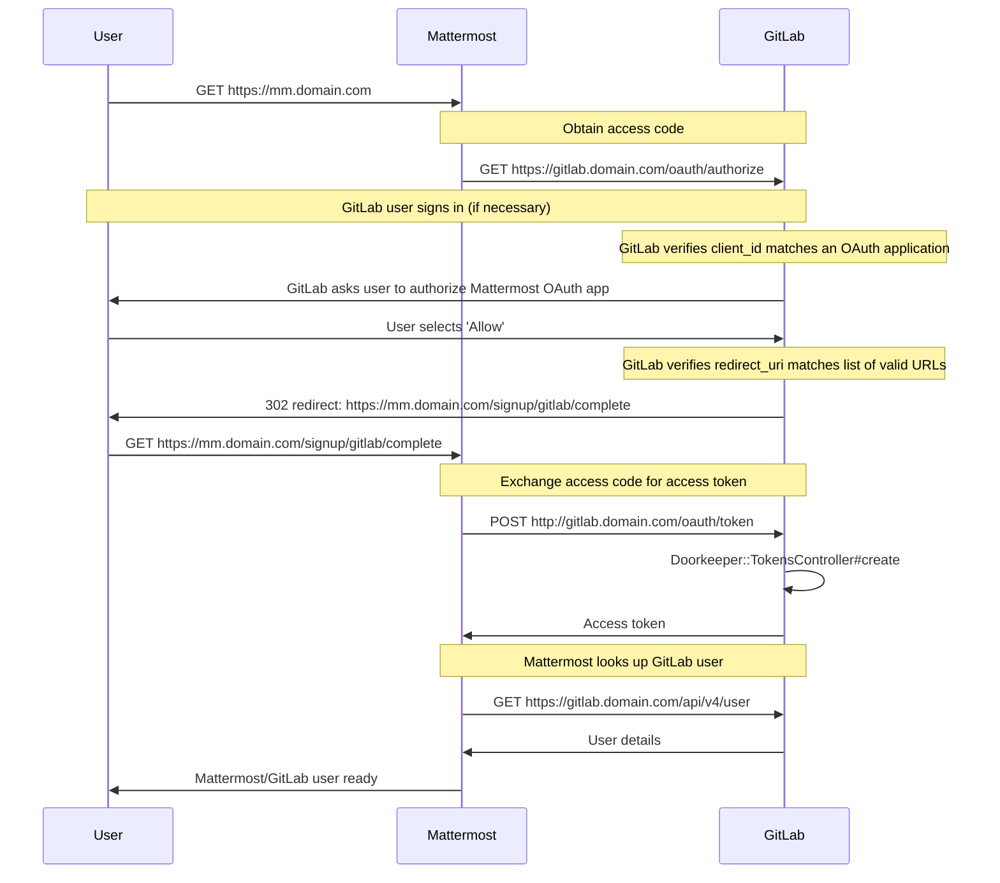

# GitLab Mattermost

NOTE:
This document applies to GitLab 11.0 and later.

You can run a [GitLab Mattermost](https://gitlab.com/gitlab-org/gitlab-mattermost)
service on your GitLab server. Mattermost is not part of the single application that GitLab is. There is a good integration between [Mattermost and GitLab](https://mattermost.com/solutions/mattermost-gitlab/), and our Omnibus installer allows you to easily install it. But it is a separate application from a separate company.

## Prerequisites

Each release of GitLab Mattermost is compiled and manually tested on an AMD 64 chipset for Linux. ARM chipsets and operating systems, like Raspberry Pi, are not supported.

## Getting started

GitLab Mattermost expects to run on its own virtual host. In your DNS settings, you need
two entries pointing to the same machine. For example, `gitlab.example.com` and
`mattermost.example.com`.

GitLab Mattermost is disabled by default. To enable it:

1. Edit `/etc/gitlab/gitlab.rb` and add the Mattermost external URL:

   ```ruby
   mattermost_external_url 'https://mattermost.example.com'
   ```

1. Reconfigure GitLab:

   ```shell
   sudo gitlab-ctl reconfigure
   ```

1. Confirm that GitLab Mattermost is reachable at `https://mattermost.example.com` and authorized to connect to GitLab. Authorizing Mattermost with GitLab allows users to use GitLab as an SSO provider.

The Omnibus GitLab package attempts to automatically authorize GitLab Mattermost with GitLab if the applications are running on the same server.

Automatic authorization requires access to the GitLab database. If the GitLab database is not available
you need to manually authorize GitLab Mattermost for access to GitLab using the process described in the [Authorize GitLab Mattermost section](#authorize-gitlab-mattermost).

## Configuring Mattermost

Starting in GitLab 11.0, Mattermost can be configured using the Mattermost System Console. An extensive list of
Mattermost settings and where they can be set is available [in the Mattermost documentation](https://docs.mattermost.com/administration/config-settings.html).

While using the System Console is recommended, you can also configure Mattermost using one of the following options:

1. Edit the Mattermost configuration directly through `/var/opt/gitlab/mattermost/config.json`.
1. Specify environment variables used to run Mattermost by changing the `mattermost['env']` setting in `gitlab.rb`. Any settings configured in this way are disabled from the System Console and cannot be changed without restarting Mattermost.

## Running GitLab Mattermost with HTTPS

Place the SSL certificate and SSL certificate key inside `/etc/gitlab/ssl`. If the directory doesn't exist, create it:

```shell
sudo mkdir -p /etc/gitlab/ssl
sudo chmod 755 /etc/gitlab/ssl
sudo cp mattermost.gitlab.example.key mattermost.gitlab.example.crt /etc/gitlab/ssl/
```

In `/etc/gitlab/gitlab.rb` specify the following configuration:

```ruby
mattermost_external_url 'https://mattermost.gitlab.example'
mattermost_nginx['redirect_http_to_https'] = true
```

If you haven't named your certificate and key `mattermost.gitlab.example.crt`
and `mattermost.gitlab.example.key` then you need to also add the full paths
as shown below.

```ruby
mattermost_nginx['ssl_certificate'] = "/etc/gitlab/ssl/mattermost-nginx.crt"
mattermost_nginx['ssl_certificate_key'] = "/etc/gitlab/ssl/mattermost-nginx.key"
```

where `mattermost-nginx.crt` is the SSL certificate and `mattermost-nginx.key` is the SSL key.

Once the configuration is set, run `sudo gitlab-ctl reconfigure` to apply the changes.

## Running GitLab Mattermost on its own server

If you want to run GitLab and GitLab Mattermost on two separate servers the GitLab services are still set up on your GitLab Mattermost server, but they do not accept user requests or
consume system resources. You can use the following settings and configuration details on the GitLab Mattermost server to effectively disable the GitLab service bundled into the Omnibus package.

```ruby
mattermost_external_url 'http://mattermost.example.com'

# Shut down GitLab services on the Mattermost server
gitlab_rails['enable'] = false
redis['enable'] = false
postgres_exporter['enable'] = false
grafana['enable'] = false
```

Then follow the appropriate steps in the [Authorize GitLab Mattermost section](#authorize-gitlab-mattermost). Last, to enable
integrations with GitLab add the following on the GitLab Server:

```ruby
gitlab_rails['mattermost_host'] = "https://mattermost.example.com"
```

By default GitLab Mattermost requires all users to sign up with GitLab and disables the sign-up by email option. See Mattermost [documentation on GitLab SSO](https://docs.mattermost.com/deployment/sso-gitlab.html).

## Manually (re)authorizing GitLab Mattermost with GitLab

### Reauthorize GitLab Mattermost

To reauthorize GitLab Mattermost, you first need to revoke the existing
authorization. This can be done in the **Settings > Applications** area of GitLab. Then follow the steps below to complete authorization.

### Authorize GitLab Mattermost

Navigate to the **Settings > Applications** area in GitLab. Create a new application and for the **Redirect URI** use the following (replace `http` with `https` if you use HTTPS):

```plaintext
http://mattermost.example.com/signup/gitlab/complete
http://mattermost.example.com/login/gitlab/complete
```

Make sure to select the **Trusted** and **Confidential** settings. Under **Scopes**, select `read_user`. Then, choose **Save application**.

Once the application is created you are provided with an `Application ID` and `Secret`. One other piece of information needed is the URL of GitLab instance.
Return to the server running GitLab Mattermost and edit the `/etc/gitlab/gitlab.rb` configuration file as follows using the values you received above:

```ruby
mattermost['gitlab_enable'] = true
mattermost['gitlab_id'] = "12345656"
mattermost['gitlab_secret'] = "123456789"
mattermost['gitlab_scope'] = "read_user"
mattermost['gitlab_auth_endpoint'] = "http://gitlab.example.com/oauth/authorize"
mattermost['gitlab_token_endpoint'] = "http://gitlab.example.com/oauth/token"
mattermost['gitlab_user_api_endpoint'] = "http://gitlab.example.com/api/v4/user"
```

Save the changes and then run `sudo gitlab-ctl reconfigure`. If there are no errors your GitLab and GitLab Mattermost should be configured correctly.

## Specify numeric user and group identifiers

Omnibus GitLab creates a user and group `mattermost`. You can specify the
numeric identifiers for these users in `/etc/gitlab/gitlab.rb` as follows:

```ruby
mattermost['uid'] = 1234
mattermost['gid'] = 1234
```

Run `sudo gitlab-ctl reconfigure` to apply the changes.

## Setting custom environment variables

If necessary you can set custom environment variables to be used by Mattermost
via `/etc/gitlab/gitlab.rb`. This can be useful if the Mattermost server
is operated behind a corporate internet proxy. In `/etc/gitlab/gitlab.rb`
supply a `mattermost['env']` with a hash value. For example:

```ruby
mattermost['env'] = {"HTTP_PROXY" => "my_proxy", "HTTPS_PROXY" => "my_proxy", "NO_PROXY" => "my_no_proxy"}
```

Run `sudo gitlab-ctl reconfigure` to apply the changes.

## Connecting to the bundled PostgreSQL database

If you need to connect to the bundled PostgreSQL database and are using the default Omnibus GitLab database configuration, you can connect as
the PostgreSQL superuser:

```shell
sudo gitlab-psql -d mattermost_production
```

## Back up GitLab Mattermost

GitLab Mattermost is not included in the regular [Omnibus GitLab backup](../../raketasks/backup_restore.md) Rake task.

The general Mattermost [backup and disaster recovery](https://docs.mattermost.com/deploy/backup-disaster-recovery.html) documentation can be used as a guide
on what needs to be backed up.

### Back up the bundled PostgreSQL database

If you need to back up the bundled PostgreSQL database and are using the default Omnibus GitLab database configuration, you can back up using this command:

```shell
sudo -i -u gitlab-psql -- /opt/gitlab/embedded/bin/pg_dump -h /var/opt/gitlab/postgresql mattermost_production | gzip > mattermost_dbdump_$(date --rfc-3339=date).sql.gz
```

### Back up the `data` directory and `config.json`

Mattermost has a `data` directory and `config.json` file that need to be backed up as well:

```shell
sudo tar -zcvf mattermost_data_$(date --rfc-3339=date).gz -C /var/opt/gitlab/mattermost data config.json
```

## Restore GitLab Mattermost

If you have previously [created a backup of GitLab Mattermost](#back-up-gitlab-mattermost), you can run the following commands to restore it:

```shell
# Stop Mattermost so we don't have any open database connections
sudo gitlab-ctl stop mattermost

# Drop the Mattermost database
sudo -u gitlab-psql /opt/gitlab/embedded/bin/dropdb -U gitlab-psql -h /var/opt/gitlab/postgresql -p 5432 mattermost_production

# Create the Mattermost database
sudo -u gitlab-psql /opt/gitlab/embedded/bin/createdb -U gitlab-psql -h /var/opt/gitlab/postgresql -p 5432 mattermost_production

# Perform the database restore
# Replace /tmp/mattermost_dbdump_2021-08-05.sql.gz with your backup
sudo -u mattermost sh -c "zcat /tmp/mattermost_dbdump_2021-08-05.sql.gz | /opt/gitlab/embedded/bin/psql -U gitlab_mattermost -h /var/opt/gitlab/postgresql -p 5432 mattermost_production"

# Restore the data directory and config.json
# Replace /tmp/mattermost_data_2021-08-09.gz with your backup
sudo tar -xzvf /tmp/mattermost_data_2021-08-09.gz -C /var/opt/gitlab/mattermost

# Fix permissions if required
sudo chown -R mattermost:mattermost /var/opt/gitlab/mattermost/data
sudo chown mattermost:mattermost /var/opt/gitlab/mattermost/config.json

# Start Mattermost
sudo gitlab-ctl start mattermost
```

## Mattermost Command Line Tools (CLI)

[`mmctl`](https://docs.mattermost.com/manage/mmctl-command-line-tool.html) is a CLI tool for the Mattermost server which is installed locally and uses the Mattermost API, but may also be used remotely. You must configure Mattermost either for local connections or authenticate as an administrator with local login credentials (not through GitLab SSO). The executable is located at `/opt/gitlab/embedded/bin/mmctl`.

### Use `mmctl` through a local connection

For local connections, the `mmctl` binary and Mattermost must be run from the same server. To enable the local socket:

1. Edit `/var/opt/gitlab/mattermost/config.json`, and add the following lines:

   ```json
   {
       "ServiceSettings": {
          ...
           "EnableLocalMode": true,
           "LocalModeSocketLocation": "/var/tmp/mattermost_local.socket",
           ...
       }
   }
   ```

1. Restart Mattermost:

   ```shell
   sudo gitlab-ctl restart mattermost
   ```

You can then use `/opt/gitlab/embedded/bin/mmctl --local` to run `mmctl` commands
on your Mattermost instance.

For example, to show the list of users:

```shell
$ /opt/gitlab/embedded/bin/mmctl --local user list

13dzo5bmg7fu8rdox347hbfxde: appsbot (appsbot@localhost)
tbnkwjdug3dejcoddboo4yuomr: boards (boards@localhost)
wd3g5zpepjgbfjgpdjaas7yj6a: feedbackbot (feedbackbot@localhost)
8d3zzgpurp85zgf1q88pef73eo: playbooks (playbooks@localhost)
There are 4 users on local instance
```

### Use `mmctl` through a remote connection

For remote connections or local connections where the socket cannot be used,
create a non SSO user and give that user administrator privileges. Those credentials
can then be used to authenticate `mmctl`:

```shell
$ /opt/gitlab/embedded/bin/mmctl auth login http://mattermost.example.com

Connection name: test
Username: local-user
Password:
 credentials for "test": "local-user@http://mattermost.example.com" stored
```

## Configuring GitLab and Mattermost integrations

As of 12.3, the Mattermost GitLab plugin is shipped with Omnibus GitLab: [Mattermost Plugin for GitLab documentation](https://github.com/mattermost/mattermost-plugin-gitlab).

You can use the plugin to subscribe Mattermost to receive notifications about issues, merge requests, and pull requests as well as personal notifications regarding merge request reviews, unread messages, and task assignments. If you want to use slash commands to perform actions
such as creating and viewing issues, or to trigger deployments use GitLab [Mattermost slash commands](../../user/project/integrations/mattermost_slash_commands.md).

The plugin and slash commands can be used together or individually.

## Email Notifications

### Setting up SMTP for GitLab Mattermost

These settings are configured through the Mattermost System Console by the System Administrator.
On the **Environment > SMTP** tab of the **System Console**, you can enter the SMTP credentials given by your SMTP provider, or `127.0.0.1` and port `25` to use `sendmail`. More information on the specific settings
that are needed is available in the [Mattermost documentation](https://docs.mattermost.com/install/smtp-email-setup.html).

These settings can also be configured in `/var/opt/gitlab/mattermost/config.json`.

### Email batching

Enabling this feature allows users to control how often they receive email notifications.

Email batching can be enabled in the Mattermost **System Console** by navigating to the **Environment > SMTP** tab, and setting the **Enable Email Batching** setting to **True**.

This setting can also be configured in `/var/opt/gitlab/mattermost/config.json`.

## Upgrading GitLab Mattermost

Below is a list of Mattermost versions for GitLab 11.10 and later:

| GitLab Version  | Mattermost Version |
| :------------ |:----------------|
| 11.11 | 5.10 |
| 12.0 | 5.11 |
| 12.1 | 5.12 |
| 12.2 | 5.13 |
| 12.3 | 5.14 |
| 12.4 | 5.15 |
| 12.5 | 5.16 |
| 12.6 | 5.17 |
| 12.7 | 5.17 |
| 12.8 | 5.19 |
| 12.9 | 5.20 |
| 12.10 | 5.21 |
| 13.0 | 5.22 |
| 13.1 | 5.23 |
| 13.2 | 5.24 |
| 13.3 | 5.25 |
| 13.4 | 5.26 |
| 13.5 | 5.27 |
| 13.6 | 5.28 |
| 13.7 | 5.29 |
| 13.8 | 5.30 |
| 13.9 | 5.31 |
| 13.10 | 5.32 |
| 13.11 | 5.33 |
| 13.12 | 5.34 |
| 14.0 | 5.35 |
| 14.1 | 5.36 |
| 14.2 | 5.37 |
| 14.3 | 5.38 |
| 14.4 | 5.39 |
| 14.5 | 5.39 |
| 14.6 | 6.1 |
| 14.7 | 6.2 |

- GitLab 14.5 remained on Mattermost 5.39
- GitLab 14.6 updates to Mattermost 6.1 instead of 6.0

NOTE:
When upgrading the Mattermost version, it is essential to check the
[Important Upgrade Notes](https://docs.mattermost.com/administration/important-upgrade-notes.html)
for Mattermost to address any changes or migrations that need to be performed.

Starting with GitLab 11.0, GitLab Mattermost can be upgraded through the regular Omnibus GitLab update process. When upgrading previous versions of
GitLab, the update process can only be used if Mattermost configuration settings have not been changed outside of GitLab. That is, no changes to the Mattermost `config.json`
file have been made - either directly or via the Mattermost **System Console**, which saves changes to `config.json`.

If you are upgrading to at least GitLab 11.0 or have only configured Mattermost using `gitlab.rb`, you can upgrade GitLab using Omnibus and then run `gitlab-ctl reconfigure` to upgrade GitLab Mattermost to the latest version.

If this is not the case, there are two options:

1. Update [`gitlab.rb`](https://gitlab.com/gitlab-org/omnibus-gitlab/blob/master/files/gitlab-config-template/gitlab.rb.template#L706)
   with the changes done to `config.json`. This might require adding some parameters as not all
   settings in `config.json` are available in `gitlab.rb`. Once complete, Omnibus GitLab should be
   able to upgrade GitLab Mattermost from one version to the next.
1. Migrate Mattermost outside of the directory controlled by Omnibus GitLab so it can be administered
   and upgraded independently. Follow the [Mattermost Migration Guide](https://docs.mattermost.com/administration/migrating.html)
   to move your Mattermost configuration settings and data to another directory or server independent
   from Omnibus GitLab.

For a complete list of upgrade notices and special considerations for older versions, see the [Mattermost documentation](https://docs.mattermost.com/administration/important-upgrade-notes.html).

## Upgrading GitLab Mattermost to 15.10

GitLab 15.10 ships with Mattermost 7.8. Before upgrading, [connect to the bundled PostgreSQL database](#connecting-to-the-bundled-postgresql-database) to perform the PostgreSQL maintenance described in the [Important Upgrade Notes](https://docs.mattermost.com/administration/important-upgrade-notes.html) provided by Mattermost.

## Upgrading GitLab Mattermost to 14.6

GitLab 14.6 ships with Mattermost 6.1 including potentially long running database migrations for Mattermost 6.0. For information about upgrading and for ways to reduce the downtime caused by those migrations, read the [Important Upgrade Notes](https://docs.mattermost.com/administration/important-upgrade-notes.html) for both versions. If you need to perform any manual migrations, [connect to the bundled PostgreSQL database](#connecting-to-the-bundled-postgresql-database).

NOTE:
The Mattermost upgrade notes refer to different impacts when used with a PostgreSQL versus a MySQL database. The GitLab Mattermost included with the GitLab Linux packages uses a PostgreSQL database.

## Upgrading GitLab Mattermost from versions prior to 11.0

With version 11.0, GitLab introduced breaking changes which affected Mattermost configuration.
In versions prior to GitLab 11.0 all
Mattermost-related settings were configurable from the `gitlab.rb` file, which
generated the Mattermost `config.json` file. However, Mattermost also
permitted configuration via its System Console. This configuration ended up in
the same `config.json` file, which resulted in changes made via the System Console being
overwritten when users ran `gitlab-ctl reconfigure`.

To resolve this problem, `gitlab.rb` includes only the
configuration necessary for GitLab<=>Mattermost integration in 11.0. GitLab no longer
generates the `config.json` file, and instead passes limited configuration settings via environment variables.

The settings that continue to be supported in `gitlab.rb` can be found in
[`gitlab.rb.template`](https://gitlab.com/gitlab-org/omnibus-gitlab/blob/master/files/gitlab-config-template/gitlab.rb.template).

From GitLab 11.0, other Mattermost settings can be configured through the Mattermost System Console,
by editing `/var/opt/gitlab/mattermost/config.json`, or by using `mattermost['env']` in `gitlab.rb`.

If you would like to keep configuring Mattermost using `gitlab.rb`, you can take the following actions
in preparation for GitLab 11.0:

1. Upgrade to version 10.x which supports the new `mattermost['env']` setting.
1. Configure any settings not listed above through the `mattermost['env']` setting. Mattermost requires
   environment variables to be provided in `MM_<CATEGORY>SETTINGS_<ATTRIBUTE>` format. Below is an example
   of how to convert the old settings syntax to the new one.

The following settings in `gitlab.rb`:

```ruby
mattermost['service_maximum_login_attempts'] = 10
mattermost['team_teammate_name_display'] = "full_name"
mattermost['sql_max_idle_conns'] = 10
mattermost['log_file_level'] = 'INFO'
mattermost['email_batching_interval'] = 30
mattermost['file_enable_file_attachments'] = true
mattermost['ratelimit_memory_store_size'] = 10000
mattermost['support_terms_of_service_link'] = "/static/help/terms.html"
mattermost['privacy_show_email_address'] = true
mattermost['localization_available_locales'] = "en,es,fr,ja,pt-BR"
mattermost['webrtc_enable'] = false
```

Would translate to:

```ruby
mattermost['env'] = {
                    'MM_SERVICESETTINGS_MAXIMUMLOGINATTEMPTS' => '10',
                    'MM_TEAMSETTINGS_TEAMMATENAMEDISPLAY' => 'full_name',
                    'MM_SQLSETTINGS_MAXIDLECONNS' => '10',
                    'MM_LOGSETTINGS_FILELEVEL' => 'INFO',
                    'MM_EMAILSETTINGS_BATCHINGINTERVAL' => '30',
                    'MM_FILESETTINGS_ENABLEFILEATTACHMENTS' => 'true',
                    'MM_RATELIMITSETTINGS_MEMORYSTORESIZE' => '10000',
                    'MM_SUPPORTSETTINGS_TERMSOFSERVICELINK' => '/static/help/terms.html',
                    'MM_PRIVACYSETTINGS_SHOWEMAILADDRESS' => 'true',
                    'MM_LOCALIZATIONSETTINGS_AVAILABLELOCALES' => 'en,es,fr,ja,pt-BR',
                    'MM_WEBRTCSETTINGS_ENABLE' => 'false'
                    }
```

Refer to the [Mattermost Configuration Settings documentation](https://docs.mattermost.com/administration/config-settings.html)
for details about categories and configuration values.

There are a few exceptions to this rule:

1. `ServiceSettings.ListenAddress` configuration of Mattermost is configured
   by `mattermost['service_address']` and `mattermost['service_port']` settings.
1. Configuration settings named in an inconsistent way are given in the
   following table. Use these mappings when converting them to environment
   variables.

|`gitlab.rb` configuration|Environment variable|
|---|---|
|`mattermost['service_lets_encrypt_cert_cache_file']`|`MM_SERVICESETTINGS_LETSENCRYPTCERTIFICATECACHEFILE`|
|`mattermost['service_user_access_tokens']`|`MM_SERVICESETTINGS_ENABLEUSERACCESSTOKENS`|
|`mattermost['log_console_enable']`|`MM_LOGSETTINGS_ENABLECONSOLE`|
|`mattermost['email_enable_batching']`|`MM_EMAILSETTINGS_ENABLEEMAILBATCHING`|
|`mattermost['email_batching_buffer_size']`|`MM_EMAILSETTINGS_EMAILBATCHINGBUFFERSIZE`|
|`mattermost['email_batching_interval']`|`MM_EMAILSETTINGS_EMAILBATCHINGINTERVAL`|
|`mattermost['email_smtp_auth']`|`MM_EMAILSETTINGS_ENABLESMTPAUTH`|
|`mattermost['email_notification_content_type']`|`MM_EMAILSETTINGS_NOTIFICATIONCONTENTTYPE`|
|`mattermost['ratelimit_enable_ratelimiter']`|`MM_RATELIMITSETTINGS_ENABLE`|
|`mattermost['support_email']`|`MM_SUPPORTSETTINGS_SUPPORTEMAIL`|
|`mattermost['localization_server_locale']`|`MM_LOCALIZATIONSETTINGS_DEFAULTSERVERLOCALE`|
|`mattermost['localization_client_locale']`|`MM_LOCALIZATIONSETTINGS_DEFAULTCLIENTLOCALE`|
|`mattermost['webrtc_gateway_stun_uri']`|`MM_WEBRTCSETTINGS_STUN_URI`|
|`mattermost['webrtc_gateway_turn_uri']`|`MM_WEBRTCSETTINGS_TURN_URI`|
|`mattermost['webrtc_gateway_turn_username']`|`MM_WEBRTCSETTINGS_TURN_USERNAME`|
|`mattermost['webrtc_gateway_turn_sharedkey']`|`MM_WEBRTCSETTINGS_TURN_SHAREDKEY`|

NOTE:
GitLab 11.0 no longer generates `config.json` file from the configuration specified
in `gitlab.rb`. Users are responsible for managing this file which can be done via the
Mattermost System Console or manually.
If a configuration setting is specified via both the `gitlab.rb` (as an environment variable)
and `config.json` files, the environment variable gets precedence.

If you encounter any issues [visit the GitLab Mattermost troubleshooting forum](https://forum.mattermost.com/t/upgrading-to-gitlab-mattermost-in-gitlab-8-9/1735) and share any relevant portions of `mattermost.log` along with the step at which you encountered issues.

### Upgrading GitLab Mattermost outside of GitLab

If you choose to upgrade Mattermost outside of the Omnibus GitLab automation, [follow this guide](https://docs.mattermost.com/administration/upgrade.html).

## OAuth 2.0 sequence diagram

The following image is a sequence diagram for how GitLab works as an OAuth 2.0
provider for Mattermost. You can use this to troubleshoot errors
in getting the integration to work:



## Community support resources

For help and support around your GitLab Mattermost deployment, see:

- [Troubleshooting Mattermost issues](https://docs.mattermost.com/install/troubleshooting.html).
- [Mattermost GitLab Issues Support Handbook](https://docs.mattermost.com/process/support.html?highlight=omnibus#gitlab-issues).
- [GitLab Mattermost issue tracker](https://gitlab.com/gitlab-org/gitlab-mattermost/-/issues) for verified bugs with repro steps.
