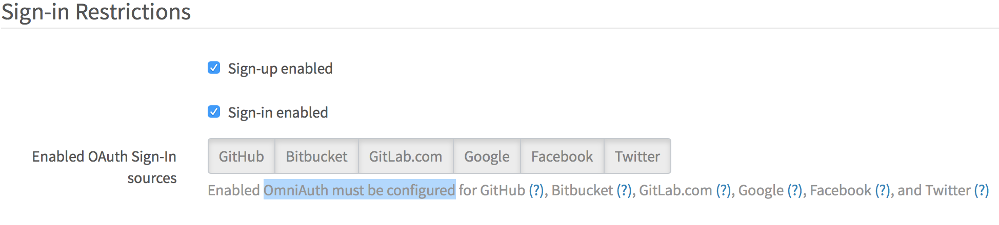

# OmniAuth

GitLab leverages OmniAuth to allow users to sign in using Twitter, GitHub, and
other popular services.

Configuring OmniAuth does not prevent standard GitLab authentication or LDAP
(if configured) from continuing to work. Users can choose to sign in using any
of the configured mechanisms.

- [Initial OmniAuth Configuration](#initial-omniauth-configuration)
- [Supported Providers](#supported-providers)
- [Enable OmniAuth for an Existing User](#enable-omniauth-for-an-existing-user)
- [OmniAuth configuration sample when using Omnibus GitLab](https://gitlab.com/gitlab-org/omnibus-gitlab/tree/master#omniauth-google-twitter-github-login)
- [Enable or disable Sign In with an OmniAuth provider without disabling import sources](#enable-or-disable-sign-in-with-an-omniauth-provider-without-disabling-import-sources)

## Supported Providers

This is a list of the current supported OmniAuth providers. Before proceeding
on each provider's documentation, make sure to first read this document as it
contains some settings that are common for all providers.

- [GitHub](github.md)
- [Bitbucket](bitbucket.md)
- [GitLab.com](gitlab.md)
- [Google](google.md)
- [Facebook](facebook.md)
- [Twitter](twitter.md)
- [Shibboleth](shibboleth.md)
- [SAML](saml.md)
- [Crowd](../administration/auth/crowd.md)
- [Azure](azure.md)
- [Auth0](auth0.md)
- [Authentiq](../administration/auth/authentiq.md)
- [OAuth2Generic](oauth2_generic.md)
- [JWT](../administration/auth/jwt.md)

## Initial OmniAuth Configuration

Before configuring individual OmniAuth providers there are a few global settings
that are in common for all providers that we need to consider.

- Omniauth needs to be enabled, see details below for example.
- `allow_single_sign_on` allows you to specify the providers you want to allow to
  automatically create an account. It defaults to `false`. If `false` users must
  be created manually or they will not be able to sign in via OmniAuth.
- `auto_link_ldap_user` can be used if you have [LDAP / ActiveDirectory](ldap.md)
  integration enabled. It defaults to false. When enabled, users automatically
  created through OmniAuth will be linked to their LDAP entry as well.
- `block_auto_created_users` defaults to `true`. If `true` auto created users will
  be blocked by default and will have to be unblocked by an administrator before
  they are able to sign in.

>**Note:**
If you set `block_auto_created_users` to `false`, make sure to only
define providers under `allow_single_sign_on` that you are able to control, like
SAML, Shibboleth, Crowd or Google, or set it to `false` otherwise any user on
the Internet will be able to successfully sign in to your GitLab without
administrative approval.

>**Note:**
`auto_link_ldap_user` requires the `uid` of the user to be the same in both LDAP
and the OmniAuth provider.

To change these settings:

* **For omnibus package**

    Open the configuration file:

    ```sh
    sudo editor /etc/gitlab/gitlab.rb
    ```

    and change:

    ```ruby
    gitlab_rails['omniauth_enabled'] = true

    # CAUTION!
    # This allows users to login without having a user account first. Define the allowed providers
    # using an array, e.g. ["saml", "twitter"], or as true/false to allow all providers or none.
    # User accounts will be created automatically when authentication was successful.
    gitlab_rails['omniauth_allow_single_sign_on'] = ['saml', 'twitter']
    gitlab_rails['omniauth_auto_link_ldap_user'] = true
    gitlab_rails['omniauth_block_auto_created_users'] = true
    ```

* **For installations from source**

    Open the configuration file:

    ```sh
    cd /home/git/gitlab

    sudo -u git -H editor config/gitlab.yml
    ```

    and change the following section:

    ```yaml
     ## OmniAuth settings
      omniauth:
        # Allow login via Twitter, Google, etc. using OmniAuth providers
        enabled: true

        # CAUTION!
        # This allows users to login without having a user account first. Define the allowed providers
        # using an array, e.g. ["saml", "twitter"], or as true/false to allow all providers or none.
        # User accounts will be created automatically when authentication was successful.
        allow_single_sign_on: ["saml", "twitter"]

        auto_link_ldap_user: true

        # Locks down those users until they have been cleared by the admin (default: true).
        block_auto_created_users: true
    ```

Now we can choose one or more of the [Supported Providers](#supported-providers)
listed above to continue the configuration process.

## Enable OmniAuth for an Existing User

Existing users can enable OmniAuth for specific providers after the account is
created. For example, if the user originally signed in with LDAP, an OmniAuth
provider such as Twitter can be enabled. Follow the steps below to enable an
OmniAuth provider for an existing user.

1. Sign in normally - whether standard sign in, LDAP, or another OmniAuth provider.
1. Go to profile settings (the silhouette icon in the top right corner).
1. Select the "Account" tab.
1. Under "Connected Accounts" select the desired OmniAuth provider, such as Twitter.
1. The user will be redirected to the provider. Once the user authorized GitLab
   they will be redirected back to GitLab.

The chosen OmniAuth provider is now active and can be used to sign in to GitLab from then on.

## Configure OmniAuth Providers as External

>**Note:**
This setting was introduced with version 8.7 of GitLab

You can define which OmniAuth providers you want to be `external` so that all users
**creating accounts, or logging in via these providers** will not be able to have
access to internal projects. You will need to use the full name of the provider,
like `google_oauth2` for Google. Refer to the examples for the full names of the
supported providers.

>**Note:**
If you decide to remove an OmniAuth provider from the external providers list
you will need to manually update the users that use this method to login, if you
want their accounts to be upgraded to full internal accounts.

**For Omnibus installations**

```ruby
  gitlab_rails['omniauth_external_providers'] = ['twitter', 'google_oauth2']
```

**For installations from source**

```yaml
  omniauth:
    external_providers: ['twitter', 'google_oauth2']
```

## Using Custom Omniauth Providers

>**Note:**
The following information only applies for installations from source.

GitLab uses [Omniauth](http://www.omniauth.org/) for authentication and already ships
with a few providers pre-installed (e.g. LDAP, GitHub, Twitter). But sometimes that
is not enough and you need to integrate with other authentication solutions. For
these cases you can use the Omniauth provider.

### Steps

These steps are fairly general and you will need to figure out the exact details
from the Omniauth provider's documentation.

-   Stop GitLab:

        sudo service gitlab stop

-   Add the gem to your [Gemfile](https://gitlab.com/gitlab-org/gitlab-ce/blob/master/Gemfile):

        gem "omniauth-your-auth-provider"

-   If you're using MySQL, install the new Omniauth provider gem by running the following command:

        sudo -u git -H bundle install --without development test postgres --path vendor/bundle --no-deployment

-   If you're using PostgreSQL, install the new Omniauth provider gem by running the following command:

        sudo -u git -H bundle install --without development test mysql --path vendor/bundle --no-deployment

    > These are the same commands you used in the [Install Gems section](#install-gems) with `--path vendor/bundle --no-deployment` instead of `--deployment`.

-   Start GitLab:

        sudo service gitlab start

### Examples

If you have successfully set up a provider that is not shipped with GitLab itself,
please let us know.

You can help others by reporting successful configurations and probably share a
few insights or provide warnings for common errors or pitfalls by sharing your
experience [in the public Wiki](https://github.com/gitlabhq/gitlab-public-wiki/wiki/Custom-omniauth-provider-configurations).

While we can't officially support every possible authentication mechanism out there,
we'd like to at least help those with specific needs.

## Enable or disable Sign In with an OmniAuth provider without disabling import sources

>**Note:**
This setting was introduced with version 8.8 of GitLab.

Administrators are able to enable or disable Sign In via some OmniAuth providers.

>**Note:**
By default Sign In is enabled via all the OAuth Providers that have been configured in `config/gitlab.yml`.

In order to enable/disable an OmniAuth provider, go to Admin Area -> Settings -> Sign-in Restrictions section -> Enabled OAuth Sign-In sources and select the providers you want to enable or disable.




## Keep OmniAuth user profiles up to date

You can enable profile syncing from selected OmniAuth providers and for all or for specific user information.

When authenticating using LDAP, the user's email is always synced.

 ```ruby
   gitlab_rails['sync_profile_from_provider'] = ['twitter', 'google_oauth2']
   gitlab_rails['sync_profile_attributes'] = ['name', 'email', 'location']
 ```

 **For installations from source**

 ```yaml
   omniauth:
     sync_profile_from_provider: ['twitter', 'google_oauth2']
     sync_profile_attributes: ['email', 'location']
 ```
