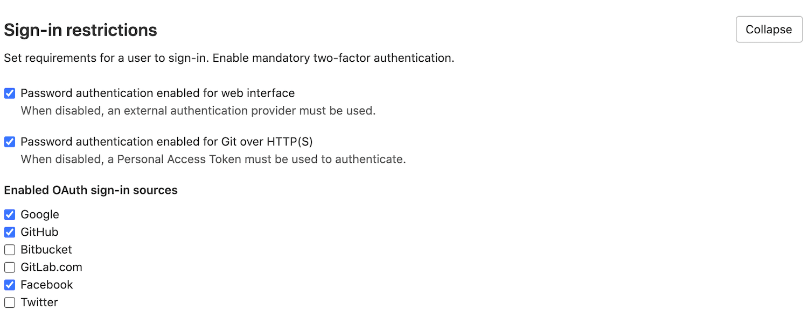

# OmniAuth **(FREE)**

GitLab leverages OmniAuth to allow users to sign in using Twitter, GitHub, and
other popular services. [OmniAuth](https://rubygems.org/gems/omniauth/) is
"a generalized Rack framework for multiple-provider authentication, built on Ruby.

Configuring OmniAuth does not prevent standard GitLab authentication or LDAP
(if configured) from continuing to work. Users can choose to sign in using any
of the configured mechanisms.

- [Initial OmniAuth Configuration](#initial-omniauth-configuration)
- [Supported Providers](#supported-providers)
- [Enable OmniAuth for an Existing User](#enable-omniauth-for-an-existing-user)
- [OmniAuth configuration sample when using Omnibus GitLab](https://gitlab.com/gitlab-org/omnibus-gitlab/tree/master#omniauth-google-twitter-github-login)
- [Enable or disable Sign In with an OmniAuth provider without disabling import sources](#enable-or-disable-sign-in-with-an-omniauth-provider-without-disabling-import-sources)

## Supported Providers

This is a list of the current supported OmniAuth providers. Before proceeding on each provider's documentation,
make sure to first read this document as it contains some settings that are common for all providers.

|Provider documentation                                           |OmniAuth provider name    |
|-----------------------------------------------------------------|--------------------------|
|[Atlassian Crowd](../administration/auth/crowd.md)               |`crowd`                   |
|[Atlassian](../administration/auth/atlassian.md)                 |`atlassian_oauth2`        |
|[Auth0](auth0.md)                                                |`auth0`                   |
|[Authentiq](../administration/auth/authentiq.md)                 |`authentiq`               |
|[AWS Cognito](../administration/auth/cognito.md)                 |`cognito`                 |
|[Azure v2](azure.md#microsoft-azure-oauth2-omniauth-provider-v2) |`azure_activedirectory_v2`|
|[Azure v1](azure.md)                                             |`azure_oauth2`            |
|[Bitbucket Cloud](bitbucket.md)                                  |`bitbucket`               |
|[CAS](cas.md)                                                    |`cas3`                    |
|[Facebook](facebook.md)                                          |`facebook`                |
|[Generic OAuth2](oauth2_generic.md)                              |`oauth2_generic`          |
|[GitHub](github.md)                                              |`github`                  |
|[GitLab.com](gitlab.md)                                          |`gitlab`                  |
|[Google](google.md)                                              |`google_oauth2`           |
|[JWT](../administration/auth/jwt.md)                             |`jwt`                     |
|[Kerberos](kerberos.md)                                          |`kerberos`                |
|[OpenID Connect](../administration/auth/oidc.md)                 |`openid_connect`          |
|[Salesforce](salesforce.md)                                      |`salesforce`              |
|[SAML](saml.md)                                                  |`saml`                    |
|[Shibboleth](shibboleth.md)                                      |`shibboleth`              |
|[Twitter](twitter.md)                                            |`twitter`                 |

## Initial OmniAuth Configuration

The OmniAuth provider names from the table above are needed to configure a few global settings that are in common for all providers.

NOTE:
Starting from GitLab 11.4, OmniAuth is enabled by default. If you're using an
earlier version, you must explicitly enable it.

- `allow_single_sign_on` allows you to specify the providers that automatically
  create a GitLab account. For example, if you wish to enable Azure (v2) and Google,
  in Omnibus, specify a list of provider names:

  ```ruby
  gitlab_rails['omniauth_allow_single_sign_on'] = ['azure_activedirectory_v2', 'google_oauth2']
  ```

  The value defaults to `false`. If `false` users must be created manually, or they can't sign in by using OmniAuth.
- `auto_link_ldap_user` can be used if you have [LDAP / ActiveDirectory](../administration/auth/ldap/index.md)
  integration enabled. It defaults to `false`. When enabled, users automatically
  created through an OmniAuth provider have their LDAP identity created in GitLab as well.
- `block_auto_created_users` defaults to `true`. If `true` auto created users will
  be blocked by default and must be unblocked by an administrator before
  they are able to sign in.

NOTE:
If you set `block_auto_created_users` to `false`, make sure to only
define providers under `allow_single_sign_on` that you are able to control, like
SAML, Shibboleth, Crowd, or Google. Otherwise, set it to `false`, or any user on
the Internet can successfully sign in to your GitLab without
administrative approval.

NOTE:
`auto_link_ldap_user` requires the `uid` of the user to be the same in both LDAP
and the OmniAuth provider.

To change these settings:

- **For Omnibus package**

  Open the configuration file:

  ```shell
  sudo editor /etc/gitlab/gitlab.rb
  ```

  and change:

  ```ruby
  # CAUTION!
  # This allows users to sign in without having a user account first. Define the allowed providers
  # using an array, for example, ["saml", "twitter"], or as true/false to allow all providers or none.
  # User accounts will be created automatically when authentication was successful.
  gitlab_rails['omniauth_allow_single_sign_on'] = ['saml', 'twitter']
  gitlab_rails['omniauth_auto_link_ldap_user'] = true
  gitlab_rails['omniauth_block_auto_created_users'] = true
  ```

- **For installations from source**

  Open the configuration file:

  ```shell
  cd /home/git/gitlab

  sudo -u git -H editor config/gitlab.yml
  ```

  and change the following section:

  ```yaml
  ## OmniAuth settings
  omniauth:
    # Allow sign-in by using Twitter, Google, etc. using OmniAuth providers
    # Versions prior to 11.4 require this to be set to true
    # enabled: true

    # CAUTION!
    # This allows users to sign in without having a user account first. Define the allowed providers
    # using an array, for example, ["saml", "twitter"], or as true/false to allow all providers or none.
    # User accounts will be created automatically when authentication was successful.
    allow_single_sign_on: ["saml", "twitter"]

    auto_link_ldap_user: true

    # Locks down those users until they have been cleared by the admin (default: true).
    block_auto_created_users: true
  ```

Now we can choose one or more of the [Supported Providers](#supported-providers)
listed above to continue the configuration process.

## Enable OmniAuth for an Existing User

Existing users can enable OmniAuth for specific providers after the account is
created. For example, if the user originally signed in with LDAP, an OmniAuth
provider such as Twitter can be enabled. Follow the steps below to enable an
OmniAuth provider for an existing user.

1. Sign in normally - whether standard sign in, LDAP, or another OmniAuth provider.
1. In the top-right corner, select your avatar.
1. Select **Edit profile**.
1. In the left sidebar, select **Account**.
1. In the **Connected Accounts** section, select the desired OmniAuth provider, such as Twitter.
1. The user is redirected to the provider. After the user authorizes GitLab,
   they are redirected back to GitLab.

The chosen OmniAuth provider is now active and can be used to sign in to GitLab from then on.

## Automatically Link Existing Users to OmniAuth Users

> [Introduced](https://gitlab.com/gitlab-org/gitlab/-/merge_requests/36664) in GitLab 13.4.

You can automatically link OmniAuth users with existing GitLab users if their email addresses match.
For example, the following setting is used to enable the auto link feature for both a SAML provider and the Twitter OAuth provider:

**For Omnibus installations**

```ruby
gitlab_rails['omniauth_auto_link_user'] = ["saml", "twitter"]
```

**For installations from source**

```yaml
omniauth:
  auto_link_user: ["saml", "twitter"]
```

## Configure OmniAuth Providers as External

You can define which OmniAuth providers you want to be `external`. Users
creating accounts, or logging in by using these `external` providers cannot have
access to internal projects. You must use the full name of the provider,
like `google_oauth2` for Google. Refer to the examples for the full names of the
supported providers.

NOTE:
If you decide to remove an OmniAuth provider from the external providers list,
you must manually update the users that use this method to sign in if you want
their accounts to be upgraded to full internal accounts.

**For Omnibus installations**

```ruby
gitlab_rails['omniauth_external_providers'] = ['twitter', 'google_oauth2']
```

**For installations from source**

```yaml
omniauth:
  external_providers: ['twitter', 'google_oauth2']
```

## Using Custom OmniAuth Providers

NOTE:
The following information only applies for installations from source.

GitLab uses [OmniAuth](https://github.com/omniauth/omniauth) for authentication and already ships
with a few providers pre-installed, such as LDAP, GitHub, and Twitter. You may also
need to integrate with other authentication solutions. For
these cases, you can use the OmniAuth provider.

### Steps

These steps are fairly general and you must figure out the exact details
from the OmniAuth provider's documentation.

- Stop GitLab:

  ```shell
  sudo service gitlab stop
  ```

- Add the gem to your [`Gemfile`](https://gitlab.com/gitlab-org/gitlab/-/blob/master/Gemfile):

  ```shell
  gem "omniauth-your-auth-provider"
  ```

- Install the new OmniAuth provider gem by running the following command:

  ```shell
  sudo -u git -H bundle install --without development test mysql --path vendor/bundle --no-deployment
  ```

  > These are the same commands you used during initial installation in the [Install Gems section](../install/installation.md#install-gems) with `--path vendor/bundle --no-deployment` instead of `--deployment`.

- Start GitLab:

  ```shell
  sudo service gitlab start
  ```

### Examples

If you have successfully set up a provider that is not shipped with GitLab itself,
please let us know.

While we can't officially support every possible authentication mechanism out there,
we'd like to at least help those with specific needs.

## Enable or disable Sign In with an OmniAuth provider without disabling import sources

Administrators are able to enable or disable **Sign In** by using some OmniAuth providers.

NOTE:
By default, **Sign In** is enabled by using all the OAuth Providers that have been configured in `config/gitlab.yml`.

To enable/disable an OmniAuth provider:

1. On the top bar, select **Menu >** **{admin}** **Admin**.
1. In the left sidebar, go to **Settings**.
1. Scroll to the **Sign-in Restrictions** section, and click **Expand**.
1. Below **Enabled OAuth Sign-In sources**, select the check box for each provider you want to enable or disable.

   

## Disabling OmniAuth

Starting from version 11.4 of GitLab, OmniAuth is enabled by default. This only
has an effect if providers are configured and [enabled](#enable-or-disable-sign-in-with-an-omniauth-provider-without-disabling-import-sources).

If OmniAuth providers are causing problems even when individually disabled, you
can disable the entire OmniAuth subsystem by modifying the configuration file:

**For Omnibus installations**

```ruby
gitlab_rails['omniauth_enabled'] = false
```

**For installations from source**

```yaml
omniauth:
  enabled: false
```

## Keep OmniAuth user profiles up to date

You can enable profile syncing from selected OmniAuth providers and for all or for specific user information.

When authenticating using LDAP, the user's name and email are always synced.

```ruby
gitlab_rails['omniauth_sync_profile_from_provider'] = ['twitter', 'google_oauth2']
gitlab_rails['omniauth_sync_profile_attributes'] = ['name', 'email', 'location']
```

**For installations from source**

```yaml
omniauth:
  sync_profile_from_provider: ['twitter', 'google_oauth2']
  sync_profile_attributes: ['email', 'location']
```

## Bypassing two factor authentication

In GitLab 12.3 or later, users can sign in with specified providers _without_
using two factor authentication.

Define the allowed providers using an array (for example, `["twitter", 'google_oauth2']`),
or as `true` or `false` to allow all providers (or none). This option should be
configured only for providers which already have two factor authentication
(default: false). This configuration doesn't apply to SAML.

```ruby
gitlab_rails['omniauth_allow_bypass_two_factor'] = ['twitter', 'google_oauth2']
```

**For installations from source**

```yaml
omniauth:
  allow_bypass_two_factor: ['twitter', 'google_oauth2']
```

## Automatically sign in with provider

You can add the `auto_sign_in_with_provider` setting to your GitLab
configuration to redirect login requests to your OmniAuth provider for
authentication. This removes the need to click a button before actually signing in.

For example, when using the [Azure v2 integration](azure.md#microsoft-azure-oauth2-omniauth-provider-v2), set the following to enable auto
sign-in:

For Omnibus package:

```ruby
gitlab_rails['omniauth_auto_sign_in_with_provider'] = 'azure_activedirectory_v2'
```

For installations from source:

```yaml
omniauth:
  auto_sign_in_with_provider: azure_activedirectory_v2
```

Keep in mind that every sign-in attempt is redirected to the OmniAuth
provider; you can't sign in using local credentials. Ensure at least
one of the OmniAuth users has administrator permissions.

You may also bypass the auto sign in feature by browsing to
`https://gitlab.example.com/users/sign_in?auto_sign_in=false`.

## Passwords for users created via OmniAuth

The [Generated passwords for users created through integrated authentication](../security/passwords_for_integrated_authentication_methods.md)
guide provides an overview about how GitLab generates and sets passwords for
users created with OmniAuth.

## Custom OmniAuth provider icon

Most supported providers include a built-in icon for the rendered sign-in button.
After you ensure your image is optimized for rendering at 64 x 64 pixels,
you can override this icon in one of two ways:

- **Provide a custom image path**:
  1. *If you are hosting the image outside of your GitLab server domain,* ensure
     your [content security policies](https://docs.gitlab.com/omnibus/settings/configuration.html#content-security-policy)
     are configured to allow access to the image file.
  1. Depending on your method of installing GitLab, add a custom `icon` parameter
     to your GitLab configuration file. Read [OpenID Connect OmniAuth provider](../administration/auth/oidc.md)
     for an example for the OpenID Connect provider.
- **Directly embed an image in a configuration file**: This example creates a Base64-encoded
  version of your image you can serve through a
  [Data URL](https://developer.mozilla.org/en-US/docs/Web/HTTP/Basics_of_HTTP/Data_URIs):
  1. Encode your image file with GNU `base64` command (such as `base64 -w 0 <logo.png>`)
     which returns a single-line `<base64-data>` string.
  1. Add the Base64-encoded data to a custom `icon` parameter in your GitLab configuration file:

     ```yaml
     omniauth:
       providers:
         - { name: '...'
             icon: 'data:image/png;base64,<base64-data>'
             ...
           }
     ```
