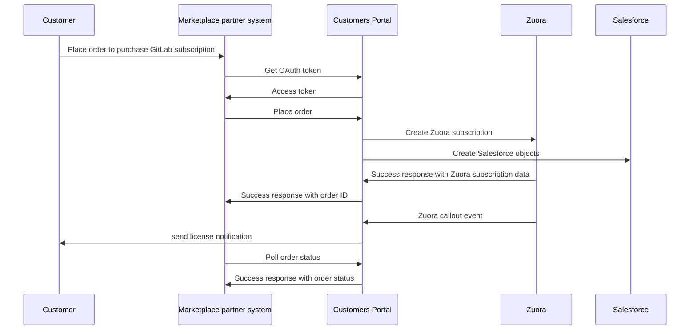

# Marketplace partner integration

GitLab supports automation for selected distribution marketplaces to process sales of GitLab products to authorized
channel partners. Marketplace partners can use the GitLab Marketplace APIs to integrate their systems with GitLab to 
sell GitLab subscriptions on their site.

This document's target audience is third-party developers for Marketplace partners.

## How the Marketplace APIs work

The Marketplace APIs are hosted in the [Customers Portal](https://customers.gitlab.com/). The Customers Portal allows
individual customers to purchase and manage GitLab subscriptions and supports APIs for partners
to make sales on behalf of their customers. The Customers Portal integrates with other GitLab services, including
Zuora and Salesforce, to provide a task-oriented interface for users.

The following example shows a typical purchase flow of request and response between the following components:

- Customer
- Marketplace partner system
- Customers Portal
- Zuora
- Salesforce

## Prerequisites

Before a marketplace partner client can use the Marketplace API, GitLab must set up the following configurations for the client:

1. Client credential. Marketplace APIs are secured with OAuth 2.0. A client credential is required to get the OAuth token.
1. Invoice owner account in Zuora system. Required for invoice processing.
1. Distributor account in Salesforce system.
1. Trading partner account in Salesforce system.

Interested GitLab Partners should contact their GitLab Partner Manager or email [`partnerorderops`](mailto:partnerorderops@gitlab.com).

## Marketplace API Specification

OpenAPI specs for the Marketplace APIs are available upon request. The specs will be made public before the end of Q1 2023.
