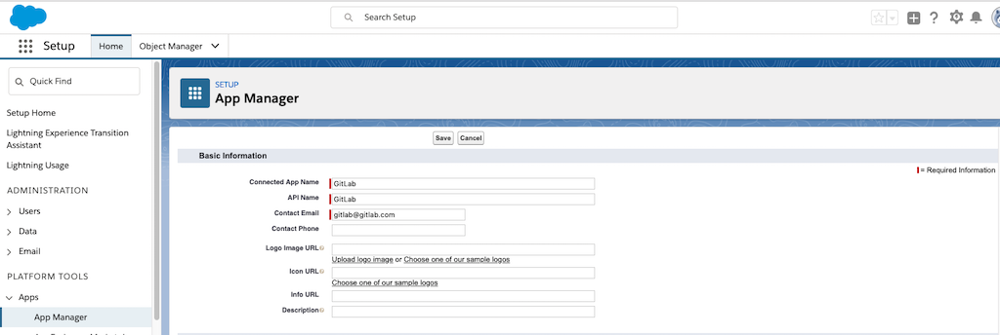
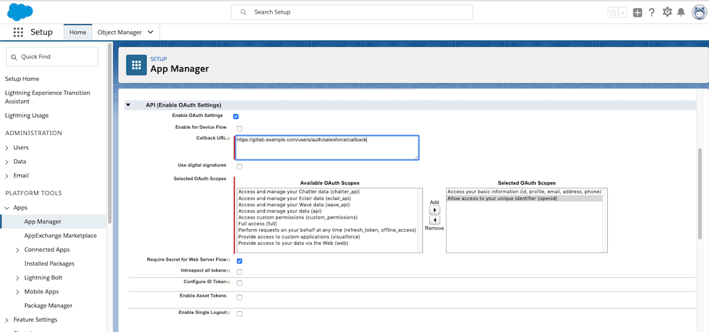
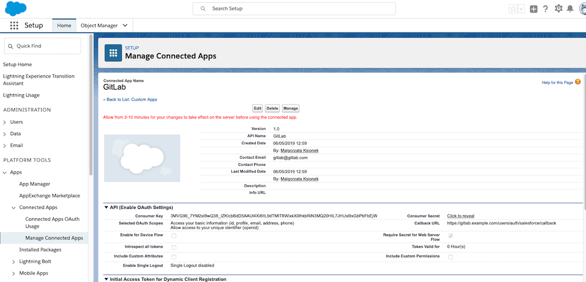

# Salesforce OmniAuth Provider **(FREE)**

You can integrate your GitLab instance with [Salesforce](https://www.salesforce.com/) to enable users to log in to your GitLab instance with their Salesforce account.

## Create a Salesforce Connected App

To enable Salesforce OmniAuth provider, you must use Salesforce's credentials for your GitLab instance.
To get the credentials (a pair of Client ID and Client Secret), you must [create a Connected App](https://help.salesforce.com/articleView?id=connected_app_create.htm&type=5) on Salesforce.

1. Sign in to [Salesforce](https://login.salesforce.com/).

1. In Setup, enter `App Manager` in the Quick Find box, click **App Manager**, then click **New Connected App**.

1. Fill in the application details into the following fields:
   - **Connected App Name** and **API Name**: Set to any value but consider something like `<Organization>'s GitLab`, `<Your Name>'s GitLab`, or something else that is descriptive.
   - **Contact Email**: Enter the contact email for Salesforce to use when contacting you or your support team.
   - **Description**: Description for the application.

   

1. Select **API (Enable OAuth Settings)** and click on **Enable OAuth Settings**.
1. Fill in the application details into the following fields:
   - **Callback URL**: The callback URL of your GitLab installation. For example, `https://gitlab.example.com/users/auth/salesforce/callback`.
   - **Selected OAuth Scopes**: Move `Access your basic information (id, profile, email, address, phone)` and `Allow access to your unique identifier (openid)` to the right column.

   

1. Click **Save**.

1. On your GitLab server, open the configuration file.

   For Omnibus package:

   ```shell
   sudo editor /etc/gitlab/gitlab.rb
   ```

   For installations from source:

   ```shell
   cd /home/git/gitlab
   sudo -u git -H editor config/gitlab.yml
   ```

1. See [Initial OmniAuth Configuration](omniauth.md#initial-omniauth-configuration) for initial settings.

1. Add the provider configuration:

   For Omnibus package:

   ```ruby
   gitlab_rails['omniauth_providers'] = [
     {
       "name" => "salesforce",
       "app_id" => "SALESFORCE_CLIENT_ID",
       "app_secret" => "SALESFORCE_CLIENT_SECRET"
     }
   ]
   ```

   For installation from source:

   ```yaml
   - { name: 'salesforce',
       app_id: 'SALESFORCE_CLIENT_ID',
       app_secret: 'SALESFORCE_CLIENT_SECRET'
   }
   ```

1. Change `SALESFORCE_CLIENT_ID` to the Consumer Key from the Salesforce connected application page.
1. Change `SALESFORCE_CLIENT_SECRET` to the Consumer Secret from the Salesforce connected application page.

   

1. Save the configuration file.
1. [Reconfigure GitLab]( ../administration/restart_gitlab.md#omnibus-gitlab-reconfigure ) or [restart GitLab]( ../administration/restart_gitlab.md#installations-from-source ) for the changes to take effect if you installed GitLab via Omnibus or from source respectively.

On the sign in page, there should now be a Salesforce icon below the regular sign in form.
Click the icon to begin the authentication process. Salesforce asks the user to sign in and authorize the GitLab application.
If everything goes well, the user is returned to GitLab and is signed in.

NOTE:
GitLab requires the email address of each new user. After the user is signed in
using Salesforce, GitLab redirects the user to the profile page where they must
provide the email and verify the email.
