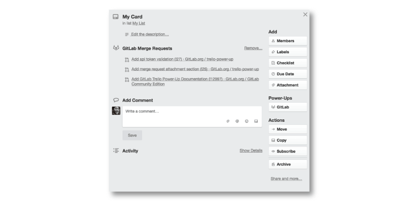
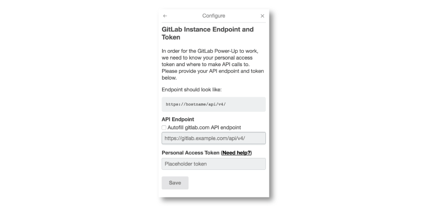

# Trello Power-Up

GitLab's Trello Power-Up enables you to seamlessly attach
GitLab **merge requests** to Trello cards.

## Configuring the Power-Up

In order to get started, you will need to configure your Power-Up.

In Trello:

1. Go to your Trello board
1. Select `Power-Ups` to see a listing of all the available Power-Ups
1. Look for a row that says `GitLab` and select the `Enable` button
1. Select the `Settings` (gear) icon
1. In the popup menu, select `Authorize Account`

In this popup, fill in your `API URL` and `Personal Access Token`. After that, you will be able to attach any merge request to any Trello card on your selected Trello board.

## What is my API URL?

Your API URL should be your GitLab instance URL with `/api/v4` appended in the end of the URL.
For example, if your GitLab instance URL is `https://gitlab.com`, your API URL would be `https://gitlab.com/api/v4`.
If your instance's URL is `https://example.com`, your API URL will be `https://example.com/api/v4`.

## What is my Personal Access Token?

Your GitLab's personal access token will enable your GitLab account to be accessed
from Trello.

> Find it in GitLab by clicking on your avatar (upright corner), from which you access
your user **Settings** > **Access Tokens**.

Learn more about generating a personal access token in the
[Personal Access Token Documentation][personal-access-token-documentation].
Don't forget to check the API scope checkbox!

[personal-access-token-documentation]: ../user/profile/personal_access_tokens.md
