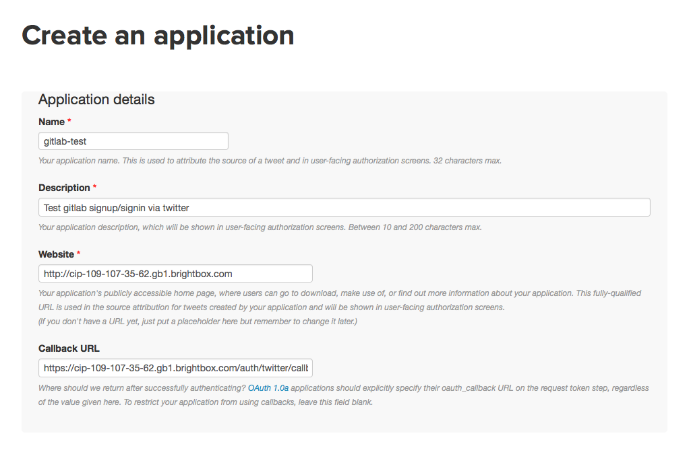
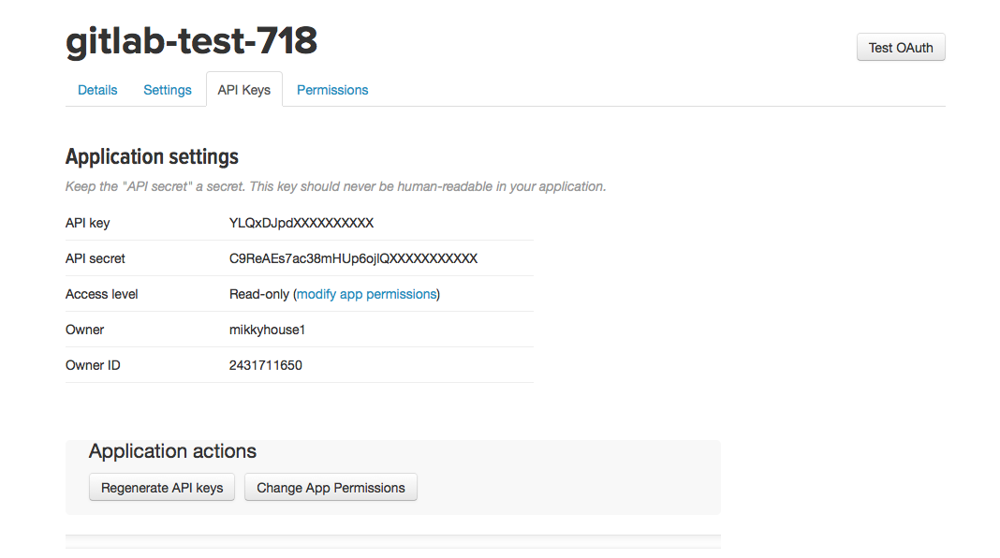

# Twitter OAuth2 OmniAuth Provider

To enable the Twitter OmniAuth provider you must register your application with Twitter. Twitter will generate a client ID and secret key for you to use.

1.  Sign in to [Twitter Developers](https://dev.twitter.com/) area.

1.  Hover over the avatar in the top right corner and select "My applications."

1.  Select "Create new app"

1.  Fill in the application details.
    - Name: This can be anything. Consider something like "\<Organization\>'s GitLab" or "\<Your Name\>'s GitLab" or
    something else descriptive.
    - Description: Create a description.
    - Website: The URL to your GitLab installation. 'https://gitlab.example.com'
    - Callback URL: 'https://gitlab.example.com/users/auth/github/callback'
    - Agree to the "Rules of the Road."

    
1.  Select "Create your Twitter application."

1.  Select the "Settings" tab.

1.  Underneath the Callback URL check the box next to "Allow this application to be used to Sign in the Twitter."

1.  Select "Update settings" at the bottom to save changes.

1.  Select the "API Keys" tab.

1.  You should now see an API key and API secret (see screenshot). Keep this page open as you continue configuration.

    

1.  On your GitLab server, open the configuration file.

    ```sh
    cd /home/git/gitlab

    sudo -u git -H editor config/gitlab.yml
    ```

1.  Find the section dealing with OmniAuth. See [Initial OmniAuth Configuration](README.md#initial-omniauth-configuration)
for more details.

1.  Under `providers:` uncomment (or add) lines that look like the following:

    ```
       - { name: 'twitter', app_id: 'YOUR APP ID',
         app_secret: 'YOUR APP SECRET' }
    ```

1.  Change 'YOUR APP ID' to the API key from Twitter page in step 11.

1.  Change 'YOUR APP SECRET' to the API secret from the Twitter page in step 11.

1.  Save the configuration file.

1.  Restart GitLab for the changes to take effect.

On the sign in page there should now be a Twitter icon below the regular sign in form. Click the icon to begin the authentication process. Twitter will ask the user to sign in and authorize the GitLab application. If everything goes well the user will be returned to GitLab and will be signed in.
