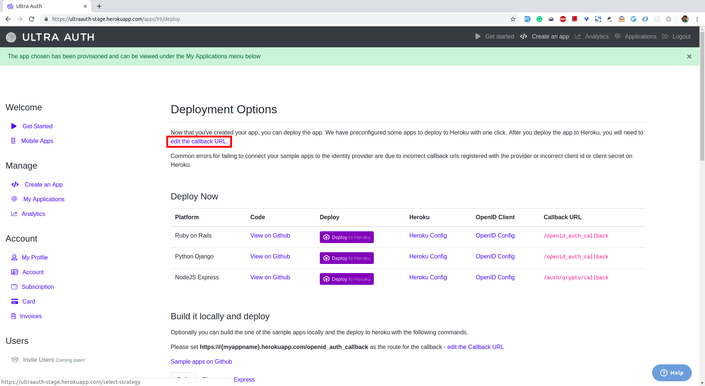
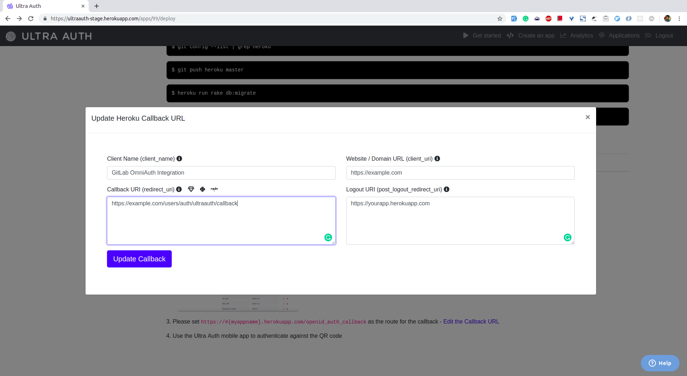

# UltraAuth OmniAuth Provider

You can integrate your GitLab instance with [UltraAuth](https://ultraauth.com) to enable users to perform secure biometric authentication to your GitLab instance with your UltraAuth account. Users have to perform the biometric authentication using their mobile device with fingerprint sensor.

## Create UltraAuth Application

To enable UltraAuth OmniAuth provider, you must use UltraAuth's credentials for your GitLab instance.
To get the credentials (a pair of Client ID and Client Secret), you must register an application on UltraAuth.

1. Sign in to [UltraAuth](https://ultraauth.com).
1. Navigate to **Create an App** and click on **Ruby on Rails**.
1. Scroll down the page that is displayed to locate the **Client ID** and **Client Secret**.
   Keep this page open as you continue configuration.

   

1. Click on "Edit Callback URL" link.

   

1. The callback URL will be `http(s)://<your_domain>/users/auth/ultraauth/callback`

   

1. Select **Register application**.
1. On your GitLab server, open the configuration file.

   For Omnibus package:

   ```sh
   sudo editor /etc/gitlab/gitlab.rb
   ```

   For installations from source:

   ```sh
   cd /home/git/gitlab
   sudo -u git -H editor config/gitlab.yml
   ```

1. See [Initial OmniAuth Configuration](omniauth.md#initial-omniauth-configuration) for initial settings.
1. Add the provider configuration:

   For Omnibus package:

   ```ruby
   gitlab_rails['omniauth_providers'] = [
     {
       "name" => "ultraauth",
       "app_id" => "OPENID_CLIENT_ID",
       "app_secret" => "OPENID_CLIENT_SECRET",
       "args" => {
         "client_options" => {
           "redirect_uri" => "https://example.com/users/auth/ultraauth/callback"
         }
       }
     }
   ]
   ```

   For installation from source:

   ```
   - { name: 'ultraauth',
       app_id: 'OPENID_CLIENT_ID',
       app_secret: 'OPENID_CLIENT_SECRET',
       args: {
         client_options: {
           redirect_uri: 'https://example.com/users/auth/ultraauth/callback'
         }
       }
     }
   ```

   __Replace `https://example.com/users/auth/ultraauth/callback` with your application's Callback URL.__

1. Change `OPENID_CLIENT_ID` to the Client ID from the UltraAuth application page.
1. Change `OPENID_CLIENT_SECRET` to the Client Secret from the UltraAuth application page.
1. Save the configuration file.
1. [Reconfigure GitLab](../administration/restart_gitlab.md#omnibus-gitlab-reconfigure) or [restart GitLab](../administration/restart_gitlab.md#installations-from-source) for the changes to take effect if you
   installed GitLab via Omnibus or from source respectively.

On the sign in page, there should now be an UltraAuth icon below the regular sign in form.
Click the icon to begin the authentication process. UltraAuth will ask the user to sign in and authorize the GitLab application.
If everything goes well, the user will be returned to GitLab and will be signed in.

GitLab requires the email address of each new user. Once the user is logged in using UltraAuth, GitLab will redirect the user to the profile page where they will have to provide the email and verify the email. Password authentication will be disabled for UltraAuth users and two-factor authentication (2FA) will be enforced.
