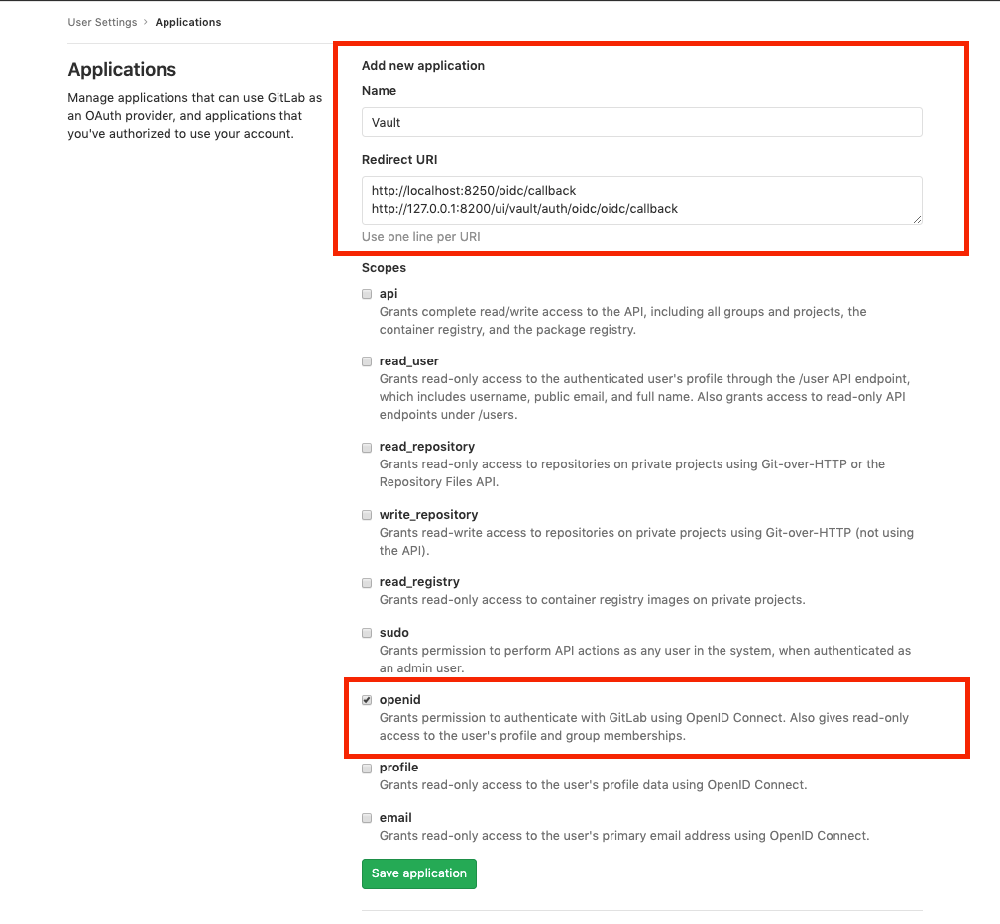
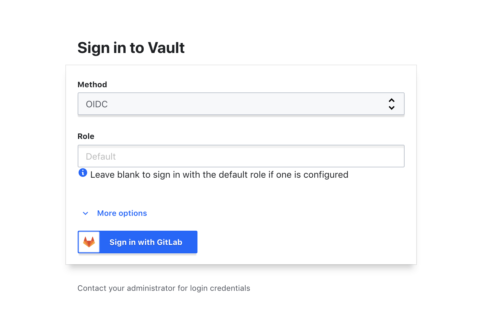
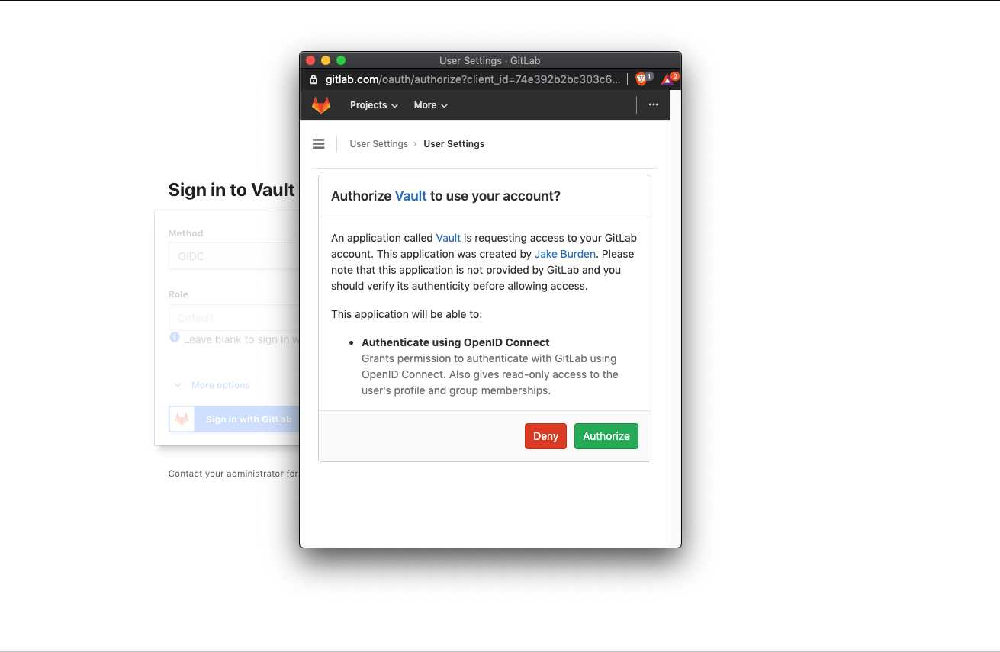
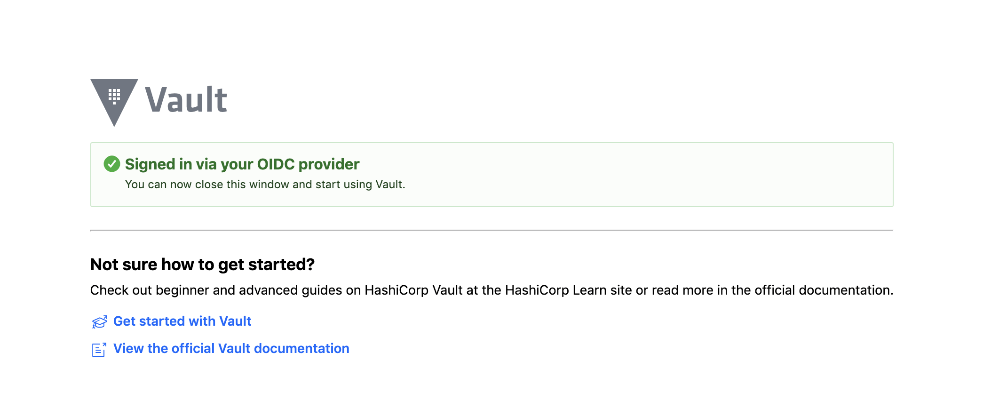

DETAILS:
**Tier:** Free, Premium, Ultimate
**Offering:** GitLab Self-Managed, GitLab Dedicated

[Vault](https://www.vaultproject.io/) is a secrets management application offered by HashiCorp.
It allows you to store and manage sensitive information such as secret environment
variables, encryption keys, and authentication tokens.

Vault offers Identity-based Access, which means Vault users can authenticate
through several of their preferred cloud providers.

The following content explains how Vault users can authenticate themselves through
GitLab by using our OpenID authentication feature.

## Prerequisites

1. [Install Vault](https://developer.hashicorp.com/vault/docs/install).
1. Run Vault.

## Get the OpenID Connect client ID and secret from GitLab

First you must create a GitLab application to obtain an application ID and secret
for authenticating into Vault. To do this, sign in to GitLab and follow these steps:

1. On the left sidebar, select your avatar.
1. Select **Edit profile**.
1. On the left sidebar, select **Applications**.
1. Fill out the application **Name** and [**Redirect URI**](https://developer.hashicorp.com/vault/docs/auth/jwt#redirect-uris).
1. Select the **OpenID** scope.
1. Select **Save application**.
1. Copy the **Client ID** and **Client Secret**, or keep the page open for reference.



## Enable OpenID Connect on Vault

OpenID Connect (OIDC) is not enabled in Vault by default.

To enable the OIDC authentication provider in Vault, open a terminal session
and run the following command:

```shell
vault auth enable oidc
```

You should see the following output in the terminal:

```plaintext
Success! Enabled oidc auth method at: oidc/
```

## Write the OIDC configuration

To give Vault the application ID and secret generated by GitLab and allow
Vault to authenticate through GitLab, run the following command in the terminal:

```shell
vault write auth/oidc/config \
  oidc_discovery_url="https://gitlab.com" \
  oidc_client_id="<your_application_id>" \
  oidc_client_secret="<your_secret>" \
  default_role="demo" \
  bound_issuer="localhost"
```

Replace `<your_application_id>` and `<your_secret>` with the application ID
and secret generated for your app.

You should see the following output in the terminal:

```shell
Success! Data written to: auth/oidc/config
```

## Write the OIDC role configuration

You must tell Vault the [**Redirect URIs**](https://developer.hashicorp.com/vault/docs/auth/jwt#redirect-uris)
and scopes given to GitLab when you created the application.

Run the following command in the terminal:

```shell
vault write auth/oidc/role/demo - <<EOF
{
   "user_claim": "sub",
   "allowed_redirect_uris": "<your_vault_instance_redirect_uris>",
   "bound_audiences": "<your_application_id>",
   "oidc_scopes": "<openid>",
   "role_type": "oidc",
   "policies": "demo",
   "ttl": "1h",
   "bound_claims": { "groups": ["<yourGroup/yourSubgrup>"] }
}
EOF
```

Replace:

- `<your_vault_instance_redirect_uris>` with redirect URIs that match where your
  Vault instance is running.
- `<your_application_id>` with the application ID generated for your app.

The `oidc_scopes` field must include `openid`.

This configuration is saved under the name of the role you are creating. In this
example, we are creating a `demo` role.

WARNING:
If you're using a public GitLab instance, such as GitLab.com, you must specify
the `bound_claims` to allow access only to members of your group or project.
Otherwise, anyone with a public account can access your Vault instance.

## Sign in to Vault

1. Go to your Vault UI. For example: [http://127.0.0.1:8200/ui/vault/auth?with=oidc](http://127.0.0.1:8200/ui/vault/auth?with=oidc).
1. If the `OIDC` method is not selected, open the dropdown list and select it.
1. Select **Sign in With GitLab**, which opens a modal window:

   

1. To allow Vault to sign in through GitLab, select **Authorize**. This redirects you back to your Vault UI as an authenticated user.

   

## Sign in using the Vault CLI (optional)

You can also sign in to Vault using the [Vault CLI](https://developer.hashicorp.com/vault/docs/commands).

1. To sign in with the role configuration you created in the previous example,
   run the following command in your terminal:

   ```shell
   vault login -method=oidc port=8250 role=demo
   ```

   This command sets:

   - `role=demo` so Vault knows which configuration we'd like to sign in with.
   - `-method=oidc` to set Vault to use the `OIDC` sign-in method.
   - `port=8250` to set the port that GitLab should redirect to. This port
     number must match the port given to GitLab when listing
     [Redirect URIs](https://developer.hashicorp.com/vault/docs/auth/jwt#redirect-uris).

   After running this command, you should see a link in the terminal.

1. Open this link in a web browser:

   

   You should see in the terminal:

   ```plaintext
   Success! You are now authenticated. The token information displayed below
   is already stored in the token helper. You do NOT need to run "vault login"
   again. Future Vault requests will automatically use this token.
   ```
